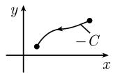
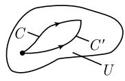
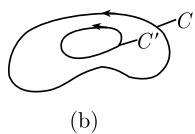
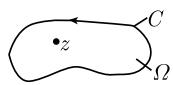

##### 1.14.4 积分

全纯函数最重要的积分性质是, 在单连通区域上的围道积分 $\int_{C} f(z) dz$ 与积分路径无关 (柯西积分定理).

复平面 $\mathbb{C}$ 中的曲线 $\mathbb{C}$ 中的曲线 $C$ 由函数

$$
\boxed {z = z (t), \quad a \leqslant t \leqslant b}\tag{1.454}
$$

给出 (图 1.169(a)). 这里 $-\infty < a < b < +\infty$ . 令 $z := x + iy$ , 因此这对应着平面 $R^{2}$ 中的一条实曲线:

$$
x = x (t), y = y (t), \quad a \leqslant t \leqslant b.
$$

如果函数 $x = x(t)$ , $y = y(t)$ 在 $[a, b]$ 上都是 $C^1$ 型的, 那么就说曲线 $C$ 是 $C^1$ 型的.

若尔当曲线 如果在 $[a,b]$ 上映射 $A:t\mapsto z(t)$ 是一个同胚，那么称曲线 C 是若尔当曲线. $^{1)}$

(1.454) 中的曲线 $C$ 是闭曲线, 如果 $z(a) = z(b)$ . 若尔当闭曲线是复平面 $\mathbb{C}$ 中圆周 $\{z \in \mathbb{C} : |z| = 1\}$ 的同胚象.

若尔当曲线形态规则, 即, 没有像图 1.169(c) 中那样的自相交.\*

曲线积分的定义 如果函数 $f: U \subseteq \mathbb{C} \to \mathbb{C}$ 在开集 $U$ 上连续, 且 $C: z = z(t), a \leqslant t \leqslant b$ 是 $C^1$ 类曲线, 则我们用公式

$$
\boxed {\int_ {C} f (z) \mathrm{d} z := \int_ {a} ^ {b} f (z (t)) z ^ {\prime} (t) \mathrm{d} t}
$$

定义曲线积分. 这个定义与定向曲线 C 的参数化无关. $^{2)}$ 如果曲线 C 是闭的, 则称为周线积分.

  
(a)

  
(b)

  
(c)  
图1.169 复平面中的曲线

三角不等式

$$
\boxed {\left| \int_ {C} f \mathrm{d} z \right| \leqslant (C \text {的长度}) \sup _ {z \in C} | f (z) |.}
$$

方向的变化 如果用 -C 表示由 C 所得到的与 C 方向相反的曲线, 则有 (图 1.169(b))

$$
\boxed {\int_ {- C} f \mathrm{d} z = - \int_ {C} f \mathrm{d} z.}
$$

柯西（1825）和莫雷拉（1886）的主定理 单连通域 $U$ 上的连续函数 $f: U \subseteq \mathbb{C} \to \mathbb{C}$ 是全纯的, 当且仅当积分 $\int_{C} f \mathrm{d}z$ 与 $U$ 中的积分路径无关. 1)

例 1: 在图 1.170(a) 中, 我们有: $\int_{C} f \mathrm{~d} z = \int_{C'} f \mathrm{~d} z$ . 单连通域的基本概念在 1.3.2.4 引入. 从直观上说, 单连通域没有洞.

推论 在单连通区域 $U$ 上, 连续函数 $f: U \subseteq \mathbb{C} \to \mathbb{C}$ 是全纯的, 如果对 $U$ 中的所有 $C^1$ 型若尔当闭曲线 $C$ 有

$$
\int_ {C} f \mathrm{d} z = 0.\tag{1.455}
$$

例 2: 如果 C 是包围原点的 $C^{1}$ 型若尔当闭曲线 (如圆周), 而且在数学意义上有正定向 (即, 逆时针), 那么

$$
\int_ {C} z ^ {k} \mathrm{d} z = \left\{ \begin{array}{c c} 0, & k = 0, 1, 2 \dots , \\ 2 \pi \mathrm{i}, & k = - 1, \\ 0, & k = - 2, - 3, \dots . \end{array} \right.\tag{1.456}
$$

如果 $k=0,1,2,\cdots$ ，那么函数 $f(z):=z^{k}$ 在 C 中是全纯的。这时，由 (1.455) 即得 (1.456)。对于 k=-1，函数 $f(z):=z^{-1}$ 在非单连通区域 $C-\{0\}$ 中是全纯的，但是在 C 中却不是全纯的。因而来自于 (1.456) 的关系式

$$
\boxed {\int_ {C} \frac {\mathrm{d} z}{z} = 2 \pi \mathrm{i}}
$$

  
(a)

  
(b)

  
(c)  
图 1.170 周线积分的性质

表明, 不能减弱 (1.455) 式中 U 为单连通域这一假设 (图 1.170(c)).

下面, 令 $C$ 表示 $U$ 中起点为 $z_0$ , 终点为 $z$ 的 $C^1$ 型曲线.

微积分基本定理 给定区域 $U$ 上的一个连续函数 $f: U \subseteq \mathbb{C} \to \mathbb{C}$ , 并令 $F$ 是 $f$ 在 $U$ 上的一个原函数, 即, 在 $U$ 上 $F' = f$ , 则

$$
\boxed {\int_ {C} f \mathrm{d} z = F (z) - F (z _ {0}).}
$$

f 在 U 上的两个原函数相差一个常数.

例 3: $\int_{C} e^{z} dz = e^{z} - e^{z0}.$

推论 如果函数 $f: U \subseteq C \rightarrow C$ 是在单连通域 U 中全纯的, 则函数

$$
F (z) := \int_ {z _ {0}} ^ {z} f (\zeta) \mathrm{d} \zeta
$$

是 f 在 U 上的一个原函数. $^{1)}$

全纯函数的积分的基本 (拓扑) 性质是, 变成 $C^{1}$ 同伦路径或 $C^{1}$ 同调路径后积分不变.

$C^1$ 同伦路径 给定复平面 $\mathbb{C}$ 中的区域 $U$ . 两条 $C^1$ 曲线 $C$ 和 $C'$ 称为是 $C^1$ 同伦曲线, 如果满足下面两个条件:

(i) C 和 $C'$ 有相同的起点和终点.

(ii) C 可以可微地形变为 $C'$ (图 1.170(a)). $^{2)}$

定理 1 如果 $f: U \subseteq C \to C$ 在区域 U 上是全纯的, 并且如果曲线 C 和 $C'$ 是 $C^{1}$ 同伦的, 则有

$$
\boxed {\int_ {C} f \mathrm{d} z = \int_ {C ^ {\prime}} f \mathrm{d} z.}\tag{1.457}
$$

$C^{1}$ 同调路径 区域 U 中两条 $C^{1}$ 曲线 C 和 $C'$ 称为 $C^{1}$ 同调曲线, 如果它们的边界不同, 即, 存在区域 $\Omega$ , 其闭包包含在 U 中, 使得

$$
\boxed {C = C ^ {\prime} + \partial \Omega .}
$$

边界曲线 $\partial \Omega$ 用这样的方式来定向, 使得区域 $\Omega$ 在边界曲线的左边 (图1.171(a)). 在这个情形我们记作 $C \sim C'$ .

例 4: 图 1.171 中区域 $\Omega$ 的边界曲线 $\partial\Omega$ 由两条曲线 C 和 $-C'$ 组成, 换言之, $\partial\Omega = C - C'$ , 因而 $C = C' + \partial\Omega$ .

用类似的方法即得图 1.172 中 $C \sim C'$ .

  
图 1.171 同调路径

  
图 1.172 同调路径

定理 2 方程 (1.457) 对 $C^{1}$ 同调路径 C 和 $C'$ 也成立.

柯西积分公式(1831) 令 $U$ 是复平面中的区域, 它包含圆盘 $\Omega := \{z \in \mathbb{C} : |z - a| < r\}$ 及其 (数学上正定向) 边界曲线 $C$ . 如果函数 $F: U \to \mathbb{C}$ 是全纯的, 则对所有 $z \in \Omega$ , 有

  
图1.173

$$
\boxed {f (z) = \frac {1}{2 \pi \mathrm{i}} \int_ {C} \frac {f (\zeta)}{\zeta - z} \mathrm{d} \zeta}
$$

以及

$$
f ^ {(n)} (z) = \frac {n !}{2 \pi \mathrm{i}} \int_ {C} \frac {f (\zeta)}{(\zeta - z) ^ {n + 1}} \mathrm{d} \zeta , \quad n = 1, 2, \dots .
$$

如果 $\Omega$ 的边界曲线 $C$ 是 (数学上正定向) $C^1$ 若尔当闭曲线, 那么上述结果仍然成立. 此外, 要求 $\Omega$ 和 $C$ 都在 $U$ 中 (参看图 1.173).

单变量复值函数论包含了代数拓扑的同伦理论及同调理论的萌芽，(关于这一点) 它是由庞加莱于 19 世纪末创建的.

有关代数拓扑更详细的内容在 [212].
