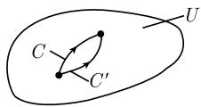

##### 1.14.5 微分式的语言

因而，那就是秘密！

浮士德 (Faust)

如果使用微分式的语言, 那么就可能对前一节的柯西-黎曼定理和柯西-莫雷拉 (Morera) 定理有更深刻的理解. 我们考虑的出发点是一次微分式

$$
\boxed {\omega = f (z) \mathrm{d} z.}
$$

我们使用复数 z 的分解式 $z = x + iy$ ，和函数 f 的分解式 $f(z) = u(x, y) + \mathrm{i}v(x, y)$ ，分别把 z 和函数 f 分解为它们的实部和虚部。 $^{1)}$

像黎曼-罗赫定理这样比较深刻的函数论结果需要黎曼面的概念. 关于这一点, 微分式是基本对象, 它既自然又不可或缺 (参看 [212]).

定理 1 $\int_{C} f(z) dz = \int_{C} \omega.$

这个结果表明, 1.14.4 中积分 $\int_{C} f \mathrm{~d} z$ 的定义与从微分式框架中得到的积分有完全相同的意义.

证明:

$$
\int_ {C} \omega = \int_ {C} (u + \mathrm{i} v) (\mathrm{d} x + \mathrm{i} \mathrm{d} y) = \int_ {a} ^ {b} (u + \mathrm{i} v) (x ^ {\prime} (t) + \mathrm{i} y ^ {\prime} (t)) \mathrm{d} t = \int_ {a} ^ {b} f (z (t)) z ^ {\prime} (t) \mathrm{d} t.
$$

定理2 给定开集 $U$ 上的两个 $C^1$ 型函数 $u, v: U \to \mathbb{R}$ (复值函数 $f$ 的实部和虚部). 那么下列陈述是等价的：

(i) 在 U 上 $d\omega = 0$ .

(ii) $f$ 在 $U$ 上是全纯的.

这实际上是用微分式的语言叙述的 1.14.3 中的柯西－黎曼定理.

证明：由关系式 $\mathrm{du} = u_x\mathrm{dx} + u_y\mathrm{dy},\mathrm{dv} = v_x\mathrm{dx} + v_y\mathrm{dy}$ 就得到

$$
\mathrm{d} \omega = (\mathrm{d} u + \mathrm{id} v) (\mathrm{d} x + \mathrm{id} y) = \{(u _ {y} + v _ {x}) + \mathrm{i} (v _ {y} - u _ {x}) \} \mathrm{d} y \wedge \mathrm{d} x.
$$

因而 $\mathrm{d}\omega = 0$ 等价于柯西-黎曼微分方程

$$
u _ {y} + v _ {x} = 0, \quad v _ {y} - u _ {x} = 0.
$$

定理 3 设在单连通域 U 上有两个 $C^{1}$ 型函数 u, v. 那么下列陈述等价:

(i) 在 U 上 $d\omega = 0$ .

(ii) $\int_{C} \omega$ 与 $U$ 中的积分路径 $C$ 无关.

这就是 1.14.4 的柯西-莫雷拉定理 (至多相差一个附加的, 正则性假设).

证明概述 (i) $\Rightarrow$ (ii). 我们考虑图1.174中描绘的情况. 我们有 $\partial \Omega = C - C'$ . 如果在 $U$ 上 $\mathrm{d}\omega = 0$ , 那么由斯托克斯定理得到

$$
0 = \int_ {\Omega} \mathrm{d} \omega = \int_ {\partial \Omega} \omega = \int_ {C} \omega - \int_ {C ^ {\prime}} \omega .
$$

1) 如果用 $f(x, y)$ 代替 $f(z)$ , 那么上述关系式可写成

$$
\omega = f (x, y) (\mathrm{d} x + \mathrm{id} y).
$$

这蕴涵着 $\int_{C}\omega = \int_{C^{\prime}}\omega ,$ 即， $U$ 中 $\omega$ 的积分与积分路径无关.

  
(a)

  
(b)  
图1.174 定理3的证明

(ii) $\Rightarrow$ (i). 反之, 如果 $U$ 中 $\omega$ 的积分与积分路径无关, 那么对 $U$ 中其边界 $\partial \Omega$ 为封闭的 $C^1$ 类若尔当曲线的所有区域 $\Omega$ 有

$$
\int_ {\partial \Omega} \omega = 0.
$$

由此以及德拉姆定理(参看 [212]) 即得, 在 U 上有 $d\omega = 0$ .

定理 4 如果 $f: U \subseteq C \rightarrow C$ 在区域 U 上是全纯的, 则对 U 中的 $C^{1}$ 同调路径 C 和 $C'$ 有

$$
\int_ {C} \omega = \int_ {C ^ {\prime}} \omega .
$$

证明：因为在 U 上 $d\omega = 0$ ，且 $C = C' + \partial\Omega$ ，所以有

$$
\int_ {C} \omega = \int_ {C ^ {\prime}} \omega + \int_ {\partial \Omega} \omega = \int_ {C ^ {\prime}} \omega .
$$

因为从斯托克斯定理即得 $\int_{\partial \Omega}\omega = \int_{\Omega}\mathrm{d}\omega = 0.$

前面的考虑构成了德拉姆上同调论的基础, 它位于现代微分几何的中心地位, 并且在现代物理的基本粒子理论中有重要应用.

复平面 $\mathbb{C}$ 的辛几何 空间 $\mathbb{R}^2$ 具有自然的辛结构, 它由体积形式

$$
\mu = \mathrm{d} x \wedge \mathrm{d} y
$$

所给出. 通过映射 $(x, y) \mapsto x + \mathrm{i}y$ , 可以把 $\mathbb{R}^2$ 等同于 $\mathbb{C}$ . 这样, $\mathbb{C}$ 也是辛空间. 因为 $\mathrm{d}z \wedge \mathrm{d}\overline{z} = (\mathrm{d}x + \mathrm{id}y) \wedge (\mathrm{d}x - \mathrm{id}y) = -2\mathrm{id}x \wedge \mathrm{d}y$ , 所以

$$
\boxed {\mu = \frac {\mathrm{i}}{2} \mathrm{d} z \wedge \mathrm{d} \overline {{z}}.}
$$

复平面 $\mathbb{C}$ 上的黎曼度量 $\mathbb{R}^2$ 上的经典欧几里得度量由

$$
g := \mathrm{d} x \otimes \mathrm{d} x + \mathrm{d} y \otimes \mathrm{d} y
$$

给出. 如果 $u = (u_{1}, u_{2})$ 是 $\mathbb{R}^{2}$ 中的点, 那么有 $\mathrm{d}x(u) = u_{1}, \mathrm{d}y(u) = u_{2}$ . 由此得到表达式

$$
g (u, v) = u _ {1} v _ {1} + u _ {2} v _ {2} \quad {\text {对所有}} u, v \in \mathbb {R} ^ {2}.
$$

这就是 $R^{2}$ 里的标准标量积.

如果把复平面 $\mathbb{C}$ 看成 $\mathbb{R}^2$ , 那么 $\mathbb{C}$ 也变成了黎曼流形. 由 $z = x + \mathrm{i}y$ 和 $\overline{z} = x - \mathrm{i}y$ 即得

$$
\boxed {g = \frac {1}{2} (\mathrm{d} z \otimes \mathrm{d} \overline {{z}} + \mathrm{d} \overline {{z}} \otimes \mathrm{d} z).}
$$

作为凯勒流形的复平面 $\mathbb{C}$ 空间 $\mathbb{R}^2$ 具有殆复结构, 这由下述线性算子 $J: \mathbb{R}^2 \to \mathbb{R}^2$ 给出:

$$
\boxed {J (x, y) := (- y, x), \quad \text {对所有} (x, y) \in \mathbb {R} ^ {2}.}
$$

如果把 $(x,y)$ 等同于 $z = x + \mathrm{i}y$ ，那么 $J$ 对应于映射 $z\mapsto \mathrm{i}z$ （乘以复数i).度量 $\pmb{g}$ 与殆复结构 $J$ 是相容的，即

$$
\pmb {g} (J u, J v) = \pmb {g} (u, v) \quad {\text {对所有}} u, v \in \mathbb {R} ^ {2}.
$$

此外, 我们用

$$
\boxed {\Phi (u, v) := \pmb {g} (u, J v) \quad \text {对所有} u, v \in \mathbb {R} ^ {2}.}
$$

表示 2 微分式, 它称为 g 的基本形. 对任意的 $u, v \in R^{2}$ , 有 $\Phi(u, v) = u_{2}v_{1} - u_{1}v_{2}$ , 即

$$
\varPhi = \mathrm{d} y \wedge \mathrm{d} x.
$$

由此即得 $\mathrm{d}\varPhi = 0$ .这样 $\mathbb{R}^2$ 变成了凯勒流形.1)

如果把 $\mathbb{C}$ 看作 $\mathbb{R}^2$ , 那么同样复平面 $\mathbb{C}$ 也变成了凯勒流形. 这种流形像弦的构形空间一样, 在现代弦理论(又称弦论)中起着决定性的作用. 这个理论所宣称的目标是用统一的理论 (万物之理论) 来解释所有的四种基本力.

关于凯勒流形的一个重要定理是著名的丘成桐定理, 他因此 (及其他一些重要结果) 于 1982 年获得了菲尔兹奖 (参看 [212]).
