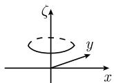

##### 1.14.6 函数的表示

1.14.6.1 幂级数

0.7.2 的诸表中包含了重要幂级数的详尽的列表. 1.10.3 给出了幂级数的性质. 定义 开集 $U$ 上的函数 $f: U \subseteq \mathbb{C} \to \mathbb{C}$ 称为解析函数, 当且仅当, 对 $U$ 的每个点存在一个邻域, 使得在其中 $f$ 能展开成一个幂级数.

柯西主定理(1831) 函数 $f: U \subseteq C \rightarrow C$ 是解析的, 当且仅当 f 是全纯的.

推论 U 上的全纯函数有任意阶导数.

全纯函数的柯西展开式 如果 $f$ 在点 $a \in \mathbb{C}$ 的邻域中是全纯的, 那么它可以展开成如下幂级数:

$$
\boxed {f (z) = f (a) + f ^ {\prime} (a) (z - a) + \frac {f ^ {\prime \prime} (a)}{2 !} (z - a) ^ {2} + \dots .}
$$

1) [212]给出了凯勒流形的一般定义. 1932 年凯勒(Erich Kähler, 1906—2000) 引进了这些流形.

幂级数的收敛域是使 f 在其中为全纯函数的以 a 为圆心的最大开圆盘.

例 1: 考虑 $f(z) := \frac{1}{1 - z}$ . 使 f 在其中为全纯函数的以原点为圆心的最大开圆盘是半径为 1 的圆. 因此几何级数:

$$
{\frac {1}{1 - z}} = 1 + z + z ^ {2} + \dots
$$

的收敛半径 r = 1.

解析面 每个复值函数 $w = f(z)$ 都与复平面之上的一个解析面相关联: 选取笛卡儿坐标系 $(x, y, \zeta)$ ，并取值 $\zeta := |f(z)|$ 作为解析面在点 z 处的高.

例 2: 函数 $f(z) := z^{2}$ 的解析面是抛物面 $\zeta = x^{2} + y^{2}$ (图 1.175).

最大值原理 如果一个非常数函数 $f: U \subseteq C \to C$ 在开集 U 上是全纯的, 那么函数 $\zeta := |f(z)|$ 在 U 上没有最大值.

图1.175

如果在 U 上函数 $\zeta = |f(z)|$ 在点 $a \in U$ 处有绝对极小值, 那么 $f(a) = 0$ .

从直观上说, 这表示在 $U$ 之上 $f$ 的解析面没有最高点. 如果存在一个最低点, 那么在该处高度是 0.

全纯函数列 假设我们有函数 $f_{n}: U \subseteq \mathbb{C} \to \mathbb{C}$ , 它们在开集 $U$ 上是全纯的. 如果函数列在 $U$ 上一致 1) 收敛:

$$
\lim _ {n \to \infty} f _ {n} (z) = f (z) \quad {\text {对所有}} z \in U,
$$

那么极限函数 f 在 U 上也是全纯的. 此外, 对任意 $k = 1, 2, \cdots$ , 有

$$
\lim _ {n \to \infty} f _ {n} ^ {(k)} (z) = f ^ {(k)} (z) \quad {\text {对所有}} z \in U.
$$

1.14.6.2 洛朗级数与奇点

给定 $r, \rho$ 和 $R$ , 满足 $0 \leqslant r < \rho < R \leqslant \infty$ . 考虑圆环 $\Omega := \{z \in \mathbb{C} | r < |z| < R\}$ . 洛朗展开定理 (1843) 令 $f: \Omega \to \mathbb{C}$ 为全纯函数. 那么对所有 $z \in \Omega$ , 有绝对收敛级数展开式:

$$
\boxed { \begin{array}{c} f (z) = a _ {0} + a _ {1} (z - a) + a _ {2} (z - a) ^ {2} + \dots \\ \qquad + \frac {a _ {- 1}}{(z - a)} + \frac {a _ {- 2}}{(z - a) ^ {2}} + \frac {a _ {- 3}}{(z - a) ^ {3}} + \dots , \end{array} }\tag{1.458}
$$

其中系数由公式

$$
a _ {k} = \frac {1}{2 \pi \mathrm{i}} \int_ {C} f (\zeta) (\zeta - a) ^ {- k - 1} \mathrm{d} \zeta , \quad k = 0, \pm 1, \pm 2, \dots
$$

给出. 令 $C$ 表示圆心为 $a$ , 半径为 $\rho$ 的圆周. 所谓的洛朗级数(1.458) 在 $\Omega$ 中可以逐项求积、求导.

孤立奇点 点 $a$ 称为函数 $f$ 的孤立奇点, 如果存在 $a$ 的开邻域 $U$ , 使得 $f$ 在 $U - \{a\}$ 上是全纯的. 在这个情形, (1.458) 对于 $r = 0$ 和足够小的数 $R$ 成立.

(i) 如果 (1.458) 成立, 其中 $a_{-m} \neq 0$ , 且对所有 $k > m$ , $a_{-k} = 0$ , 那么 $a$ 称为 $f$ 的 $m$ 阶极点.

(ii) 如果 (1.458) 成立, 其中对所有 $k \geqslant 1$ , $a_{-k} = 0$ , 那么 $a$ 称为 $f$ 的可去奇点. 在这个情形, 令 $f(a) := a_0$ , $f$ 就变成了 $U$ 上的全纯函数.

(iii) 如果情况 (i) 和 (ii) 都不成立, 即洛朗级数包含无穷多个负指数项, 那么 $a$ 称为本质奇点.

(1.458) 中的系数 $a_{-1}$ 称为 f 在点 a 处的留数, 记作

$$
\boxed {\operatorname{Res} _ {a} f := a _ {- 1}.}
$$

例 1: 函数

$$
f (z) := z + \frac {a}{z - 1} + \frac {b}{(z - 1) ^ {2}}
$$

在点 z=1 处有一个 2 阶极点, 函数在这一点的留数是 $a_{-1}=a$ .

例 2: 函数

$$
\sin {\frac {1}{z}} = \frac {1}{z} - \frac {1}{3 ! z ^ {3}} + \frac {1}{5 ! z ^ {5}} - \dots
$$

在点 z=0 处有一个本质奇点, 它在该处的留数是 $a_{-1}=1$ .

有界函数 函数 $f: U \subseteq \mathbb{C} \to \mathbb{C}$ 称为有界的, 如果存在一个数 $S$ 使得对所有的 $z \in U$ 有 $|f(z)| \leqslant S$ .

定理 假设函数 f 在点 a 处有一个奇点.

(i) 如果函数 $f$ 在 $a$ 的一个邻域内有界, 那么 $f$ 在点 $a$ 处的奇点是可去奇点.

(ii) 如果 $z \to a$ 时, $|f(z)1 \to \infty$ , 那么函数 $f$ 在点 $a$ 处有一个极点.

皮卡定理(1879) 如果函数 $f$ 在点 $a$ 处有一个本质奇点, 那么除了至多有限个例外, $f$ 在 $a$ 的每个邻域内可以取所有复数为其值.

这表示, 在任一本性奇点附近, 函数是相当病态的.

例 3: 函数 $w = e^{1/z}$ 在点 z = 0 处有一个本质奇点, 并且除了 w = 0 外, 此函数在原点的邻域内可以取每个复数为其值.

1.14.6.3 整函数及其乘积展开式

整函数是多项式的推广.

定义 在整个复平面上都是全纯的函数, 并且仅仅是这些函数, 称为整函数.

例 1: 函数 $w = e^{z}$ , $\sin z$ , $\cos z$ , $\sinh z$ , $\cosh z$ 及每个多项式都是整函数.

刘维尔定理(1847) 有界整函数是常数.

从直观上说, 这表示非常数的整函数解析面的高度无界地增长.

皮卡定理 除有限个复数外, 非常数的整函数取每个复数为其值.

例 2: 除 w = 0 外, 函数 $w = e^{z}$ 取每个复数为其值.

整函数的零点 对于整函数 $f: C \rightarrow C$ ，下列陈述成立.

(i) 或者 $f \equiv 0$ , 或者在复平面的每个圆盘里, f 至多有有限个零点.

(ii) 函数 $f$ 是多项式, 当且仅当它在整个复平面上有有限个零点.

零点的重数 如果函数 $f$ 在点 $a$ 的一个邻域内是全纯的, 且 $f(a) = 0$ , 按定义我们说 $f$ 的零点 $a$ 是 $m$ 重的, 如果 $f$ 在点 $a$ 的邻域内的幂级数展开有形式

$$
f (z) = a _ {m} (z - a) ^ {m} + a _ {m + 1} (z - a) ^ {m + 1} + \dots ,
$$

其中 $a_{m} \neq 0$ . 这等价于条件

$$
f ^ {(m)} (a) \neq 0 \quad {\text {和}} \quad f ^ {\prime} (a) = f ^ {\prime \prime} (a) = \dots = f ^ {(m - 1)} (a) = 0.
$$

由代数基本定理, 对一个非常数的多项式 f, 有

$$
f (z) = a \prod_ {k = 1} ^ {n} (z - z _ {k}) ^ {m _ {k}} \quad {\text {对所有}} z \in \mathbb {C}.
$$

这里点 $z_{1},\cdots,z_{n}$ 是 f 的不同的零点, $m_{1},\cdots,m_{n}$ 是它们的重数; a 表示某个非零复数.

下面的定理是对更一般函数的推广：

魏尔斯特拉斯乘积公式(1876) 令 $f: \mathbb{C} \to \mathbb{C}$ 表示非常数整函数, 它有无穷多个零点 $z_1, z_2, \cdots$ , 它们的相应重数是 $m_1, m_2, \cdots$ . 那么, 对于 $f$ , 有公式

$$
\boxed {f (z) = \mathrm{e} ^ {g (z)} \prod_ {k = 1} ^ {\infty} (z - z _ {k}) ^ {m _ {k}} \mathrm{e} ^ {p _ {k} (z)}, \quad \text {对所有} z \in \mathbb {C},}\tag{1.459}
$$

其中, $p_{1}, p_{2}, \cdots$ 是多项式, g 表示一个整函数. $^{1)}$

例 3: 对所有 $z \in C$ , 有 $\sin \pi z = \pi z \prod_{k=1}^{\infty} \left(1 - \frac{z^{2}}{k^{2}}\right)$ . 这个公式最初是被当时还十分年轻的欧拉发现的.

推论 如果指定至多可数个零点及其重数, 那么存在一个整函数, 它有这些零点及重数.

1) 因为对所有的 $w \in \mathbb{C}, e^w \neq 0$ , 所以 (1.459) 中的指数因子并不为 $f$ 增加零点, 但是保证乘积的收敛性.

1.14.6.4 亚纯函数与部分分式展开

亚纯函数是有理函数 (多项式的商) 的推广.

定义 函数 $f$ 称为是亚纯的, 如果它在 $\mathbb{C}$ 上是全纯的, 且除了一些孤立奇点外, 其他奇点都是极点.

我们把值 $\infty$ 与 $f$ 的极点联系起来, 并把点 $\infty$ 添加到 $\mathbb{C}$ 上, 考虑 $\mathbb{C}$ 的紧化 $\overline{\mathbb{C}} := \mathbb{C}U\{\infty\}$ (这个空间可看成二维球面, 参看下面的 1.14.11.4, 它具备自然的复结构, 但是这里只涉及 $\mathbb{C}$ 与表示 $\infty$ 的点的并集组成的空间.)

例 1: 函数 $w = \tan z, \cot z, \tanh z, \coth z$ 及任意有理函数, 所有整函数都是亚纯函数.

亚纯函数的极点 对每个亚纯函数 $f: \mathbb{C} \to \overline{\mathbb{C}}$ , 下列陈述成立:

(i) 函数 f 在每个圆盘有至多有限个极点.

(ii) $f$ 是有理函数，当且仅当，在整个复平面上它只有有限个极点和有限个零点.

(iii) f 是两个整函数的商 (这是对下面事实的推广: 有理函数是多项式的商).

(iv) 所有亚纯函数构成的集合形成一个域 (2.5.3 意义下的), 它是整函数环 (2.5.2 意义下的) 的商域.

有理函数的部分分式分解定理称, 每个有理函数 f 可以写成多项式及形式为

$$
\frac {b}{(z - a) ^ {k}}
$$

的表达式的线性组合, 其中点 a 是 f 的极点, b 是某一复数.

米塔-列夫勒定理(1877) 令 $f: \mathbb{C} \to \overline{\mathbb{C}}$ 是亚纯函数, 有 (无穷多个) 极点 $z_1$ , $z_2$ , $\cdots$ , 使得 $|z_1| \leqslant |z_2| \leqslant \cdots$ . 则除了 $f$ 的极点外, 对其他所有的 $z \in \mathbb{C}$ , 表达式

$$
\boxed {f (z) = \sum_ {k = 1} ^ {\infty} g _ {k} \left(\frac {1}{z - z _ {k}}\right) - p _ {k} (z)}\tag{1.460}
$$

成立. 这里, $g_{1}, g_{2}, \cdots$ 与 $p_{1}, p_{2}, \cdots$ 是多项式.

例 2: 对不等于函数 $w = \sin \pi z$ 的极点 $k \in Z$ 的所有复数 z, 有

$$
{\frac {1}{\sin \pi z}} = {\frac {1}{z}} + \sum_ {k = 1} ^ {\infty} (- 1) ^ {k} \left({\frac {1}{z - k}} + {\frac {1}{z + k}}\right).
$$

推论 如果规定了极点及它们在洛朗展开式中的主要部分(即负幂次项)，则存在一个亚纯函数具有给定的这些极点与主要部分.

1.14.6.5 狄利克雷级数

狄利克雷级数在解析数论中很重要.

定义 无穷级数

$$
\boxed {f (s) := \sum_ {n = 1} ^ {\infty} a _ {n} \mathrm{e} ^ {- \lambda_ {n} s}}\tag{1.461}
$$

称为狄利克雷级数, 如果所有的 $a_{n}$ 是复数, 实指数 $\lambda_{n}$ 构成严格递增的序列, 且 $\lim_{n\to \infty}\lambda_n = +\infty.$

$$
\sigma_ {0} := \varlimsup_ {N \to \infty} \frac {\ln | A (N) |}{\lambda_ {N}}.
$$

这里, 量 $A(N)$ 由下述关系式定义:

$$
A (N) := \left\{ \begin{array}{l l} { \sum_ {n = 1} ^ {N} a _ {n}, \quad} & {\text {当}  \sum_ {n = 1} ^ {\infty} a _ {n} \text {发散时},} \\ { \sum_ {n = N} ^ {\infty} a _ {n}, \quad} & {\text {当}  \sum_ {n = 1} ^ {\infty} a _ {n} \text {收敛时}.} \end{array} \right.
$$

此外, 我们用 $\mathcal{H} = \mathcal{H}_{\sigma_0} := \{s \in \mathbb{C} | \operatorname{Re}s > \sigma_0\}$ 表示 $\mathbb{C}$ 中位于 $\sigma_0$ “右边”的部分. 例1: 如果 $\lambda_n := \ln n, a_n := 1$ , 我们得到黎曼 $\zeta$ 函数

$$
\zeta (s) = \sum_ {n = 1} ^ {\infty} \frac {1}{n ^ {s}},
$$

其中 $\sigma_0 = \lim_{N\to \infty}\frac{\ln N}{\ln N} = 1.$ 下面三个陈述对狄利克雷级数，比如黎曼 $\zeta$ 函数成立

定理 (i) 狄利克雷级数 (1.461) 在开的半空间 $\mathcal{H}$ 中收敛, 在开的半空间 $\mathbb{C} - \overline{\mathcal{H}}$ 中发散, 在 $\mathcal{H}$ 的紧子集上一致收敛.

(ii) 函数 $f$ 在 $\mathcal{H}$ 上是全纯的. 级数 (1.461) 可以逐项求导任意次.

(iii) 如果对所有的 $n$ , 有 $a_{n} \geqslant 0$ , $\lambda_{n} = \ln n$ , 那么 $f$ 在点 $s = \sigma_{0}$ 处有一个奇点.

与素数理论的联系 令 $g: \mathbb{N}_{+} \to \mathbb{C}$ 为定义在正自然数集合上的函数。 $g$ 称为乘性函数，当且仅当，对所有互素自然数 $m, n$ 有 $g(mn) = g(m)g(n)$ 。如果级数

$$
f (s) = \sum_ {n = 1} ^ {\infty} \frac {g (n)}{n ^ {s}}
$$

绝对收敛, 那么有欧拉积

$$
f (s) = \prod_ {p} \left(1 + \frac {g (1)}{p ^ {s}} + \frac {g (2)}{p ^ {2 s}} + \dots\right),
$$

其中, 这个积中的 p 取遍所有素数. 这个积总是绝对收敛的.

例 2: 在 $g \equiv 1$ 的特殊情形, 有

$$
\zeta (s) = \prod_ {p} \left(1 - {\frac {1}{p ^ {s}}}\right) ^ {- 1}, \quad {\text {对所有满足}} \mathrm{Re} s > 1 {\text {的}} s \in \mathbb {C}.
$$

对黎曼 $\zeta$ 函数及著名的黎曼假设(一个猜想) 的更详细的讨论见 2.7.3.
