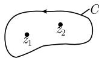
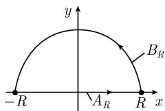

##### 1.14.7 留数计算与积分计算

数学是避免计算的艺术.

民间传说

下面的定理意义重大. 它表明, 为了计算复积分, 对于计算整个积分而言, 只需知道被积函数在积分路径内奇点处的行为便足够了. 积分的计算会十分乏味. 一定是上帝把留数计算这一漂亮技巧送给柯西去发现的, 在很多情况下它把计算量降到最低.

柯西留数定理(1826) 令函数 $f: U \subseteq \mathbb{C} \to \mathbb{C}$ 除有限个极点 $z_1, \cdots, z_n$ 外在开集 $U$ 上全纯. 那么有

$$
\boxed {\int_ {C} f \mathrm{d} z = 2 \pi \mathrm{i} \sum_ {k = 1} ^ {n} \operatorname{Res} _ {z _ {k}} f.}\tag{1.462}
$$

这里, C 是 U 中 $C^{1}$ 型闭若尔当曲线, 所有点 $z_{1}, \cdots, z_{n}$ 在其内部, 而且它是正定向的 (数学意义上的, 参看图 1.176).

例 1: 令

  
图1.176

$$
f (z) = \frac {1}{z - 1} - \frac {2}{z + 1},
$$

因而 $\operatorname{Res}_{z=1}f = 1$ , $\operatorname{Res}_{z=-1}f = -2$ . 对围绕两个点 $z = \pm 1$ 的圆周 $C$ , 有

$$
\int_ {C} f \mathrm{d} z = 2 \pi \mathrm{i} (\operatorname{Res} _ {z = 1} f + \operatorname{Res} _ {z = - 1} f) = - 2 \pi \mathrm{i}.
$$

计算法则 如果函数 f 在点 a 处有 m 阶极点, 那么

$$
\operatorname{Res} _ {a} f = \lim _ {z \to a} (z - a) f (z), \quad {\text {对于}} m = 1\tag{1.463}
$$

以及

$$
\operatorname{Res} _ {a} f = \lim _ {z \to a} F ^ {(m - 1)} (z), \quad \text {对于} m \geqslant 2,
$$

其中 $F(z):=(z-a)^{m}f(z)/(m-1)!$ .

例 2: 有理函数 $\frac{g(z)}{h(z)}$ (其中 $g(a) \neq 0$ ) 在点 a 处有一个 m 阶极点, 当且仅当分母 h 在点 a 处有一个 m 阶零点.

典型例子 我们有

$$
\boxed {\int_ {- \infty} ^ {\infty} \frac {g (x)}{h (x)} \mathrm{d} x = 2 \pi \mathrm{i} \sum_ {k = 1} ^ {n} \operatorname{Res} _ {z _ {k}} \frac {g}{h}.}\tag{1.464}
$$

在计算实积分的时候, 假设 g, h 是多项式, 且 $\deg h \geqslant \deg g + 2$ . 分母 h 应该在实轴上没有零点. 我们用 $z_{1}, \cdots, z_{n}$ 表示在上半平面中 (即, 复平面中具有正虚部的复数的集合) h 的零点.

例3: $\int_{-\infty}^{\infty}\frac{\mathrm{d}x}{1 + x^2} = \pi .$

证明：由于多项式 $h(z) := 1 + z^2$ 可以分解成 $h(z) = (z - \mathrm{i})(z + \mathrm{i})$ ，所以 $h(z)$ 在上半平面中点 $z = i$ 处有一个一阶零点。从(1.463)即得

$$
\operatorname{Res} _ {\mathrm{i}} \frac {1}{1 + z ^ {2}} = \lim _ {z \rightarrow \mathrm{i}} \frac {(z - \mathrm{i})}{(z + \mathrm{i}) (z - \mathrm{i})} = \frac {1}{2 \mathrm{i}}.
$$

因而由 (1.464) 得

$$
\int_ {- \infty} ^ {\infty} \frac {\mathrm{d} x}{1 + x ^ {2}} = 2 \pi \mathrm{iRes} _ {\mathrm{i}} \frac {1}{1 + z ^ {2}} = \pi .
$$

  
图1.177

(1.464)的证明概述 令 $f := \frac{g}{h}$ . 图 1.177 中半圆的边界 $A_R + B_R$ 选得足够大, 使得上半平面中 $h$ 的所有零点都包含在半圆内部. 由 (1.462) 得

$$
\int_ {A _ {R}} f \mathrm{d} z + \int_ {B _ {R}} f \mathrm{d} z = \int_ {A _ {R} + B _ {R}} f \mathrm{d} z = 2 \pi \mathrm{i} \sum_ {k = 1} ^ {n} \operatorname{Res} _ {z _ {k}} f.\tag{1.465}
$$

此外, 有

$$
\lim _ {R \to \infty} \int_ {A _ {R}} f \mathrm{d} z = \int_ {- \infty} ^ {\infty} f (x) \mathrm{d} x
$$

以及

$$
\lim _ {R \to \infty} \int_ {B _ {R}} f \mathrm{d} z = 0\tag{1.466}
$$

当 $R \to \infty$ 时, 由 (1.465) 即得断言 (1.464).

极限关系式 (1.466) 可以从估计 $^{1)}$

$$
| f (z) | \leqslant {\frac {\text {常数}}{| z ^ {2} |}} = {\frac {\text {常数}}{R ^ {2}}}, \quad \text {对所有满足}   | z | = R   \text {的}   z
$$

得到, 而此估计从次数关系式 $\deg h \geqslant \deg g + 2$ 即得, 从周线积分的三角不等式得到

$$
\begin{array}{r l} {\left| \int_ {B _ {R}} f \mathrm{d} z \right| \leqslant (\text {半圆周} B _ {R} \text {的长度})   \sup _ {z \in B _ {R}} | f (z) |} & \\ {\leqslant  \frac {\pi R \cdot \text {常数}}{R ^ {2}} \to 0, \quad \text {当} R \to \infty \text {时}.} \end{array}
$$

1) 这里的常数与 R 无关.
