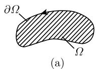
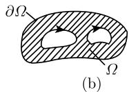

##### 1.14.8 映射度

假设给定复平面中一个有界区域 $\Omega$ ，它的边界 $\partial \Omega$ 由有限个闭 $C^1$ 型若尔当曲线组成，曲线的方向这样确定： $\Omega$ 总位于曲线的左边 (图1.178). 记作 $f \in \ell(\Omega)$ ，如果：

  
图 1.178 定义映射度时 f 的定义域

(i) 除有限个极点外, 函数 $f$ 在 $\overline{\Omega}$ 的一个开邻域中是全纯的, 其中极点都在 $\Omega$ 内.

(ii) 在边界 $\partial\Omega$ 上没有 f 的零点.

定义 $\Omega$ 上 $f$ 的映射度定义为

$$
\boxed {\deg (f, \Omega) := N - P.}
$$

这里 $N(\text{相应地}, P)$ 是 f 在 $\Omega$ 中所有零点 (相应地, 极点) 重数之和.

例：对于 $f(z):=z^{k}$ 和圆盘 $\Omega:=\{z\in\mathbb{C}:|z|<R\}$ ，有

$$
\deg (f, \varOmega) = k, \quad k = 0, \pm 1, \pm 2, \dots
$$

定理 令 $f, g \in \ell(\Omega)$ , 那么有

(i) 表示公式

$$
\deg (f, \varOmega) = \frac {1}{2 \pi \mathrm{i}} \int_ {\partial \varOmega} \frac {f ^ {\prime} (z)}{f (z)} \mathrm{d} z.
$$

(ii) 存在性原理 如果 $\deg(f, \Omega) \neq 0$ , 那么函数在 $\Omega$ 上有零点或极点.

(iii) 映射度的稳定性 从关系式

$$
| g (z) | <   \max _ {z \in \partial \Omega} | f (z) |\tag{1.467}
$$

即得 $\deg(f,\Omega)=\deg(f+g,\Omega)$ .

儒歇零点原理(1862) 假设函数 $f, g$ 在 $\overline{\Omega}$ 的一个开邻域上是全纯的, 并且 (1.467) 成立. 那么, 如果 $f$ 在 $\Omega$ 上有一个零点, 即得 $f + g$ 在 $\Omega$ 上也有一个零点.

证明：因为 $f$ 有一个零点，没有极点 $(f$ 是全纯的)，所以有 $\deg (f,\Omega)\neq 0$ ，由上面的(iii)即得 $\deg (f + g,\Omega)\neq 0$ ，由(ii)得出本结论. □

映射度的一般理论可见 [212], 它使得能够证明数学中一大类问题 (方程组、常微分和偏微分方程组、积分方程组) 解的存在性, 而不用具体构造出这些解.
