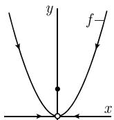
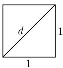
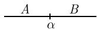
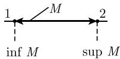
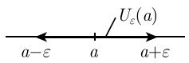
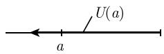
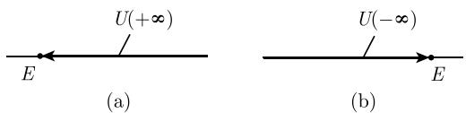

#### 1.2 序列的极限

##### 1.2.1 基本思想

序列

例 1: 考虑实数序列 $(a_{n})$ , 其中

$$
a _ {n} := \frac {1}{n}, \quad n = 1, 2, \dots .
$$

当 $n$ 增大时, $a_{n}$ 的值趋向于零 (表1.1). 为了描述这种行为, 记作

$$
\boxed {\lim _ {n \to \infty} a _ {n} = 0,}
$$

并称序列 $(a_{n})$ 的极限为0.

表 1.1

<table><tr><td>n</td><td>1</td><td>2</td><td>10</td><td>100</td><td>1000</td><td>10000</td><td>...</td></tr><tr><td>an</td><td>1</td><td>0.5</td><td>0.1</td><td>0.01</td><td>0.001</td><td>0.0001</td><td>...</td></tr></table>

例 2: 设 $b_{n} := \frac{n}{n+1}$ ，当 n 增大时，序列 $(b_{n})$ 趋向于 1. 记作 $\lim_{n \to \infty} b_{n} = 1$ .

函数 数学在科学、技术和经济学中的许多应用中, 极限概念起了尤为重要的作用. 一个函数的极限的概念可以简化成如上序列的极限的概念.

例 3: 考虑函数

$$
f (x) := \left\{ \begin{array}{l l} x ^ {2}, & \text {当所有实数} x \neq 0, \\ 1, & \text {当} x = 0 \end{array} \right.
$$

(图 1.13).

我们记作

$$
\boxed {\lim _ {x \to a} f (x) = b}
$$

当且仅当, 对每个序列 $(a_{n})$ , 其中对所有 $n, a_{n} \neq a$ , 有

$$
\left| \text {由} \quad \lim _ {n \to \infty} a _ {n} = a, \quad \text {可得} \quad \lim _ {n \to \infty} f (a _ {n}) = b. \right|
$$

图1.13

对于这个例子中的函数 $f(x)$ ，有

$$
\lim _ {x \to 0} f (x) = 0,\tag{1.18}
$$

因为从对所有 $n, a_n \neq 0$ 且 $\lim_{n \to \infty} a_n = 0$ , 即得 $\lim_{n \to \infty} f(a_n) = \lim_{n \to \infty} a_n^2 = 0$ .

(1.18) 与我们的直观印象对应: 如果点 $x$ 从右边 (或左边) 趋向于 0, 那么对应的函数值趋于 0. $f$ 在点 0 的值与这些考虑不相关.

因为有理数的序列的极限可以是无理数, 所以需要发展一套严格的极限理论, 这首先要严格引入实数概念, 我们将在下一节介绍.

##### 1.2.2 实数的希尔伯特(Hilbert) 公理

公元前 500 年左右, 古希腊毕达哥拉斯(Pythagoras) 学派的一名成员发现, 单位正方形的对角线长 d 与其边长是不可通约的, 即, d 与边长的比值不是有理数. 由毕达哥拉斯定理及图 1.14 可得

  
图1.14

$$
d ^ {2} = 1 ^ {2} + 1 ^ {2},
$$

这表明 $d = \sqrt{2}$ . 用现代术语来说, 这位古希腊人发现了 $\sqrt{2}$ 的无理性(见4.2.1). 这一发现破坏了毕达哥拉斯学派宇宙和谐的美妙图景, 引发了一场危机. 据传说, 这一事实的发现者, 在一次航行中被毕达哥拉斯学派的其他成员扔到了海里.

继古代最重要的数学家阿基米德(Archimedes, 公元前 281—前 212)之后, 尼多斯 (Knidos) 的欧多克索斯(Eudoxus, 公元前 410—前 350) 掌握了无理数. 直到 2000 年后, 为了从数学上严格定义无理数, 戴德金(Dedekind) 才于 1872 年重新采用了欧多克索斯的思想.

自欧几里得(Euclid, 大约公元前 300 年) 的《几何原本》之后, 数学理论通常是公理化构建的, 即, 把理论建立在一些简单的原理之上. (一组公理中的) 原理不需要被证明. 通常, 公理是对这一情况的冗长检验的结果. 从公理开始, 可以根据逻辑的结论推导整个理论.

1.2.2.1 公理

假设存在一个集合 R, 它的元素称为实数, 并满足如下公理 (F), (O), (C).

(F) 域公理. 集合 $\mathbb{R}$ 是一个域, 其中加法的中性元是 0, 乘法的中性元是 1.

(O) 序公理. 对任意两个给定的实数 $a, b$ , 下列三个关系式恰有一个成立:

$$
a <   b, \quad a = b, \quad b <   a \quad (\text {三分法}).
$$

对任意实数 a, b, c, 有

(i) 关系式 a < b, b < c 蕴涵 a < c (传递性).

(ii) 关系式 a < b 蕴涵 $a + c < b + c$ (加法的单调性).

(iii) 关系式 a < b, 0 < c 蕴涵 ac < bc (乘法的单调性).

一个戴德金分割 $(A, B)$ 是非空有序实数集对，使得任意实数都属于这两个集合之一，并且若 $a \in A, b \in B$ ，则 $a < b$ .

(C) 完备性公理. 对任一戴德金分割 $(A, B)$ , 恰存在一个实数 $\alpha$ 具有性质:

$$
\boxed {a \leqslant \alpha \leqslant b \quad \text {对所有} \quad a \in A, b \in B.}
$$

直观上, (C) 表示实数直线没有洞 (图 1.15).

公理 (F) 表示实数集满足下列诸条件. 域的定义 集合 K 是一个域, 如果满足:

  
图1.15

加法 K 中两个任意元素被赋值为 K 中特定的第三个元素, 记作 $a + b$ . 对 K 中所有的 a, b, c, 有关系式:

$$
\boxed { \begin{array}{c c} (a + b) + c = a + (b + c) & (\text {结合性}), \\ a + b = b + a & (\text {交换性}). \end{array} }
$$

K 中有一个唯一的元素, 记作 0, 使得对所有 $a \in K$ , 有

$$
\boxed {a + 0 = a.}
$$

这个元素称为加法的零元(素).

对每个 $a \in K$ ，存在唯一元 $b \in K$ ，使得

$$
\boxed {a + b = 0.}
$$

这个元称为 a 的加法逆元. 元素 b 也可记作 -a.

乘法 $K$ 中两个任意元素被赋值为 $K$ 中特定的第三个元素, 记作 $ab$ (或 $a \cdot b$ ). 对 $K$ 中所有的 $a, b, c$ , 有

$$
\begin{array}{r l} {(a b) c = a (b c)} & {(\text {结合性}),} \\ {a b = b a} & {(\text {交换性}),} \\ {a (b + c) = a b + a c} & {(\text {分配性}).} \end{array}
$$

K 中有一个唯一的元素, 记作 1, 且 $1 \neq 0$ , 对所有 $a \in K$ , 有

$$
\boxed {a \cdot 1 = a.}
$$

这个元称为乘法的单位元.

对每个 $a \in K$ , 且 $a \neq 0$ , 存在唯一元 $b \in K$ , 使得

$$
\boxed {a b = 1.}
$$

这个元称为 a 的乘法逆元. 这时, 元素 b 也可记作 $a^{-1}$ .

域是所有数学分支中最基本的概念之一. 许多数学对象都是域 (见 2.5.3). 在一般域论里, 符号 e 也用来表示元素 1.

公理的推论 实数的所有算术法则 (符号, 分数, 等式与不等式) 都可以从这些公理推导出来.

公理 (F) 和 (O) 对有理数也是成立的; 不过, 公理 (C) 则不然.

唯一性 如果 $\mathbb{R}$ 和 $\mathbb{R}'$ 是满足所有公理 (F), (O), (C) 的两个集合, 那么域 $\mathbb{R}$ 同构于 $\mathbb{R}'$ , 它遵守序公理. 意思是, 存在一映射 $\varphi: \mathbb{R} \to \mathbb{R}'$ , 使得对所有 $a, b \in \mathbb{R}$ , 满足下列条件:

(i) $\varphi(a+b)=\varphi(a)+\varphi(b).$

(ii) $\varphi(ab)=\varphi(a)\varphi(b).$

(iii) 由 $a \leqslant b$ , 可得 $\varphi(a) \leqslant \varphi(b)$ .

这说明, 在 $R'$ 里的运算和在 R 中的一样.

1.2.2.2 归纳法

直观上, 可以通过连续的加法: $0, 0+1, 1+1, \cdots$ 得到自然数集 $0, 1, 2, \cdots$ . 为了得到数学上严格的定义, 必须走一条 (显然更复杂的) 不同的路线.

归纳集：一个实数集 $M$ 称为归纳的，如果它包含0, 并且由 $a \in M$ 可以推出 $a + 1 \in M$ .

根据定义, 自然数集合是由所有归纳集合的交集构成. 这表示 $\mathbb{N}$ 是最小归纳集. 归纳法 设 $A$ 是满足下列性质的自然数集合:

(i) $0 \in A,$

(ii) $n \in A$ 蕴涵 $n + 1 \in A$ .

那么 $A = \mathbb{N}$

证明：集合 A 是归纳集. 因为 N 是最小的归纳集, 所以 $N \subset A$ . 因为 A 是自然数构成的集合, 所以 $A \subset N$ , 因此 A = N.

数学里的许多证明是以归纳法为基础的. 4.2.2 将详细讨论.

1.2.2.3 上确界和下确界

定理 实数集 $\mathbb{R}$ 有阿基米德序, 即, 对每个实数 $x$ , 都存在一个实数 $y$ 使得 $x < y$ . 界 实数构成的集合 $M$ 称为上有界的(或下有界的), 当且仅当存在一个实数 $S$ 使得

$$
x \leqslant S,
$$

$$
x \in M)
$$

S 称为集合 M 的上界(或下界).

实数集合是有界的, 当且仅当它是上有界及下有界的.

上确界 上有界的每个非空实数集 $M$ , 有一个最小的上界. 这个界记作

并称为 M 的上确界. M 的上确界不一定包含在 M 里.

对一个无上界的非空实数集 M, 我们令 $\sup M := +\infty$ .

例 1: 设 $M := \{0, 1\}$ ，则 M 的上界构成的集合的元素是，满足 $S \geqslant 1$ 的全部实数 S。因此 $\sup M = 1$ 。

例 2: 对开区间 $M := ]1, 2[$ , 它的上界的集合由所有 $S \geqslant 2$ 的实数 S 构成. 因此 $\sup M = 2$ ; 这里, 上确界不属于 M(图 1.16).

下确界 任一下有界的非空实数集有一个最大的下界. 这个界记作

  
图1.16

并称为 M 的下确界. M 的下确界不一定属于 M.

对一个无下界的非空实数集 M, 令 inf M := -∞.

例 3: 设集合 $M := \{0,1\}$ ，下界集由所有 $S \leqslant 0$ 的实数 S 组成。因此 inf M = 0。

例 4: 开区间 $M := ]1,2[$ 的下界集由所有 $S \leqslant 1$ 的实数 S 组成。因此 inf M = 1(图 1.16)。这里，下确界也不属于 M。

例 5: inf R = -∞, sup R = +∞, inf N = 0, sup N = +∞.

##### 1.2.3 实数序列

现代分析在阐述极限概念时, 使用的是邻域的几何语言. 这样做就允许我们用拓扑的语言非常一般地来形成极限的概念.

1.2.3.1 有限极限

邻域 一个实数 a 的 $\varepsilon$ 邻域 $U_{\varepsilon}(a)$ 是实数 x 的集合, 它使得 x 到 a 的距离小于 $\varepsilon$ , 用集合的符号即

$$
U _ {\varepsilon} (a) = \{x \in \mathbb {R}: | x - a | <   \varepsilon \}
$$

(图 1.17(a)). 实数集 $U(a)$ 是 a 的邻域, 如果对某个 $\varepsilon > 0$ , 它包含 a 的某一 $\varepsilon$ 邻域:

$$
\boxed {U _ {\varepsilon} (a) \subseteq U (a).}
$$

如果使用区间的符号, 那么 $U_{\varepsilon}(a) = ]a - \varepsilon, a + \varepsilon[$ . 不过, 刚定义的邻域 $U(a)$ 不必是个区间, 但是一定包含某一区间.

极限的基本定义 设 $(a_{n})$ 是一个实数列1). 记

$$
\boxed {\lim _ {n \to \infty} a _ {n} = a,}\tag{1.19}
$$

当且仅当实数 $a$ 的任一 $\varepsilon$ 邻域包含除了有限个 $a_{n}$ 外的所有 $a_{n}$ . 这时我们称, 序列 $(a_{n})$ 收敛于极限 $a$ .

(除法法则) $^{1)}$ ,

换言之, (1.19) 成立, 当且仅当对每个实数 $\varepsilon > 0$ , 存在自然数 $n_0(\varepsilon)$ (与 $\varepsilon$ 有关) 使得

$$
\left| a _ {n} - a \right| <   \varepsilon ,
$$

$$
n \geqslant n _ {0} (\varepsilon)
$$

  
(a)

  
(b)  
图1.17 点 $a$ 的邻域

例 1: 设 $a_{n} := \frac{1}{n}, n = 1, 2, \cdots$ ，那么有

$$
\lim _ {n \to \infty} \frac {1}{n} = 0.
$$

证明：对每个实数 $\varepsilon > 0$ ，存在一个自然数 $n_0(\varepsilon) > \frac{1}{\varepsilon}$ . 因此

$$
| a _ {n} | = {\frac {1}{n}} <   \varepsilon , \quad {\text {对所有}} n \geqslant n _ {0} (\varepsilon).
$$

例 2: 对常数列 $a_{n}=a$ , 有 $\lim_{n\to\infty}a_{n}=a$ .

定理 (i) 如果极限存在, 那么它是唯一的.

(ii) 如果序列的有限项改变, 那么极限不变.

极限运算法则 对任意两个都收敛到有限极限的序列 $(a_{n})$ 和 $(b_{n})$ , 下列关系式成立:

$$
\lim _ {n \to \infty} (a _ {n} + b _ {n}) = \lim _ {n \to \infty} a _ {n} + \lim _ {n \to \infty} b _ {n}
$$

(加法法则),

$$
\lim _ {n \to \infty} (a _ {n} b _ {n}) = \lim _ {n \to \infty} a _ {n} \lim _ {n \to \infty} b _ {n}\tag{乘法法则),}
$$

$$
\lim _ {n \to \infty} \frac {a _ {n}}{b _ {n}} = \frac {\lim _ {n \to \infty} a _ {n}}{\lim _ {n \to \infty} b _ {n}}
$$

$$
\lim _ {n \to \infty} | a _ {n} | = \left| \lim _ {n \to \infty} a _ {n} \right|
$$

(绝对值法则),

对所有的 $n$ ，由 $a_{n}\leqslant b_{n}$ 得 $\lim_{n\to \infty}a_n\leqslant \lim_{n\to \infty}b_n$ （不等式法则）.

例 3 (乘法): $\lim_{n\to\infty}\frac{1}{n^{2}}=\lim_{n\to\infty}\frac{1}{n}\lim_{n\to\infty}\frac{1}{n}=0.$

例 4 (求和): $\lim_{n\to\infty}\frac{n+1}{n}=\lim_{n\to\infty}\left(1+\frac{1}{n}\right)=\lim_{n\to\infty}1+\lim_{n\to\infty}\frac{1}{n}=1.$

1.2.3.2 非正常极限

邻域 设

$$
U _ {E} (+ \infty) := ] E, \infty [, \quad U _ {E} (- \infty) := ] - \infty , E [.
$$

实数集合 $U(+\infty)$ 称为无穷大的邻域, 如果存在实数 E 使得

$$
\boxed {U _ {E} (+ \infty) \subseteq U (+ \infty).}
$$

同样, $U(-\infty)$ 是对某一固定实数 E, 使得 $U_{E}(-\infty) \subset U(-\infty)$ 的集合 (图 1.18).

  
图1.18 $\pm \infty$ 的邻域

定义 设 $(a_{n})$ 是一个实数列, 记

$$
\boxed {\lim _ {n \to \infty} a _ {n} = + \infty ,}\tag{1.20}
$$

当且仅当, 除了有限个 $a_{n}$ 外的所有 $a_{n}$ 都属于每个邻域 $U(+\infty)$ .

换言之, (1.20) 成立, 当且仅当, 对每个实数 E, 我们能找到一个自然数 $n_{0}(E)$ , 使得

$$
\boxed {a _ {n} > E, \quad \text {对所有} n \geqslant n _ {0} (E).}
$$

例 1: $\lim_{n\to\infty}n=+\infty.$

同样，记

$$
\lim _ {n \to \infty} a _ {n} = - \infty .
$$

当且仅当, 除了有限个 $a_{n}$ 外的所有 $a_{n}$ 都属于每个邻域 $U(-\infty)$ .

反射原理 我们有 $\lim_{n\to \infty}a_n = -\infty$ ，当且仅当 $\lim_{n\to \infty}(-a_n) = +\infty$

例 2: $\lim_{n\to\infty}(-n)=-\infty.$

1) 设 $\lim_{n\to \infty}a_n = a$ .在过去的文献中，当 $a\in \mathbb{R}$ ，则说其收敛；当 $a = \pm \infty$ ，则说其确定发散.现代数学有了一般的收敛概念．在这个意义上， $(a_{n})$ 对 $a$ 的所有值都收敛(参看1.3.2.1的例4).我们这里采用的现代观点，其显著优点就是避免考虑不同的情况，见1.2.4.

关于无穷大的运算法则 设 $-\infty < a < \infty$ ，那么有

$$
\begin{array}{l} {\text {加法:}} \\ {a + \infty = + \infty , \quad + \infty + \infty = + \infty ,} \\ {a - \infty = - \infty , \quad - \infty - \infty = - \infty .} \\ {\text {乘法:}} \\ {a (\pm \infty) = \left\{ \begin{array}{l l} {\pm \infty ,} & {a > 0,} \\ {\mp \infty ,} & {a <   0,} \end{array} \right.} \\ {(+ \infty) (+ \infty) = + \infty , \quad (- \infty) (- \infty) = + \infty , \quad (+ \infty) (- \infty) = - \infty .} \\ {\text {除法:}} \\ {\frac {a}{\pm \infty} = 0, \quad \frac {\pm \infty}{a} = \left\{ \begin{array}{l l} {\pm \infty ,} & {a > 0,} \\ {\mp \infty ,} & {a <   0.} \end{array} \right.} \end{array}
$$

例如, 符号 “ $a + \infty = +\infty$ ” 表示, 由关系式

$$
\lim _ {n \to \infty} a _ {n} = a \quad {\text {和}} \quad \lim _ {n \to \infty} b _ {n} = + \infty\tag{1.21}
$$

作为一个推论总可得

$$
\lim _ {n \to \infty} (a _ {n} + b _ {n}) = + \infty .
$$

类似地, 符号 “ $a(+\infty)=+\infty$ , 当 a>0” 表示, 由 (1.21) 及 a>0 可得

$$
\lim _ {n \to \infty} a _ {n} b _ {n} = + \infty .
$$

例 3: $\lim_{n\to\infty}n^{2}=\lim_{n\to\infty}n\cdot\lim_{n\to\infty}n=+\infty.$

有理式 设

$$
a _ {n} := \frac {\alpha_ {k} n ^ {k} + \alpha_ {k - 1} n ^ {k - 1} + \cdots + \alpha_ {0}}{\beta_ {m} n ^ {m} + \beta_ {m - 1} n ^ {m - 1} + \cdots + \beta_ {0}}, \quad n = 1, 2, \dots ,
$$

其中 $k, m = 0, 1, 2, \cdots$ 固定, $\alpha_{r}, \beta_{s}$ 是固定实数, 且 $\alpha_{k} \neq 0, \beta_{m} \neq 0$ . 那么有

$$
\lim _ {n \to \infty} a _ {n} = {\left\{ \begin{array}{l l} {{\frac {\alpha_ {k}}{\beta_ {m}},}} & {{k = m,}} \\ {{0,}} & {{k <   m,}} \\ {{+ \infty ,}} & {{k > m {\text {且}} \alpha_ {k} / \beta_ {m} > 0,}} \\ {{- \infty ,}} & {{k > m {\text {且}} \alpha_ {k} / \beta_ {m} <   0.}} \end{array} \right.}
$$

例 4: $\lim_{n\to\infty}\frac{n^{2}+1}{n^{3}+1}=0.$

未定式 当碰到如下情况时, 一定要极其小心!

$$
\boxed {+ \infty - \infty , \quad 0 \cdot (\pm \infty), \quad \frac {0}{0}, \quad \frac {\infty}{\infty}, \quad 0 ^ {0}, \quad 0 ^ {\infty}, \quad \infty^ {0}.}\tag{1.22}
$$

没有处理这些表达式的通用法则. 不同的情况得到不同的结果.

例 5 (+∞ - ∞):

$$
\lim _ {n \to \infty} (2 n - n) = + \infty , \quad \lim _ {n \to \infty} (n - 2 n) = - \infty , \quad \lim _ {n \to \infty} ((n + 1) - n) = 1.
$$

例 6 (0 · ∞):

$$
\lim _ {n \to \infty} \left(\frac {1}{n} \cdot n\right) = 1, \quad \lim _ {n \to \infty} \left(\frac {1}{n} \cdot n ^ {2}\right) = \lim _ {n \to \infty} n = + \infty .
$$

在某些情况下, 像 (1.22) 中那些表达式有意义并可以用 L'Hospital(洛必达) 法则计算 (参看 1.3.1.3).

##### 1.2.4 序列收敛准则

基本思想

例 1: 考虑迭代过程

$$
a _ {n + 1} = \frac {a _ {n}}{2} + \frac {1}{a _ {n}}, \quad n = 0, 1, 2, \dots ,\tag{1.23}
$$

其中初始值 $a_{0}:=2$ . 为了计算序列 $(a_{n})$ 的极限, 假设极限

$$
\boxed {\lim _ {n \to \infty} a _ {n} = a}\tag{1.24}
$$

存在, 其中 a > 0. 由 (1.23) 可得

$$
\lim _ {n \rightarrow \infty} a _ {n + 1} = \lim _ {n \rightarrow \infty} \left(\frac {a _ {n}}{2} + \frac {1}{a _ {n}}\right)
$$

或 $a = \frac{a}{2} +\frac{1}{a}$ .这导出 $2a^{2} = a^{2} + 2,$ 或 $a^2 = 2,$ 最终 $a = \sqrt{2}$ 因此

$$
\lim _ {n \to \infty} a _ {n} = \sqrt {2}.\tag{1.25}
$$

下面的例子包含了一个错误的结论.

例 2: 考虑迭代过程

$$
a _ {n + 1} = - a _ {n}, \quad n = 0, 1, 2, \dots ,\tag{1.26}
$$

其中初始值 $a_{0} := 1$ . 同样的方法得到

$$
\lim _ {n \to \infty} a _ {n + 1} = - \lim _ {n \to \infty} a _ {n},
$$

由此推出 $a = -a$ ，或 $a = 0$ ，即有 $\lim_{n\to \infty}a_n = 0.$

另一方面, 由 (1.26) 立即可得, 对所有 $n$ , 有 $a_{n} = (-1)^{n}$ , 这个序列不收敛. 问题在哪? 答案是:

$$
\begin{array}{l} {\text {在计算一个迭代过程的极限时,如果极限保证存在,那么便捷的计算方法才是有效的.}} \end{array}
$$

因此当一个序列收敛时, 具有某些一般的检验准则是十分重要的. 下面的 1.2.4.1 和 1.2.4.3 将讨论这样的准则.

定理 迭代过程 (1.23) 收敛, 即, $\lim_{n\to \infty}a_n = \sqrt{2}$ .

证明思路: 要证明

$$
a _ {0} \geqslant a _ {1} \geqslant a _ {2} \geqslant \dots \geqslant 1.\tag{1.27}
$$

这表示, 序列 $(a_{n})$ 是非递增的, 而且下有界. 1.2.4.1 的收敛准则保证了极限 (1.24)的存在性, 它证明了论断 (1.25).

有界序列 一个实数序列 $(a_{n})$ 称为下有界的(或上有界的), 如果存在实数 $S$ 使得对所有 $n$ , 有

$$
\boxed {a _ {n} \geqslant S}
$$

(或 $S \geqslant a_{n}$ ). 序列称为有界的, 如果它上有界且下有界.

有界性准则 收敛到有限极限的每一个实数序列是有界的.

推论：无界实数序列不能收敛到一个有界极限.

例 3: 自然数列 $(n)$ 是无上界的, 因此它不能收敛到有限极限.

1.2.4.1 递增序列和递减序列

定义 实数序列 $(a_{n})$ 称为递增的(或递减的), 如果

$$
\boxed {n \leqslant m \quad \text {蕴涵} \quad a _ {n} \leqslant a _ {m}}
$$

(或 $n \leqslant m$ 蕴涵 $a_{n} \geqslant a_{m}$ ).

收敛准则 每个递增的实数序列 $(a_{n})$ 收敛到有限或无限的极限2)

(i) 如果 $(a_{n})$ 上有界, 那么对某一有限实数 $a$ , 有 $\lim_{n\to \infty}a_n = a$ .

(ii) 如果 $(a_{n})$ 无上界, 那么 $\lim_{n\to \infty}a_n = +\infty$

设 $M := \{a_{n} | n \in N\}$ ，则 $\lim_{n \to \infty} a_{n} = \sup M$ .

例：选取序列 $a_{n}:=1-\frac{1}{n}$ , 它是递增的, 且上有界. 而且 $\lim_{n\to\infty}a_n=1$ .

1) 对 $(1.27)$ 更详细的证明将在 4.2.4 作为归纳法的应用给出.

2) 同样, 每个递减实数序列收敛到一个有限或无限的极限.

(i) 若 $(a_{n})$ 下有界, 则对某一有限实数 $a$ , 有 $\lim_{n\to \infty}a_n = a$ .

(ii) 若 $(a_{n})$ 无下界, 则 $\lim_{n\to \infty}a_n = -\infty$ . 若设 $M:=\{a_n:n\in\mathbb{N}\}$ , 则 $\lim_{n\to \infty}a_n=\inf M$ .

1.2.4.2 柯西(Cauchy) 收敛准则

定义 实数序列 $(a_{n})$ 称为柯西序列, 如果对每个 $\varepsilon > 0$ , 存在 $n_{0}(\varepsilon) \in \mathbb{N}$ 使得

$$
\boxed {| a _ {n} - a _ {m} | <   \varepsilon , \quad \text {对所有} n, m \geqslant n _ {0} (\varepsilon).}
$$

柯西准则 实数序列收敛, 当且仅当它是柯西序列.

1.2.4.3 子序列

子序列 设 $(a_{n})$ 为实数列. 选择指数 $k_{0}<k_{1}<\cdots$ , 并设

$$
\boxed {b _ {n} := a _ {k _ {n}}, \quad n = 0, 1, \dots ,}
$$

则序列 $(b_{n})$ 称作 $(a_{n})$ 的子序列 $^{1)}$ .

例 1: 设 $a_{n} := (-1)^{n}$ . 如果我们令 $b_{n} := a_{2n}$ ，则 $(b_{n})$ 是 $(a_{n})$ 的子序列. 显然, 有

$$
a _ {0} = 1, a _ {1} = - 1, a _ {2} = 1, a _ {3} = - 1, \dots ,
$$

$$
b _ {0} = a _ {0} = 1, \quad b _ {1} = a _ {2} = 1, \quad \dots , \quad b _ {n} = a _ {2 n} = 1, \quad \dots .
$$

聚点 设 $-\infty \leqslant a \leqslant \infty$ 。点 $a$ 称作序列 $(a_n)$ 的一个聚点，如果存在一个子序列 $(a_{n'})$ 使得

$$
\boxed {\lim _ {n \to \infty} a _ {n ^ {\prime}} = a}
$$

$(a_{n})$ 的所有聚点的集合称为 $(a_{n})$ 的极限集.

波尔查诺-魏尔斯特拉斯定理 (i) 每个实数序列有一个聚点.

(ii) 对于每个有界实数序列, 都有一个实数是它的聚点.

上极限 设 $(a_{n})$ 是实数序列. 令2)

$$
\boxed {\varlimsup_ {n \rightarrow \infty} a _ {n} := (a _ {n}) \text {的最大聚点},}
$$

和

$$
\varliminf_ {n \to \infty} a _ {n} := (a _ {n}) \text {的最小聚点},
$$

收敛的子序列准则 设 $-\infty \leqslant a \leqslant \infty$ 。对于实数序列 $(a_n)$ ，下列两个结论等价：

(i) $\lim_{n\to\infty}a_{n}=a,$

(ii)

$$
\boxed {\varlimsup_ {n \to \infty} a _ {n} = \varliminf_ {n \to \infty} a _ {n} = a.}
$$

1) 通常用 $(a_{n'})$ 表示子序列比较方便, 这表示我们令 $a_{1'} = b_{1}, a_{2'} = b_{2}$ , 等.

2) 这个定义有意义, 因为 $(a_{n})$ 确实有一个最大聚点和一个最小聚点 (可能是 $\pm \infty$ ). 称 $\varlimsup_{n\to \infty}a_n$ (相应地, $\varliminf_{n\to \infty}a_n$ ) 为序列 $(a_{n})$ 的上极限 (相应地, 下极限).

例 2: 设 $a_{n} := (-1)^{n}$ . 对两个子序列 $(a_{2n})$ 和 $(a_{2n+1})$ , 有

$$
\lim _ {n \to \infty} a _ {2 n} = 1 \quad {\text {和}} \quad \lim _ {n \to \infty} a _ {2 n + 1} = - 1.
$$

a = 1 及 a = -1 都是 $(a_{n})$ 的聚点, 因此

$$
\varlimsup_ {n \to \infty} a _ {n} = 1, \quad \varliminf_ {n \to \infty} a _ {n} = - 1.
$$

因为这些值不一样, 所以序列 $(a_{n})$ 不收敛.

例 3: 当 $a_{n} := (-1)^{n} n$ 时, 有 $\lim_{n \to \infty} a_{2n} = +\infty$ 且 $\lim_{n \to \infty} a_{2n+1} = -\infty$ . 这些是序列的全部聚点. 因此有

$$
\varlimsup_ {n \to \infty} a _ {n} = + \infty , \quad \varliminf_ {n \to \infty} a _ {n} = - \infty .
$$

因为这些点也不一样, 所以序列发散 (即不收敛).

特殊情形 设 $(a_{n})$ 是一个实数序列, 且 $-\infty \leqslant a \leqslant \infty$ .

(i) 如果 $\lim_{n\to \infty}a_n = a,$ 那么 $a$ 是 $(a_{n})$ 的唯一聚点，并且 $(a_{n})$ 的每个子序列都收敛到 $a$

(ii) 如果柯西序列 $(a_{n})$ 的一个子序列收敛到 $a\in \mathbb{R}$ , 那么 $a$ 是 $(a_{n})$ 的唯一聚点, 且 $\lim_{n\to \infty}a_n = a$ .
