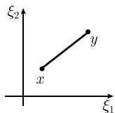
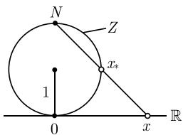
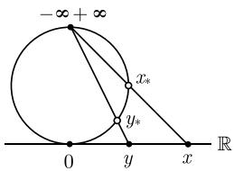
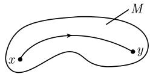
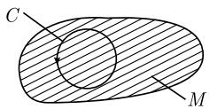
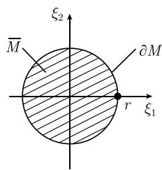

#### 1.3 函数的极限

##### 1.3.1 一个实变量的函数

考虑一个实变量 x 的函数 $y = f(x)$ ，其中 $f(x)$ 为实值.

1.3.1.1 极限

定义 设 $-\infty \leqslant a, b \leqslant \infty$ . 记

$$
\boxed {\lim _ {x \to a} f (x) = b,}
$$

如果, 对 $f$ 定义域里每个序列 $(x_{n})$ , 其中每个 $x_{n} \neq a$ , 有1)

$$
\left| \lim _ {n \rightarrow \infty} x _ {n} = a \quad \text {蕴涵} \quad \lim _ {n \rightarrow \infty} f (x _ {n}) = b. \right|
$$

特别地, 记

$$
\lim _ {x \to a + 0} f (x) = b, \quad {\text {或}} \quad \lim _ {x \to a - 0} f (x) = b,
$$

如果只考虑序列 $(x_{n})$ ，其中每个 $x_{n} > a$ （或 $x_{n} < a)(a\in \mathbb{R})$

1) 在这些情形函数 $f$ 不必在点 $a$ 有定义. 只要求 $f$ 的定义域至少包含一个具有上述极限性质的序列 $(x_{n})$ .

运算 因为函数极限的概念是用数列极限形式给出的, 所以函数极限的运算符合数列的运算. 特别地, 当 $-\infty \leqslant a \leqslant \infty$ 时, 有

$$
\boxed { \begin{array}{l} \lim _ {x \to a} (f (x) + g (x)) = \lim _ {x \to a} f (x) + \lim _ {x \to a} g (x), \\ \lim _ {x \to a} f (x) g (x) = \lim _ {x \to a} f (x) \lim _ {x \to a} g (x), \\ \lim _ {x \to a} \frac {f (x)}{h (x)} = \frac {\lim _ {x \to a} f (x)}{\lim _ {x \to a} h (x)}. \end{array} }
$$

这里，需额外假设等式右边的极限都存在，而且有限，并且最后一个表达式里 $\lim_{x\to a}h(x)\neq 0.$

当 $x \to a + 0$ 或 $x \to a - 0$ 时, 这些运算依然正确, 其中 $a \in \mathbb{R}$ .

例 1: 设 $f(x) := x$ . 那么对所有 $a \in R$ , 有

$$
\lim _ {x \to a} f (x) = a.
$$

实际上， $\lim_{n\to \infty}x_n = a.$ 推出 $\lim_{n\to \infty}f(x_n) = a.$

例 2: 设 $f(x) := x^{2}$ ，则

$$
\lim _ {x \to a} x ^ {2} = \lim _ {x \to a} x \lim _ {x \to a} x = a ^ {2}.
$$

例 3: 设

$$
f (x) := \left\{ \begin{array}{r l} 1, & x > a, \\ 2, & x = a, \\ - 1, & x <   a \end{array} \right.
$$

(图 1.19), 则

$$
\lim _ {x \to a + 0} f (x) = 1, \quad \lim _ {x \to a - 0} f (x) = - 1.
$$

  
图1.19

称极限 $\lim_{x\to a+0}f(x)$ (或 $\lim_{x\to a-0}f(x)$ ) 为 f 在点 a 处的右极限 (或左极限).

1.3.1.2 连续函数

直观上说, 连续函数是指没有跳跃点的函数 [图 1.20(a)].

  
(a) 连续函数

  
图1.20  
(b) 不连续函数

定义 设 $a \in M$ . 函数 $f: M \subseteq \mathbb{R} \to \mathbb{R}$ 称作在点 $a$ 处连续, 如果对象点 $f(a)$ 的每个邻域 $U(f(a))$ , 存在邻域 $U(a)$ 使得 $^{1)}$

$$
\boxed {x \in U (a) \quad \text {且} \quad x \in M \quad \text {蕴涵} \quad f (x) \in U (f (a)).}
$$

换言之, 如果对每个实数 $\varepsilon > 0$ , 存在一个实数 $\delta > 0$ 使得

$$
| f (x) - f (a) | <   \varepsilon \quad {\text {对所有满足}} | x - a | <   \delta {\text {的}} x \in M,
$$

则 f 在点 a 处连续.

极限判别法 f 在点 a 处连续, 当且仅当 $^{2)}$

$$
\boxed {\lim _ {x \to a} f (x) = f (a).}
$$

运算 如果 $f, g: M \subseteq R \rightarrow R$ 在点 a 处连续, 那么

(i) 和 $f + g$ 及积 $fg$ 在点 $a$ 处连续.

(ii) 商 $\frac{f}{q}$ 在点 a 处连续, 如果 $g(a) \neq 0$ .

现在考虑两个函数的复合:

$$
\boxed {H (x) := F (f (x)).}
$$

也可记作 $H = F \circ f$ .

复合函数的连续性 函数 H 在点 a 处连续, 如果 f 在点 a 处连续, 且 F 在点 $f(a)$ 处连续.

可微性和连续性 如果函数 $f: M \subseteq \mathbb{R} \to \mathbb{R}$ 在点 $a$ 处可微, 那么 $f$ 在点 $a$ 处连续 (参看 1.4.1).

例：函数 $y = \sin x$ 在每个点 $a \in \mathbb{R}$ 处都是可微的。由此即得

$$
\boxed {\lim _ {x \to a} \sin x = \sin a.}
$$

类似的结论对 $y = \cos x, y = e^{x}, y = \cosh x, y = \sinh x, y = \arctan x$ 及每个有实系数的多项式 $y = a_{0} + a_{1}x + \cdots + a_{n}x^{n}$ 都成立.

下列定理说明, 连续函数有很好的性质.

设 $-\infty < a < b < \infty.$

魏尔斯特拉斯定理 每个连续函数 $f:[a,b]\to R$ 有极小值和极大值.

更明确地说, 存在 $\alpha, \beta \in [a, b]$ , 使得对每个 $x \in [a, b]$ , 有

$$
\boxed {f (\alpha) \leqslant f (x)}
$$

1) 也可记作 $f(U(a)) \subseteq U(f(a))$ .

2) 这意味着, 对 $M$ 中满足 $\lim_{n\to \infty}x_n = a$ 的每个序列 $(x_{n})$ , 有 $\lim_{n\to \infty}f(x_n) = f(a)$ .

(称 $f(\alpha)$ 为极小值); 对每个 $x \in [a, b]$ , 有 $f(x) \leqslant f(\beta)$ (称 $f(\beta)$ 为极大值)(图1.21). 波尔查诺(Bolzano)定理 如果函数 $f: [a, b] \to \mathbb{R}$ 连续, 且 $f(a)f(b) \leqslant 0$ , 那么方程

$$
\boxed {f (x) = 0, \quad x \in [ a, b ]}
$$

有一个解 (图 1.22).

  
图1.21

  
图1.22

中值定理 如果函数 $f:[a,b]\to \mathbb{R}$ 连续, 那么对所有满足 $\min_{a\leqslant x\leqslant b}f(x)\leqslant \gamma \leqslant$ $\max_{a\leqslant x\leqslant b}f(x)$ 的 $\gamma$ ，方程

$$
\boxed {f (x) = \gamma , \quad x \in [ a, b ]}
$$

有一个解.

1.3.1.3 洛必达法则

这个重要的法则能够计算 $\frac{0}{0}, \frac{\infty}{\infty}$ 型的不定式. 法则是

$$
\boxed {\lim _ {x \to a} \frac {f (x)}{g (x)} = \lim _ {x \to a} \frac {f ^ {\prime} (x)}{g ^ {\prime} (x)}.}\tag{1.28}
$$

这里需要假设:

(i) 存在极限 $\lim_{x\to a}f(x) = \lim_{x\to a}g(x) = b,$ 其中 $b = 0$ 或 $b = \pm \infty$ ，而一 $\infty \leqslant a\leqslant$ $\infty$

(ii) 存在一个邻域 $U(a)$ , 使得对所有的 $x \in U(a)$ , 且 $x \neq a$ , 导数 $f'(x)$ 和 $g'(x)$ 存在.

(iii) 对所有的 $x \in U(a)$ ，且 $x \neq a$ ，有 $g'(x) \neq 0$ .

(iv) 式 (1.28) 右边的极限存在. $^{1)}$

1) 当 $x \to a + 0$ (相应地, $x \to a - 0$ ), 类似的论述也成立, 其中 $a \in \mathbb{R}$ . 这时要求假设 (ii) 和 (iii) 只对点 $x \in U$ 成立, 其中 $x > a$ (相应地, $x < a$ ).

导数 $f'(x)$ 的概念将在 1.4.4 引入.

例 1 $\left(\frac{0}{0}\right)$ : $\lim_{x\to0}\sin x=\lim_{x\to0}x=0.$ 因为 $\cos x$ 的连续性, 由 (1.28) 即得

$$
\lim _ {x \to 0} \frac {\sin x}{x} = \lim _ {x \to 0} \frac {\cos x}{1} = \cos 0 = 1.
$$

例 2 $\left(\frac{\infty}{\infty}\right)$ :

$$
\lim _ {x \to + \infty} \frac {\ln x}{x} = \lim _ {x \to + \infty} \frac {\frac {1}{x}}{1} = 0,
$$

$$
\lim _ {x \to + \infty} \frac {\mathrm{e} ^ {x}}{x} = \lim _ {x \to + \infty} \frac {\mathrm{e} ^ {x}}{1} = + \infty .
$$

洛必达法则的变形 有时候必须重复应用洛必达法则, 直到右端有极限.

$$
\boxed {\lim _ {x \to a} \frac {f (x)}{g (x)} = \lim _ {x \to a} \frac {f ^ {\prime} (x)}{g ^ {\prime} (x)} = \dots = \lim _ {x \to a} \frac {f ^ {(n)} (x)}{g ^ {(n)} (x)}.}
$$

例3： $\lim_{x\to +\infty}\frac{\mathrm{e}^x}{x^2} = \lim_{x\to +\infty}\frac{\mathrm{e}^x}{2x} = \lim_{x\to +\infty}\frac{\mathrm{e}^x}{2} = +\infty .$

$0 \cdot \infty$ 型的表达式可以转化为 $\frac{\infty}{\infty}$ 型, 这样就可以应用洛必达法则了. 例4:

$$
\lim _ {x \to + 0} x \ln x = \lim _ {x \to + 0} \frac {\ln x}{\frac {1}{x}} = \lim _ {x \to + 0} \frac {\frac {1}{x}}{\left(- \frac {1}{x ^ {2}}\right)} = \lim _ {x \to + 0} (- x) = 0.
$$

$\infty - \infty$ 型的表达式可以转化为 $\infty \cdot a$ 型, 其中 $a$ 是某个有限值.

例 5:

$$
\begin{array}{c} \lim _ {x \to + \infty} (\mathrm{e} ^ {x} - x) = \lim _ {x \to + \infty} \mathrm{e} ^ {x} \left(1 - \frac {x}{\mathrm{e} ^ {x}}\right) = \lim _ {x \to + \infty} \mathrm{e} ^ {x} \lim _ {x \to + \infty} \left(1 - \frac {x}{\mathrm{e} ^ {x}}\right) \\ = \lim _ {x \to + \infty} \mathrm{e} ^ {x} = + \infty \end{array}
$$

这可由例 2 推出, 在那里有

$$
\lim _ {x \to + \infty} \left(1 - \frac {x}{\mathrm{e} ^ {x}}\right) = 1.
$$

下面的公式也非常好用：

$$
a ^ {x} = \mathrm{e} ^ {x \cdot \ln a}.
$$

它可以用来处理 $0^0, \infty^0, 0^\infty$ 型的表达式.

例 6 ( $\infty^{0}$ ): 由 $x^{1/x}=e^{\frac{\ln x}{x}}$ 及例 2, 可得

$$
\lim _ {x \to + \infty} x ^ {1 / x} = \mathrm{e} ^ {0} = 1.
$$

1.3.1.4 函数的数量级

在许多情况下, 很好地理解函数量的变化就足够了. 为此有两个归功于兰道 (Landau) 的方便的符号 $O(g(x))$ 和 $o(g(x))$ . 设 $-\infty \leqslant a \leqslant \infty$ .

定义(渐近等式) 当且仅当 $\lim_{x\to a}\frac{f(x)}{g(x)} = 1$ ，记

$$
\boxed {f (x) \cong g (x), \quad x \to a.}
$$

例 1: $\lim_{x\to0}\frac{\sin x}{x}=1$ , 蕴涵 $x\to0$ 时 $\sin x\cong x$ .
定义 记

$$
\boxed {f (x) = O (g (x)), \quad x \to a,}\tag{1.29}
$$

如果存在 a 的一个邻域 $U(a)$ 及一个实数 K, 使得

$$
\left| {\frac {f (x)}{g (x)}} \right| \leqslant K. \quad {\text {对所有}} \quad x \in U (a) \quad {\text {且}} \quad x \neq a.\tag{1.29 \( ^{*} \)}
$$

定理 如果有限极限 $\lim_{x\to a}\frac{f(x)}{g(x)}$ 存在, 则关系式 (1.29) 成立.

例 2: 等式 $\lim_{x\to+\infty}\frac{3x^{2}+1}{x^{2}}=3$ 蕴涵当 $x\to+\infty$ 时, $3x^{2}+1=O(x^{2})$ .
定义 记 $^{1)}$

$$
\boxed {f (x) = o (g (x)), \quad x \to a,}
$$

如果 $\lim_{x\to a}\frac{f(x)}{g(x)}=0.$

例 3: 当 $x \to 0$ 时, $x^{n} = o(x)$ , 其中 $n = 2, 3, \cdots$ .

例 4:

$$
\mathrm{(i)} \frac {x ^ {2}}{x ^ {2} + 2} \cong 1, x \to \infty .
$$

(ii) $\frac{1}{x^2 + 2} \cong \frac{1}{x^2}, x \to +\infty.$

(iii) 设 $-\infty \leqslant a \leqslant \infty$ , 当 $x \to a$ 时, $\sin x = O(1)$ .

(iv) 当 $x \to +0$ 时, $\ln x = o\left(\frac{1}{x}\right)$ , 当 $x \to +\infty$ 时, $\ln x = o(x)$ .

(v) 当 $x \to +\infty$ 时, $x^{n} = o(\mathrm{e}^{x})$ , 其中 $n = 1, 2, \cdots$ .

最后的陈述 (v) 表示, 当 $x \to +\infty$ 时, 函数 $y = \mathrm{e}^{x}$ 比任何幂函数 $x^{n}$ 增长得快.

1) 设 $a \in \mathbb{R}$ . 同样, 当 $x \to a + 0$ (相应地, $x \to a - 0$ ) 时, 可以引进符号 $f(x) \cong g(x)$ , $f(x) = O(g(x))$ , $f(x) = o(g(x))$ . 一般地, 当 $x \in U(a)$ , 且 $x > a$ (相应地, $x < a$ ) 时, 不等式 (1.29\*) 才成立.

##### 1.3.2 度量空间和点集

动机 现代数学的特征之一是趋向于把概念和方法推广到越来越抽象的情况。这使得人们能够解决大量日益复杂的问题，并发现看起来完全不同的研究领域之间的联系。这个过程还被证明是高度有效的，因为它把更多不同的概念替换成几个极其基本概念的推导。

为了把单变量函数极限的概念引入多变量函数, 引进度量空间是有益的. 现代观点的强大威力在泛函分析的研究中变得鲜明. 这一数学分支发展于 20 世纪 (参看 [212]).

1.3.2.1 距离的概念和收敛

度量空间 度量空间中有两点之间距离的概念. 一个非空集合 $X$ 称为度量空间, 如果对 $X$ 里的每个有序点对 $(x, y)$ , 存在一个实数 $d(x, y) \geqslant 0$ , 使得对所有的 $x, y, z \in X$ , 下列陈述成立:

(i) $d(x,y)=0$ , 当且仅当 x=y.

(ii) $d(x,y)=d(y,x)$ (对称性).

(iii) $d(x,z) \leqslant d(x,y) + d(y,z)$ (三角不等式).

数 $d(x,y)$ 称为 x 与 y 之间的距离. 由定义, 空集也是度量空间.

定理 度量空间的每个子集仍是具有相同距离函数的一个度量空间.

极限 设 $(x_{n})$ 是度量空间 $X$ 中点的序列. 记

$$
\boxed {\lim _ {n \to \infty} x _ {n} = x,}
$$

如果 $\lim_{n\to \infty}d(x_n,x) = 0$ ，即，如果当 $n\to \infty$ 时， $x_{n}$ 与 $x$ 的距离趋向于0.唯一性 如果极限存在，那么它被唯一确定.

例 1: 实数集 R 是具有距离函数

$$
d (x, y) := | x - y |, \quad x, y \in \mathbb {R}
$$

的度量空间. 由这个度量所诱导的距离概念是通常 (朴素) 的距离概念 (见 1.2.3.1). 例 2: 由定义, 集合 $\mathbb{R}^{N}$ 为实数 $\xi_{j}$ 的全部 $N$ 元数组 $x = (\xi_{1}, \cdots, \xi_{N})$ 的集合. 设 $y = (\eta_{1}, \cdots, \eta_{N})$ 为 $\mathbb{R}^{N}$ 的另一个元素, 并令

$$
\boxed {d (x, y) := \sqrt {\sum_ {j = 1} ^ {N} (\xi_ {j} - \eta_ {j}) ^ {2}}.}
$$

这就把 $\mathbb{R}^N$ 做成一个度量空间. 当 $N = 1,2,3$ 时, 在 $\mathbb{R},\mathbb{R}^2,\mathbb{R}^3$ 中导出的距离概念与通常 (朴素) 的距离概念一致 (图1.23).

进一步, 我们定义

$$
\boxed {| x - y | := d (x, y),}
$$

并令 $|x| = \sqrt{\sum_{j=1}^{N}\xi_j^2}$ 表示 $x$ 的欧几里得范数. 直观上, $|x|$ 是 $x$ 到原点的距离.

令 $(x_{n})$ 是 $R^{N}$ 中具有分量 $x_{n}=(\xi_{1n},\cdots,\xi_{Nn})$ 的一个序列, 并如上令 $x=(\xi_{1},\cdots,\xi_{N})$ . 那么度量空间 $R^{N}$ 中的收敛

$$
\boxed {\lim _ {n \to \infty} x _ {n} = x}
$$

等价于各分量的收敛

$$
\boxed {\lim _ {n \to \infty} \xi_ {j n} = \xi_ {j}, \quad j = 1, \dots , N.}
$$

  
(a) N=1

  
(b) N=2

  
(c) N=3  
图1.23 $\mathbb{R}^n$ 中的距离

例 3: 当 N = 2 时, 收敛 $\lim_{n \to \infty} x_n = x$ 对应着点 $x_n$ 越来越接近点 x(图 1.24).

例 4(单位圆): 考虑图 1.25 所示的情形. 实数直线 R 上的每个点 x 对应于单位圆上唯一的点 $x_{*}$ . 北极点 N 不对应 R 的任何点. 通常把北极点替换成 $+\infty$ 和 $-\infty$ . 定义:

  
图1.24

$$
\overline {{\mathbb {R}}} := \mathbb {R} \cup \{+ \infty , - \infty \}.
$$

令

$$
d (x, y) := \mathrm{单位圆} Z \mathrm{上} x _ {*} \mathrm{与} y _ {*} \mathrm{之间的弧长},
$$

则集合 $\overline{R}$ 成为度量空间.

  
(a)

  
(b)  
图1.25 单位圆上的一个距离函数

我们约定

$$
d (- \infty , \infty) := 2 \pi .
$$

例如, 我们有 $d(\pm \infty, 0) = \pi$ . 设 $(x_{n})$ 是一个实数序列. 在 $\overline{\mathbb{R}}$ 中度量 $d$ 的意义下, 收敛

$$
\lim _ {n \to \infty} x _ {n} = x, \quad - \infty \leqslant x \leqslant + \infty
$$

意味着单位圆上的对应点序列 $(x_{n})_{*}$ 收敛到点 $x_{*}$ . 这等价于收敛的经典概念 (见1.2.3).

这样, 从单位圆度量空间 Z 中收敛的度量概念, 就导出了收敛到有限值和无限值经典概念的一个统一的定义.

1.3.2.2 特殊的集合

令 M 是度量空间 X 的一个子集.

有界集 非空集合 M 称为有界的, 如果存在实数 R > 0 使得

$$
\boxed {d (x, y) \leqslant R, \quad \text {对所有的} \quad x, y \in M.}
$$

根据定义, 空集是有界的.

邻域 令 $\varepsilon > 0$ . 设

$$
U _ {\varepsilon} (a) := \{x \in Z \mid d (a, x) <   \varepsilon \},
$$

并称它为 a 的 $\varepsilon$ 邻域. 换句话说, 点 a 的 $\varepsilon$ 邻域 $U_{\varepsilon}(a)$ 是由度量空间 X 中到 a 的距离小于 $\varepsilon$ 的所有点 x 组成 (图 1.26).

  
(a) $X = R^{2}$

  
(b) $\mathbb{R}^2$ 中的开集 $M$

  
(c) $\mathbb{R}^2$ 中的闭集 $M$  
图1.26 $\mathbb{R}^2$ 中的开集和闭集

集合 $U(a)$ 称为 a 的邻域, 如果它包含某个 $\varepsilon$ 邻域 $U_{\varepsilon}(a)$ .

开集 集合 $M$ 称为开集, 如果对每个 $a \in M$ , 存在 $a$ 的邻域 $U(a)$ 包含在 $M$ 里, 即 $U(a) \subseteq M$ .

闭集 集合 M 称为闭集, 如果补集 X - M 是开集.

内点和外点 点 $a \in M$ 称为 $M$ 的内点, 如果存在 $a$ 的一个邻域 $U(a)$ 包含在 $M$ 里, $U(a) \subseteq M$ (图1.26(c)).

点 b 称为 M 的外点, 如果存在一个不属于 M 的邻域 $U(b)$ , $U(b) \subseteq X - M$ .

点 c 称为 M 的边界点, 如果 c 既非 M 的内点也非 M 的外点 (图 1.26(c)).

M 的所有内点 (相应地, 外点) 组成的集合记作 intM(相应地, extM).

边界和闭包 M 的所有边界点的集合 $\partial M$ 称为 M 的边界(图 1.26(c)). 另, 集合

$$
\boxed {\overline {{M}} := M \cup \partial M}
$$

称为 M 的闭包.

定理 (i) $M$ 的内点集 $\operatorname{int} M$ 是包含在 $M$ 中的最大开集.

(ii) M 的闭包 $\overline{M}$ 是包含 M 的最小闭集.

(iii) 可以把 X 分解成几个不相交的集合:

$$
\boxed {X = \operatorname{int} M \cup \operatorname{ext} M \cup \partial M,}
$$

它表示, 每个点 $x \in X$ 恰属于 $\operatorname{int} M$ 、 $\operatorname{ext} M$ 、 $\partial M$ 这三个集合中的一个.

聚点 点 $a \in X$ 称为 $M$ 的聚点, 如果 $a$ 的每个邻域至少包含一个不为 $a$ 的 $M$ 里的点.

波尔查诺-魏尔斯特拉斯定理 $\mathbb{R}^N$ 的每个无界无限集有一个聚点.

1.3.2.3 紧性

紧性的概念是分析中最重要的概念之一.

度量空间的子集 M 称作紧集, 如果 M 的每个开覆盖 (一些开集的集合, 它们的并包含 M) 包含一个有限子覆盖, 即, 开集的那个集合有一个有限子集, 它们的并仍包含 M.

一个集合称为相对紧的, 如果它的闭包是紧的.

定理 (i) 每个紧集是有界闭集.

(ii) 每个相对紧集是有界集.
用收敛序列刻画 设 M 是一个度量空间的子集.

(i) $M$ 是闭集, 当且仅当 $M$ 中的每个收敛序列 $(x_{n})$ 的极限属于 $M$ .

(ii) $M$ 是相对紧集, 当且仅当 $M$ 中的每个序列有一个收敛子序列.

(iii) $M$ 是紧集, 当且仅当 $M$ 中的每个序列有一个收敛子序列, 且其极限属于 $M$ .

$\mathbb{R}$ 的子集 令 $M$ 是 $\mathbb{R}^N$ 的子集. 下面三个陈述等价:

(i) M 是紧集.

(ii) M 是有界闭集.

(iii) $M$ 中的每个序列有一个收敛子序列, 且其极限属于 $M$ .

而且, 下面三个陈述也等价:

(a) M 是相对紧集.

(b) $M$ 是有界集.

(c) M 中的每个序列包含一个收敛子序列.

1.3.2.4 连通性

度量空间的子集 $M$ 称为弧连通集, 如果对任意两点 $x, y \in M$ , 在 $M$ 中有一条连续曲线连接这两点(图1.27).

  
图 1.27 弧连通性

区域 度量空间的一个子集称为区域, 如果它是弧连通的非空开集.

单连通集 度量空间的子集 $M$ 称为单连通集, 如果它是弧连通的, 并且 $M$ 里的每条闭曲线可以连续收缩到一个点2)(图1.28).

  
(a) 单连通

  
(b) 非单连通  
图 1.28 单连通集与非单连通集的概念

1.3.2.5 例子

例 1 (X = R): 设 $-\infty < a < b < \infty$ .

(i) 区间 $[a, b]$ 是 R 中的紧集. 它也是有界闭集.

(ii) 区间 ]a, b[ 是有界开集.

(iii) $\mathbb{R}$ 的子集是弧连通的, 当且仅当它是一个区间.

1) 连续曲线的概念定义如下：存在一个连续映射 $\varphi : [0,1] \to M$ ，其中 $\varphi(0) = x$ ， $\varphi(1) = y$ 。 $\varphi$ 的连续性意味着，对 $[0,1]$ 里的每个序列 $(t_n)$ ，当 $\lim_{n \to \infty} t_n = t$ 时，有

$$
\lim _ {n \to \infty} \varphi (t _ {n}) = \varphi (t).
$$

2) 这意味着, 对每个闭曲线, 即连续映射 $\varphi : [0,1] \to M$ , 其中 $\varphi(0) = \varphi(1)$ , 存在一个从 $[0,1] \times M$ 映到 $M$ 的连续函数 $H = H(t,x)$ , 使得对所有 $x \in M$ , 有

$$
H (0, x) = \varphi (x), H (1, x) = x _ {0},
$$

其中 $x_{0}$ 是 M 中的某个固定点.

(iv) 每个实数是有理数集的聚点.

(v) 半开区间 $[a, b]$ 既不是开集也不是闭集. 然而它是有界的相对紧集. 例 $2(X = \mathbb{R}^2)$ : 设 $r > 0$ . 令

$$
M := \{(\xi_ {1}, \xi_ {2}) \in \mathbb {R} ^ {2} | \xi_ {1} ^ {2} + \xi_ {2} ^ {2} <   r ^ {2} \}.
$$

那么 M 是半径为 r, 原点为圆心的圆的内点集 (图 1.29(a)).

  
(a) 开圆 $M$

  
(b) $\overline{M}=M\cup\partial M$  
图1.29

可以验证, 这个圆的边界和闭包如下:

$$
\partial M = \{(\xi_ {1}, \xi_ {2}) \in \mathbb {R} ^ {2} | \xi_ {1} ^ {2} + \xi_ {2} ^ {2} = r ^ {2} \},
$$

$$
\overline {{M}} = \{(\xi_ {1}, \xi_ {2}) \in \mathbb {R} ^ {2} | \xi_ {1} ^ {2} + \xi_ {2} ^ {2} \leqslant r ^ {2} \}
$$

(图 1.29(b)).

(i) 集合 $M$ 是开的、有界的、弧连通的、单连通的、相对紧的.

(ii) 集合 M 是单连通区域.

(iii) 集合 M 既不是闭集, 也不是紧集.

(iv) 集合 $\overline{M}$ 是闭的、有界的、紧的、弧连通的、单连通的.

(v) 边界 $\partial M$ 是闭的、有界的、紧的、弧连通的、但不是单连通的. 例3(单位圆): 集合 $\mathbb{R}$ 相对于经典距离函数是无界集, 因此不是紧的 (参看1.3.2.1中的例1).

另一方面, 1.3.2.1 的例 4 中引入的度量空间 $\mathbb{R} \cup \{\pm \infty\}$ 是有界紧的. 这就是能统一处理有限极限和无限极限的更深层次的原因.

上面引入的概念可以推广到度量空间和拓扑空间 (见 [212]).

##### 1.3.3 多变量函数

应用中出现的多数函数依赖于多于一个的变量, 如空间坐标和时间坐标. 简记作 $y = f(x)$ , 其中 $x = (\xi_{1}, \cdots, \xi_{N})$ , 而所有的 $\xi_{j}$ 是实变量.

1.3.3.1 极限

令 $f:M\to Y$ 是从度量空间 $M$ 到度量空间 $Y$ 的一个函数1).记

$$
\boxed {\lim _ {x \to a} f (x) = b,}
$$

当且仅当, 对 $f$ 的定义域中的每个序列 $(x_{n})$ , 其中对所有的 $n$ , $x_{n} \neq a$ , 有2)

$$
\boxed {\lim _ {n \to \infty} x _ {n} = a \quad \text {蕴涵} \quad \lim _ {n \to \infty} f (x _ {n}) = b.}
$$

例 1: 函数 $f: R^{2} \rightarrow R$ 由 $f(u, v) := u^{2} + v^{2}$ 给出, 则有

$$
\lim _ {(u, v) \to (a, b)} f (u, v) = a ^ {2} + b ^ {2}.
$$

实际上, 对满足 $\lim_{n\to \infty}(u_n,v_n) = (a,b)$ 的任意序列 $(u_{n},v_{n})$ ，有 $\lim_{n\to \infty}u_n = a$ 和 $\lim_{n\to \infty}v_n = b.$ 因此，

$$
\lim _ {n \to \infty} (u _ {n} ^ {2} + v _ {n} ^ {2}) = a ^ {2} + b ^ {2}.
$$

例 2: 对于函数

$$
f (u, v) := \left\{ \begin{array}{l l} \frac {u}{v}, & (u, v) \neq (0, 0), \\ 0, & (u, v) = (0, 0), \end{array} \right.
$$

极限 $\lim_{(u,v)\to (0,0)}f(u,v)$ 不存在. 这是因为序列 $(u_n,v_n) = \left(\frac{1}{n},\frac{1}{n}\right)$ 满足

$$
\lim _ {n \to \infty} f (u _ {n}, v _ {n}) = 1,
$$

而当 $(u_{n},v_{n}) = \left(\frac{1}{n^{2}},\frac{1}{n}\right)$ 时，有

$$
\lim _ {n \to \infty} f (u _ {n}, v _ {n}) = \lim _ {n \to \infty} \frac {1}{n} = 0.
$$

1.3.3.2 连续性

定义 两个度量空间 $M$ 和 $Y$ 之间的映射 $f: M \to Y$ 称为在点 $a$ 处是连续的, 如果对于象 $f(a)$ 的每个邻域 $U(f(a))$ , 存在 $a$ 的一个邻域 $U(a)$ 满足:

$$
\boxed {f (U (a)) \subseteq U (f (a)).}
$$

这意味着, $x \in U(a)$ 蕴涵 $f(x) \in U(f(a))$ .

函数 f 称为连续的, 如果它在 M 的每个点处都连续.

极限判别法 对函数 $f: M \rightarrow Y$ 及点 $a \in M$ ，下列三个陈述等价： $^{1)}$

(i) f 在点 a 处连续.

(ii) $\lim_{x\to a}f(x)=f(a).$

(iii) 对任意 $\varepsilon > 0$ , 存在一个 $\delta > 0$ , 使得对所有满足 $d(x, a) < \delta$ 的 $x$ 有: $d(f(x), f(a)) < \varepsilon$ .

定理 函数 $f: M \rightarrow Y$ 是连续的, 当且仅当, 开集的逆象是开的.

复合定律 如果函数 $f: M \rightarrow Y$ 和 $F: Y \rightarrow Z$ 都是连续的, 那么复合映射

$$
\boxed {F \circ f: M \to Z}
$$

也是连续的. 我们有 $(F \circ f)(x) := F(f(x))$ .

运算 如果函数 $f, g: M \rightarrow R$ 在点 a 处连续, 那么

$$
f + g
$$

$$
\frac {f}{g}
$$

$$
g (a) \neq 0
$$

分量法则 设 $f(x)=(f_{1}(x),\cdots,f_{k}(x))$ . 那么下面两个陈述等价:

(i) 对每个 $j, f_j: M \to \mathbb{R}$ , 在点 $a$ 处都是连续的.

(ii) $f:M\to \mathbb{R}^k$ 在点 $a$ 处连续.

例：设 $x = (\xi_1, \xi_2)$ . 具有实系数 $a_{jk}$ 的每个多项式

$$
p (x) = \sum_ {j, k = 0} ^ {m} a _ {j k} \xi_ {1} ^ {j} \xi_ {2} ^ {k}
$$

在每个点 $x \in R^{2}$ 处都是连续的.

类似的结论对 N 元多项式也成立.

不变性原理 设 $f: M \rightarrow Y$ 是两个度量空间之间的连续映射, 那么

(i) f 把紧集映射成紧集.

(ii) f 把弧连通集映射成弧连通集.

魏尔斯特拉斯定理 设 $M$ 是度量空间的一个非空紧子集, 则连续函数 $f: M \to \mathbb{R}$ 有一个最大值和最小值. 对于 $\mathbb{R}^N$ 的一个非空有界闭子集, 这个定理也成立.

波尔查诺零点定理 设 $f: M \to \mathbb{R}$ 是一个连续函数, 定义域 $M$ 是一个度量空间的弧连通子集. 如果存在 $M$ 的两个点 $a, b$ 满足 $f(a)f(b) \leqslant 0$ , 那么方程

$$
\boxed {f (x) = 0, \quad x \in M}
$$

1) 条件 (ii) 意味着, 对 $M$ 中满足 $\lim_{n\to \infty}x_n = a$ 的每个序列 $(x_{n})$ , 有 $\lim_{n\to \infty}f(x_n) = f(a)$ .

有一个解.

中值定理 如果 $f: M \to \mathbb{R}$ 是连续的, 且 $M$ 是弧连通集, 那么象 $f(M)$ 是一个区间.

在 M 中有两个点 a 和 b, 使得 $f(a) < f(b)$ 的特殊情形, 方程

$$
\boxed {f (x) = \gamma , \quad x \in M}
$$

对每个实数 $\gamma$ 都有一个解, 其中 $f(a) \leqslant \gamma \leqslant f(b)$ .
