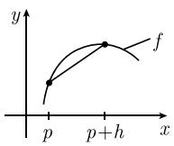
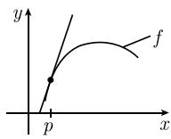

##### 1.4.1 导数

定义 考虑一个实变量 $x$ 的实值函数 $y = f(x)$ , 它定义在点 $p$ 的一个邻域内. $f$ 在点 $p$ 处的导数 $f'(p)$ 定义为有限极限:

$$
\boxed {f ^ {\prime} (p) = \lim _ {h \to 0} \frac {f (p + h) - f (p)}{h}.}
$$

几何解释 数 $\frac{f(p + h) - f(p)}{h}$ 是图1.30(a)中割线的斜率.当 $h\to 0$ 时，割线直观上趋向于切线.因此定义：

$$
\boxed {f ^ {\prime} (p) \text {是} f \text {的图形在点} (p, f (p)) \text {处的切线的斜率}.}
$$

此时对应的切线方程是

$$
\boxed {y = f ^ {\prime} (p) (x - p) + f (p).}
$$

例 1: 对函数 $f(x) := x^{2}$ ，有

$$
f ^ {\prime} (p) = \lim _ {h \to 0} \frac {(p + h) ^ {2} - p ^ {2}}{h} = \lim _ {h \to 0} \frac {2 p h + h ^ {2}}{h} = \lim _ {h \to 0} (2 p + h) = 2 p.
$$

  
(a)

  
(b)  
图1.30 导数

重要导数表 见 0.8.1.

莱布尼茨符号 令 $y = f(x)$ . $f'(p)$ 也可以记作

$$
f ^ {\prime} (p) = {\frac {\mathrm{d} f}{\mathrm{d} x}} (p) \quad {\text {或}} \quad f ^ {\prime} (p) = {\frac {\mathrm{d} y}{\mathrm{d} x}} (p).
$$

如果令 $\Delta f := f(x) - f(p)$ , $\Delta x := x - p$ , $\Delta y = \Delta f$ , 那么有

$$
\boxed {\frac {\mathrm{d} f}{\mathrm{d} x} (p) = \lim _ {\Delta x \to 0} \frac {\Delta f}{\Delta x} = \lim _ {\Delta x \to 0} \frac {\Delta y}{\Delta x}.}
$$

这套符号是 G. W. 莱布尼茨(Gottfried Wilhelm Leibniz, 1646—1716) 引进的, 事实证明极其方便, 许多重要的求导运算法则就是通过这些符号推导来的. 这是精心挑选的数学符号的性质.

连续性和可微性的关系 如果 f 在点 p 处可导 (即, f 在点 p 处的导数存在), 那么 f 在点 p 处也是连续的 (可以说 “f 在点 p 处更是连续的”).

相反的结论不成立. 例如, 函数 $f(x) := |x|$ 在点 $x = 0$ 处连续, 但是不可导 (虽然它在所有其他点处是可微的), 理由是这个函数的图像在 $x = 0$ 处没有切线 (图1.31).

  
图1.31

高阶导数 如果令 $g(x) := f'(x)$ ，那么由定义，

$$
\boxed {f ^ {\prime \prime} (p) := g ^ {\prime} (p).}
$$

也可记作 $f^{(2)}(p)$ ，或用莱布尼茨的符号：

$$
f ^ {\prime \prime} (p) = \frac {\mathrm{d} ^ {2} f}{\mathrm{d} x ^ {2}} (p).
$$

类似地, 我们定义 $f^{(n)}(p), n = 2, 3, \cdots$ .

例 2: 当 $f(x) := x^{2}$ 时, 我们有

$$
f ^ {\prime} (x) = 2 x, \quad f ^ {\prime \prime} (x) = 2, \quad f ^ {\prime \prime \prime} (x) = 0, \quad f ^ {(n)} (x) = 0, \quad n = 4, 5, \dots
$$

(见 0.8.1).

基本法则 假设 f, g 在点 x 处可导, $\alpha$ , $\beta$ 为实数. 那么

$$
(\alpha f + \beta g) ^ {\prime} (x) = \alpha f ^ {\prime} (x) + \beta g ^ {\prime} (x)
$$

$$
(f g) ^ {\prime} (x) = f ^ {\prime} (x) g (x) + f (x) g (x)
$$

$$
\left({\frac {f}{g}}\right) ^ {\prime} (x) = {\frac {f ^ {\prime} (x) g (x) - f (x) g ^ {\prime} (x)}{g (x) ^ {2}}} \quad (\text {除法法则}).
$$

在除法法则里, 当然一定假设 $g(x) \neq 0$ .

例子可见 0.8.2.

莱布尼茨积法则 如果 f, g 在点 x 处是 n 阶可导的, 那以对于 $n = 1, 2, \cdots$ , 有

$$
\boxed {(f g) ^ {(n)} (x) = \sum_ {k = \infty} ^ {n} \binom{n}{k} f _ {(x)} ^ {(n - k)} g ^ {(k)} (x).}
$$

这个求导法则类似于二项式公式 (见 0.1.10.3). 特别是, 当 n = 2 时, 有

$$
(f g) ^ {\prime \prime} (x) = f ^ {\prime \prime} (x) g (x) + 2 f ^ {\prime} (x) g ^ {\prime} (x) + f (x) g ^ {\prime \prime} (x).
$$

例 3：考虑函数 $h(x):=x\cdot\sin x$ 。如果我们令 $f(x):=x,g(x):=\sin x$ ，那么 $f'(x)=1,f''(x)=0$ ，且 $g'(x)=\cos x,g''(x)=-\sin x$ 。因此

$$
h ^ {\prime \prime} (x) = 2 \cos x - x \sin x.
$$

$C[a,b]$ 类函数 令 $[a,b]$ 是一个紧区间. 我们把所有连续函数 $f:[a,b] \to \mathbb{R}$ 的空间记作 $C[a,b]$ . 而且令1)

$$
| | f | | := \max _ {a \leqslant x \leqslant b} | f (x) |.
$$

$C^{k}[a,b]$ 类函数 这类函数由在开区间 $[a,b[$ 上有连续导数 $f',f'',\cdots,f^{(k)}$ 的所有函数 $f\in C[a,b]$ 组成, 而每个导数都可以延拓为 $[a,b]$ 上的连续函数.

定义 $^{2)}$

$$
| | f | | _ {k} := \sum_ {j = 0} ^ {k} \max _ {a \leqslant x \leqslant b} | f ^ {(j)} (x) |.
$$

$C^k$ 型 我们称定义在点 $p$ 的一个邻域内的函数是 $C_k^k$ 型的, 如果在点 $p$ 的一个开邻域内, $f$ 有 $k$ 阶连续导数.
