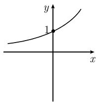
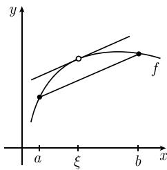

##### 1.4.3 递增函数和递减函数

递增（或递减）判别法 设 $-\infty \leqslant a < b \leqslant \infty$ ，并令 $f :]a, b[ \to R$ 是可导的.

(i) f 是非递减的 (相应地, 非递增的), 如果

$$
\boxed {f ^ {\prime} (x) \geqslant 0, \quad \text {对所有的} \quad x \in ] a, b [}
$$

(相应地 $f'(x) \leqslant 0$ , 对所有的 $x \in]a, b[$ ).

(ii) 如果对所有的 $x \in ]a, b[$ 有 $f'(x) > 0$ , 则 $f$ 在 $]a, b[$ 上是递增的 $^{1)}$ .

(iii) 如果对所有的 $x \in ]a, b[$ 有 $f'(x) < 0$ , 则 $f$ 在 $]a, b[$ 上是递减的.

例 1: 令 $f(x) := \mathrm{e}^{x}$ . 由 $f'(x) = \mathrm{e}^{x} > 0$ (其中 $x \in \mathbb{R}$ ) 即得, 函数 $f$ 在 $\mathbb{R}$ 上是递增的 (图 1.32(a)).

例 2: 令 $f(x) := \cos x$ . 因为 $f'(x) = -\sin x < 0$ (其中 $x \in ]0, \pi[$ ), 由此即得 $f$ 在这个区间 $]0, \pi[$ 上是递减的 (图 1.32(b)).

  
(a) $y = e^{x}$

  
(b) $y = \cos x$  
图 1.32 递增函数与递减函数

  
图 1.33 中值定理

中值定理 令 $-\infty < a < b < \infty$ 。如果 $f: [a, b] \to \mathbb{R}$ 在开区间 $]a, b[$ 上是可导的, 则存在一个数 $\xi \in]a, b[$ , 使得

$$
\boxed {\frac {f (b) - f (a)}{b - a} = f ^ {\prime} (\xi).}
$$

直观上这意味着，图 1.33 中割线的斜率与曲线在某一点 $\xi$ 处切线的斜率一样.

勒贝格(Lebesgue) 定理 令 $-\infty \leqslant a < b \leqslant \infty$ . 对一个严格递增函数 $f:]a, b[ \to \mathbb{R}$ , 有:

(i) 除有限个点外, $f$ 都是连续的, 其中 $f$ 在有限个不连续点处的左极限和右极限存在.

(ii) f 几乎处处可导 $^{2)}$ (图 1.34).

  
图1.34
