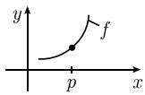
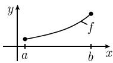

##### 1.4.4 反函数

许多重要的函数是已知函数的反函数 (参看 (0.28)).

1.4.4.1 局部反函数

应用莱布尼茨的富有启发性的符号:

$$
\boxed {\frac {\mathrm{d} x}{\mathrm{d} y} = \frac {1}{\frac {\mathrm{d} y}{\mathrm{d} x}}}\tag{1.31}
$$

就很容易记住反函数的求导法则.

例 1: $y = x^{2}$ 的反函数是

$$
x = \sqrt {y}, \quad y > 0.
$$

因为 $\frac{dy}{dx}=2x,$ 所以由 (1.31) 得

$$
{\frac {\mathrm{d} \sqrt {y}}{\mathrm{d} y}} = {\frac {\mathrm{d} x}{\mathrm{d} y}} = {\frac {1}{{\frac {\mathrm{d} y}{\mathrm{d} x}}}} = {\frac {1}{2 x}} = {\frac {1}{2 \sqrt {y}}}.
$$

例 2: 对于函数 $f(x) := \sqrt{x}$ ，有

$$
f ^ {\prime} (x) = \frac {1}{2 \sqrt {x}}, \quad x > 0.
$$

这是通过交换 x, y，由例 1 可得.

例 3: $y = e^{x}$ 的反函数是

$$
x = \ln y, \quad y > 0
$$

(参看 0.2.6). 我们有 $\frac{\mathrm{dy}}{\mathrm{dx}} = \mathrm{e}^x$ . 由 (1.31) 得

$$
{\frac {\mathrm{d} \ln y}{\mathrm{d} y}} = {\frac {\mathrm{d} x}{\mathrm{d} y}} = {\frac {1}{{\frac {\mathrm{d} y}{\mathrm{d} x}}}} = {\frac {1}{\mathrm{e} ^ {x}}} = {\frac {1}{y}}.
$$

例 4: 由函数 $f(x) := \ln x$ 得

$$
f ^ {\prime} (x) = \frac {1}{x}, \quad x > 0.
$$

交换例 3 中的 x, y 可得.

(1.31) 的明确数学阐述如下.

局部反函数定理 假设函数 $f: M \subseteq \mathbb{R} \to \mathbb{R}$ 定义在点 $p$ 的一个邻域 $U(p)$ 内, 并且在点 $p$ 是可导的, 且 $f'(p) \neq 0$ . 那么

(i) 在点 $f(p)$ 的一个邻域内, 存在 f 的反函数 $g.^{1)}$

(ii) 反函数 $g$ 在点 $f(p)$ 可导, 导数为

$$
\boxed {g ^ {\prime} (f (p)) = \frac {1}{f ^ {\prime} (p)}.}
$$

1.4.4.2 整体反函数定理

在数学里, 人们需要仔细区分

(a) 局部行为 (即, 在一个点的邻域内的行为或小范围的行为) 和

(b) 整体行为 (即, 大范围的行为). 通常, 整体结果比局部结果难证得多. 推导整体结果的一个有力工具是拓扑 (参看 [212]).

定理 令 $-\infty < a < b < \infty$ ，并设函数 $f:[a,b] \to \mathbb{R}$ 严格递增. 那么反函数 $f^{-1}$ 存在，

$$
f ^ {- 1}: [ f (a), f (b) ] \to [ a, b ].
$$

换言之, 对每个 $y \in [f(a), f(b)]$ , 方程

$$
\boxed {f (x) = y, \quad x \in [ a, b ]}
$$

有唯一解 $x$ , 记作 $x = f^{-1}(y)$ (图 1.35(b)).

  
(a) 局部

  
(b) 整体  
图 1.35 局部性质和整体性质

如果 f 是连续的, 那么 $f^{-1}$ 也是连续的.

整体反函数定理 令 $-\infty < a < b < \infty$ ，并设连续函数 $f:[a,b] \to \mathbb{R}$ 在开区间 $]a,b[$ 上可导，并且

$$
\boxed {f ^ {\prime} (x) > 0, \quad \text {对所有} \quad x \in ] a, b [.}
$$

那么存在连续反函数 $f^{-1}:[f(a),f(b)]\to[a,b]$ ，其导数为

$$
\boxed {(f ^ {- 1}) ^ {\prime} (y) = \frac {1}{f ^ {\prime} (x)}, \quad y = f (x),}
$$

其中 $y \in ]f(a), f(b)[.$

1) 这意味着, 方程 $y = f(x)$ , 其中 $x \in U(p)$ , 可以对 $y \in U(f(p))$ 反转后, 唯一得到 $x = g(y)$ (图 1.35(a)). 我们用 $f^{-1}$ 表示 $g$ .
