##### 1.4.5 泰勒定理和函数的局部行为

利用函数的泰勒 (Taylor) 级数可以得到关于函数 $y = f(x)$ 在点 $p$ 的邻域内的局部行为的许多结论.

1.4.5.1 基本思想

为了研究函数在点 x = 0 的邻域内的行为, 用

$$
f (x) = a _ {0} + a _ {1} x + a _ {2} x ^ {2} + \dots
$$

尝试一下 $^{1)}$ .

为了确定系数 $a_{0}, a_{1}, \cdots$ ，我们形式地求导

$$
\begin{array}{l} f ^ {\prime} (x) = a _ {1} + 2 a _ {2} x + 3 a _ {3} x ^ {2} + \dots , \\ f ^ {\prime \prime} (x) = 2 a _ {2} + 2 \cdot 3 a _ {3} x + \dots , \\ f ^ {\prime \prime \prime} (x) = 2 \cdot 3 a _ {3} + \dots . \end{array}
$$

在 x = 0 处, 我们得到形式表达式:

$$
a _ {0} = f (0), \quad a _ {1} = f ^ {\prime} (0), \quad a _ {2} = \frac {f ^ {\prime \prime} (0)}{2}, \quad a _ {3} = \frac {f ^ {\prime \prime \prime} (0)}{2 \cdot 3}, \dots ,
$$

这样就得到了下面的基本公式, 称为泰勒级数:

$$
\boxed {f (x) = f (0) + f ^ {\prime} (0) x + \frac {f ^ {\prime \prime} (0)}{2 !} x ^ {2} + \frac {f ^ {\prime \prime \prime} (0)}{3 !} x ^ {3} + \dots .}\tag{1.32}
$$

在点 $x = 0$ 处的局部行为 由(1.32)我们可以看出函数 $f$ 在点 $x = 0$ 处的局部行为, 现在我们来解释一下. 为此我们使用幂函数 $y = x^n$ 的已知行为 (见表0.15).

例 1 (切线): 第一个近似是 $f(x) = f(0) + f'(0)x$ , 它告诉我们函数局部地由直线 (图 1.36)

$$
y = f (0) + f ^ {\prime} (0) x
$$

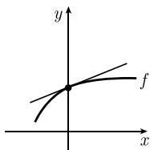  
图1.36

近似. 这条直线是 f 在点 x = 0 处的切线.

例 2 (局部最小值或最大值): 假设 $f'(0)=0, f''(0) \neq 0$ . 那么函数 f 在 x=0 附近的行为像 (这是第一个近似)

$$
f (0) + \frac {f ^ {\prime \prime} (0)}{2} x ^ {2}.
$$

(b) 局部最大值 $(f''(0)<0)$

当 $f''(0) > 0$ (或 $f''(0) < 0$ ) 时, 函数在 x = 0 处有局部最小值 (或局部最大值) (图 1.37).

例 3 (水平拐点): 如果 $f'(0) = f''(0) = 0$ , 而 $f'''(0) \neq 0$ , 那么函数 f 在 x = 0 附近的行为像

$$
f (0) + \frac {f ^ {\prime \prime \prime} (0)}{3 !} x ^ {3}.
$$

这对应着 x = 0 处的水平拐点(图 1.38).

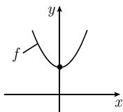  
(a) 局部最小值 $(f''(0)>0)$

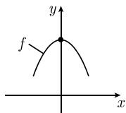

图 1.37 局部极值: 最小值与最大值  
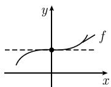  
(a) 水平拐点 $(f^{\prime \prime \prime}(0) > 0)$

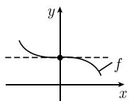  
(b) 水平拐点 $(f^{\prime \prime \prime}(0) < 0)$  
图 1.38 局部极值: 拐点

例 4 (局部最小值): 假设 $f^{(n)}(0)=0, n=1, \cdots, 125$ , 而 $f^{(126)}(0)>0$ . 那么函数在 x=0 附近的行为像

$$
f (0) + a x ^ {1 2 6},
$$

其中 $a := f^{(126)}(0)/126!$ 唯一重要的事实是, $x^{126}$ 是 $x$ 的偶数次幂, $a$ 是正的. 因此, $f$ 的局部行为像图 1.37(a) 所示, 即 $f$ 在点 $x = 0$ 处有局部最小值. 区别是数量上的, 不是本质上的; 在放大镜下看, 函数 $f$ 比图 1.37(a) 所示要平得多. 这个例子说明了这个方法的普适性, 即使在函数的许多导数为零的情况下也成立.

局部曲率 函数

$$
\boxed {g (x) := f (x) - \left(f (0) + f ^ {\prime} (0) x\right)}
$$

描述了 $f$ 及其在点 $x = 0$ 处的切线之间的差. 由 (1.32) 得

$$
g (x) = \frac {f ^ {\prime \prime} (0)}{2 !} x ^ {2} + \frac {f ^ {\prime \prime \prime} (0)}{3 !} x ^ {3} + \dots .
$$

因此, 函数 f 的导数 $f''(0)$ , $f'''(0)$ , $\cdots$ 刻画了 f 在 x = 0 处的切线附近的样子. 这为我们提供了 f 的 (图像的) 曲率的信息.

例 5 (局部凸与局部凹): 假设 $f''(0) \neq 0$ . 那么在 x = 0 附近, g 的形为像

$$
\frac {f ^ {\prime \prime} (0)}{2 !} x ^ {2}.
$$

由此可得

(i) 当 $f''(0) > 0$ 时, 在 $x = 0$ 附近 $f$ 的图像局部地位于切线上面 (局部凸, 见图 1.39(a)).

(ii) 当 $f''(0) < 0$ 时, 在 $x = 0$ 附近 $f$ 的图像局部地位于切线下面 (局部凹, 见图 1.39(b)).

例 6 (拐点): 假设 $f''(0)=0, f'''(0) \neq 0$ . 那么 g 在 x=0 附近的形为像

$$
\frac {f ^ {\prime \prime \prime} (0)}{3 !} x ^ {3}.
$$

因此在 x = 0 附近, f 的图像局部地位于切线的两边 (图 1.39(c), (d)).

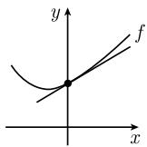  
(a) 局部凸性 $(f''(0) > 0)$

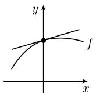  
(b) 局部凹性 $(f''(0) < 0)$

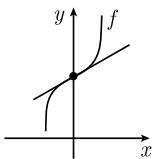  
(c) 拐点 $(f''(0) = 0, f'''(0) > 0)$

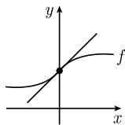  
拐点 $(f''(0) = 0, f'''(0) < 0)$  
图 1.39 函数的局部曲率

洛必达法则 由 (1.32) 可以立即从形式上推出 1.3.3 中描述的洛必达法则. 为此我们记

$$
f (x) = f (0) + f ^ {\prime} (0) x + \frac {f ^ {\prime \prime} (0)}{2 !} x ^ {2} + \frac {f ^ {\prime \prime \prime} (0)}{3 !} x ^ {3} + \dots ,
$$

$$
g (x) = g (0) + g ^ {\prime} (0) x + \frac {g ^ {\prime \prime} (0)}{2 !} x ^ {2} + \frac {g ^ {\prime \prime \prime} (0)}{3 !} x ^ {3} + \dots .
$$

例 7 $\left(\frac{0}{0}\right)$ ：假设 $f(0)=g(0)=0,\ g'(0)\neq0,$ 则

$$
\lim _ {x \rightarrow 0} \frac {f (x)}{g (x)} = \lim _ {x \rightarrow 0} \frac {x \left(f ^ {\prime} (0) + \frac {f ^ {\prime \prime} (0)}{2} x + \cdots\right)}{x \left(g ^ {\prime} (0) + \frac {g ^ {\prime \prime} (0)}{2} x + \cdots\right)} = \frac {f ^ {\prime} (0)}{g ^ {\prime} (0)}.
$$

1.4.5.2 余项

通过估计 (1.32) 中的误差, 能够把 1.4.5.1 中的形式考虑严格化. 这是借助下面的公式实现的:

$$
\boxed { \begin{array}{c} f (x) = f (p) + f ^ {\prime} (p) (x - p) + \frac {f ^ {\prime \prime} (p)}{2 !} (x - p) ^ {2} \\ + \dots + \frac {f ^ {(n)} (p)}{n !} (x - p) ^ {n} + R _ {n + 1} (x) \end{array} }\tag{1.33}
$$

这里, 余项 $R_{n+1}(x)$ 有形式

$$
\boxed {R _ {n + 1} (x) = \frac {f ^ {(n + 1)} (p + \vartheta (x - p))}{(n + 1) !} (x - p) ^ {n + 1}, \quad 0 <   \vartheta <   1.}\tag{1.34}
$$

借助求和符号, (1.33) 可记作

$$
f (x) = \sum_ {k = 0} ^ {n} \frac {f ^ {(k)} (p)}{k !} (x - p) ^ {k} + R _ {n + 1} (x).
$$

泰勒定理 令 $J$ 是一个开集, 且 $p \in J$ , 设 $f: J \to \mathbb{R}$ 在 $J$ 上 $n + 1$ 阶可导. 那么对每个 $x \in J$ , 存在一个数 $\vartheta \in]0, 1[$ , 使得具有余项 (1.34) 的表达式 (1.33) 成立.

这是局部分析中最重要的一个定理.
对无穷级数的应用 $^{1)}$ 如果下列假设满足:

(i) 函数 $f: J \to \mathbb{R}$ 在开区间 $J$ 上无穷阶可导, 且 $p \in J$ .

(ii) 对固定的 $x \in J$ 及每个 $n = 1, 2, \cdots$ 存在数 $\alpha_{n}(x)$ 使得有如下估计：

$$
\boxed {\left| \frac {f ^ {(n + 1)} (p + \vartheta (x - p))}{(n + 1) !} (x - p) ^ {n + 1} \right| \leqslant \alpha_ {n} (x), \quad \text {对所有的} \vartheta \in ] 0, 1 [,}
$$

其中 $\lim_{n\to \infty}\alpha_n(x) = 0.$ 那么有

$$
\boxed {f (x) = \sum_ {k = 0} ^ {\infty} \frac {f ^ {(k)} (p)}{k !} (x - p) ^ {k}.}\tag{1.35}
$$

例 (正弦函数的展开): 令 $f(x) := \sin x$ , 那么

$$
f ^ {\prime} (x) = \cos x, \quad f ^ {\prime \prime} (x) = - \sin x, \quad f ^ {\prime \prime \prime} (x) = - \cos x, \quad f ^ {(4)} (x) = \sin x,
$$

因此 $f'(0)=1, f''(0)=0, f'''(0)=-1, f^{(4)}(0)=0,$ 等等. 对所有 $x \in R$ 及 n=1,2, $\cdots$ , 由 (1.33) 及 p=0 可得

$$
\boxed {\sin x = x - \frac {x ^ {3}}{3 !} + \frac {x ^ {5}}{5 !} - \dots + \frac {(- 1) ^ {n - 1} x ^ {2 n - 1}}{(2 n - 1) !} + R _ {2 n} (x),}
$$

1) 1.10 详细考虑了无穷级数.

误差估计是 $^{1)}$

$$
\boxed {| R _ {2 n} (x) | = \left| \frac {f ^ {(2 n)} (\vartheta x)}{(2 n) !} x ^ {2 n} \right| \leqslant \frac {| x | ^ {2 n}}{(2 n) !}.}
$$

由 $\lim_{n\to \infty}\frac{|x|^{2n}}{(2n)!} = 0$ 得

$$
\sin x = x - {\frac {x ^ {3}}{3 !}} + \dots = \sum_ {n = 1} ^ {\infty} {\frac {(- 1) ^ {n - 1} x ^ {2 n - 1}}{(2 n - 1) !}}, \quad {\text {对所有的}} x \in \mathbb {R}.
$$

积分型余项 如果函数 $f: J \to \mathbb{R}$ 是开区间 $J$ 上的 $C^{n+1}$ 型函数 (见 1.4.1 末), 且 $p \in J$ , 那么 (1.33) 对所有 $x \in J$ 都成立, 其中余项有形式:

$$
R _ {n + 1} (x) = \left(\int_ {0} ^ {1} (1 - t) ^ {n} f ^ {(n + 1)} (p + (x - p) t) \mathrm{d} t\right) \frac {(x - p) ^ {n + 1}}{n !}.
$$

1.4.5.3 局部极值和临界点

定义 度量空间 $M$ 上的函数 $f: M \to \mathbb{R}$ 称为在点 $a \in M$ 处有局部极小值(相应地, 局部极大值), 如果存在一个邻域 $U(a)$ , 满足

$$
\boxed {f (a) \leqslant f (x) \quad \text {对所有的} \quad x \in U (a)}\tag{1.36}
$$

(相应地, $f(x) \leqslant f(a)$ 对所有的 $x \in U(a)$ ).

函数 $f$ 有局部严格极小值, 如果有

$$
f (a) <   f (x), \quad {\text { 对所有的}} x \in U (a)   \text { 且 }   x \neq a,
$$

局部严格极大值有类似的定义.

由定义, 局部极值(局部极值点)要么是局部极小值, 要么是局部极大值(图1.40(a),(b)). 起始数据 考虑函数

$$
\boxed {f: ] a, b [ \rightarrow \mathbb {R}}
$$

且 $p \in ]a, b[$ .

临界点 点 p 称为 f 的临界点, 如果导数 $f'(p)$ 存在, 且满足

$$
\boxed {f ^ {\prime} (p) = 0.}
$$

直观上这意味着, 点 p 处的切线是水平的.

水平拐点 f 的临界点, 它既不是局部最小值也不是局部最大值 (图 1.40).

1) 注意 $f^{(k)}(\vartheta x) = \pm \sin \vartheta x, \pm \cos \vartheta x, |\sin \vartheta x| \leqslant 1$ 及 $|\cos \vartheta x| \leqslant 1$ , 对所有实数 $x$ 和 $\vartheta$ 都成立.

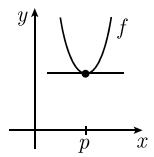  
(a) 局部最小值

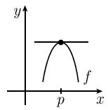

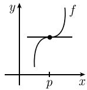

(b) 局部最大值  
(c) 水平拐点  
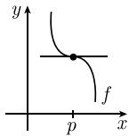  
图 1.40 局部极值

局部极值的必要条件 如果函数 $f$ 在点 $p$ 处有局部极值, 且导数 $f'(p)$ 存在, 那么 $p$ 是 $f$ 的临界点, 即 $f'(p) = 0$ .

局部极值的充分条件 如果在点 p 的一个邻域中 f 是 $C^{2n}$ 型函数, $n \geqslant 1$ , 且 $f'(p) = f''(p) = \cdots = f^{(2n-1)}(p) = 0$ , 此外

$$
\boxed {f ^ {(2 n)} (p) > 0,}
$$

(相应地, $f^{(2n)}(p) < 0$ ), 那么 f 有局部极小值 (相应地, 局部极大值).

水平拐点的充分条件 如果在点 $p$ 的一个开邻域中 $f$ 是 $C^{2n + 1}$ 型函数, $n \geqslant 1$ , 并且有

$$
f ^ {\prime} (p) = f ^ {\prime \prime} (p) = \dots = f ^ {(2 n)} (p) = 0,
$$

也有

$$
\boxed {f ^ {(2 n + 1)} (p) \neq 0,}
$$

那么 f 在点 p 处有水平拐点.

例 1: 对于 $f(x) := \cos x$ , 有 $f'(x) = -\sin x, f''(x) = -\cos x$ . 这就给出了

$$
f ^ {\prime} (0) = 0, \quad f ^ {\prime \prime} (0) <   0.
$$

而且 f 在点 x = 0 处有局部最大值. 由

$$
\cos x \leqslant 1, \quad {\text { 对所有的 }} \quad x \in \mathbb {R}
$$

可得, 函数 $y = \cos x$ 甚至在点 x = 0 处有全局最大值 (图 1.41(a)).

例 2: 对于 $f(x) := x^{3}$ 有 $f'(x) = 3x^{2}, f''(x) = 6x, f'''(x) = 6,$ 因此

$$
f ^ {\prime} (0) = f ^ {\prime \prime} (0) = 0, \quad f ^ {\prime \prime \prime} (0) \neq 0.
$$

所以, f 在点 x = 0 处有水平拐点 (图 1.41(b)).

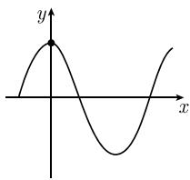  
(a) $y = \cos x$  
图1.41

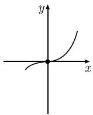  
(b) $y = x^{3}$

1.4.5.4 曲率

函数图像与切线的相对位置 函数

$$
g (x) := f (x) - f (p) - f ^ {\prime} (p) (x - p)
$$

描述了函数 $f$ 与其在点 $p$ 处的切线之差. 我们定义:

(i) 函数 f 在点 p 处局部凸, 如果函数 g 在点 p 处有局部极小值.

(ii) f 在点 p 处局部凹, 如果 g 在点 p 处有局部极大值.

(iii) $f$ 在点 $p$ 处有拐点, 如果 $g$ 在点 $p$ 处有水平拐点.

在 (i)(相应地, (ii)) 里, g 的图像位于点 p 处的切线上面 (相应地, 下面).

在 (iii) 里, f 的图像在点 p 附近为切线的两边 (图 1.42).

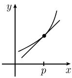  
(a) 凸

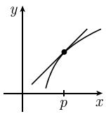  
(b)凹

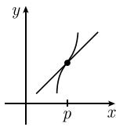  
(c) 拐点  
图 1.42 局部凸函数和局部凹函数

拐点存在的必要条件 如果 $f$ 在 $p$ 的一个邻域中是 $C^2$ 型函数, 并且如果 $f$ 在 $p$ 处有拐点, 那么

$$
f ^ {\prime \prime} (p) = 0.
$$

拐点存在的充分条件 假设 $f$ 在 $p$ 的一个邻域中是 $C^k$ 型函数, 而且满足

$$
f ^ {\prime \prime} (p) = f ^ {\prime \prime \prime} (p) = \dots = f ^ {(k - 1)} (p) = 0,\tag{1.37}
$$

其中奇数 $k \geqslant 3$ , 而且 $f^{(k)}(p) \neq 0$ . 那么 $f$ 在点 $p$ 处有拐点.

局部凸性的充分条件 假设 $f$ 在 $p$ 的一个邻域中是 $C^k$ 型函数. 如果满足下列条件之一, 那么 $f$ 在点 $p$ 处局部凸:

(i) $f''(p) > 0$ 且 k = 2.

(ii) $f^{(k)}(p) > 0$ 且对于偶数 $k\geqslant 4,$ (1.37)成立.

局部凹性的充分条件 假设 $f$ 在 $p$ 的一个邻域中是 $C^k$ 型函数. 如果满足下列条件之一, 那么 $f$ 在点 $p$ 处局部凹:

(i) $f''(p) < 0$ 且 k = 2.

(ii) $f^{(k)}(p) < 0$ 且对于偶数 $k \geqslant 4$ , (1.37) 成立.

例：令 $f(x):=\sin x$ ，那么 $f'(x)=\cos x, f''(x)=-\sin x, f'''(x)=-\cos x.$

(i) 因为 $f''(0)=0, f'''(0) \neq 0$ ，所以点 x=0 是拐点.

(ii) 对于 $x \in]0, \pi[$ , 有 $f''(x) < 0$ , 因而 $f$ 在 $x$ 处是局部凹的.

(iii) 对于 $x \in] \pi, 2\pi[$ , 有 $f''(x) > 0$ , 因而 f 在 x 处是局部凸的.

(iv) 因为 $f''(\pi)=0, f'''(\pi)\neq0$ , 所以 $x=\pi$ 是一个拐点 (图 1.43).

1.4.5.5 凸函数

凸性是一类最简单的非线性．能量函数和负的熵函数常常都是凸的．而且，凸函数在变分法和优化理论（见第5章）中起着重要作用.

定义 线性空间元素的一个集合 M 称为凸的, 如果有蕴涵关系

$x,y\in M\Rightarrow tx + (1 - t)y\in M,$ 对所有的 $t\in [0,1]$

在几何上这意味着, 连接 $M$ 中两个点的割线也属于 $M$ (图 1.44).

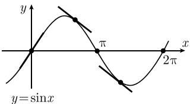  
图1.43

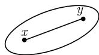  
图1.44

函数 $f: M \to \mathbb{R}$ 称为凸的, 如果集合 $M$ 是凸的, 而且对所有的 $x, y \in M$ 和所有的实数 $t \in]0, 1[$ 有

$$
\boxed {f (t x + (1 - t) y) \leqslant t f (x) + (1 - t) f (y).}\tag{1.38}
$$

如果把 (1.38) 中的 $\leqslant$ 换成 $<$ , 则称 $f$ 是严格凸的(图 1.45).

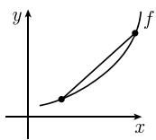  
(a) 严格凸

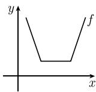  
(b) 凸  
图1.45

函数 $f: M \to \mathbb{R}$ 称为凹的 (相应地, 严格凹的), 如果 $-f$ 是凸的 (相应地, 严格凸的).

例：开区间 $M$ 上的实函数 $f:M\to \mathbb{R}$ 是凸的(相应地，严格凸的)，当且仅当，连接 $f$ 图像上的两个点的割线位于(相应地，严格位于) $f$ 图像的上方(图1.45).

凸性判定准则 开区间 J 上的函数 $f: J \rightarrow R$ 具有下列性质.

(i) 如果 f 是凸的, 那么 f 在 J 上连续.

(ii) 如果 $f$ 是凸的, 那么对每个点 $x \in J$ , 右导数 $^{1)} f_{+}(x)$ 与左导数 $f_{-}(x)$ 都存在, 并满足

$$
f _ {-} (x) \leqslant f _ {+} (x).
$$

(iii) 如果 f 在 J 上的一阶导数 $f'$ 存在, 那么 $^{2)}$

$$
\boxed {f \text {在} J \text {上是} (\text {严格}) \text {凸的} \Leftrightarrow f ^ {\prime} \text {在} J \text {上} (\text {严格}) \text {递增}.}
$$

(iv) 如果 f 在 J 上的二阶导数 $f''$ 存在, 那么

$$
\begin{array}{r l} {{\mathrm{在} J \mathrm{上} f ^ {\prime \prime} (x) \geqslant 0}} & {{\Leftrightarrow \quad f \mathrm{在} J \mathrm{上是凸的},}} \\ {{\mathrm{在} J \mathrm{上} f ^ {\prime \prime} (x) > 0}} & {{\Leftrightarrow \quad f \mathrm{在} J \mathrm{上是严格凸的}.}} \end{array}
$$

1.4.5.6 对图像分析的应用

为了定性分析函数 $f: M \subseteq R \rightarrow R$ 的图像, 我们如下进行:

(i) 首先确定使 f 不连续的点的集合.

(ii) 如果可能的话, 通过计算单边导数, 确定 f 在这些点附近的形态.

(iii) 通过计算极限 $\lim_{x\to +\infty}f(x)$ , 如果存在, 来确定 $f$ 在“无穷远点”的形态.

(iv) 通过解方程 $f(x)=0$ 确定 f 的零点.

(v) 通过解方程 $f'(x) = 0$ 确定 $f$ 的临界点.

(vi) 对 f 的临界点进行分类 (极小值、极大值、拐点, 见 1.4.5.3).

2) 符号 $A \Rightarrow B$ 意为 $A$ 蕴涵 $B$ , 而 $A \Leftrightarrow B$ 意为 $A \Rightarrow B$ 且 $B \Rightarrow A$ .

(vii) 通过研究在不同点处一阶导数 $f'$ 的符号, 确定 $f$ 递增或递减的区域 (见1.4.3).

(viii) 通过研究 $f''(x)$ 的符号, 确定 f 的曲率 (凸性、凹性, 见 1.4.5.4).

(ix) 最后确定 $f''(x)$ 的零点, 看是否拐点 (见 1.4.5.4).

例：画出函数

$$
f (x) := \left\{ \begin{array}{l l} \frac {x ^ {2} + 1}{x ^ {2} - 1}, & x \leqslant 2, \\ \frac {5}{3}, & x > 2 \end{array} \right.
$$

的图像.

(i) 由

$$
\lim _ {x \to 2 \pm 0} f (x) = \frac {5}{3}
$$

看出 $f$ 在点 $x = 2$ 处连续. 因此, 对所有 $x \neq \pm 1$ , $f$ 是连续的; 对所有 $x \in \mathbb{R}$ , 且 $x \neq \pm 1$ , $x \neq 2$ , $f$ 是可导的.

(ii) 由

$$
f (x) = \frac {2}{(x - 1) (x + 1)} + 1, \quad x \leqslant 2
$$

得到

$$
\lim _ {x \to 1 \pm 0} f (x) = \pm \infty , \quad \lim _ {x \to - 1 \pm 0} f (x) = \mp \infty .
$$

(iii) 我们有 $\lim_{x\to -\infty}f(x) = 1$ 和 $\lim_{x\to +\infty}f(x) = \frac{5}{3}$ .

(iv) 方程 $f(x)=0$ 没有解, 所以 f 的图像与 x 轴没有交点.

(v) 设 $x \neq \pm 1$ . 求导得

$$
f ^ {\prime} (x) = - \frac {4 x}{(x ^ {2} - 1) ^ {2}}, \quad x <   2,
$$

$$
f ^ {\prime \prime} (x) = \frac {4 (3 x ^ {2} + 1)}{(x ^ {2} - 1) ^ {3}}, \quad x <   2,
$$

且当 $x > 2$ 时， $f'(x) = f''(x) = 0$ . 由

$$
\lim _ {x \to 2 - 0} f ^ {\prime} (x) = - \frac {8}{9}, \quad \lim _ {x \to 2 + 0} f ^ {\prime} (x) = 0
$$

得到, 在点 $x = 2$ 处图像没有切线. 方程

$$
f ^ {\prime} (x) = 0, \quad x <   2
$$

恰有一个解：x = 0.

(vi) 由 $f'(0) = 0, f''(0) < 0$ 可以看出, $f$ 在 $x = 0$ 处有局部极小值.

(vii) 由

$$
f ^ {\prime} (x) \left\{ \begin{array}{l l} {{> 0,}} & {{\text {在} ] - \infty , - 1 [ \text {上和} ] - 1, 0 [ \text {上},}} \\ {{<   0,}} & {{\text {在} ] 0, 1 [ \text {上和} ] 1, 2 [ \text {上}}} \end{array} \right.
$$

即得, $f$ 在区间 $[- \infty, -1[$ 和 $[-1, 0[$ 中是严格递增的, 在 $[0, 1[$ 和 $[1, 2[$ 中是严格递减的.

(viii) 由

$$
f ^ {\prime \prime} (x) \left\{ \begin{array}{l l} {> 0,} & {\text {在} ] - \infty , - 1 [ \text {上和} ] 1, 2 [ \text {上},} \\ {<   0,} & {\text {在} ] - 1, 1 [ \text {上}} \end{array} \right.
$$

即得, $f$ 在区间 $[- \infty, -1[$ 上和]1,2[上是严格凸的, 在 $[-1, 1[$ 上是严格凹的.

(ix) 当 $x < 2$ 时方程 $f''(x) = 0$ 没有解, 因此, 当 $x < 2$ 时没有拐点.

总之，f 的图像形状见图 1.46.

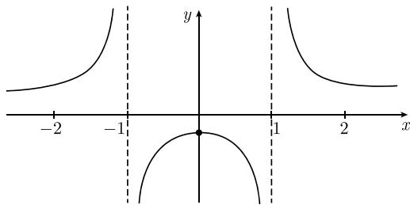  
图1.46 函数 $f$ 的图像
