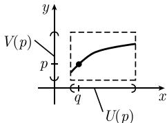

##### 1.5.6 隐函数定理

1.5.6.1 二元实变量方程

对于 $x, y \in \mathbb{R}$ , 且 $F(x, y) \in \mathbb{R}$ . 我们要对 $y$ 解方程

$$
\boxed {F (x, y) = 0.}\tag{1.67}
$$

即, 我们要找一个函数 $y = y(x)$ 满足

$$
\boxed {F (x, y (x)) = 0.}
$$

假设我们知道方程的某个固定解, 即

$$
F (q, p) = 0.\tag{1.68}
$$

此外, 我们要求

$$
\boxed {F _ {y} (q, p) \neq 0.}\tag{1.69}
$$

隐函数定理 如果函数 $F: D(F) \subseteq \mathbb{R}^2 \to \mathbb{R}$ 在点 $(q, p)$ 的某个邻域中是 $C^k$ 类的, $k \geqslant 1$ , 并满足条件 (1.68) 和 (1.69), 那么方程 (1.67) 在点 $(q, p)$ 处可以唯一解出 $y^1$ (图1.48).

  
图1.48

解 $y = y(x)$ 在 q 处是局部 $C^{k}$ 类的.

隐函数求导法 为了计算解 $y = y(x)$ 的导数, 利用链式法则对方程

$$
F (x, y (x)) = 0
$$

求关于 $x$ 的导数, 得到

$$
F _ {x} (x, y (x)) + F _ {y} (x, y (x)) y ^ {\prime} (x) = 0.\tag{1.70}
$$

这就蕴涵着

$$
\boxed {y ^ {\prime} (x) = - F _ {y} (x, y (x)) ^ {- 1} F _ {x} (x, y (x)).}\tag{1.71}
$$

对 (1.71) 求导可得 $y$ 的高阶导数. 然而, 对 (1.70) 求关于 $x$ 的导数更方便. 得到

$$
F _ {x x} (x, y (x)) + 2 F _ {x y} (x, y (x)) y ^ {\prime} (x) + F _ {y y} (x, y (x)) y ^ {\prime} (x) ^ {2} + F _ {y} (x, y (x)) y ^ {\prime \prime} (x) = 0.
$$

由此可解出 $y''(x)$ . 类似可求得更高阶的导数.

1）这意味着存在开邻域 $U(q)$ 和 $V(p)$ ，使得对每个 $x \in U(q)$ ，方程 (1.67) 有唯一解 $y(x) \in V(p)$ .

近似公式 $F(x,y) = 0$ 的解 $y$ 的泰勒展开式给出一个近似

$$
\boxed {y = p + y ^ {\prime} (q) (x - q) + \frac {y ^ {\prime \prime} (q)}{2 !} (x - q) ^ {2} + \dots .}
$$

例: 令 $F(x,y) := \mathrm{e}^{y} \sin x - y$ ，则 $F(0,0) = 0, F_{y}(x,y) = \mathrm{e}^{y} \sin x - 1$ ，因此 $F_{y}(0,0) \neq 0$ 。所以，

$$
\mathrm{e} ^ {y} \sin x - y = 0\tag{1.72}
$$

在 $(0,0)$ 附近可唯一解出 y. 为了得到解 $y=y(x)$ 的近似, 我们尝试设

$$
y (x) = a + b x + c x ^ {2} + \dots .
$$

因为 $y(0)=0$ ，所以 a=0。利用指数函数的幂级数展开式：

$$
\mathrm{e} ^ {y} = 1 + y + \dots , \quad \sin x = x - \frac {x ^ {3}}{3 !} + \dots ,\tag{1.73}
$$

从 (1.72) 和 (1.73) 得到方程

$$
x - b x + x ^ {2} (\dots) + x ^ {3} (\dots) + \dots = 0.
$$

比较系数, 得 b = 1, 所以

  
图1.49

$$
y = x + \dots .
$$

歧点 设 $F(x,y):=x^{2}-y^{2}$ , 则有 $F(0,0)=0,F_{y}(0,0)=0$ . 因为函数 $F$ 不满足 (1.69), 所以方程 $F(x,y)=0$ 在 $(0,0)$ 处不能局部地唯一解出 $y$ . 事实上, 方程

$$
\boxed {x ^ {2} - y ^ {2} = 0}
$$

有两个解 $y = \pm x$ . 所以点 $(0, 0)$ 是两个解分岔的地方 (称为歧点) $^{1)}$ (图 1.49).

1.5.6.2 方程组

F 导数的运算十分灵活, 它们可以立即被推广而应用到非线性方程组中:

$$
\boxed {F (\boldsymbol {x}, \boldsymbol {y}) = \mathbf {0},}\tag{1.74}
$$

其中 $x \in R^{N}, y \in R^{M}$ ，以及 $F(x, y) \in \mathbb{R}^{M}$ 。需要注意的是， $F_{y}(q, p)$ 是个矩阵，关键条件 $F_{y}(q, p) \neq 0$ 必须被替换成

$$
\boxed {\det F _ {y} (q, p) \neq 0.}\tag{1.75}
$$

令 $(\pmb {q},\pmb {p})$ 是

$$
\boxed {F (\boldsymbol {q}, \boldsymbol {p}) = 0, \quad \boldsymbol {q} \in \mathbb {R} ^ {N}, \boldsymbol {p} \in \mathbb {R} ^ {M}}\tag{1.76}
$$

的一个解.

隐函数定理 如果函数 $F: D(F) \subseteq \mathbb{R}^{N + M} \to \mathbb{R}^M$ 在点 $(\pmb{q}, \pmb{p})$ 的一个邻域中是 $C^k$ 类的, $k \geqslant 1$ , 并且满足条件 (1.75) 和 (1.76), 那么方程 (1.74) 在点 $(\pmb{q}, \pmb{p})$ 处有唯一解 $y$ .

解 $y = y(x)$ 在点 $q$ 处局部为 $C^k$ 类的. 公式 (1.71) 对 $F$ 导数 $y'(x)$ 作为一个矩阵方程仍然有效.

显式方程 显然, 方程组 (1.74) 为

$$
F _ {k} (x _ {1}, \dots , x _ {N}, y _ {1}, \dots , y _ {M}) = 0, \quad k = 1, \dots , M,\tag{1.77}
$$

并且 $F_{y}(x,y)$ 是 $F_{k}$ 关于 $y_{m}$ 的一阶偏导数的矩阵．把 (1.77) 中的 $y_{m}$ 换成 $y_{m}(x_{1},\cdots,x_{n})$ ，求关于 $x_{n}$ 的导数，则有

$$
\frac {\partial F _ {k}}{\partial x _ {n}} (x, y (x)) + \sum_ {m = 1} ^ {M} \frac {\partial F _ {k}}{\partial y _ {m}} (x, y (x)) \frac {\partial y _ {m}}{\partial x _ {n}} (x) = 0, \quad n = 1, \dots , N.
$$

关于 $\partial y_{m}/\partial x_{n}$ 解这个方程, 得到矩阵方程 (1.71).
