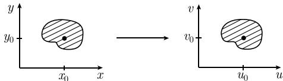

##### 1.5.7 逆映射

1.5.7.1 同胚

定义 令 X 和 Y 是度量空间 (比如, $R^{N}$ 的子集). 映射 $f: X \to Y$ 称为同胚, 如果 f 是双射的, 且 f 与 $f^{-1}$ 连续 (见 4.3.3).

同胚定理 紧集上的连续双射 $f: X \rightarrow Y$ 是一个同胚.

这个定理推广了紧区间上的实值整体逆函数定理 (见 1.4.4.2).

1.5.7.2 局部微分同胚

定义 令 $X$ 和 $Y$ 是 $\mathbb{R}^N$ 的非空开集, $N \geqslant 1$ . 映射 $f: X \to Y$ 称为 $C^k$ 类微分同胚, 如果 $f$ 是双射的, 且 $f$ 和 $f^{-1}$ 都是 $C^k$ 类的.

关于局部微分同胚的主要定理 令 $1 \leqslant k \leqslant \infty$ . 假设映射 $f: M \subseteq \mathbb{R}^N \to \mathbb{R}^N$ 在 $p$ 的一个开邻域 $V(p)$ 内上是 $C^k$ 类的, 且

$$
\boxed {\det f ^ {\prime} (p) \neq 0,}
$$

那么 f 在点 p 处是局部 $C^{k}$ 类微分同胚. $^{1)}$

1) 这意味着, $f$ 是从某一恰当选取的开邻域 $U(p)$ 到开邻域 $U(f(p))$ 的 $C^k$ 类微分同胚.

例：考虑映射

$$
\boxed {u = g (x, y), \quad v = h (x, y),}\tag{1.78}
$$

并且假设 $u_0 := g(x_0, y_0), v_0 := h(x_0, y_0)$ . 函数 $g$ 和 $h$ 都假定是在点 $(x_0, y_0)$ 的一个邻域内的 $C^k$ 类函数, $1 \leqslant k \leqslant \infty$ , 并假设

$$
\boxed { \begin{array}{c c} \left| \begin{array}{c c} g _ {u} (x _ {0}, y _ {0}) & g _ {v} (x _ {0}, y _ {0}) \\ h _ {u} (x _ {0}, y _ {0}) & h _ {v} (x _ {0}, y _ {0}) \end{array} \right| \neq 0. \end{array} }
$$

那么映射 (1.78) 在点 $(x_0, y_0)$ 处是局部 $C^k$ 类微分同胚.

这意味着, 如图 1.50 描绘的 (1.78) 中的映射可以在点 $(u_{0}, v_{0})$ 的一个邻域中被逆转, 且逆映射

$$
x = x (u, v), \qquad y = y (u, v)
$$

在 $(u_0, v_0)$ 的一个邻域内是光滑的, 即, $x, y$ 是 $C^k$ 类的.

  
图 1.50 局部微分同胚

1.5.7.3 整体微分同胚

整体微分同胚的阿达马(Hadamard) 定理 令 $1 \leqslant k \leqslant \infty$ 。假设 $C^k$ 类映射 $f: \mathbb{R}^N \to \mathbb{R}^N$ 满足两个条件：

  
图1.51

$$
\left.\begin{array}{l}{\underset {| x | \rightarrow \infty} {\lim}   | f (\boldsymbol {x}) | = + \infty}\\{\det f ^ {\prime} (\boldsymbol {x}) \neq 0}\end{array}\right\} \text {对所有的} \boldsymbol {x} \in \mathbb {R} ^ {N},\tag{1.79}
$$

则 f 是 $C^{k}$ 类的微分同胚. $^{1)}$

例：令 N=1 。对函数 $f(x):=\sinh x, f'(x)=\cosh x>0$ 蕴涵 (1.79) 成立。因此 $f:\mathbb{R}\to\mathbb{R}$ 是 $C^{\infty}$ 类微分同胚（图 1.51）。

1.5.7.4 解的一般形态

定理 令 $f: \mathbb{R}^N \to \mathbb{R}^N$ 是 $C^1$ 类函数, 使得 $\lim_{|\pmb{x}| \to \infty} |f(\pmb{x})| = \infty$ , 那么存在一个稠密 $^{2)}$ 开集 $D \subseteq \mathbb{R}^N$ , 使得方程

$$
\boxed {f (\boldsymbol {x}) = y, \quad \boldsymbol {x} \in \mathbb {R} ^ {N}}\tag{1.80}
$$

对于每个 $y \in D$ . 有至多有限个解.

可以简化结论为：通常存在有限个解. 更精确地说, 有如下显然的情况.

(i) 扰动. 如果给定一个值 $y_0 \in \mathbb{R}^N$ , 那么在 $y_0$ 的每个邻域内存在一个点 $y \in \mathbb{R}^N$ , 对于这个 $y$ , 方程 (1.80) 至多有有限个解; 换句话说, 通过轻轻扰动 $y_0$ , 可以得到具有好性质的解.

(ii) 稳定性. 如果对某一点 $\pmb{y}_1 \in D$ , 方程 (1.80) 有至多有限个解, 那么存在一个邻域 $U(\pmb{y}_1)$ , 对于所有的 $\pmb{y} \in U(\pmb{y}_1)$ , (1.80) 只有有限个解.
