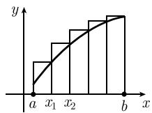
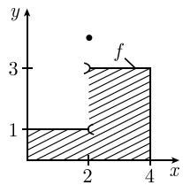
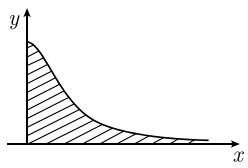
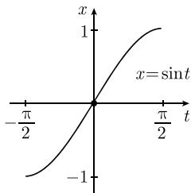
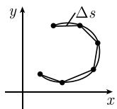
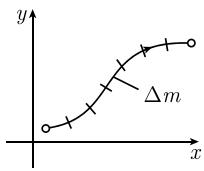
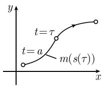

#### 1.6 单实变函数的积分

在 0.9 中可以找到许多具体计算积分的方法和已知积分的详细列表.

##### 1.6.1 基本思想

在1.6.2中可以找到对下面一些问题精确的数学阐述.和的极限积分

$$
\boxed {\int_ {a} ^ {b} f (x) \mathrm{d} x}
$$

等于图 1.52(a) 中曲线 f 下阴影部分区域的面积. 如图 1.52(b), 利用很多矩形来近似计算出这个面积, 然后当矩形越来越细时取极限, 即 $^{1)}$

$$
\boxed {\int_ {a} ^ {b} f (x) \mathrm{d} x = \lim _ {n \rightarrow \infty} \sum_ {k = 1} ^ {n} f (x _ {k}) \Delta x.}\tag{1.101}
$$

这里, 我们把紧区间 $[a, b]$ 分割成 $n$ 个相等的部分, 分割点是

$$
x _ {k} = a + k \Delta x, \quad k = 0, 1, 2, \dots , n,
$$

其中

$$
\boxed {\Delta x := \frac {b - a}{n}.}
$$

特别地, $x_{0}=a,x_{n}=b.$

(a)  

  
(b)  
图1.52 曲面面积的近似

积分的具体计算 牛顿和莱布尼茨发现了基本公式:

$$
\boxed {\int_ {a} ^ {b} F ^ {\prime} (x) \mathrm{d} x = F (b) - F (a),}\tag{1.102}
$$

它被称为微积分基本定理. $^{2)}$ 这个公式表明, 积分可以看成是微分的逆运算. 从此
1) 宽为 $\Delta x$ , 高为 $f(x_{k})$ 的矩形的面积是 $f(x_{k})\Delta x$ . 因此, 表达式

$$
\sum_ {k = 1} ^ {n} f (x _ {k}) \Delta x
$$

是图 1.52(b) 中各个矩形面积的和.

2) 公式 (1.102) 形式上的动机由下式过渡到无限极限给出:

$$
\sum \frac {\Delta F}{\Delta x} \Delta x = \sum \Delta F = F (b) - F (a).
$$

用莱布尼茨符号可得到对应的公式:

$$
\int_ {a} ^ {b} \frac {\mathrm{d} F}{\mathrm{d} x} \mathrm{d} x = \int_ {a} ^ {b} \mathrm{d} F
$$

和

$$
\int_ {a} ^ {b} \mathrm{d} F = F (b) - F (a).\tag{1.103}
$$

在一般测度论中给出了 (1.103) 的严格证明, 它对某一类不连续函数 $F$ 也成立 (参看 [212]).

记作

$$
F (x) | _ {a} ^ {b} := F (b) - F (a).
$$

例 1: 令 $F(x) := x^{2}$ . 由 $F'(x) = 2x$ 可得

$$
\int_ {a} ^ {b} 2 x \mathrm{d} x = x ^ {2} | _ {a} ^ {b} = b ^ {2} - a ^ {2}.
$$

例 2: 令 $F(x) := \sin x$ . 由 $F'(x) = \cos x$ 得

$$
\int_ {a} ^ {b} \cos x \mathrm{d} x = \sin x | _ {a} ^ {b} = \sin b - \sin a.
$$

原函数 令 $J$ 是开区间. 函数 $F: J \to \mathbb{R}$ 称为 $f$ 在 $J$ 上的一个原函数, 如果

$$
\boxed {F ^ {\prime} (x) = f (x), \quad \text {对所有} x \in J.}
$$

定理 如果 $F$ 是 $f$ 在 $J$ 上的一个原函数, 那么 $f$ 在 $J$ 上的所有原函数有如下形式:

$$
F + C,
$$

其中 C 是任意实常数.

也可以写成

$$
\boxed {\int f (x) \mathrm{d} x = F (x) + C, \quad \text {在} J \text {上},}\tag{1.104}
$$

并且称 (1.104) 右边的所有原函数构成的集合为 $f$ 在 $J$ 上的不定积分. 从 (1.102) 得

$$
\boxed {\int_ {a} ^ {b} f (x) \mathrm{d} x = F | _ {a} ^ {b}.}\tag{1.105}
$$

因此求积分被归结为求原函数.

重要原函数表 见 0.9.1.

例 3: 由于 $(-\cos x)'=\sin x$ ，所以有

$$
\int \sin x \mathrm{d} x = - \cos x + C,
$$

以及

$$
\int_ {a} ^ {b} \sin x \mathrm{d} x = - \cos x | _ {a} ^ {b} = \cos a - \cos b.
$$

例 4: 设 $\alpha$ 为非零实数. 由 $(x^{\alpha})' = \alpha x^{\alpha-1}$ 即得

$$
\int \alpha x ^ {\alpha - 1} \mathrm{d} x = x ^ {\alpha} + C,
$$

以及

$$
\int_ {a} ^ {b} \alpha x ^ {\alpha - 1} \mathrm{d} x = x ^ {\alpha} | _ {a} ^ {b} = b ^ {\alpha} - a ^ {\alpha}.
$$

不连续函数的积分 可微函数总是连续的, 因此只有充分光滑的函数才可微.

然而, 可以对一大类不连续函数进行积分.

例 5: 令

$$
f (x) := \left\{ \begin{array}{l l} 1, & x <   2, \\ 3, & x > 2, \\ c, & x = 2. \end{array} \right.
$$

由于面积的可加性, 因此由图 1.53, 我们要求有下述关系式:

$$
\int_ {0} ^ {4} \mathrm{d} x = \int_ {0} ^ {2} f \mathrm{d} x + \int_ {2} ^ {4} f \mathrm{d} x = 2 \cdot 1 + 2 \cdot 3 = 8.
$$

这里, $f$ 在点 $x = 2$ 处的不连续性是无关紧要的. 从直观上看, 当图1.52(a)中函数 $f$ 在有限多个点的值改变时, 曲线 $f$ 下区域的面积不变.

无界区间上的积分 从直观上看, 积分 $\int_0^\infty \frac{\mathrm{d}x}{1 + x^2}$ 相应于图1.54(a)中的阴影部分区域的面积. 显然这个面积可以用极限计算:

$$
\boxed {\int_ {0} ^ {\infty} \frac {\mathrm{d} x}{1 + x ^ {2}} = \lim _ {b \rightarrow + \infty} \int_ {0} ^ {b} \frac {\mathrm{d} x}{1 + x ^ {2}} = \frac {\pi}{2}}
$$

(图 1.54(b)). 这里, 我们利用了公式:

$$
\int_ {0} ^ {b} \frac {\mathrm{d} x}{1 + x ^ {2}} = \arctan x | _ {0} ^ {b} = \arctan b - \arctan 0 = \arctan b.
$$

  
图 1.53 不连续函数的积分

  
(a)

  
(b)  
图 1.54 无界区间上积分的近似

无界函数的积分 积分 $\int_0^1\frac{\mathrm{d}x}{\sqrt{x}}$ 相应于图1.55(a)中阴影部分区域的面积.

(b)  
(a)  

  
图 1.55 无界函数的积分

这个面积可以用极限计算:

$$
\int_ {0} ^ {1} \frac {\mathrm{d} x}{\sqrt {x}} = \lim _ {\varepsilon \rightarrow + 0} \int_ {\varepsilon} ^ {1} \frac {\mathrm{d}}{\sqrt {x}} = 2
$$

(图 1.55(b)). 这里, 我们利用了公式:

$$
\int_ {\varepsilon} ^ {1} \frac {\mathrm{d} x}{\sqrt {x}} = 2 \sqrt {x} | _ {\varepsilon} ^ {1} = 2 - 2 \sqrt {\varepsilon}.
$$

测度与积分 古希腊伟大的数学家阿基米德(Archimedes, 公元前 287—前 212)用正 96 边形近似一个圆, 从而近似计算出了单位圆的周长. 这样, 他得到了 $2\pi$ 的近似值 6.28. 自他之后, 许多数学家和物理学家从事计算集合的“测度”(曲线的长度、曲面的面积、体积、质量、电量等). 在 20 世纪初, 法国数学家 H. 勒贝格(Henri Lebesgue, 1875—1941) 发展了一般测度论, 它允许把测度分配到给定集合的子集, 而且可以以令人满意的方式进行计算; 特别是, 可以在这个理论中形成极限. 这样, 勒贝格完全解决了定义和计算测度的古老问题. 勒贝格测度的概念包含所谓的勒贝格积分, 经典黎曼积分 (1.101) 是勒贝格积分的特殊情形.

由于教学的原因, 经典积分仍然是高中和大学里教学大纲的一部分. 但是在现代数学和物理学中, 人们确实需要勒贝格积分一般概念带来的广泛应用 (例如, 在概率论、变分法、偏微分方程理论、量子理论等中). 现代勒贝格积分之所以优越的理由是基本极限公式:

$$
\boxed {\lim _ {n \to \infty} \int_ {a} ^ {b} f _ {n} (x) \mathrm{d} x = \int_ {a} ^ {b} \lim _ {n \to \infty} f _ {n} (x) \mathrm{d} x,}\tag{1.106}
$$

对于勒贝格积分, 它在很弱的假设下成立, 但对于经典积分它并不成立. 可出现这样的情况: (1.106) 左端的积分看作经典积分也存在, 而极限函数 $\lim_{n\to \infty}f(x)$ 高度不连续, 以致 (1.106) 的右端在经典积分意义下不存在, 只在勒贝格积分意义下存在.

在本卷中, 我们只考虑经典的积分概念. [212] 解释了现代测度论的概念. 关于一元积分 $\int_{a}^{b} f(x) \, dx$ 的下列论述可以立即推广到多变量积分 (参看 1.7).

##### 1.6.2 积分的存在性

令 $-\infty < a < b < \infty.$

第一存在性定理 如果函数 $f:[a,b]\to \mathbb{C}$ 是连续的, 那么积分 $\int_{a}^{b}f(x)\mathrm{d}x$ 在(1.101)意义下存在.

一维零测度集合 称 R 的子集 M 有一维勒贝格零测度, 如果对每个实数 $\varepsilon > 0$ , 存在一个由区间 $J_{1}, J_{2}, \cdots$ 构成的至多可数集覆盖了 M, 且总长度小于 $\varepsilon$ .
例 1: 由有限个或可数个实数构成的每个集合 M, 有一维勒贝格零测度.

因为有理数集 $\mathbb{Q}$ 是可数的, 所以可推出 $\mathbb{Q}$ 有勒贝格零测度.

  
图 1.56

几乎处处连续的函数 函数 $f: [a, b] \to \mathbb{R}$ 是几乎处处连续的, 如果存在一个勒贝格零测度集合 $M$ , 使得 $f$ 在所有 $x \in [a, b] - M$ 处都是连续的.

例 2: 图 1.56 中表示的函数包含有限个不连续点, 因此是几乎处处连续的.

第二存在性定理 如果函数 $f:[a,b]\to \mathbb{R}$ 是有界的1）、几乎处处连续的，那么在(1.101)意义下的积分 $\int_{a}^{b}f(x)\mathrm{d}x$ 存在.复值函数 复值函数 $f:[a,b]\to \mathbb{C}$ 可以写成如下形式：

$$
\boxed {f (x) = \varphi (x) + \mathrm{i} \psi (x),}
$$

其中 $\varphi(x)$ 和 $\psi(x)$ 分别表示复数 $f(x)$ 的实部和虚部. 显然, 当 $\phi$ 和 $\psi$ 都在 $x$ 点处连续时, 函数 $f$ 在点 $x$ 处是连续的.

上述两个存在性定理在同样条件下对复值函数 $f:[a,b]\to \mathbb{C}$ 仍然成立.在这个情形， $f$ 是有界且几乎处处连续的，如果 $\phi$ 和 $\psi$ 都满足这些性质．对于积分，有如下公式：

$$
\boxed {\int_ {a} ^ {b} f (x) \mathrm{d} x = \int_ {a} ^ {b} \varphi (x) \mathrm{d} x + \mathrm{i} \int_ {a} ^ {b} \psi (x) \mathrm{d} x.}
$$

积分的性质 令 $-\infty < a < c < b < \infty$ , 假设函数 $f, g: [a, b] \to \mathbb{C}$ 有界且几乎处处连续, 并令 $\alpha, \beta \in \mathbb{C}$ .

(i) 线性性

$$
\int_ {a} ^ {b} (\alpha f (x) + \beta g (x)) \mathrm{d} x = \alpha \int_ {a} ^ {b} f (x) \mathrm{d} x + \beta \int_ {a} ^ {b} g (x) \mathrm{d} x.
$$

(ii) 三角不等式

$$
\boxed {\left| \int_ {a} ^ {b} f (x) \mathrm{d} x \right| \leqslant \int_ {a} ^ {b} | f (x) | \mathrm{d} x \leqslant (b - a) \sup _ {a \leqslant x \leqslant b} | f (x) |.}
$$

1) $f$ 有界的意思是, 对所有 $x \in [a, b]$ , $|f(x)| \leqslant$ 某一常数.

(iii) 加法法则

$$
\int_ {a} ^ {c} f (x) \mathrm{d} x + \int_ {c} ^ {b} f (x) \mathrm{d} x = \int_ {a} ^ {b} f (x) \mathrm{d} x.
$$

(iv) 不变性原理 如果在勒贝格测度为零的集合 $M$ 上, 改变函数 $f$ 的值, 积分 $\int_{a}^{b} f(x) \mathrm{d}x$ 不变.

(v) 单调性 如果 $f, g$ 是实值函数, 那么对所有 $x \in [a, b]$ , $f(x) \leqslant g(x)$ 蕴涵着不等式

$$
\int_ {a} ^ {b} f (x) \mathrm{d} x \leqslant \int_ {a} ^ {b} g (x) \mathrm{d} x.
$$

积分中值定理 如果函数 $f:[a,b]\to \mathbb{R}$ 是连续的，函数 $g:[a,b]\to \mathbb{R}$ 是非负有界，且处处连续的，那么对某个适当的 $\xi \in [a,b]$ ，有

$$
\boxed {\int_ {a} ^ {b} f (x) g (x) \mathrm{d} x = f (\xi) \int_ {a} ^ {b} g (x) \mathrm{d} x.}
$$

例 3: 对于特殊情形 $g(x) \equiv 1$ , 我们得到

$$
\int_ {a} ^ {b} f (x) \mathrm{d} x = f (\xi) (b - a).
$$

例 4: 如果 $f : [a, b] \to R$ 几乎处处连续, 且对所有 $x \in [a, b]$ 有 $m \leqslant f(x) \leqslant M$ , 那么有

$$
\int_ {a} ^ {b} m \mathrm{d} x \leqslant \int_ {a} ^ {b} f (x) \mathrm{d} x \leqslant \int_ {a} ^ {b} M \mathrm{d} x,
$$

即 $(b - a)m\leqslant \int_{a}^{b}f(x)\mathrm{d}x\leqslant (b - a)M.$

##### 1.6.3 微积分基本定理

基本定理 令 $-\infty < a < b < \infty$ 。对于 $C^1$ 类函数 $F:[a,b] \to \mathbb{C},^{1)}$ 下列等式成立：

$$
\boxed {\int_ {a} ^ {b} F ^ {\prime} (x) \mathrm{d} x = F (b) - F (a).}
$$

例：由于对所有 $x \in R$ ，因为 $(\mathrm{e}^{\alpha x})' = \alpha \mathrm{e}^{\alpha x} (\alpha \text{ 是复数})$ ，即有

$$
\alpha \int_ {a} ^ {b} \mathrm{e} ^ {\alpha x} \mathrm{d} x = \mathrm{e} ^ {\alpha x} | _ {a} ^ {b} = \mathrm{e} ^ {\alpha b} - \mathrm{e} ^ {\alpha a}.
$$

在下文中, $f:[a,b]\to \mathbb{C}$ 表示连续函数.

关于积分上限的微分令

$$
\boxed {F _ {0} (x) := \int_ {a} ^ {x} f (t) \mathrm{d} t, \quad a \leqslant x \leqslant b,}
$$

则有

$$
F ^ {\prime} (x) = f (x), \quad \text { 对所有 } x \in [ a, b ],\tag{1.107}
$$

其中 $F = F_{0}$

原函数的存在性 (i) $F_{0}:[a,b]\to \mathbb{C}$ 是微分方程(1.107）在 $C^1$ 函数类中满足 $F_0(a) = 0$ 的唯一解.特别地， $F_{0}$ 是 $f$ 在区间] $a,b[$ 上的一个原函数

(ii) (1.107) 的所有 $C^1$ 类解 $F[a, b] \to \mathbb{C}$ 都由

$$
F _ {0} (x) + C
$$

所得到, 其中 C 是任意复常数.

(iii) 如果函数 $F:[a,b]\to \mathbb{R}$ 是 (1.107) 的一个 $C^1$ 类解, 那么

$$
\int_ {a} ^ {b} f (x) \mathrm{d} x = F (b) - F (a).
$$

##### 1.6.4 分部积分法

定理 令 $-\infty < a < b < \infty$ . 对 $C^1$ 类函数 $u, v: [a, b] \to \mathbb{C}$ , 有

$$
\boxed {\int_ {a} ^ {b} u ^ {\prime} v \mathrm{d} x = u v | _ {a} ^ {b} - \int_ {a} ^ {b} u v ^ {\prime} \mathrm{d} x.}\tag{1.108}
$$

证明：由微积分基本定理及微分乘法法则，有

$$
\int_ {a} ^ {b} (u ^ {\prime} v + u v ^ {\prime}) \mathrm{d} x = \int_ {a} ^ {b} (u v) ^ {\prime} \mathrm{d} x = u v | _ {a} ^ {b}.
$$

□

例 1: 为了计算积分

$$
A := \int_ {a} ^ {2} 2 x \ln x \mathrm{d} x,
$$

令

$$
\begin{array}{c c} u ^ {\prime} = 2 x, & v = \ln x, \\ u = x ^ {2}, & v ^ {\prime} = \frac {1}{x}. \end{array}
$$

由 (1.108) 可得

$$
A = x ^ {2} \ln x | _ {1} ^ {2} - \int_ {1} ^ {2} x \mathrm{d} x = x ^ {2} \ln x - \left. \frac {x ^ {2}}{2} \right| _ {1} ^ {2} = 4 \ln 2 - \frac {3}{2}.
$$

例 2: 为了求积分

$$
A = \int_ {a} ^ {b} x \sin x \mathrm{d} x
$$

我们令

$$
u ^ {\prime} = \sin x, \qquad v = x,
$$

$$
u = - \cos x, v ^ {\prime} = 1.
$$

根据 (1.108) 可得

$$
A = - x \cos x | _ {a} ^ {b} + \int_ {a} ^ {b} \cos x \mathrm{d} x = - x \cos x + \sin x | _ {a} ^ {b}.
$$

例 3(叠分部积分): 为求积分

$$
B = \int_ {a} ^ {b} {\frac {1}{2}} x ^ {2} \cos x \mathrm{d} x,
$$

令

$$
\begin{array}{l l} {u ^ {\prime} = \cos x,} & {v = \frac {1}{2} x ^ {2},} \\ {u = \sin x,} & {v ^ {\prime} = x.} \end{array}
$$

由 (1.108) 得

$$
B = \frac {1}{2} x ^ {2} \sin x | _ {a} ^ {b} - \int_ {a} ^ {b} x \sin x \mathrm{d} x.
$$

最后一个积分可以再次利用分部积分, 计算过程和例 2 一样.

不定积分 在与 (1.108) 一样的假设 $F$ , 有

$$
\boxed {\int u ^ {\prime} v \mathrm{d} x = u v - \int u v ^ {\prime} \mathrm{d} x, \quad \text {在} ] a, b [ \text {上}.}
$$

##### 1.6.5 代换

基本思想 我们希望通过代换

$$
\boxed {x = x (t)}
$$

变换积分 $\int_{a}^{b}f(x)\mathrm{d}x.$

利用莱布尼茨微积分, 形式规则

$$
\mathrm{d} x = \frac {\mathrm{d} x}{\mathrm{d} t} \mathrm{d} t
$$

导致公式

$$
\boxed {\int_ {a} ^ {b} f (x) \mathrm{d} x = \int_ {\alpha} ^ {\beta} f (x (t)) \frac {\mathrm{d} x}{\mathrm{d} t} (t) \mathrm{d} t.}\tag{1.109}
$$

  
图1.57

这可以被严格证明 (图 1.57).

定理 在下列假设下, 公式 (1.109) 成立:

(a) 函数 $f: [a, b] \to \mathbb{C}$ 有界且几乎处处连续.

(b) $C^{1}$ 类函数 $x:[\alpha,\beta]\to R$ 满足条件 $^{1)}$

$$
\boxed {x ^ {\prime} (t) > 0, \quad \text {对所有} t \in ] \alpha , \beta [,}\tag{1.110}
$$

并且 $x(\alpha)=a, x(\beta)=b.$

重要条件 (1.110) 保证了函数 $x = x(t)$ 在 $[\alpha, \beta]$ 上严格递增, 因此对变量变换, 保证了它的反函数 $t = t(x)$ 唯一. 没有假设条件 (1.110), 公式 (1.109) 将导致完全错误的结果.

例 1: 为求积分

$$
A = \int_ {a} ^ {b} \mathrm{e} ^ {2 x} \mathrm{d} x,
$$

令 $t = 2x$ ，则

$$
x = \frac {t}{2}, \quad \frac {\mathrm{d} x}{\mathrm{d} t} = \frac {1}{2}.
$$

当 $x = a, b$ 时 $t = 2a, 2b$ , 因此 $\alpha = 2a, \beta = 2b$ . 此时从 (1.109) 即得

$$
A = \int_ {\alpha} ^ {\beta} \frac {1}{2} \mathrm{e} ^ {t} \mathrm{d} t = \left. \frac {1}{2} \mathrm{e} ^ {t} \right| _ {\alpha} ^ {\beta} = \left. \frac {1}{2} \mathrm{e} ^ {2 x} \right| _ {a} ^ {b} = \frac {\mathrm{e} ^ {2 b} - \mathrm{e} ^ {2 a}}{2}.
$$

不定积分中的代换 根据莱布尼茨的记号, 不定积分的形式代换规则为

$$
\boxed {\int f (x) \mathrm{d} x = \int f (x (t)) \frac {\mathrm{d} x}{\mathrm{d} t} \mathrm{d} t.}\tag{1.111}
$$

我们必须考虑两种情形：

(i) 在计算中不需要反函数.

(ii) 在计算中需要反函数.

在非临界情况 (i), 我们总是可以用 (1.111). 然而在情况 (ii), 只能使用 $x = x(t)$ 的反函数存在的那个区间. 在不确定的情形, 应该在计算 $\int f(x) \mathrm{d}x = F(x)$ 后检验一下是否有 $F'(x) = f(x)$ .

例 2: 为求

$$
A = \int \mathrm{e} ^ {x ^ {2}} 2 x \mathrm{d} x,
$$

我们令 $t = x^2$ 由 $\frac{\mathrm{d}t}{\mathrm{d}x} = 2x$ ，得

$$
\boxed {2 x \mathrm{d} x = \mathrm{d} t.}
$$

1) 如果对所有 $t \in ]\alpha, \beta[$ ，有 $x'(t) < 0$ ，那么必须把 $x(t)$ 换成 $-x(t)$ .

这导出 $^{1)}$

$$
A = \int \mathrm{e} ^ {t} \mathrm{d} t = \mathrm{e} ^ {t} + C = \mathrm{e} ^ {x ^ {2}} + C, \quad \text {在} \mathbb {R} \text {上}.
$$

此时的检验是 $(\mathrm{e}^{x^2})' = \mathrm{e}^{x^2}\cdot 2x.$

例 3: 为了求积分

$$
B = \int {\frac {\mathrm{d} x}{\sqrt {1 - x ^ {2}}}},
$$

选取代换 $x = \sin t$ ，则 $\frac{\mathrm{d}x}{\mathrm{d}t} = \cos t,$ 并且有

$$
B = \int {\frac {\cos t}{\sqrt {1 - \sin^ {2} t}}} \mathrm{d} t = \int {\frac {\cos t}{\cos t}} \mathrm{d} t = \int \mathrm{d} t = t + C = \arcsin x + C.
$$

在这些形式变化中, 我们使用了反函数 $t = \arcsin x$ , 在推断 $B$ 所导出的表达式在哪个区间上成立时我们必须十分谨慎. 首先进行代换

$$
\boxed {x = \sin t, - \frac {\pi}{2} <   t <   \frac {\pi}{2}}
$$

(图 1.58). 对应的反函数是

$$
t = \arcsin x, - 1 <   x <   1.
$$

对所有 $t \in \left]\right) - \frac{\pi}{2}, \frac{\pi}{2}\left[\right.$ , 有 $\cos t > 0$ , 所以

$$
\sqrt {1 - \sin^ {2} t} = \sqrt {\cos^ {2} t} = \cos t.
$$

这样, 一言以蔽之, 我们得到

$$
B = \int {\frac {\mathrm{d} x}{\sqrt {1 - x ^ {2}}}} = \arcsin x + C, \quad - 1 <   x <   1.
$$

图1.58

重要代换列表 见 0.9.4.

##### 1.6.6 无界区间上的积分

通过先计算有界区间上积分, 然后当区间的长度趋于无限时求极限, 来计算无
1) 下面的符号特别有助于记忆:

$$
\int \mathrm{e} ^ {x ^ {2}} 2 x \mathrm{d} x = \int \mathrm{e} ^ {x ^ {2}} \mathrm{d} x ^ {2} = \int \mathrm{e} ^ {t} \mathrm{d} t = \mathrm{e} ^ {t} + C = \mathrm{e} ^ {x ^ {2}} + C.
$$

一旦你习惯了它, 你就可以用更加简短的形式:

$$
\int \mathrm{e} ^ {x ^ {2}} 2 x \mathrm{d} x = \int \mathrm{e} ^ {x ^ {2}} \mathrm{d} x ^ {2} = \mathrm{e} ^ {x ^ {2}} + C.
$$

界区间上的积分. $^{1)}$ 令 $a\in R$ ，则有

$$
\boxed {\int_ {a} ^ {\infty} f (x) \mathrm{d} x = \lim _ {b \rightarrow + \infty} \int_ {a} ^ {b} f (x) \mathrm{d} x,}\tag{1.112}
$$

$$
\int_ {- \infty} ^ {a} f (x) \mathrm{d} x = \lim _ {b \to - \infty} \int_ {b} ^ {a} f (x) \mathrm{d} x,\tag{1.113}
$$

以及

$$
\boxed {\int_ {- \infty} ^ {+ \infty} f (x) \mathrm{d} x = \int_ {- \infty} ^ {a} f (x) \mathrm{d} x + \int_ {a} ^ {\infty} f (x) \mathrm{d} x.}\tag{1.114}
$$

存在性判别准则 假设函数 $f: J \rightarrow C$ 几乎处处连续, 并满足如下估计:

$$
\boxed {| f (x) | \leqslant \frac {\text {常数}}{(1 + | x |) ^ {\alpha}}, \quad \text {对所有} x \in J,}
$$

其中常数 $\alpha > 1$ . 那么下列结论成立:

(i) 如果 $J = [a, \infty[(\text{或 } J =] - \infty, a])$ , 那么 (1.112)(或 (1.113)) 中有限极限存在.

(ii) 如果 $J = ] - \infty, +\infty[$ , 那么对所有 $a \in \mathbb{R}$ , (1.112) 和 (1.113) 中的有限极限都存在, 并且 (1.114) 右端的和与 $a$ 的选取无关.

例： $\int_0^\infty \frac{\mathrm{d}x}{1 + x^2} = \lim_{b\to +\infty}\int_0^b\frac{\mathrm{d}x}{1 + x^2} = \lim_{b\to +\infty}\arctan b = \frac{\pi}{2};$

$$
\int_ {- \infty} ^ {0} \frac {\mathrm{d} x}{1 + x ^ {2}} = \lim _ {b \to - \infty} (- \arctan b) = \frac {\pi}{2},
$$

$$
\int_ {- \infty} ^ {+ \infty} \frac {\mathrm{d} x}{1 + x ^ {2}} = \int_ {- \infty} ^ {0} \frac {\mathrm{d} x}{1 + x ^ {2}} + \int_ {0} ^ {\infty} \frac {\mathrm{d} x}{1 + x ^ {2}} = \frac {\pi}{2} + \frac {\pi}{2} = \pi .
$$

##### 1.6.7 无界函数的积分

令 $-\infty < a < b < \infty$ . 起点是关于两个极限的关系式:

$$
\boxed {\int_ {a} ^ {b} f (x) \mathrm{d} x = \lim _ {\varepsilon \rightarrow + 0} \int_ {a - \varepsilon} ^ {b} f (x) \mathrm{d} x.}\tag{1.115}
$$

存在性判别准则 假设函数 $f:]a,b]\rightarrow\mathbb{C}$ 几乎处处连续, 并满足估计

$$
\boxed {| f (x) | \leqslant \frac {\text {常数}}{| x - a | ^ {\alpha}}, \quad \text {对所有} x \in [ a, b ],}
$$

1) 在较早的文献中, 术语 “反常积分” 表示这种情况. 这个词容易产生误导, 因为这种积分也是勒贝格积分一般概念的一种特殊情形, 因此也服从这个理论中的一般规则. 而对于勒贝格积分, 被积函数与区间是否有界是无关紧要的.

其中常数 $\alpha < 1$ . 那么 (1.115) 中的极限存在且有限.

例：令 $0 < \alpha < 1$ 。由

$$
\int_ {\varepsilon} ^ {1} \frac {\mathrm{d} x}{x ^ {\alpha}} = \left. \frac {x ^ {1 - \alpha}}{1 - \alpha} \right| _ {\varepsilon} ^ {1} = \frac {1}{1 - \alpha} (1 - \varepsilon^ {1 - \alpha})
$$

即得

$$
\int_ {0} ^ {1} \frac {\mathrm{d} x}{x ^ {\alpha}} = \lim _ {\varepsilon \to + 0} \int_ {\varepsilon} ^ {1} \frac {\mathrm{d} x}{x ^ {\alpha}} = \frac {1}{1 - \alpha}.
$$

类似可处理

$$
\boxed {\int_ {a} ^ {b} f (x) \mathrm{d} x = \lim _ {\varepsilon \rightarrow + 0} \int_ {a} ^ {b - \varepsilon} f (x) \mathrm{d} x.}\tag{1.116}
$$

存在性判别准则 假设函数 $f:[a,b]\to C$ 几乎处处连续, 并满足估计

$$
\boxed {| f (x) | \leqslant \frac {\text {常数}}{| x - b | ^ {\alpha}}, \quad \text {对所有} x \in [ a, b [,}
$$

其中常数 $\alpha < 1$ . 那么极限 (1.116) 存在且有限.

##### 1.6.8 柯西主值

令 $-\infty < a < c < b < \infty$ 。公式

$$
\mathrm{PV} \int_ {a} ^ {b} \frac {\mathrm{d} x}{x - c} = \lim _ {\varepsilon \rightarrow + 0} \left(\int_ {a} ^ {c - \varepsilon} \frac {\mathrm{d} x}{x - c} + \int_ {c + \varepsilon} ^ {b} \frac {\mathrm{d} x}{x - c}\right).\tag{1.117}
$$

定义了柯西主值.

令 $\varepsilon > 0$ 足够小. 由于下列关系式:

$$
\int_ {a} ^ {c - \varepsilon} \frac {\mathrm{d} x}{x - c} = \ln | x - c | | _ {a} ^ {c - \varepsilon} = \ln \varepsilon - \ln (c - a),
$$

$$
\int_ {c + \varepsilon} ^ {b} \frac {\mathrm{d} x}{x - c} = \ln | x - c | | _ {c + \varepsilon} ^ {b} = \ln (b - c) - \ln \varepsilon ,
$$

我们得到

$$
\mathrm{PV} \int_ {a} ^ {b} {\frac {\mathrm{d} x}{x - c}} = \ln (b - c) - \ln (c - a) = \ln {\frac {b - c}{c - a}}.
$$

当 $\varepsilon \to +0$ 时, 有 $\ln \varepsilon \to -\infty$ ; 由于 (1.117) 的积分中上、下限的特定选择, $\ln \varepsilon$ 中的危险项互相抵消了.

不论是在经典积分, 还是勒贝格积分中, 积分 $\int_{a}^{b} \frac{\mathrm{d}x}{x - c}$ 都不存在. 因此, 柯西主值是勒贝格积分概念的真正推广.

##### 1.6.9 对弧长的应用

平面曲线的弧长 曲线

$$
x = x (t), y = y (t), \quad a \leqslant t \leqslant b\tag{1.118}
$$

的弧长定义为积分

$$
\boxed {s := \int_ {a} ^ {b} \sqrt {x ^ {\prime} (t) ^ {2} + y ^ {\prime 2} (t) ^ {2}} \mathrm{d} t}\tag{1.119}
$$

的值.

通常的动机 根据阿基米德 (公元前 287—前 212) 的例子, 我们用开多边形逼近曲线 (图 1.59(a)).

由毕达哥拉斯定理可知, 这个多边形的一个割线长为

$$
(\Delta s) ^ {2} = (\Delta x) ^ {2} + (\Delta y) ^ {2}
$$

(图 1.59(b)). 由此即得

$$
\frac {\Delta s}{\Delta t} = \sqrt {\left(\frac {\Delta x}{\Delta t}\right) ^ {2} + \left(\frac {\Delta y}{\Delta t}\right) ^ {2}}.\tag{1.120}
$$

曲线的弧长近似等于\*

$$
s = \sum \Delta s = \sum \frac {\Delta s}{\Delta t} \Delta t.\tag{1.121}
$$

我们令每个割线的长度趋向于零, 对 $(1.121)$ 求极限, 则积分表达式 $(1.119)$ 就是 $(1.121)$ 的连续形式.

  
(a)

  
(b)  
图1.59 弧长

提炼后的动机 假设曲线有弧长, 并用 $s(\tau)$ 表示曲线上用 $t = a, t = \tau$ 定义的点之间曲线的长度 (图 1.60(b), 其中 $s(\tau) = m(\tau)^{\dagger}$ ). 当 $\Delta t \to 0$ 时, 由 (1.120) 可得下述微分方程:

$$
\begin{array}{c} s (\tau) = \sqrt {x ^ {\prime} (\tau) ^ {2} + y ^ {\prime} (\tau) ^ {2}}, \quad a \leqslant \tau \leqslant b, \\ s (a) = 0. \end{array}\tag{1.122}
$$

由 (1.107) 知, 它有唯一解

$$
s (\tau) = \int_ {a} ^ {\tau} \sqrt {x ^ {\prime} (t) ^ {2} + y ^ {\prime} (t ^ {2})} \mathrm{d} t.
$$

  
(a)

  
(b)  
图1.60

例：对于由曲线

$$
x = \cos t, \quad y = \sin t, \quad 0 \leqslant t \leqslant 2 \pi
$$

给出的单位圆的弧长, 有

$$
s = \int_ {0} ^ {2 \pi} \sqrt {x ^ {\prime} (t) ^ {2} + y ^ {\prime} (t) ^ {2}} \mathrm{d} t = \int_ {0} ^ {2 \pi} \sqrt {\sin^ {2} t + \cos^ {2} t} \mathrm{d} t = \int_ {0} ^ {2 \pi} \mathrm{d} t = 2 \pi .
$$

##### 1.6.10 物理角度的标准推理

曲线的质量 令 $\rho = \rho(s)$ 为曲线 (1.118) 的密度, 即其每单位长的质量. 根据定义, 这条曲线上长度为 $\sigma$ 部分的质量 $m(\sigma)$ 由

$$
\boxed {m (\sigma) = \int_ {0} ^ {\sigma} \varrho (s) \mathrm{d} s.}\tag{1.123}
$$

给出. 如果我们把这个表达式与曲线的参数 $t$ 联系起来, 对于曲线上参数 $t = a$ 和 $t = \tau$ 所对应的点之间那一段的质量, 我们就得到了公式

$$
m (s (\tau)) = \int_ {0} ^ {\tau} \varrho (s (t)) \frac {\mathrm{d} s}{\mathrm{d} t} \mathrm{d} t.
$$

这导致

$$
\boxed {m (s (\tau)) = \int_ {0} ^ {\tau} \varrho (s (t)) \sqrt {x ^ {\prime} (t) ^ {2} + y ^ {\prime} (t) ^ {2}} \mathrm{d} t.}\tag{1.124}
$$

通常的动机 我们把曲线分割成小段, 其中每段的质量为 $\Delta m$ , 弧长为 $\Delta s$ (图1.60(a)). 那么近似地有

$$
m = \sum \Delta m = \sum \frac {\Delta m}{\Delta s} \Delta s = \sum \varrho \Delta s = \sum \varrho \frac {\Delta s}{\Delta t} \Delta t.\tag{1.125}
$$

如果让曲线段越来越小, 那么当 $\Delta t \rightarrow 0$ 时, 公式 (1.124) 就是 (1.125) 的连续形式.

从牛顿的时代开始, 人们在物理学中就进行了这类考虑, 用它来推导以积分形式定义的物理量的公式.

提炼后的动机 我们从质量函数 $m = m(s)$ 出发, 并假设积分表达式 (1.123) 成立, 其中 $\varrho$ 是连续函数. (1.123) 在点 $\sigma = s$ 处的微分为

$$
m ^ {\prime} (s) = \varrho (s)
$$

(参看 (1.107)). 这样, 函数 $\varrho$ 是质量关于弧长的导数, 所以称为线密度. 借助积分的代换法则, 由 (1.123) 即得公式 (1.124).
