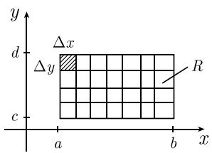
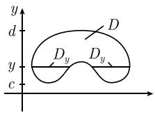
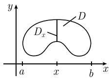
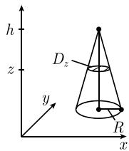
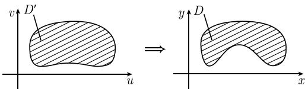
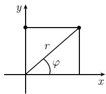
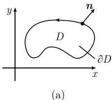
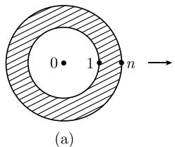
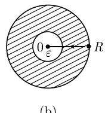

##### 1.7.1 基本思想

下面启发式的思考将在后面的 1.7.2 中被严格证明.

矩形的质量 令 $-\infty < a < b < \infty, -\infty < c < d < \infty$ . 考虑矩形 $R := \{(x, y) : a \leqslant x \leqslant b, c \leqslant y \leqslant d\}$ , 假设它的面密度为 $\varrho$ (图1.61(a)). 为了计算 $R$ 的质量, 我们

令

  
(a)

  
图1.61 量的计算  
(b)

$$
\Delta x := \frac {b - a}{n}, \quad \Delta y := \frac {d - c}{n}, n = 1, 2, \dots
$$

以及 $x_{j} := a + j\Delta x, y_{k} := c + k\Delta y,$ 其中 $j, k = 0, \cdots, n.$ 我们把矩形 R 分割成右上角为 $(x_{j}, y_{k})$ ，边长分别为 $\Delta x, \Delta y$ 的众多小矩形。这种小矩形的质量近似等于：

$$
\Delta m = \varrho (x _ {j}, y _ {k}) \Delta x \Delta y.
$$

因此, 用极限关系式

$$
\boxed {\int_ {R} \varrho (x, y) \mathrm{d} x \mathrm{d} y := \lim _ {n \rightarrow \infty} \sum_ {j, k = 1} ^ {\infty} \varrho (x _ {j}, y _ {k}) \Delta x \Delta y}\tag{1.126}
$$

来确定 R 的质量是有意义的.

累次积分(富比尼定理) 可以用公式:

$$
\boxed {\int_ {R} \varrho (x, y) \mathrm{d} x \mathrm{d} y = \int_ {c} ^ {d} \left(\int_ {a} ^ {b} \varrho (x, y) \mathrm{d} x\right) \mathrm{d} y = \int_ {a} ^ {b} \left(\int_ {c} ^ {d} \varrho (x, y) \mathrm{d} y\right) \mathrm{d} y}\tag{1.127}
$$

把 R 上的积分计算归结为两个一维积分的计算, 这有重大的实际意义. $^{1)}$

例 1: $\int_{R} \mathrm{d}x \mathrm{~d}y = \int_{c}^{d} \left( \int_{a}^{b} \mathrm{~d}x \right) \mathrm{~d}y = \int_{c}^{d} (b - a) \mathrm{~d}y = (b - a)(d - c)$ . 这是矩形 $R$ 的面积.

例 2: 从关系式

$$
\int_ {a} ^ {b} 2 x y \mathrm{d} x = 2 y \int_ {a} ^ {b} x \mathrm{d} x = y x ^ {2} | _ {a} ^ {b} = y (b ^ {2} - a ^ {2})
$$

1) 当 $n \to \infty$ 时, 对有限和交换累加次序:

$$
\sum_ {j, k = 1} ^ {n} \varrho \Delta x \Delta y = \sum_ {k = 1} ^ {n} \left(\sum_ {j = 1} ^ {n} \varrho \Delta x\right) \Delta y = \sum_ {j - 1} ^ {n} \left(\sum_ {k = 1} ^ {n} \varrho \Delta y\right) \Delta x,
$$

即得公式 (1.127), 其中 (更确切一点) $\varrho$ 被写为 $\varrho(x_{j}, y_{k})$ .

即得

$$
\int_ {R} 2 x y \mathrm{d} x \mathrm{d} y = \int_ {c} ^ {d} \left(\int_ {a} ^ {b} 2 x y \mathrm{d} x\right) \mathrm{d} y = \int_ {c} ^ {d} y (b ^ {2} - a ^ {2}) \mathrm{d} y = \frac {1}{2} (d ^ {2} - c ^ {2}) (b ^ {2} - a ^ {2}).
$$

有界区域的质量 为了求面密度为 $\varrho$ 的区域 $D$ 的质量, 我们选取一个包含 $D$ 的矩形 $R$ , 并令

$$
\boxed {\int_ {D} \varrho (x, y) \mathrm{d} x \mathrm{d} y := \int_ {R} \varrho_ {*} (x, y) \mathrm{d} x \mathrm{d} y,}\tag{1.128}
$$

其中

$$
\varrho_ {*} (x, y) := \left\{ \begin{array}{l l} \varrho (x, y), & (x, y) \in D \\ 0, & D \text {外} ^ {1)} \end{array} \right.
$$

这些讨论可以完全类似地推广到高维的情形. 在高维情形, 用 $n$ 维立方体代替矩形, 其中 $n$ 是区域的维数 (参看图1.61(b)).

卡瓦列里原理 考虑图 1.62 所示的情形. 有

$$
\int_ {a} ^ {b} \varrho_ {*} (x, y) \mathrm{d} x = \int_ {\alpha (y)} ^ {\beta (y)} \varrho_ {*} (x, y) \mathrm{d} x = \int_ {\alpha (y)} ^ {\beta (y)} \varrho (x, y) \mathrm{d} x.
$$

注意, 对于固定的 $y, \varrho_{*}(x, y)$ 在区间 $[\alpha(y), \beta(y)]$ 上等于 $\varrho(x, y)$ , 在区间外等于 0. 由而从 (1.127) 和 (1.128) 即得

$$
\boxed {\int_ {D} \varrho (x, y) \mathrm{d} x \mathrm{d} y = \int_ {c} ^ {d} \left(\int_ {\alpha (y)} ^ {\beta (y)} \varrho (x, y) \mathrm{d} x\right) \mathrm{d} y.}
$$

这个公式也可以简写成

$$
\boxed {\int_ {D} \varrho (x, y) \mathrm{d} x \mathrm{d} y = \int_ {c} ^ {d} \left(\int_ {D _ {y}} \varrho (x, y) \mathrm{d} x\right) \mathrm{d} y.}\tag{1.129}
$$

其中 $D_{y}$ 是所谓的 D 的 y 截面:

$$
D _ {y} = \{x \in \mathbb {R} | (x, y) \in D \}.
$$

公式 (1.129) 不依赖于区域 $^{2)}$ D 的特殊形式, 见图 1.62(也可见图 1.63(a)).

1) 如果 $\varrho$ 也取负值, 那么可以把 $\varrho$ 看作表面电荷密度, 把 $\int_{D} \varrho(x, y) \mathrm{d}x \mathrm{~d}y$ 解释成区域 $D$ 中的总电荷. 当 $\varrho \equiv 1$ 时, 积分 $\int_{D} \mathrm{d}x \mathrm{~d}y$ 就是区域 $D$ 的面积.

2) 如果我们引进 $D$ 的 $x$ 截面 $D_{x} := \{y \in \mathbb{R} | (x, y) \in D\}$ , 那么类似于 (1.129), 我们有公式:

$$
\int_ {D} \rho (x, y) \mathrm{d} x \mathrm{d} y = \int_ {a} ^ {b} \left(\int_ {D _ {x}} \rho (x, y) \mathrm{d} y\right) \mathrm{d} x
$$

(参看图 1.63(b)).

  
图1.62 一个 $y$ 截面

  
(a)

  
(b)  
图1.63 区域 $D$ 的 $y$ 截面和 $x$ 截面

也可以把方程 (1.129) 推广到高维, 它对应着积分理论的一般原理, 它在牛顿和莱布尼茨之前的最简单形式是由伽利略的学生 B. 卡瓦列里(Bonaventura Cavalieri, 1598—1647) 发现的, 于 1653 年发表在他的主要著作《连续不可分量的几何学》(Geometria indivisibilius continuorum) 中.

例 3(圆锥的体积): 令 D 是底面圆半径为 R, 高为 h 的一个圆锥. 关于 D 的体积, 有公式

$$
\boxed {V = \frac {1}{3} \pi R ^ {2} h.}
$$

为了推导出这个公式, 应用卡瓦列里原理:

$$
V = \int_ {D} \mathrm{d} x \mathrm{d} y \mathrm{d} z = \int_ {0} ^ {h} \left(\int_ {D _ {z}} \mathrm{d} x \mathrm{d} y\right) \mathrm{d} z.
$$

z 截面是半径为 $R_{z}$ 的圆盘 (图 1.64(a)). 因此有 $\int_{D_{z}} dx dy =$ 半径为 $R_{z}$ 的圆盘的面积, $A = \pi R_{z}^{2}$ (参看例 4). 由图 1.64(b), 可以看出

$$
\frac {R _ {z}}{R} = \frac {h - z}{h},
$$

因而得到

$$
V = \int_ {0} ^ {h} \frac {\pi R ^ {2}}{h ^ {2}} (h - z) ^ {2} d z = - \frac {\pi R ^ {2}}{3 h ^ {2}} (h - z) ^ {3} | _ {0} ^ {h} = \frac {1}{3} \pi R ^ {2} h.
$$

  
(a)

  
(b)  
图1.64

代换规则和嘉当微分学 考虑映射

$$
\boxed {x = x (u, v), \quad y = y (u, v),}\tag{1.130}
$$

它把 $(u,v)$ 平面上的区域 $D'$ 映射到 $(x,y)$ 平面上的区域 $D(\text{图 1.65})$ .

  
图1.65 代换规则

根据嘉当微分学的如下形式的方法, 可以推导出积分 $\int_{D}\varrho(x,y)\mathrm{d}x\mathrm{d}y$ 的恰当的变换法则. 为此, 我们记作

$$
\int_ {D} \varrho (x, y) \mathrm{d} x \mathrm{d} y = \int_ {D} \omega ,
$$

其中

$$
\omega = \varrho \mathrm{d} x \wedge \mathrm{d} y.
$$

利用变换 (1.130), 我们得到

$$
\omega = \varrho \frac {\partial (x , y)}{\partial (u , v)} \mathrm{d} u \wedge \mathrm{d} v
$$

(参看 1.5.10.4 中的例 10). 用这种方式, 我们已经推导出代换基本公式:

$$
\boxed {\int_ {D} \varrho (x, y) \mathrm{d} x \mathrm{d} y = \int_ {D ^ {\prime}} \varrho (x (u, v), y (u, v)) \frac {\partial (x , y)}{\partial (u , v)} \mathrm{d} u \mathrm{d} v,}\tag{1.131}
$$

这可以严格证明. 这里, 必须假定 $^{1)}$

$$
\frac {\partial (x , y)}{\partial (u , v)} (u, v) > 0, \quad \text {对所有} (u, v) \in D ^ {\prime}.
$$

1) 允许 $\frac{\partial(x, y)}{\partial(u, v)}$ 在有限多个点处为零.

应用到极坐标 变量变换

$$
x = r \cos \varphi , \quad y = r \sin \varphi , \quad - \pi <   \varphi \leqslant \pi ,
$$

把笛卡儿坐标 $(x,y)$ 变成极坐标 $(r,\varphi)$ (图 1.66(a)).

(b)  
  
(a)

  
图1.66 极坐标

那么我们有

$$
\boxed {\int_ {D} \varrho (x, y) \mathrm{d} x \mathrm{d} y = \int_ {D ^ {\prime}} \varrho r \mathrm{d} r \mathrm{d} \varphi .}\tag{1.132}
$$

这由 (1.131) 及 $^{1)}$

$$
\frac {\partial (x , y)}{\partial (r , \varphi)} = \left| \begin{array}{c c} x _ {r} & x _ {\varphi} \\ y _ {r} & y _ {\varphi} \end{array} \right| = \left| \begin{array}{c c} \cos \varphi & - r \sin \varphi \\ \sin \varphi & r \cos \varphi \end{array} \right| = r (\cos^ {2} \varphi + \sin^ {2} \varphi) = r
$$

即得.

例 4(圆周内部的面积): 令 D 是由半径为 R 的圆围成的区域. 对于 D 的面积 A(图 1.67), 有

$$
A = \int_ {D} \mathrm{d} x \mathrm{d} y = \int_ {D ^ {\prime}} r \mathrm{d} r \mathrm{d} \varphi = \int_ {0} ^ {R} \left(\int_ {- \pi} ^ {\pi} r \mathrm{d} \varphi\right) \mathrm{d} r = 2 \pi \int_ {0} ^ {R} r \mathrm{d} r = \pi R ^ {2}.
$$

  
(a)

  
(b)  
图 1.67 图形所描绘的面积

1) 把 (1.132) 的区域 $D$ 分割成很多小片 $\Delta F = r\Delta r\Delta \varphi$ , 然后对和

$$
\sum \varrho \Delta F = \sum \varrho r \Delta r \Delta \varphi
$$

取极限 $\Delta F \rightarrow 0$ (参看图 1.66(b)), 这给出了 (1.132) 的直观动机.

微积分基本定理和嘉当微分学 在一维的情形, 牛顿和莱布尼茨基本定理是

$$
\int_ {a} ^ {b} F ^ {\prime} (x) \mathrm{d} x = F | _ {a} ^ {b}.
$$

把它记作

$$
\boxed {\int_ {D} \mathrm{d} \omega = \int_ {\partial D} \omega ,}\tag{1.133}
$$

其中 $\omega = F, D = ]a, b[$ . 注意 $\mathrm{d}\omega = \mathrm{d}F = F'(x)\mathrm{d}x$ .

(1.133) 对任意维的区域, 曲线和曲面都成立, 这显示了嘉当微分学的优美 (参看 1.7.6).

因为 (1.133) 把域论 (向量分析) 的高斯经典定理和斯托克斯经典定理作为特例包含了进来, 所以把 (1.133) 称为高斯-斯托克斯定理 (或更简单地称为斯托克斯定理).

例 5(平面上的高斯定理): 令 D 是平面区域, 边界为 $\partial D$ , 它的参数表示为

$$
x = x (t), \quad y = y (t), \quad \alpha \leqslant t \leqslant \beta ,
$$

并且如图 1.68 所示在数学意义下它是正定向的. 我们选 1 次微分式

$$
\omega = a \mathrm{d} x + b \mathrm{d} y,
$$

则有

$$
\mathrm{d} \omega = (b _ {x} - a _ {y}) \mathrm{d} x \wedge \mathrm{d} y
$$

(参看 1.5.10.4 的例 5). 那么公式 (1.133) 即为

$$
\int_ {D} (b _ {x} - a _ {y}) \mathrm{d} x \wedge \mathrm{d} y = \int_ {\partial D} a \mathrm{d} x + b \mathrm{d} y.\tag{1.134}
$$

同时嘉当微分学展示了如何计算这些积分. 在 (1.134) 左端的积分里, 把 $\mathrm{dx} \wedge \mathrm{dy}$ 换成 $\mathrm{dxdy}$ (这个规则对任意维区域有效). 在 (1.134) 右端的积分里, 把 $\omega$ 与 $\partial D$ 的参数表示联系起来, 就得到

$$
\omega = \left(a \frac {\mathrm{d} x}{\mathrm{d} t} + b \frac {\mathrm{d} y}{\mathrm{d} t}\right) \mathrm{d} t
$$

和

$$
\int_ {\partial D} \omega = \int_ {\alpha} ^ {\beta} (a x ^ {\prime} + b y ^ {\prime}) \mathrm{d} t.
$$

这样, 用经典记号来写 (1.134) 就是 $^{1)}$

$$
\boxed {\int_ {D} (b _ {x} - a _ {y}) \mathrm{d} x \mathrm{d} y = \int_ {\alpha} ^ {\beta} (a x ^ {\prime} + b y ^ {\prime}) \mathrm{d} t.}\tag{1.135}
$$

1) 也包括记号中的自变量, 更精确地说是如下公式:

$$
\int_ {D} (b _ {x} (x, y) - a _ {y} (x, y)) \mathrm{d} x \mathrm{d} y = \int_ {\alpha} ^ {\beta} (a (x (t), y (t)) x ^ {\prime} (t) + b (x (t), y (t)) y ^ {\prime} (t)) \mathrm{d} t.
$$

这就是平面上的高斯定理.

  
图1.68 $\partial D$ 边界上某点处的 $n$ 标架

应用到分部积分 下面两个关系式成立:

$$
\boxed { \begin{array}{l} \int_ {D} u _ {x} v \mathrm{d} x \mathrm{d} y = \int_ {\partial D} u v n _ {x} \mathrm{d} s - \int_ {D} u v _ {x} \mathrm{d} x \mathrm{d} y, \\ \int_ {D} u _ {y} v \mathrm{d} x \mathrm{d} y = \int_ {\partial D} u v n _ {y} \mathrm{d} s - \int_ {D} u v _ {y} \mathrm{d} x \mathrm{d} y. \end{array} }\tag{1.136}
$$

这里 $n = n_{x}i + n_{y}j$ 为在边界点处的外法向量, s 表示 (假定足够光滑的) 边界曲线的弧长. 公式 (1.136) 推广了一维的公式

$$
\int_ {\alpha} ^ {\beta} u ^ {\prime} v \mathrm{d} x = u v | _ {\alpha} ^ {\beta} - \int_ {\alpha} ^ {\beta} u v ^ {\prime} \mathrm{d} x.
$$

现在我们希望证明, 由 (1.135) 可推得 (1.136). 为此, 我们把沿边界曲线 $\partial D$ 的参数 $t$ 看成是时间. 如果一个点沿 $\partial D$ 移动, 那么它的运动方程是

$$
\pmb {r} (t) = x (t) \pmb {i} + y (t) \pmb {j},
$$

而速度向量则为

$$
\boldsymbol {r} ^ {\prime} (t) = x ^ {\prime} (t) \boldsymbol {i} + y ^ {\prime} (t) \boldsymbol {j}.
$$

对于向量 $N = y'(t)\mathbf{i} - x'(t)\mathbf{j}$ 来说, 由于关系式 $\mathbf{r}'(t)\mathbf{N} = x'(t)y'(t) - y'(t)x'(t) = 0$ , 因此 N 垂直于切向量 $\mathbf{r}'(t)$ , 并且指向 D 的外部. 对于相应的单位向量 n, 我们得到表达式

$$
\boldsymbol {n} = \frac {\boldsymbol {N}}{| \boldsymbol {N} |} = \frac {y ^ {\prime} (t) \boldsymbol {i} - x ^ {\prime} (t) \boldsymbol {j}}{\sqrt {x ^ {\prime} (t) ^ {2} + y ^ {\prime} (t) ^ {2}}} = n _ {x} \boldsymbol {i} + n _ {y} \boldsymbol {j}
$$

(参看图 1.68(a)). 而且有 $\frac{\mathrm{d}s}{\mathrm{d}t} = \sqrt{x'(t)^2 + y'(t)^2}$ (参看 1.6.9). 因此

$$
n _ {x} \frac {\mathrm{d} s}{\mathrm{d} t} = y ^ {\prime} (t).
$$

如果我们令 $b := uv$ , 以及在 (1.135) 中的 $a \equiv 0$ , 那么有

$$
\int_ {D} (u v) _ {x} \mathrm{d} x \mathrm{d} y = \int_ {\alpha} ^ {\beta} u v y ^ {\prime} \mathrm{d} t = \int_ {\alpha} ^ {\beta} u v n _ {x} \frac {\mathrm{d} s}{\mathrm{d} t} \mathrm{d} t = \int_ {\partial D} u v n _ {x} \mathrm{d} s.
$$

由于乘积法则 $(uv)_x = u_xv + uv_x$ ，这就是(1.136)的第一个公式．如果令 $a\coloneqq uv$ 用完全相同的方法就得到(1.136）的第二个公式.

无界区域上的积分 和一维的情形一样, 用有界区域近似无界区域 D, 然后让近似区域的大小没有界限, 取极限, 从而得到无界区域上的积分:

$$
\boxed {\int_ {D} f \mathrm{d} x \mathrm{d} y = \lim _ {n \to \infty} \int_ {D _ {n}} f \mathrm{d} x \mathrm{d} y,}
$$

其中的记号的选取满足 $D_{1} \subseteq D_{2} \subseteq \cdots$ ，且 $D = \bigcup_{n=1}^{\infty} D_{n}$ .
例 6: 令 $r := \sqrt{x^{2} + y^{2}}$ ，区域 D 为单位圆的外部：

$$
D := \{(x, y) \in \mathbb {R} ^ {2} | 1 <   r <   \infty \}.
$$

我们用一系列圆环

$$
D _ {n} = \{(x, y) | 1 <   r <   n \}
$$

来逼近 $D(\text{图 } 1.69(\mathrm{a}))$ . 当 $\alpha > 2$ 时, 有

$$
\boxed {\int_ {D} \frac {\mathrm{d} x \mathrm{d} y}{r ^ {\alpha}} = \lim _ {n \to \infty} \int_ {D _ {n}} \frac {\mathrm{d} x \mathrm{d} y}{r ^ {\alpha}} = \frac {2 \pi}{\alpha - 2}.}
$$

利用极坐标, 从等式

$$
\begin{array}{c} \int_ {D _ {n}} \frac {\mathrm{d} x \mathrm{d} y}{r ^ {\alpha}} = \int_ {r = 1} ^ {n} \left(\int_ {\varphi = 0} ^ {2 \pi} \frac {r \mathrm{d} r \mathrm{d} \varphi}{r ^ {\alpha}}\right) = 2 \pi \int_ {1} ^ {n} r ^ {1 - \alpha} \mathrm{d} r \\ = 2 \pi \frac {r ^ {2 - \alpha}}{2 - \alpha} \Bigg | _ {1} ^ {n} = \frac {2 \pi}{\alpha - 2} \left(1 - \frac {1}{n ^ {\alpha - 2}}\right) \end{array}
$$

即得上面的结果.

无界函数的积分 和一维情况一样, 我们用那些函数在其中有界的区域来逼近区域 D.

例 7: 令 $D := \{(x, y) \in \mathbb{R}^2 | r \leqslant R\}$ 是半径为 $R$ 的圆的内部. 我们用圆环 (图 1.69(b))

$$
D _ {\varepsilon} := D \setminus U _ {\varepsilon} (0)
$$

来逼近这个圆盘, 其中 $U_{\varepsilon}(0) := \{(x, y) \in \mathbb{R}^2 | r < \varepsilon\}$ 是半径为 $\varepsilon$ 的圆的内部. 当 $0 < \alpha < 2$ 时, 有

$$
\int_ {D} \frac {\mathrm{d} x \mathrm{d} y}{r ^ {\alpha}} = \lim _ {\varepsilon \rightarrow 0} \int_ {D _ {\varepsilon}} \frac {\mathrm{d} x \mathrm{d} y}{r ^ {\alpha}} = \frac {2 \pi R ^ {2 - \alpha}}{2 - \alpha}.
$$

再次利用极坐标, 从关系式

$$
\int_ {D _ {\varepsilon}} \frac {\mathrm{d} x \mathrm{d} y}{r ^ {\alpha}} = \int_ {r = \varepsilon} ^ {R} \left(\int_ {\varphi = 0} ^ {2 \pi} \frac {r \mathrm{d} r \mathrm{d} \varphi}{r ^ {\alpha}}\right) = 2 \pi \int_ {\varepsilon} ^ {R} r ^ {1 - \alpha} \mathrm{d} r = \frac {2 \pi}{2 - \alpha} (R ^ {2 - \alpha} - \varepsilon^ {2 - \varepsilon})
$$

即得上面的结果.

  
图 1.69 求无界函数的积分 (b) 及无界区域上的积分 (a)
