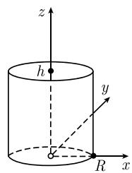
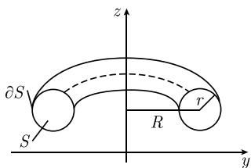

##### 1.7.10 应用到质心和惯性中点

求质量、质心和惯性中心的公式可见表 1.3.

例 1(球): 考虑笛卡儿坐标系 $(x,y,z)$ 下中心在原点, 半径为 R 的实心球 (图 1.79(a)).

体积

$$
M = \int r ^ {2} \cos \theta \mathrm{d} \theta \mathrm{d} \varphi \mathrm{d} r = \int_ {0} ^ {R} r ^ {2} \mathrm{d} r \int_ {- \pi} ^ {\pi} \mathrm{d} \varphi \int_ {- \frac {\pi}{2}} ^ {\frac {\pi}{2}} \cos \theta \mathrm{d} \theta = \frac {4 \pi R ^ {3}}{3},
$$

其中用了球面坐标 (参看表 1.2).

质心：它位于球的中心，即，在原点.

惯性中心(关于 z 轴的)

$$
\Theta_ {z} = \int (r \cos \theta) ^ {2} r ^ {2} \cos \theta \mathrm{d} \theta \mathrm{d} \varphi \mathrm{d} r = \int_ {0} ^ {R} r ^ {4} \mathrm{d} r \int_ {- \pi} ^ {\pi} \mathrm{d} \varphi \int_ {- \frac {\pi}{2}} ^ {\frac {\pi}{2}} \cos^ {3} \theta \mathrm{d} \theta = \frac {2}{5} R ^ {2} M.
$$

表 1.3 曲线坐标下的积分量

<table><tr><td></td><td>质量  $M(\rho$  为密度)</td><td>质心向量  $(\boldsymbol{r} = x\boldsymbol{i} + y\boldsymbol{j} + z\boldsymbol{k})$ </td><td>关于  $z$  轴的惯性中心</td></tr><tr><td>曲线  $\mathcal{C}$ </td><td> $M = \int_{\mathcal{C}} \rho \mathrm{d}s(\rho = 1 \text{时为}\mathcal{C} \text{的弧长})$ </td><td> $\boldsymbol{r}_{\mathrm{cm}} = \frac{1}{M} \int_{\mathcal{C}} \boldsymbol{r} \rho \mathrm{d}s$ </td><td> $\Theta_z = \int_{\mathcal{C}} (x^2 + y^2) \rho \mathrm{d}s$ </td></tr><tr><td>曲面  $\mathcal{F}$ </td><td> $M = \int_{\mathcal{F}} \rho \mathrm{d}F(\rho = 1 \text{时为曲面}\mathcal{F} \text{的面积})$ </td><td> $\boldsymbol{r}_{\mathrm{cm}} = \frac{1}{M} \int_{\mathcal{F}} \boldsymbol{r} \rho \mathrm{d}F$ </td><td> $\Theta_z = \int_{\mathcal{F}} (x^2 + y^2) \rho \mathrm{d}F$ </td></tr><tr><td>立体 $\mathcal{F}$ (dV = dxdydz)</td><td> $M = \int_{\mathcal{F}} \rho \mathrm{d}V(\rho = 1 \text{时为}\mathcal{F} \text{的体积})$ </td><td> $\boldsymbol{r}_{\mathrm{cm}} = \frac{1}{M} \int_{\mathcal{F}} \boldsymbol{r} \rho \mathrm{d}V$ </td><td> $\Theta_z = \int_{\mathcal{G}} (x^2 + y^2) \rho \mathrm{d}V$ </td></tr></table>

  
(a)

  
(b)

  
图 1.79 实心球、圆柱体、圆锥体  
(c)

例 2(圆柱体): 考虑半径为 R, 高为 h 的圆柱体 (图 1.79(b)). 体积

$$
M = \int r \mathrm{d} r \mathrm{d} \varphi \mathrm{d} z = \int_ {0} ^ {R} r \mathrm{d} r \int_ {- \pi} ^ {\pi} \mathrm{d} \varphi \int_ {0} ^ {h} \mathrm{d} z = \pi R ^ {2} h,
$$

其中用了柱面坐标 (参看表 1.2).

质心:

$$
z _ {\mathrm{cm}} = \frac {h}{2}, x _ {\mathrm{cm}} = y _ {\mathrm{cm}} = 0.
$$

关于 $z$ 轴的惯性中心：

$$
\Theta_ {z} = \int r ^ {2} r \mathrm{d} \varphi \mathrm{d} r \mathrm{d} z = \int_ {0} ^ {R} r ^ {3} \mathrm{d} r \int_ {- \pi} ^ {\pi} \mathrm{d} \varphi \int_ {0} ^ {h} \mathrm{d} z = \frac {1}{2} R ^ {2} M.
$$

例 3(圆锥体): 考虑半径为 R 的圆做底, 高为 h 的圆锥体 (图 1.79(c)).

$$
M = \int_ {z = 0} ^ {h} \left(\int_ {D _ {z}} \mathrm{d} x \mathrm{d} y \mathrm{d} z\right) = \int_ {0} ^ {h} \pi R _ {z} ^ {2} \mathrm{d} z = \frac {1}{3} \pi R ^ {2} h,
$$

这里, 我们应用了卡瓦列里原理. 根据 1.7.1 中的例 3, 有 $R_{z} = (h - z)R / h$ . 质点:

$$
z _ {\mathrm{cm}} = \frac {1}{M} \int_ {z = 0} ^ {h} \left(\int_ {D z} z \mathrm{d} x \mathrm{d} y\right) \mathrm{d} z = \frac {1}{M} \int_ {0} ^ {h} z \pi R _ {z} ^ {2} \mathrm{d} z = \frac {h}{4}, \quad x _ {\mathrm{cm}} = y _ {\mathrm{cm}} = 0.
$$

关于 $z$ 轴的惯性中心：

$$
\begin{array}{l} \Theta_ {z} = \int (x ^ {2} + y ^ {2}) \mathrm{d} x \mathrm{d} y \mathrm{d} z = \int_ {0} ^ {h} \left(\int_ {D z} r ^ {3} \mathrm{d} r \mathrm{d} \varphi\right) \mathrm{d} z = \int_ {0} ^ {h} \left(\int_ {0} ^ {R z} r ^ {3} \mathrm{d} r\right) \left(\int_ {- \pi} ^ {\pi} \mathrm{d} \varphi\right) \mathrm{d} z \\ = \int_ {0} ^ {h} \frac {\pi}{2} R _ {z} ^ {4} \mathrm{d} z = \frac {3}{1 0} M R ^ {2}. \end{array}
$$

第一古尔丁(Guldinian) 法则\* 旋转体的体积等于, 过旋转轴平面与它的截面 $S$ 的面积 $F$ 与在一次旋转中 $S$ 的质心的轨道长度的乘积.

第二古尔丁法则 旋转体的表面积等于, 截面 S 的边界 $\partial S$ 的长度与在一次旋转中边界 $\partial S$ 的质心的轨道长度的乘积.

例 4(环面): 环面的子午截面 S 是半径为 r 的圆周, 它的面积是 $F = \pi r^{2}$ , 周长是 $U = 2\pi r$ (图 1.80). S 和 $\partial S$ 的质心都是圆的中心, 它与 z 轴的距离是 R. 根据古尔丁法则, 有

$$
\mathrm{环面的体积} = 2 \pi R F = 2 \pi^ {2} R r ^ {2},
$$

  
图1.80

环面的表面积 $= 2\pi RU = 4\pi^2 Rr$
