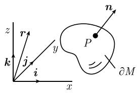
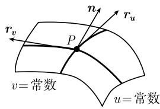
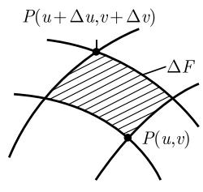
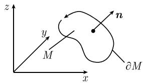
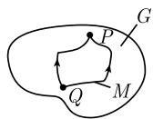
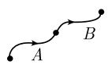

##### 1.7.6 微积分基本定理（高斯-斯托克斯定理）

人们也许会问, 最深刻的数学定理 —— 毫无疑问, 它有明确的物理解释 —— 是什么? 对我而言, 这个定理自然是斯托克斯定理.

R. 托姆 (René Thom, 1923—2002)

斯托克斯一般定理 $^{1)}$

$$
\boxed {\int_ {M} \mathrm{d} \omega = \int_ {\partial M} w.}\tag{1.143}
$$

这个异常优美的公式是牛顿-莱布尼茨微积分基本定理, 即

$$
\int_ {a} ^ {b} F ^ {\prime} (\pmb {x}) \mathrm{d} \pmb {x} = F | _ {a} ^ {b}
$$

对高维的推广.

斯托克斯定理 令 $M$ 为 $n$ 维定向紧的实流形 $(n \geqslant 1)$ , 其中边界 $\partial M$ 为协同定向的, 并令 $\omega$ 为 $M$ 上 $C'$ 类的 $n - 1$ 次微分式. 那么公式 (1.143) 成立.

注 斯托克斯定理中出现的数学对象在 [212] 中被详细介绍. 在当前, 我们建议读者从直觉上考虑基本公式 (1.143), 而不用担心精确的阐述.

(i) 把 M 看作一条有界曲线, 或有界的 m 维曲面 $(m=2,3,\cdots)$ , 或 $R^{N}$ 中有界开集的闭包是有益的.

(ii) 参数：如果我们用局部坐标记积分, 那么对 $M$ 及 $\partial M$ , 后者都是任意的.

(iii) 分解原理：如果不能把 $M$ (相应地 $\partial M$ ) 描述成局部坐标 (参数) 的单个集，那么可以把 $M$ (相应地, $\partial M$ ) 分解成有限个部分的不相交并集，每个部分确有这样一个整体参数。那么每部分积分的和就是 $M$ 上所求积分。

这样我们有如下实用的事实：

嘉当微分学完善.

只需要注意的是, $M$ 上靠近边界点 $P$ 的局部坐标与在边界 $\partial M$ 上靠近 $P$ 的局部坐标是相容的(这是协同定向边界的概念). 在下面一些例子中, 我们将从直观上解释这一点. 1)

1.7.6.1 经典高斯积分定理的应用

考虑2次微分式

$$
\omega = a \mathrm{d} y \wedge \mathrm{d} z + b \mathrm{d} z \wedge \mathrm{d} x + c \mathrm{d} x \wedge \mathrm{d} y.
$$

根据 1.5.10.4 的例 8, 有

$$
\mathrm{d} \omega = (a _ {x} + b _ {y} + c _ {z}) \mathrm{d} x \wedge \mathrm{d} y \wedge \mathrm{d} z.
$$

为了合理地定义 $\int_{\partial M} \omega, \partial M$ 必须是2维的. 因此我们假设 $M$ 是 $\mathbb{R}^3$ 中具有充分光滑边界 $\partial M$ 的一个有界(非空)开集的闭包, 它有参数表示

$$
x = x (u, v), \quad y = y (u, v), \quad z = z (u, v).
$$

如果把 $\omega$ 与参数 u, v 联系起来, 那么有

$$
\omega = \left(a \frac {\partial (y , z)}{\partial (u , v)} + b \frac {\partial (z , x)}{\partial (u , v)} + c \frac {\partial (x , y)}{\partial (u , v)}\right) \mathrm{d} u \wedge \mathrm{d} v
$$

(参看 1.5.10.4 中的例 12). 那么公式 $\int_{M} d\omega = \int_{\partial M} \omega$ 导出了 3 维区域 M 的经典高斯定理：

$$
\boxed {\int_ {M} (a _ {x} + b _ {y} + c _ {z}) \mathrm{d} x \mathrm{d} y \mathrm{d} z = \int_ {\partial M} \left(a \frac {\partial (y , z)}{\partial (u , v)} + b \frac {\partial (z , x)}{\partial (u , v)} + c \frac {\partial (x , y)}{\partial (u , v)}\right) \mathrm{d} u \mathrm{d} v}\tag{1.144}
$$

用向量记号表示 我们引进坐标向量 $r := xi + yj + zk$ ，那么表达式

$$
\boldsymbol {r} _ {u} (u, v) = x _ {u} (u, v) \boldsymbol {i} + y _ {u} (u, v) \boldsymbol {j} + z _ {u} (u, v) \boldsymbol {k}
$$

是过 $\partial M$ 上点 $P(u,v)$ 的坐标线 v = 常数的切向量 (图 1.70(b)). 类似地, $\boldsymbol{r}_{v}(u,v)$ 是过点 $P(u,v)$ 的坐标线 u = 常数的切向量. 那么在点 $P(u,v)$ 处的切平面方程为

$$
\boxed {\boldsymbol {r} = \boldsymbol {r} (u, v) + p \boldsymbol {r} _ {u} (u, v) + q \boldsymbol {r} _ {v} (u, v),}
$$

其中 $p, q$ 是实参数, $\boldsymbol{r}(u, v)$ 是点 $P(u, v)$ 的坐标向量. 为了使切向量 $\boldsymbol{r}_u(u, v)$ 和 $\boldsymbol{r}_v(u, v)$ 张成一个平面, 必须假定 $\boldsymbol{r}_u(u, v) \times \boldsymbol{r}_v(u, v) \neq 0$ , 即, 这两个向量不平行或不反平行. 单位向量

$$
\boxed {\boldsymbol {n} := \frac {\boldsymbol {r} _ {u} (u , v) \times \boldsymbol {r} _ {v} (u , v)}{| \boldsymbol {r} _ {u} (u , v) \times \boldsymbol {r} _ {v} (u , v) |}}\tag{1.145}
$$

垂直于点 $P(u,v)$ 处的切平面, 因此是法向量. M 和 $\partial M$ 的协同定向说明, 这个法向量指向外部(图 1.70(a)).

  
(a)

  
(b)  
图 1.70 高斯积分定理的坐标表示

如果我们引进向量场 $J := ai + bj + ck$ ，那么三维区域的高斯定理可以写成经典形式：

$$
\boxed {\int_ {M} \operatorname{div} \boldsymbol {J} \mathrm{d} x = \int_ {\partial M} \boldsymbol {J} \boldsymbol {n} \mathrm{d} F,}\tag{1.146}
$$

这里我们令

$$
\mathrm{d} F = \left| \boldsymbol {r} _ {u} \times \boldsymbol {r} _ {v} \right| \mathrm{d} u \mathrm{d} v = \sqrt {\left(\frac {\partial (x , y)}{\partial (u , v)}\right) ^ {2} + \left(\frac {\partial (y , z)}{\partial (u , v)}\right) ^ {2} + \left(\frac {\partial (z , x)}{\partial (u , v)}\right) ^ {2}} \mathrm{d} u \mathrm{d} v.
$$

直观上, $\partial M$ 的曲面元素 $\Delta F$ 近似为

$$
\boxed {\Delta F = | \boldsymbol {r} _ {u} (u, v) \times \boldsymbol {r} _ {v} (u, v) | \Delta u \Delta v}\tag{1.147}
$$

(图 1.71(a)). $^{1)}$

在 1.9.7 中可以找到 (1.146) 的物理解释. 从直观上看, 把曲面 $\partial M$ 分解成很多小部分 $\Delta F$ , 并细化此分解, 就得到积分 $\int_{\partial M} g \mathrm{d}F$ . 我们也可以用简略了的公式

$$
\int_ {\partial M} g \mathrm{d} F = \lim _ {\Delta F \to 0} \sum g \Delta F\tag{1.148}
$$

来描述.

  
(a)

  
(b)  
图 1.71 曲面面积元

三维空间中的曲面 上面关于切平面, 单位法向量及曲面元素的公式对 $R^{3}$ 中的任意 (足够光滑) 曲面都成立.

1.7.6.2 应用到斯托克斯经典积分定理

考虑1次微分式

$$
\omega = a \mathrm{d} x + b \mathrm{d} y + c \mathrm{d} z.
$$

根据 1.5.10.4 的例 7, 有

$$
\mathrm{d} \omega = (c _ {y} - b _ {z}) \mathrm{d} y \wedge \mathrm{d} z + (a _ {z} - c _ {x}) \mathrm{d} z \wedge \mathrm{d} x + (b _ {x} - a _ {y}) \mathrm{d} x \wedge \mathrm{d} y.
$$

为了使 $\int_{\partial M} \omega$ 有意义, 边界 $\partial M$ 必须是 1 维的, 即, 它一定是围成曲面 $M$ 的曲线 (图 1.72). 曲面 $M$ 有参数表示

$$
x = x (u, v), \quad y = y (u, v), \quad z = z (u, v),
$$

并且边界曲线的参数表示为

  
图1.72

$$
x = x (t), \quad y = y (t), \quad z = z (t), \quad \alpha \leqslant t \leqslant \beta .
$$

如图 1.72, 法向量 (1.145) 与定向曲线 $\partial M$ 在一起被定向, 就如右手的拇指与食指、中指的位置关系 (右手法则), 这个法则就确定了 M 和 $\partial M$ 的协同定向.

$$
\omega = \left(a \frac {\mathrm{d} x}{\mathrm{d} t} + b \frac {\mathrm{d} y}{\mathrm{d} t} + c \frac {\mathrm{d} z}{\mathrm{d} t}\right) \mathrm{d} t,
$$

如果我们把 $\omega(\text{相应地}, \mathrm{d}\omega)$ 与对应的参数 t(相应地, $(u, v)$ ) 联系起来, 那么有:

$$
\mathrm{d} \omega = \left((c _ {y} - b _ {z}) \frac {\partial (y , z)}{\partial (u , v)} + (a _ {z} - c _ {x}) \frac {\partial (z , x)}{\partial (u , v)} + (b _ {x} - a _ {y}) \frac {\partial (x , y)}{\partial (u , v)}\right) \mathrm{d} u \wedge \mathrm{d} v
$$

(参看 1.5.10.4 中的例 12). 公式 $\int_{M} d\omega = \int_{\partial M} \omega$ 则给出了 $R^{3}$ 中曲面的斯托克斯定理的经典形式:

$$
\begin{array}{l} \int_ {M} \left((c _ {y} - b _ {z}) \frac {\partial (y , z)}{\partial (u , v)} + (a _ {z} - c _ {x}) \frac {\partial (z , x)}{\partial (u , v)} + (b _ {x} - a _ {y}) \frac {\partial (x , y)}{\partial (u , v)}\right) \mathrm{d} u \mathrm{d} v \\ = \int_ {\partial M} (a x ^ {\prime} + b y ^ {\prime} + c z ^ {\prime}) \mathrm{d} t. \end{array}
$$

如果记 $B = ai + bj + ck$ ，那么有

$$
\boxed {\int_ {M} (\mathbf {c u r l} B) \boldsymbol {n} \mathrm{d} F = \int_ {\alpha} ^ {\beta} \boldsymbol {B} (\boldsymbol {r} (t)) \boldsymbol {r} ^ {\prime} (t) \mathrm{d} t.}\tag{1.149}
$$

我们将在 1.9.8 中给出这个公式的物理解释.

1.7.6.3 应用到曲线积分

位势公式 考虑 $\mathbb{R}^3$ 中的0次微分式 $\omega = U$ , 这里函数 $U = U(x, y, z)$ . 那么有

$$
\mathrm{d} U = U _ {x} \mathrm{d} x + U _ {y} \mathrm{d} y + U _ {z} \mathrm{d} z.
$$

选取参数表示为

$$
x = x (t), y = y (t), z = z (t), \quad \alpha \leqslant t \leqslant \beta\tag{1.150}
$$

的曲线 M. 把 U 用参数 t 表示, 就得到

$$
\mathrm{d} U = \left(U _ {x} (P (t)) \frac {\mathrm{d} x}{\mathrm{d} t} + U _ {y} (P (t)) \frac {\mathrm{d} y}{\mathrm{d} t} + U _ {z} (P (t)) \frac {\mathrm{d} z}{\mathrm{d} t}\right) \mathrm{d} t.
$$

这样, 在里斯托克斯定理就给出了所谓的位势公式:

$$
\boxed {\int_ {M} \mathrm{d} U = U (P) - U (Q),}\tag{1.151}
$$

其中, Q, P 分别是曲线 M 的起点和终点. 显然, 位势公式是

$$
\boxed {\int_ {\alpha} ^ {\beta} (U _ {x} x ^ {\prime} + U _ {y} y ^ {\prime} + U _ {z} z ^ {\prime}) \mathrm{d} t = U (P) - U (Q).}
$$

用向量分析的语言, 我们有 $dU = gradU dr$ , 并且令

$$
\int_ {M} \mathbf {g r a d} U \mathrm{d} \boldsymbol {r} = U (P) - U (Q)
$$

及

$$
\int_ {\alpha} ^ {\beta} (\mathbf {g r a d} U) (\boldsymbol {r} (t)) \boldsymbol {r} ^ {\prime} (t) \mathrm{d} t = U (\boldsymbol {r} (\beta)) - U (\boldsymbol {r} (\alpha)),
$$

其中 $\boldsymbol{r}(t)=x(t)\boldsymbol{i}+y(t)\boldsymbol{j}+z(t)\boldsymbol{k}$ . 这个公式的物理解释可见 1.9.5.

1 次微分式上的积分（曲线积分） 令给定 1 次微分式

$$
\omega = a \mathrm{d} x + b \mathrm{d} y + c \mathrm{d} z,
$$

以及具有参数表示为 (1.150) 的曲线 $M$ . 积分

$$
\int_ {M} \omega = \int_ {\alpha} ^ {\beta} (a x ^ {\prime} + b y ^ {\prime} + c z ^ {\prime}) \mathrm{d} t
$$

称为曲线积分. $^{1)}$

与所选路径的无关性 令 $D$ 是 $\mathbb{R}^3$ 中的可缩 $^{2)}$ 区域, $M$ 为 $D$ 中具有 $C^1$ 类参数表示 (1.150) 的曲线. 并且, 令

$$
\omega = a \mathrm{d} x + b \mathrm{d} y + c \mathrm{d} z
$$

为 $C^{2}$ 类 1 次微分式, 即 a, b, c 是 D 上的 $C^{2}$ 类实函数. 那么我们有

(i) 假设存在 $C^{1}$ 类函数 $U: D \rightarrow R$ ，使得

$$
\boxed {\omega = \mathrm{d} U, \quad \text {在} D \text {上},}\tag{1.152}
$$

即, 在 $D$ 上有

  
图1.73

$$
a = U _ {x}, \quad b = U _ {y}, \quad c = U _ {z}.
$$

那么积分 $\int_{M}\omega$ 与路径无关, 即, 因为位势公式 $\int_{M} \mathrm{d}M = U(P) - U(Q)$ , 所以积分只依赖于曲线 $M$ 的起点和终点 (图1.73).

(ii) 方程 (1.152) 有唯一 $C^1$ 类解 $U$ , 如果满足可积性条件:

$$
\boxed {\mathrm{d} \omega = 0, \quad \text {在} D \text {上}.}
$$

根据 1.7.6.2, 这等价于条件

$$
c _ {y} = b _ {z}, \quad a _ {z} = c _ {x}, \quad b _ {x} = c _ {y}, \quad \text {在} D \text {上}.
$$

1) 更准确地说, 这个公式是

$$
\int_ {M} \omega = \int_ {\alpha} ^ {\beta} (a (P (t)) x ^ {\prime} (t) + b (P (t)) y ^ {\prime} (t) + c (P (t)) z ^ {\prime} (t)) \mathrm{d} t,
$$

其中 $P(t):=(x(t),y(t),z(t))$ .

2) 它的直观意义是, 区域 $D$ 可以连续收缩到一个点. 1.9.11 给出了精确定义.

(iii) 方程 (1.152) 有一个 $C^1$ 类解 $U$ , 当且仅当, 对 $D$ 中每个 $C^1$ 类曲线, 积分 $\int_{M} \omega$ 与积分路径 $M$ 无关.

陈述 (ii) 是庞加莱引理(参看 1.9.11) 的特殊情形. 而 (iii) 是德拉姆定理的特殊情形. 对这些结果的更深刻的理解可能在微分拓扑的内容中 (德拉姆上同调), 参看 [212].

这个结果的物理解释在 1.9.5 中.

例：我们想求1次微分式

$$
\omega = x \mathrm{d} x + y \mathrm{d} y + z \mathrm{d} z
$$

沿直线 $M: x = t, y = t, z = t$ 的积分, 其中 $0 \leqslant t \leqslant 1$ . 那么有 $\omega = tx' \mathrm{d}t + ty' \mathrm{d}t + tz' \mathrm{d}t = 3t \mathrm{d}t$ , 因此

$$
\int_ {M} \omega = \int_ {0} ^ {1} 3 t \mathrm{d} t = \left. \frac {3}{2} t ^ {2} \right| _ {0} ^ {1} = \frac {3}{2}.
$$

因为 $\mathrm{d}\omega = \mathrm{d}x\wedge \mathrm{d}x + \mathrm{d}y\wedge \mathrm{d}y + \mathrm{d}z\wedge \mathrm{d}z = 0,$ 所以 $\mathbb{R}^3$ 中的这个积分与积分路径无关.事实上， $\omega = \mathrm{d}U$ ，其中 $U = \frac{1}{2} (x^{2} + y^{2} + z^{2})$ .这推出

$$
\int_ {M} \omega = \int_ {M} \mathrm{d} U = U (1, 1, 1) - U (0, 0, 0) = \frac {3}{2}.
$$

曲线积分的性质 (i) 曲线的加法

$$
\boxed {\int_ {A} \omega + \int_ {B} \omega = \int_ {A + B} \omega .}
$$

这里 $A + B$ 表示这样一条曲线, 它先通过 A, 后通过 B(图 1.74(a)).

(ii) 曲线的反向

$$
\boxed {\int_ {- M} \omega = - \int_ {M} \omega .}
$$

这里－ M 表示与 M 方向相反的曲线 (图 1.74(b)).

  
(a)

  
(b)  
图 1.74 定向的反向

类似地, 本节描述的围道积分的所有性质对 $R^{N}$ 中的曲线 $\boldsymbol{x}_{j} = \boldsymbol{x}_{j}(t)$ 成立, 其中 $\alpha \leqslant t \leqslant \beta, j = 1, \cdots, N$ .
