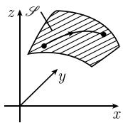

##### 1.7.7 黎曼曲面测度

黎曼(Riemann, 1826—1866) 认为, 在曲线坐标下由弧长可以直接得到曲面的面积和区域的体积.

令 $\mathcal{D}$ 为 $\mathbb{R}^m$ 中的区域. 参数表示

$$
\boxed {\boldsymbol {x} = \boldsymbol {x} (\boldsymbol {u}), \quad \boldsymbol {u} \in \mathcal {D}}
$$

确定了 $R^{N}$ 中的一个 m 维曲面, 其中 $\boldsymbol{u} = (u_{1}, \cdots, u_{m})$ , $\boldsymbol{x} = (x_{1}, \cdots, x_{N})$ (参看图 1.75, 那里 $u_{1} = u, u_{2} = v, x_{1} = x, x_{2} = y, x_{3} = z$ ).

定义 对 $\mathbb{R}^N$ 中的曲线 $x = x(t)$ , 其中 $\alpha \leqslant t \leqslant \beta$ , 曲线上参数值分别为 $t = \alpha, t = \tau$ 的两点之间的弧长为

$$
\boxed {S (\tau) = \int_ {\alpha} ^ {\tau} \left(\sum_ {j = 1} ^ {N} x _ {j} ^ {\prime} (t) ^ {2}\right) ^ {1 / 2} \mathrm{d} t.}
$$

1.6.9 中给出了这个定义的动机.

定理 参数域 $\mathcal{D}$ 中的每条曲线 $u = u(t)$ 对应着曲面元素 $\mathcal{S}$ 上的曲线

$$
\boldsymbol {x} = \boldsymbol {x} (\boldsymbol {u} (t)),
$$

它的弧长满足微分方程:

$$
\boxed {\left(\frac {\mathrm{d} s (t)}{\mathrm{d} t}\right) ^ {2} = \sum_ {j, k = 1} ^ {m} g _ {j k} (\boldsymbol {u} (t)) \frac {\mathrm{d} u _ {j} (t)}{\mathrm{d} t} \frac {\mathrm{d} u _ {k} (t)}{\mathrm{d} t}.}\tag{1.153}
$$

称

$$
g _ {j k} (u) := \sum_ {n = 1} ^ {N} \frac {\partial x _ {n} (u)}{\partial u _ {j}} \frac {\partial x _ {n} (u)}{\partial u _ {k}}
$$

为度量张量的分量. 可以把 (1.153) 符号式地记作

$$
\boxed {\mathrm{d} s ^ {2} = g _ {j k} \mathrm{d} u _ {j} \mathrm{d} u _ {k}.}
$$

这对应着近似式 $(\Delta s)^{2}=g_{jk}\Delta u_{j}\Delta u_{k}$

证明：令 $x_{j}(t) = x_{j}(u(t))$ ，则有关系式

$$
s ^ {\prime} (t) ^ {2} = \sum_ {n = 1} ^ {N} x _ {n} ^ {\prime} (t) x _ {n} ^ {\prime} (t),
$$

由链式法则得 $x_{n}^{\prime}(t)=\sum_{j=1}^{m}\frac{\partial x_{n}}{\partial u_{j}}\frac{\mathrm{d}u_{j}}{\mathrm{d}t}.$

体积形式 令 $g := \det(g_{jk})$ ，并定义曲面 F 的体积形式为

$$
\boxed {\mu := \sqrt {g} \mathrm{d} u _ {1} \wedge \dots \wedge \mathrm{d} u _ {m}.}
$$

曲面积分 定义

$$
\boxed {\int_ {\mathcal {F}} \varrho \mathrm{d} F := \int_ {\mathcal {F}} \varrho \mu .}
$$

在经典符号里, 这对应着公式:

$$
\boxed {\int_ {\mathscr {F}} \varrho \mathrm{d} F = \int_ {\mathscr {D}} \varrho \sqrt {g} \mathrm{d} u _ {1} \mathrm{d} u _ {2} \dots \mathrm{d} u _ {m}.}
$$

物理解释 如果把 $\varrho$ 看成质量密度 (或电量密度), 那么 $\int_{\mathcal{F}} \varrho \mathrm{d}F$ 等于 $\mathcal{F}$ 上的质量 (或电量) 总和. 当 $\varrho = 1$ 时, $\int_{\mathcal{F}} \varrho \mathrm{d}F$ 等于 $\mathcal{F}$ 的曲面测度. 应用到 $\mathbb{R}^3$ 中的曲面 给定 $\mathbb{R}^3$ 中的曲面 $\mathcal{F}$ , 它在笛卡儿坐标 $x, y, z$ 中的参数表示为

$$
x = x (u, v), \quad y = y (u, v), \quad z = z (u, v), \quad (u, v) \in \mathscr {D}
$$

(图 1.75). 那么有

$$
\boxed {\mathrm{d} s ^ {2} = E \mathrm{d} u ^ {2} + 2 F \mathrm{d} u \mathrm{d} v + G \mathrm{d} v ^ {2},}
$$

其中

$$
\begin{array}{l} E := \boldsymbol {r} _ {u} ^ {2} = x _ {u} ^ {2} + y _ {u} ^ {2} + z _ {u} ^ {2}, \quad G := \boldsymbol {r} _ {v} ^ {2} = x _ {v} ^ {2} + y _ {v} ^ {2} + z _ {v} ^ {2}, \\ F := \boldsymbol {r} _ {u} \boldsymbol {r} _ {v} = x _ {u} x _ {v} + y _ {u} y _ {v} + z _ {u} z _ {v}, \end{array}
$$

因此 $g = EG - F^2$ 体积形式为 $\mu = \sqrt{EG - F^2}\mathrm{d}u\wedge \mathrm{d}v$ ，曲面积分有形式

$$
\boxed {\int_ {\mathcal {F}} \varrho \mathrm{d} F = \int_ {\mathcal {F}} \varrho \mu = \int_ {\mathcal {D}} \varrho \sqrt {E G - F ^ {2} \mathrm{d} u \mathrm{d} v}.}
$$

  
图 1.75 某域中的弧长

推广到黎曼流形 见 [212].
