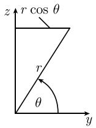

##### 1.7.9 曲线坐标

用 i,j,k 表示笛卡儿坐标系 $(x,y,z)$ 中沿坐标轴方向的单位向量. 令 $r = xi + yj + zk$ (图 1.70(a)).

1.7.9.1 极坐标

坐标变换(图 1.76)

$$
\boxed {x = r \cos \varphi , \quad y = r \sin \varphi , \quad - \pi <   \varphi \leqslant \pi , \quad r \geqslant 0.}
$$

点 P 处的自然基向量 $e_{r}, e_{\varphi}$

$$
\boldsymbol {e} _ {r} = \boldsymbol {r} _ {r} = x _ {r} \boldsymbol {i} + y _ {r} \boldsymbol {j} = \cos \varphi \boldsymbol {i} + \sin \varphi \boldsymbol {j},
$$

$$
\pmb {e} _ {\varphi} = \pmb {r} _ {\varphi} = x _ {\varphi} \pmb {i} + y _ {\varphi} \pmb {j} = - r \sin \varphi \pmb {i} + r \cos \varphi \pmb {j}.
$$

1.7.9.2 柱面坐标

坐标变换

$$
\boxed {x = r \cos \varphi , \quad y = r \sin \varphi , \quad z = z, \quad - \pi <   \varphi \leqslant \pi , \quad r \geqslant 0.}
$$

点 P 处的自然基向量 $e_{r}, e_{\varphi}, e_{z}$

$$
\begin{array}{l} \boldsymbol {e} _ {r} = \boldsymbol {r} _ {r} = x _ {r} \boldsymbol {i} + y _ {r} \boldsymbol {j} = \cos \varphi \boldsymbol {i} + \sin \varphi \boldsymbol {j}, \\ \boldsymbol {e} _ {\varphi} = \boldsymbol {r} _ {\varphi} = x _ {\varphi} \boldsymbol {i} + y _ {\varphi} \boldsymbol {j} = - r \sin \varphi \boldsymbol {i} + r \cos \varphi \boldsymbol {j}, \\ \boldsymbol {e} _ {z} = \boldsymbol {r} _ {z} = \boldsymbol {k}. \end{array}
$$

坐标线

(i) r = 变量, $\varphi =$ 常数, z = 常数: 垂直于 z 轴的射线.

(ii) $\varphi=$ 变量, r= 常数, z= 常数: 由 r= 常数确定的柱面上的大圆.

(iii) z = 变量, r = 常数, $\phi =$ 常数: 平行于 z 轴的直线.

过每个不是原点的点 P, 恰有三条坐标线, 它们的切向量为 $e_{r}, e_{\varphi}, e_{z}$ , 且两两垂直 (图 1.77).

  
图 1.76 极坐标

  
图 1.77 柱面坐标

向量 v 在点 P 处的分解

$$
\pmb {v} = v _ {1} \pmb {e} _ {r} + v _ {2} \pmb {e} _ {\varphi} + v _ {3} \pmb {e} _ {z}.
$$

我们称 $v_{1}, v_{2}, v_{3}$ 为柱面坐标下向量 v 在点 P 处的自然分量.

弧长元素 $\mathrm{ds}^2 = \mathrm{dr}^2 +r^2\mathrm{d}\varphi^2 +\mathrm{dz}^2.$

体积形式 $\mu := r\mathrm{d}r \wedge \mathrm{d}\varphi \wedge \mathrm{d}z = \mathrm{d}x \wedge \mathrm{d}y \wedge \mathrm{d}z.$

体积积分

$$
\boxed {\int \varrho \mu = \int \varrho r \mathrm{d} r \mathrm{d} \varphi \mathrm{d} z = \int \varrho \mathrm{d} x \mathrm{d} y \mathrm{d} z.}
$$

这个公式对应着代换法则.

半径固定的圆柱面 对于给定半径 r = 常数的圆柱面, 它的弧长公式为

$$
\mathrm{d} s ^ {2} = r ^ {2} \mathrm{d} \varphi^ {2} + \mathrm{d} z ^ {2},
$$

体积形式为 $\mu = r\mathrm{d}\varphi \wedge \mathrm{d}z,$ 面积积分为

$$
\boxed {\int \varrho \mathrm{d} F = \int \varrho \mu = \int \varrho r \mathrm{d} \varphi \mathrm{d} z.}
$$

例：半径为 r，高为 h 的圆柱面的曲面面积（不含上、下底——校者）是下面的积分值：

$$
\int_ {z = 0} ^ {h} \left(\int_ {\varphi = - \pi} ^ {\pi} r \mathrm{d} \varphi\right) \mathrm{d} z = 2 \pi r h.
$$

1.7.9.3 球面坐标

坐标变换

$$
\boxed {x = r \cos \varphi \cos \theta , \quad y = r \sin \varphi \cos \theta , \quad z = r \sin \theta ,}
$$

其中 $-\pi < \varphi \leqslant \pi, -\frac{\pi}{2} \leqslant \theta \leqslant \frac{\pi}{2}$ , 以及 $r \geqslant 0$ .

在点 $P$ 处的自然基向量 $\boldsymbol{e}_{\varphi},\boldsymbol{e}_{\theta},\boldsymbol{e}_r$

$$
\boldsymbol {e} _ {\varphi} = \boldsymbol {r} _ {\varphi} = - r \sin \varphi \cos \theta \boldsymbol {i} + r \cos \varphi \cos \theta \boldsymbol {j}.
$$

$$
\boldsymbol {e} _ {\theta} = \boldsymbol {r} _ {\theta} = - r \cos \varphi \sin \theta \boldsymbol {i} - r \sin \varphi \sin \theta \boldsymbol {j} + r \cos \theta \boldsymbol {k},
$$

$$
\pmb {e} _ {r} = \pmb {r} _ {r} = \cos \varphi \cos \theta \pmb {i} + \sin \varphi \cos \theta \pmb {j} + \sin \theta \pmb {k},
$$

r= 常数的曲面是中心在原点, 半径为 r 的球面的表面 $S_{r}$ .

坐标线

(i) $\varphi=$ 变量, r= 常数, $\theta=$ 常数: 纬度为 $\theta$ 的 $S_{r}$ 上的大圆.

(ii) $\theta=$ 变量, r= 常数, $\varphi=$ 常数: 经度为 $\varphi$ 的 $S_{r}$ 上的大圆的一半.

(iii) r= 变量, $\varphi=$ 常数, $\theta=$ 常数: 从原点向外射出的射线.

过每个不是原点的点 P, 恰有三条坐标线; 它们有两两垂直的切向量 $e_{\varphi}, e_{\theta}, e_{r}$ (图 1.78).

  
(a)

  
(b)  
图 1.78 球面坐标

向量 $v$ 在点 $P$ 处的分解

$$
\pmb {V} = v _ {1} \pmb {e} _ {\varphi} + v _ {2} \pmb {e} _ {\theta} + v _ {3} \pmb {e} _ {r}.
$$

称 $v_{1}, v_{2}, v_{3}$ 为向量 v 在球面坐标下点 P 处的自然分量.

弧长元素 $\mathrm{ds}^2 = r^2\cos^2\theta \mathrm{d}\varphi^2 +r^2\mathrm{d}\theta^2 +\mathrm{d}r^2.$

体积形式 $\mu := r^{2} \cos \theta \, d\varphi \wedge d\theta \wedge dr = dx \wedge dy \wedge dz.$

体积积分

$$
\boxed {\int \rho \mu = \int \rho r ^ {2} \cos \theta \mathrm{d} \varphi \mathrm{d} \theta \mathrm{d} r = \int \rho \mathrm{d} x \mathrm{d} y \mathrm{d} z.}
$$

这个公式再次对应着代换法则.

球面 在 $S_{r}$ 上弧长公式为

$$
\mathrm{d} S ^ {2} = r ^ {2} \cos^ {2} \theta \mathrm{d} \varphi^ {2} + r ^ {2} \mathrm{d} \theta^ {2},
$$

其中体积形式为 $\mu = r^{2} \cos \theta d\varphi \wedge d\theta$ ，曲面积分是

$$
\boxed {\int \rho \mathrm{d} F = \int \rho u = \int \rho r ^ {2} \cos \theta \mathrm{d} \varphi \mathrm{d} \theta .}
$$

例：半径为 r 的球面面积 F 是下面的积分值：

$$
F = \int_ {\theta = - \frac {\pi}{2}} ^ {\frac {\pi}{2}} \int_ {\varphi = - \pi} ^ {\pi} r ^ {2} \cos \theta \mathrm{d} \varphi \mathrm{d} \theta = 2 \pi r ^ {2} \int_ {- \frac {\pi}{2}} ^ {\frac {\pi}{2}} \cos \theta \mathrm{d} \theta = 4 \pi r ^ {2}.
$$

表 1.2 曲线坐标

<table><tr><td></td><td>极坐标</td><td>柱面坐标</td><td>球面坐标</td></tr><tr><td>弧长元素  $\mathrm{d}s^{2}$ </td><td> $\mathrm{d}r^{2} + r^{2}\mathrm{d}\varphi^{2}$ </td><td> $\mathrm{d}r^{2} + r^{2}\mathrm{d}\varphi^{2} + \mathrm{d}z^{2}$ </td><td> $\mathrm{d}r^{2} + r^{2}\mathrm{d}\theta^{2} + r^{2}\cos^{2}\theta\mathrm{d}\varphi^{2}$ </td></tr><tr><td>特殊体积元素  $v$ </td><td></td><td> $r\mathrm{d}\varphi\mathrm{d}z\mathrm{d}r$ </td><td> $r^{2}\cos\theta\mathrm{d}\varphi\mathrm{d}\theta\mathrm{d}r$ </td></tr><tr><td>曲面元素</td><td> $r\mathrm{d}r\mathrm{d}\varphi(\text{平面})$ </td><td> $r\mathrm{d}\varphi\mathrm{d}z(\text{半径为 } r \text{ 的圆柱面})$ </td><td> $r^{2}\cos\theta\mathrm{d}\varphi\mathrm{d}\theta(\text{半径为 } r \text{ 的球面})$ </td></tr></table>
