#### 1.8 向量代数

标量、向量和仿射向量 值为实数的量称为标量(如质量、电荷、温度、功、能量、势). 另一方面, 给一个标量加上方向就是移动向量(如速度、加速度、力、电场或磁场力). 在物理学中, 向量的基 (起点) 十分重要, 它导出 (基) 向量的概念. 如果与起点无关, 那么就是仿射向量.

向量的定义 给定点 O; 从 O 开始的向量 F 是起点在点 O 的箭头 (图 1.81). 箭头的长度记作 $|F|$ . 如果 P 是箭头的终点, 也可记作 $F = \overrightarrow{OP}$ . 向量 $0 := \overrightarrow{OO}$ 称为在点 O 处的零向量. 单位长度的向量称为单位向量.

物理解释 可以把 F 看成作用在点 O 上的一个力.

##### 1.8.1 向量的线性组合

向量乘以标量的定义(图 1.81) 令 F 是起点为点 O 的一个向量, $\alpha$ 是一个实数.

(i) -F 是基为点 O 的向量, 它与 F 有相同的长度, 但是方向与 F 相反.

(ii) 当 $\alpha > 0$ 时, $\alpha F$ 仍然是以点 O 为基的向量, 与 F 同方向, 长度等于 $\alpha |F|$ .

(iii) 当 $\alpha < 0$ 时, 令 $\alpha F := |\alpha|(-F)$ ; 当 $\alpha = 0$ 时, 令 $\alpha F := 0$ .

向量加法的定义 令 $F_{1}$ 和 $F_{2}$ 为两个向量, 基都在点 O; 定义和

$$
\boxed {\boldsymbol {F} _ {1} + \boldsymbol {F} _ {2}}
$$

为以点 $O$ 为基的向量, 它为如图1.82所示由 $\pmb{F}_{1}$ 和 $\pmb{F}_{2}$ 构成的平行四边形的对角线.

物理解释 如果 $F_{1}$ 和 $F_{2}$ 是作用在点 O 的两个力, 那么 $F_{1} + F_{2}$ 为作用在点 O 的合力 (力的平行四边形法则).

两个向量 a, b 的减法 b - a 定义为 $b + (-a)$ . 我们有 $a + (b - a) = b$ (图 1.83).

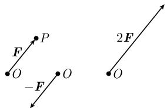  
图1.81

  
图1.82

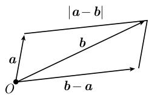  
图1.83

基本定律 令 a, b, c 是以点 O 为基的向量, $\alpha$ , $\beta$ 为实数, 那么

$$
\boxed { \begin{array}{l} \boldsymbol {a} + \boldsymbol {b} = \boldsymbol {b} + \boldsymbol {a}, (\boldsymbol {a} + \boldsymbol {b}) + \boldsymbol {c} = \boldsymbol {a} + (\boldsymbol {b} + \boldsymbol {c}), \\ \alpha (\beta \boldsymbol {a}) = (\alpha \beta) \boldsymbol {a}, (\alpha + \beta) \boldsymbol {a} = \alpha \boldsymbol {a} + \beta \boldsymbol {a}, \alpha (\boldsymbol {a} + \boldsymbol {b}) = \alpha \boldsymbol {a} + \alpha \boldsymbol {b}. \end{array} }\tag{1.156}
$$

称 $\alpha a + \beta b$ 为向量 $a, b$ 的线性组合. 而且有

$$
\begin{array}{l} {{| \pmb {a} | = 0 \quad \text {当且仅当} \quad \pmb {a} = \pmb {0};}} \\ {{| \alpha \pmb {a} | = | \alpha | | \pmb {a} |;}} \\ {{| | \pmb {a} | - | \pmb {b} | | \leqslant | \pmb {a} \pm \pmb {b} | \leqslant | \pmb {a} | + | \pmb {b} |.}} \end{array}\tag{1.157}
$$

我们用记号 $V(O)$ 表示基在点 $O$ 的所有向量的集合. 用现代数学语言来说, (1.156) 的意思是, $V(O)$ 是一个实向量空间 (参看 2.3.2). 那么, 方程 (1.157) 蕴涵着 $V(O)$ 是赋范向量空间 (参看 [212]). 距离函数

$$
d (\boldsymbol {a}, \boldsymbol {b}) := | \boldsymbol {b} - \boldsymbol {a} |\tag{1.158}
$$

赋予 $V(O)$ 度量空间的结构. 这里 $|b-a|$ 是向量 b, a 的终点之间的距离 (图 1.83). 线性无关 $V(O)$ 中的向量 $F_{1}, \cdots, F_{r}$ 称为线性无关的, 如果由方程

$$
\alpha_ {1} \boldsymbol {F} _ {1} + \dots + \alpha_ {r} \boldsymbol {F} _ {r} = \mathbf {0}
$$

可推出 $\alpha_{1}=\cdots=\alpha_{r}=0,$ 其中 $\alpha_{1},\cdots,\alpha_{r}$ 为实数.

例：(i) $V(O)$ 中两个非零向量线性无关, 当且仅当, 它们不位于同一条直线上, 即它们不共线.

(ii) $V(O)$ 中三个非零向量线性无关, 当且仅当, 它们不在同一平面上, 即不共面.

##### 1.8.2 坐标系

$V(O)$ 中线性无关向量的最大个数是3. 因此可以说线性空间 $V(O)$ 的维数是3.

基 如果 $e_{1}, e_{2}, e_{3}$ 是 $V(O)$ 中三个线性无关的向量, 那么 $V(O)$ 中的任意向量 r 可以唯一表示成

$$
\boxed {\boldsymbol {r} = x _ {1} \boldsymbol {e} _ {1} + x _ {2} \boldsymbol {e} _ {2} + x _ {3} \boldsymbol {e} _ {3}.}
$$

实数 $x_{1}, x_{2}, x_{3}$ 称为 $\pmb{r}$ 关于基 $e_1, e_2, e_3$ 的分量. 同时 $x_{1}, x_{2}, x_{3}$ 也是 $\pmb{r}$ 的终点 $P$ 的坐标 (图1.84).

笛卡儿坐标系由三个单位长度的向量 i, j, k 所给出, 它们相互垂直, 并且符合右手法则, 即它们就像右手的拇指、食指与中指的关系一样定向. 那么 $V(O)$ 中的每个向量 r 有如下唯一表示:

$$
\boxed {\boldsymbol {r} = x \boldsymbol {i} + y \boldsymbol {j} + z \boldsymbol {k},}
$$

其中 x, y, z 称为 r 的终点 P 的笛卡儿坐标(图 1.85). 另外, 有

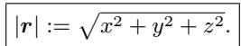

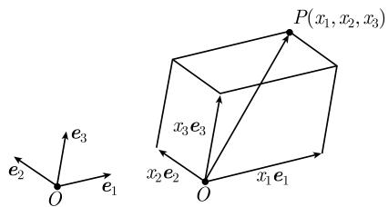  
图1.84 一组坐标系

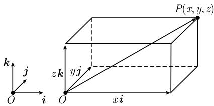  
图 1.85 笛卡儿坐标系

平面中相应的情况见图 1.86.

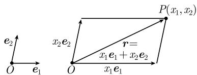  
(a) 斜坐标系

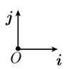

  
(b) 笛卡儿坐标系  
图 1.86 向量的长度

自由向量 起点在同一个点或不同点的两个向量 a 和 c 称为等价的, 如果它们有相同的方向和长度. 记作

$$
\pmb {a} \sim \pmb {c}
$$

(图 1.87). 另外, 用 [a] 表示向量 a 的等价类, 即, 所有等价于 a 的向量 c 的集合. 等价类 [a] 的所有元素称为 a 的代表. 每个这样的等价类 [a] 称为一个自由向量.

几何解释 自由向量 $[a]$ 表示空间中的平移. 每个代表 $c = \overrightarrow{QP}$ 表明, 在平移作用下点 $Q$ 映为 $P$ (图1.87).

  
图1.87

自由向量的和 定义

$$
[ \boldsymbol {a} ] + [ \boldsymbol {b} ] := [ \boldsymbol {a} + \boldsymbol {b} ].
$$

它表示自由向量以分量方式相加, 并且这个运算与代表的选取无关. 类似地, 定义

$$
\alpha [ \boldsymbol {a} ] := [ \alpha \boldsymbol {a} ].
$$

约定 为了简化记号, 把 $a \sim c$ 记作 $a = c$ , 把 $[a] + [b]$ (相应地, $\alpha[a]$ ) 记作 $a + b$ (相应地, $\alpha a$ ). 这相应于向量的运算, 如果它们有相同的方向和长度, 就把它们看成是相等的. 下文中, 我们将不再说到自由向量, 而总是论及向量.

例：平移两个向量 a, b, 使它们有共同的基点, 然后由上面所描述的平行四边形法则进行相加, 就得到了两个向量的和 $a + b$ (图 1.88). 同样可得 $a + b + c$ (图 1.89).

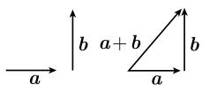

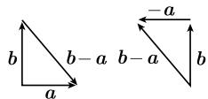  
图 1.88 向量的和与差

  
图1.89

  
图1.90

太阳的引力 如果太阳在空间的一点 S 处的质量为 M，并且在点 P 处存在质量为 m 的一个行星，那么太阳作用在这个行星上的引力是

$$
\pmb {F} (P) = \frac {G m M (\pmb {r} _ {\mathrm{cm}} - \pmb {r})}{| \pmb {r} _ {\mathrm{cm}} - \pmb {r} | ^ {3}}\tag{1.159}
$$

其中 $r := \overrightarrow{OP}, r_{cm} := \overrightarrow{OS}, G$ 表示引力常量 (图 1.90).

##### 1.8.3 向量的乘法

标量积的定义 两个向量 a, b 的标量积, 记作 ab, 定义为数

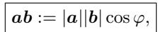

其中 $\varphi$ 是两个向量 a, b 之间的夹角, 它如此选取, 以使 $0 \leqslant \varphi \leqslant \pi$ (图 1.91).

正交性 两个向量 a, b 称为正交的, $^{1)}$ 如果

$$
\boxed {a b = 0.}
$$

如果 $a \neq 0$ ，且 $b \neq 0$ ，那么当且仅当 $\varphi = \frac{\pi}{2}$ 时，这个条件成立.
约定零向量 0 垂直于所有向量.

  
图1.91

向量积的定义 两个向量 a, b 的向量积, 记作 $a \times b$ , 定义为长为

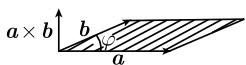  
图1.92

的一个向量 (这个量即为由向量 a, b 生成的平行四边形的面积, 参看图 1.92), 它垂直于 a, 也垂直于 b, 并且三个向量 a, b, $a \times b$ 以这个次序形成一个右手系, 如果 $a \neq 0, b \neq 0$ .

法则 对任意向量 a, b, c, 及任意实数 $\alpha$ , 我们有如下法则:

$$
\begin{array}{c c} \hline \boldsymbol {a b} = \boldsymbol {b a}, & \boldsymbol {a} \times \boldsymbol {b} = - (\boldsymbol {b} \times \boldsymbol {a}), \\ \alpha (\boldsymbol {a b}) = (\alpha \boldsymbol {a}) \boldsymbol {b}, & \alpha (\boldsymbol {a} \times \boldsymbol {b}) = (\alpha \boldsymbol {a}) \times \boldsymbol {b}, \\ \boldsymbol {a} (\boldsymbol {b} + \boldsymbol {c}) = \boldsymbol {a b} + \boldsymbol {a c}, & \boldsymbol {a} \times (\boldsymbol {b} + \boldsymbol {c}) = (\boldsymbol {a} \times \boldsymbol {b}) + (\boldsymbol {a} \times \boldsymbol {c}), \\ \boldsymbol {a} ^ {2} := \boldsymbol {a a} = | \boldsymbol {a} | ^ {2}, & \boldsymbol {a} \times \boldsymbol {a} = \boldsymbol {0}. \\ \hline \end{array}
$$

而且, 向量积有如下性质:

(i) $a \times b = 0$ , 当且仅当, a, b 有一个为零向量, 或 a, b 平行或反平行.

(ii) $a \times b = 0$ , 当且仅当, a, b 线性相关.

(iii) 向量积不满足交换律, 即, 当 $a \times b \neq 0$ 时, $a \times b \neq b \times a$ .

几个向量的乘积

展开法则：

$$
\boldsymbol {a} \times (\boldsymbol {b} \times \boldsymbol {c}) = \boldsymbol {b} (\boldsymbol {a c}) - \boldsymbol {c} (\boldsymbol {a b}).
$$

拉格朗日(Lagrange)等式:

$$
(\boldsymbol {a} \times \boldsymbol {b}) (\boldsymbol {c} \times \boldsymbol {d}) = (\boldsymbol {a c}) (\boldsymbol {b d}) - (\boldsymbol {b c}) (\boldsymbol {a d}).
$$

三重积 定义为

$$
(a b c) := (a \times b) c.
$$

a, b, c 置换后, 三重积 (abc) 要乘以置换的符号, 即

$$
(a b c) = (b c a) = (c a b) = - (a c b) = - (b a c) = - (a c b).
$$

从几何上来说, 三重积 abc 是由 a, b, c 张成的平行六面体的体积 (图 1.93). 而且, 有

$$
(a b c) (e f g) = \left| \begin{array}{c c c} a e & a f & a g \\ b e & b f & b g \\ c e & c f & c g \end{array} \right|.
$$

三个向量 a, b, c 是线性无关的, 当且仅当, 满足下面两个条件之一:

(a) $(abc)\neq0.$

(b)

$$
\left| \begin{array}{c c c} a a & a b & a c \\ b a & b b & b c \\ c a & c b & c c \end{array} \right| \neq 0 (\text {格拉姆行列式}).
$$

笛卡儿坐标系下的表示 用笛卡儿坐标表示向量为

$$
\boldsymbol {a} = a _ {1} \boldsymbol {i} + a _ {2} \boldsymbol {j} + a _ {3} \boldsymbol {k}, \boldsymbol {b} = b _ {1} \boldsymbol {i} + b _ {2} \boldsymbol {j} + b _ {3} \boldsymbol {k}, \boldsymbol {c} = c _ {1} \boldsymbol {i} + c _ {2} \boldsymbol {j} + c _ {3} \boldsymbol {k},
$$

则上述乘积可表示为

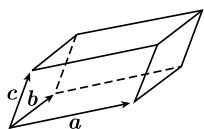  
图1.93

$$
\begin{array}{l} \boldsymbol {a b} = a _ {1} b _ {1} + a _ {2} b _ {2} + a _ {3} b _ {3}, \\ \boldsymbol {a \times b} = \left| \begin{array}{c c c} \boldsymbol {i} & \boldsymbol {j} & \boldsymbol {k} \\ a _ {1} & a _ {2} & a _ {3} \\ b _ {1} & b _ {2} & b _ {3} \end{array} \right| = (a _ {2} b _ {3} - a _ {3} b _ {2}) \boldsymbol {i} + (a _ {3} b _ {1} - a _ {1} b _ {3}) \boldsymbol {j} + (a _ {1} b _ {2} - a _ {2} b _ {1}) \boldsymbol {k}, \\ (\boldsymbol {a b c}) = \left| \begin{array}{c c c} a _ {1} & a _ {2} & a _ {3} \\ b _ {1} & b _ {2} & b _ {3} \\ c _ {1} & c _ {2} & c _ {3} \end{array} \right|. \end{array}
$$

一般坐标系下的表示 设 $e_1, e_2, e_3$ 是任意线性无关向量, 那么称下面三个向量构成的集合为基 $e_1, e_2, e_3$ 的对偶基:

$$
e ^ {1} := \frac {\boldsymbol {e} _ {2} \times \boldsymbol {e} _ {3}}{\left(\boldsymbol {e} _ {1} \boldsymbol {e} _ {2} \boldsymbol {e} _ {3}\right)}, \quad e ^ {2} := \frac {\boldsymbol {e} _ {3} \times \boldsymbol {e} _ {1}}{\left(\boldsymbol {e} _ {1} \boldsymbol {e} _ {2} \boldsymbol {e} _ {3}\right)}, \quad e ^ {3} := \frac {\boldsymbol {e} _ {1} \times \boldsymbol {e} _ {2}}{\left(\boldsymbol {e} _ {1} \boldsymbol {e} _ {2} \boldsymbol {e} _ {3}\right)}.
$$

每个向量 a 有唯一分解式:

$$
\pmb {a} = a ^ {1} \pmb {e} _ {1} + a ^ {2} \pmb {e} _ {2} + a ^ {3} \pmb {e} _ {3} \quad \text {及} \quad \pmb {a} = a _ {1} \pmb {e} ^ {1} + a _ {2} \pmb {e} ^ {2} + a _ {3} \pmb {e} ^ {3}.
$$

称 $a^1, a^2, a^3$ 为 $\pmb{a}$ 的反变坐标, $a_1, a_2, a_3$ 为 $\pmb{a}$ 的共变坐标, 则有

$$
\boldsymbol {a} \boldsymbol {b} = a _ {1} b ^ {1} + a _ {2} b ^ {2} + a _ {3} b ^ {3},
$$

$$
\begin{array}{l} \boldsymbol {a} \times \boldsymbol {b} = (e _ {1} e _ {2} e _ {3}) \left| \begin{array}{c c c} \boldsymbol {e} ^ {1} & \boldsymbol {e} ^ {2} & \boldsymbol {e} ^ {3} \\ a ^ {1} & a ^ {2} & a ^ {3} \\ b ^ {1} & b ^ {2} & b ^ {3} \end{array} \right|, \\ (\boldsymbol {a b c}) = (e _ {1} e _ {2} e _ {3}) \left| \begin{array}{c c c} a ^ {1} & a ^ {2} & a ^ {3} \\ b ^ {1} & b ^ {2} & b ^ {3} \\ c ^ {1} & c ^ {2} & c ^ {3} \end{array} \right|. \end{array}
$$

在笛卡儿坐标系中, 有

$$
\boldsymbol {i} = \boldsymbol {e} _ {1} = \boldsymbol {e} ^ {1}, \quad \boldsymbol {j} = \boldsymbol {e} _ {2} = \boldsymbol {e} ^ {2}, \quad \boldsymbol {k} = \boldsymbol {e} _ {3} = \boldsymbol {e} ^ {3}, \quad a _ {j} = a ^ {j}, \quad j = 1, 2, 3.
$$

特别地, 在这个情形反变坐标与共变坐标相等.

向量代数在几何学中的应用 见 3.3.
