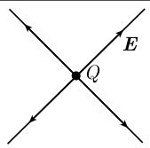
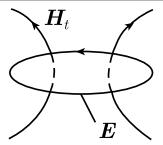
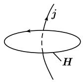
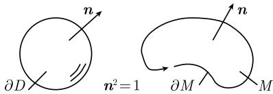

##### 1.9.10 对电磁学中麦克斯韦方程的应用

真空中电荷与电流的相互影响的麦克斯韦 (Maxwell) 方程可见表 1.6, 其中 $\varepsilon_{0}$ 表示介电常量, $\mu_{0}$ 表示真空的透过性常量.

表 1.6 国际度量单位下的麦克斯韦方程 ( $D = \varepsilon_{0}E, B = \mu_{0}H$ )

<table><tr><td>方程</td><td colspan="2">物理解释</td></tr><tr><td> $\text{div}D = \rho$ </td><td>电荷是电磁场  $E$  的源</td><td></td></tr><tr><td> $\text{curl }E = -B_{t}$ </td><td>随时间而变的磁场产生电场的偶 (感应律)</td><td></td></tr><tr><td> $\text{div}B = 0$ </td><td>不存在磁感极小</td><td></td></tr><tr><td> $\text{curl }H = j + D_{t}$ </td><td>由电流或随时间而变的电场可产生磁场的偶</td><td></td></tr><tr><td> $\rho_{t} + \text{div}j = 0$ </td><td>电荷守恒 (从其他方程即得)</td><td></td></tr></table>

这两个常量由公式

$$
c ^ {2} = \frac {1}{\varepsilon_ {0} \mu_ {0}}
$$

联系起来, 其中 $c$ 表示真空中的光速. 此外, $\rho$ 表示电荷密度, $\pmb{j}$ 表示电流密度向量. 麦克斯韦方程的积分形式 对足够规则的区域 $D$ 及曲面 $M$ (图1.106), 利用高斯积分定理与斯托克斯积分定理可得如下方程:

$$
\boxed { \begin{array}{l} \int_ {\partial D} \boldsymbol {D} \boldsymbol {n} \mathrm{d} F = \int_ {D} \rho \mathrm{d} x, \quad \int_ {\partial D} \boldsymbol {B} \boldsymbol {n} \mathrm{d} F = 0, \\ \int_ {\partial M} \boldsymbol {E} \mathrm{d} r = - \frac {\mathrm{d}}{\mathrm{d} t} \int_ {M} \boldsymbol {B} \boldsymbol {n} \mathrm{d} F, \quad \int_ {\partial M} \boldsymbol {H} \mathrm{d} r = \int_ {M} j \boldsymbol {n} \mathrm{d} F + \frac {\mathrm{d}}{\mathrm{d} t} \int_ {M} \boldsymbol {D} \boldsymbol {n} \mathrm{d} F, \\ \frac {\mathrm{d}}{\mathrm{d} t} \int_ {D} \rho \mathrm{d} x = - \int_ {\partial D} j \boldsymbol {n} \mathrm{d} F. \end{array} }
$$

  
图1.106

最后一个方程是其他方程推出来的.

历史评注 麦克斯韦方程是由 J.C. 麦克斯韦 (James Clerk Maxwell, 1831—1879) 推导出的, 并于 1865 年发表. 令人惊异的是, 这几个异常优美的方程全面地描述了电磁现象. 麦克斯韦理论的基础是法拉第 (Michael Faraday, 1791—1867) 的一个实验. 牛顿力学处理长距离下的力和运动, 而法拉第天才的物理直觉看出, 电场和磁场作用在近距离. 法拉第的这个思想现在是物理学的基础. 所有现代物理场的理论都是近距离作用力的理论, 这意味着这些理论所确定的相互作用的速度是有限的. 麦克斯韦方程组利用微分形式语言的现代方法 尽管麦克斯韦方程组简洁而优美, 但是它还不是定论. 基本问题是: 麦克斯韦方程组在哪个参照系中成立, 转换到另一参照系后, 电场 E 与磁场 H 如何转化? 这个问题由爱因斯坦发表于 1905 年的狭义相对论所解决. 麦克斯韦方程组的现代阐述应用了嘉当微分学和主纤维丛理论. 在这种阐述方式下, 麦克斯韦方程组是规范场理论的起点, 现代粒子物理的基础. [212] 对此进行了更详细的讨论.
