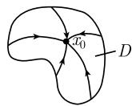

##### 1.9.11 经典向量分析与嘉当微分学的关系

嘉当微分学包含了 $R^{n}$ 中微分式的如下基本结果:

(i) 斯托克斯定理: $\int_{M} \mathrm{d}\omega = \int_{\partial M} \omega$ .

(ii) 庞加莱法则: $dd\omega = 0$ .

(iii) 庞加莱引理: 可缩区域 D 上的方程 $d\omega = b$ 有解 $\omega$ , 当且仅当 db = 0.

区域 $D$ 称为可缩的, 如果它能连续变形为一个点 $x_0 \in D$ , 即, 存在一个从 $D \times [0, 1]$ 到 $D$ 的连续映射 $H = H(x, t)$ , 使得对所有 $x \in D$ 有

$$
H (x, 0) = x, \quad H (x, 1) = x _ {0}
$$

  
图1.107

(图 1.107).

特例 经典高斯积分定理与斯托克斯积分定理是 (i) 的特例, 而 (ii) 包括特例

$$
\operatorname{divcurl} H \equiv 0, \quad \operatorname{curl} \operatorname{grad} V \equiv 0.
$$

最后, $\mathbb{R}^3$ 中的 (iii) 包括的特例是

$$
\begin{array}{l l} {\operatorname{grad} V = F,} & {\text {在} D \text {上},} \\ {\operatorname{curl} H = J,} & {\text {在} D \text {上},} \\ {\operatorname{div} D = \rho ,} & {\text {在} D \text {上}.} \end{array}
$$

[212] 对此进行了更详细的讨论.
