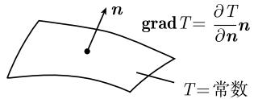

##### 1.9.2 梯度、散度和旋度

和往常一样, $U_{x},U_{xx},\cdots$ 表示偏导数.

梯度 在笛卡儿坐标系中, 原点在 O 点, 考虑函数

$$
T = T (P),
$$

其中 $P = (x, y, z)$ ，定义 T 在点 P 处的梯度为

$$
\boxed {\mathbf {g r a d} T (P) = T _ {x} (P) \boldsymbol {i} + T _ {y} (P) \boldsymbol {j} + T _ {z} (P) \boldsymbol {k}.}
$$

通常把 $T(P)$ 记作 $T(\boldsymbol{r})$ ，其中 r 是向量 $r = \overrightarrow{OP}$ .

方向导数 如果 n 是单位向量 (即, 长度为 1 的向量), 则 T 在点 P 处 (沿方向 n) 的导数定义为

$$
\frac {\partial T (P)}{\partial \boldsymbol {n}} := \lim _ {h \rightarrow 0} \frac {T (\boldsymbol {r} + h \boldsymbol {n}) - T (\boldsymbol {r})}{h}.
$$

如果 T 是在点 P 的某个邻域内的 $C^{1}$ 类函数, 则

$$
\boxed {\frac {\partial T (P)}{\partial \boldsymbol {n}} = \boldsymbol {n} (\mathbf {g r a d} T (P)).}
$$

如果 n 表示一个曲面的法向量, 则 $\frac{\partial T}{\partial n}$ 称为法向导数.

物理解释 如果 $T(P)$ 是点 P 处的温度, 则

  
图1.97

(i) 向量 $\mathbf{grad}T(P)$ 垂直于温度 T = 常量的曲面, 并指向温度递增的方向. $^{1)}$

(ii) 梯度的长度 $\left|\operatorname{grad}T(P)\right|$ 等于法向导数 $\frac{\partial T(P)}{\partial n}$ (图 1.97).

函数 $f(h) := T(\boldsymbol{r} + h\boldsymbol{n})$ 表示在过点 P 沿 n 方向的直线上的温度. 我们有

$$
\frac {\partial T (P)}{\partial \pmb {n}} = f ^ {\prime} (0).
$$

标量场 在物理学中, 实值函数也称为标量函数(如温度标量场).

散度和旋度 假设给定向量场

$$
\boldsymbol {F} = \boldsymbol {F} (P),
$$

即每个点 $P$ 对应一个向量 $\pmb{F}(P)$ . 例如 $\pmb{F}(P)$ 可以是一个作用在点 $P$ 处的力. 通常把 $\pmb{F}(P)$ 记作 $\pmb{F}(\pmb{r})$ , 这里 $\pmb{r} = \overrightarrow{OP}$ . 在笛卡儿坐标系中有表达式

$$
\boldsymbol {F} (P) = a (P) \boldsymbol {i} + b (P) \boldsymbol {j} + c (P) \boldsymbol {k}.
$$

定义向量场 F 在点 P 处的散度为

$$
\boxed {\operatorname{div} \boldsymbol {F} (P) := a _ {x} (P) + b _ {y} (P) + c _ {z} (P),}
$$

向量场 F 的旋度为

$$
\boxed {\operatorname{curl} \boldsymbol {F} (P) := \left(c _ {y} - b _ {z}\right) \boldsymbol {i} + \left(a _ {z} - c _ {x}\right) \boldsymbol {j} + \left(b _ {x} - a _ {y}\right) \boldsymbol {k},}
$$

其中, $c_{y}$ 表示 $c_{y}(P)$ , 诸如此类.

向量梯度 对固定的向量 v, 我们定义

$$
\boxed {(v \operatorname{grad}) F (P) := \lim _ {h \to 0} \frac {F (\boldsymbol {r} + h \boldsymbol {v}) - F (\boldsymbol {r})}{h},}
$$

其中 $r=\overrightarrow{OP}$ . 特别地, 如果 n 是单位向量, 则称

$$
\boxed {\frac {\partial \boldsymbol {F} (P)}{\partial \boldsymbol {n}} := (\boldsymbol {n} \operatorname{grad}) \boldsymbol {F} (P)}
$$

为向量场F 在点 P 处沿方向 n 的导数. 在笛卡儿坐标系里, 有

$$
(\boldsymbol {v} \operatorname{grad}) \boldsymbol {F} (P) = (\boldsymbol {v} \operatorname{grad} a (P)) \mathrm{i} + (\boldsymbol {v} \operatorname{grad} b (P)) \boldsymbol {j} + (\boldsymbol {v} \operatorname{grad} c (P)) \boldsymbol {k}.
$$

拉普拉斯算子 定义

$$
\boxed {\Delta T (P) := \operatorname{div} \mathbf {g r a d} T (P)}
$$

以及

$$
\Delta \boldsymbol {F} (P) := \operatorname{grad} \operatorname{div} \boldsymbol {F} (P) - \operatorname{curl} \operatorname{curl} \boldsymbol {F} (P).
$$

在笛卡儿坐标系里, 有

$$
\Delta T (P) = T _ {x x} (P) + T _ {y y} (P) + T _ {z z} (P),
$$

$$
\Delta \boldsymbol {F} (P) = \boldsymbol {F} _ {x x} (P) + \boldsymbol {F} _ {y y} (P) + \boldsymbol {F} _ {z z} (P).
$$

由 $F=a\boldsymbol{i}+bj+c\boldsymbol{k}$ 可得 $\Delta\boldsymbol{F}=(\Delta a)\boldsymbol{i}+(\Delta b)\boldsymbol{j}+(\Delta c)\boldsymbol{k}.$

不变性 表达式 grad T, div F, curl F, (v grad) F, $\Delta T$ , $\Delta F$ 与所选的笛卡儿坐标系无关. 在所有的笛卡儿坐标系下, 这些表达式有相同的公式. 下面的定义也有这种不变性.

在 $\mathbb{R}^3$ 的开集 $D$ 上的向量场 $\pmb {F} = \pmb {F}(P)$ 称为 $C^k$ 类的, 当且仅当在任一笛卡儿坐标系下所有分量 $a, b, c$ 是 $C^k$ 类的.

曲线坐标 在柱面坐标系和球面坐标系下, grad T, div F, curl F 的公式可见表 1.5. 利用张量分析可以给出任意曲线坐标下的相应公式 (参看 [212]).

物理解释 参看 1.9.3\~1.9.10.
