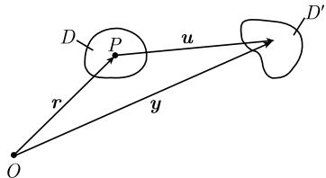

##### 1.9.3 在形变上的应用

在向量场 u 上的运算 div u 和 curl u 在描述形变时起了重要的作用. 弹性物体在力的作用下的形变为

$$
\boxed {\boldsymbol {y} (\boldsymbol {r}) = \boldsymbol {r} + \boldsymbol {u} (\boldsymbol {r}).}
$$

这里, $r := \overrightarrow{OP}$ , 并且 $\boldsymbol{y}(\boldsymbol{r})$ 是起点在 O 处的向量 (图 1.98). 为简化关系, 我们用向量 r 的终点 P 表示 r.

在形变下，向量 r 的终点被变换为 $\boldsymbol{y}(\boldsymbol{r}) = \boldsymbol{r} + \boldsymbol{u}(\boldsymbol{r})$ 的终点. 令

图1.98

$$
\boxed {\boldsymbol {\omega} := \frac {1}{2} \mathbf {c u r l}   \boldsymbol {u} (P).}
$$

我们用 A 表示过点 O, 以 $\omega$ 为方向的直线.

定理 令 $\pmb{u} = \pmb{u}(P)$ 为区域 $D\subset \mathbb{R}^3$ 中的 $C^1$ 向量场.则有：

(i) 在点 $P$ 处体积的小增量关于轴 $A$ 以一级近似旋转 $|\omega|$ 度. 此外, 它的旋转方向是主轴, 且存在一个平移.

(ii) 如果 $\pmb{u}$ 的坐标的一阶偏导数足够小, 则 $\operatorname{div} \pmb{u}(P)$ 的一级近似等于在点 $P$ 处的体积小增量的相对改变.

这就解释了向量场的“旋度”与“散度”：旋度描述了向量场的旋转 $^{1)}$ ，而散度则可以描述化学反应过程中化学物质质量的改变(参看1.9.7).

我们希望更详细地讨论这个定理. 考虑的出发点是分解式

$$
\boxed {\boldsymbol {y} (\boldsymbol {r} + \boldsymbol {h}) = \boldsymbol {r} + \boldsymbol {u} (\boldsymbol {r}) + (\boldsymbol {h} + \omega \times \boldsymbol {h}) + D (\boldsymbol {r}) \boldsymbol {h} + \boldsymbol {R},}
$$

  
图1.99

其中当 $|h| \rightarrow 0$ 时, 余项 $|R| = o(|h|)$ .

无穷小旋转 令 $T(\omega)h$ 表示起点在 $O$ 的向量, 它是 $\pmb{h}$ 关于轴 $A$ 的旋转, 转了 $\varphi := |\omega|$ 角 (图1.99). 则有

$$
T (\pmb {\omega}) \pmb {h} = \pmb {h} + \pmb {\omega} \times \pmb {h} + o (\varphi), \quad \text {当} \varphi \to 0 \text {时}.
$$

鉴于此, 用乘积 $\omega \times h$ 表示 h 的无穷小旋转.

伸缩 有起点在 P 处的三个两两垂直的单位向量 $b_{1}, b_{2}, b_{3}$ ，并且存在三个正实数 $\lambda_{1}, \lambda_{2}, \lambda_{3}$ ，使得

$$
D (\boldsymbol {r}) \boldsymbol {h} = \sum_ {j = 1} ^ {3} \lambda_ {j} (\boldsymbol {h b} _ {j}) \boldsymbol {b} _ {j}.
$$

因此有 $D(\boldsymbol{r})\boldsymbol{b}_{j} = \lambda_{j}\boldsymbol{b}_{j}, j = 1, 2, 3.$ 称 $b_{j}$ 为伸缩于点 P 处的主轴, 其中 j = 1, 2, 3. 如果我们考虑笛卡儿坐标系, 则 $\lambda_{1}, \lambda_{2}, \lambda_{3}$ 是矩阵 $(d_{jk})$ 的三个特征值, 其中

$$
d _ {j k} := \frac {1}{2} \left(\frac {\partial u _ {k}}{\partial x _ {j}} + \frac {\partial u _ {j}}{\partial x _ {k}}\right).
$$

这里, 我们有 $\boldsymbol{u} = u_{1}\boldsymbol{i} + u_{2}\boldsymbol{j} + u_{3}\boldsymbol{k}$ . 另外, 矩阵 $(d_{jk})$ 的列是主轴 $\boldsymbol{b}_{1}, \boldsymbol{b}_{2}, \boldsymbol{b}_{3}$ 的坐标.

在流体动力学和弹性力学方程上的应用 见 [212].
