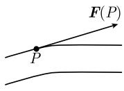
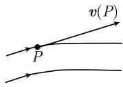

##### 1.9.4 哈密顿算子的运算\*

哈密顿算子 向量分析的许多公式可在表 1.4 中找到. 通过笛卡儿坐标系下一系列直接的计算可以验证这些公式. 然而, 应用哈密顿算子的运算就能更容易地得到相同的结果. $^{2)}$ 为此, 引入哈密顿算子如下:

$$
\nabla := i \frac {\partial}{\partial x} + j \frac {\partial}{\partial y} + k \frac {\partial}{\partial z},
$$

则有

$$
\boxed {\operatorname{grad} T = \nabla T, \quad \operatorname{div} \boldsymbol {F} = \nabla \boldsymbol {F}, \quad \operatorname{curl} \boldsymbol {F} = \nabla \times \boldsymbol {F}.}
$$

$\nabla$ 的另一个常用符号是 $\frac{\partial}{\partial r}$ .

∇ 的运算法则 (i) 借助于 $\nabla$ ，把你想要计算的表达式写作形式乘积.

(ii) 线性组合满足分配律:

$$
\nabla (\alpha X + \beta Y) = \alpha \nabla X + \beta \nabla Y,
$$

这里, X, Y 是函数或向量, $\alpha$ , $\beta$ 是实数.

(iii) 形为 $\nabla(XY)$ 的乘积记作:

$$
\nabla (X Y) = \nabla (\bar {X} Y) + \nabla (X \bar {Y}).\tag{1.161}
$$

这与 X, Y 是向量或函数无关. 横杠表示对相应的因子求导.

表 1.4 向量运算法则

梯度
gradc = 0, grad(cU) = cgradU (c = 常数),
grad(U + V) = gradU + gradV, grad(UV) = UgradV + VgradU,
grad(vw) = (v grad)w + (w grad)v + v × curl w + w × curl v,
grad(cr) = c (c = 常数),
gradU(r) = U'(r)$\frac{r}{r}$ (中心场; r = |r|
gradF(U) = F'(U) = F'(U)gradU,
$\frac{\partial U}{\partial n} = n(\text{grad}U)$ (在单位向量 n 的方向导数),
$U(r + a) = U(r) + a(\text{grad}U(r)) + \cdots$ (泰勒展开).
散度
divc = 0, div(cv) = cdivv (c, c = 常数),
div(v + w) = divv + divw, div(Uv) = Udivv + v(gradU),
div(v × w) = w(curl v) - v(curl w),
div(U(r)r) = 3U(r) + rU'(r) (中心场; r = |r|
divcurl v = 0.
旋度
curl c = 0, curl(cv) = ccurl v (c, c = 常数),
curl(v + w) = curl v + curl w, curl(Uv) = Ucurl v + (gradU) × v,
curl(v × w) = (w grad)v - (v grad)w + vdivw - wdivv,
curl(c × r) = 2c,
curl grad v = 0,
curl curl v = grad divv - Δv.
拉普拉斯算子
ΔU = divgradU,
Δv = graddivv - curl curl v.
向量梯度
2(v grad)w = curl(w × v) + grad(vw) + vdivw - wdivv
-v × curl w - w × curl v,
w(r + a) = w(r) + (a grad)w(r) + · · · (泰勒展开).

表 1.5 不同的坐标系

笛卡儿坐标系 x, y, z (图 1.86)

$\boxed{\boldsymbol{v} = a\boldsymbol{i} + b\boldsymbol{j} + c\boldsymbol{k}}$ (自然分解)

$\nabla = i\partial_x + j\partial_y + k\partial_z$ (哈密顿算子) $\left( \partial_x = \frac{\partial}{\partial x}, \cdots \right)$,

$\text{grad}U = U_x\boldsymbol{i} + U_y\boldsymbol{j} + U_z\boldsymbol{k} = \nabla U$,

$\text{div} \boldsymbol{v} = a_x + b_y + c_z = \nabla \boldsymbol{v}$,

$\text{curl} \boldsymbol{v} = \nabla \times \boldsymbol{v} = \begin{vmatrix} \boldsymbol{i} &amp; \boldsymbol{j} &amp; \boldsymbol{k} \\ \partial_x &amp; \partial_y &amp; \partial_z \\ a &amp; b &amp; c \end{vmatrix}$ $= (c_y - b_z)\boldsymbol{i} + (a_z - c_x)\boldsymbol{j} + (b_x - a_y)\boldsymbol{k}$,

$\Delta U = U_{xx} + U_{yy} + U_{zz} = (\nabla \nabla)U$,

$\Delta \boldsymbol{v} = \boldsymbol{v}_{xx} + \boldsymbol{v}_{yy} + \boldsymbol{v}_{zz} = (\nabla \nabla)\boldsymbol{v}$,

$(\boldsymbol{v}\text{ grad})\boldsymbol{w} = (\boldsymbol{v}\text{ grad}w_1)\boldsymbol{i} + (\boldsymbol{v}\text{ grad}w_2)\boldsymbol{j}$ $+ (\boldsymbol{v}\text{ grad}w_3)\boldsymbol{k}, (\boldsymbol{w} = w_1\boldsymbol{i} + w_2\boldsymbol{j} + w_3\boldsymbol{k})$.

柱面坐标系(见 1.7.9.2)

$x = r\cos\varphi, y = r\sin\varphi, z = z,$ $e_r = \cos\varphi\mathbf{i} + \sin\varphi\mathbf{j} = \boldsymbol{b}_r, e_\varphi = -r\sin\varphi\mathbf{i} + r\cos\varphi\mathbf{j} = r\boldsymbol{b}_\varphi,$ $e_z = \boldsymbol{k} = \boldsymbol{b}_z,$ $\boxed{\boldsymbol{v} = A\boldsymbol{b}_r + B\boldsymbol{b}_\varphi + C\boldsymbol{b}_z}$ (自然分解),

$A = \boldsymbol{v}\boldsymbol{b}_r, B = \boldsymbol{v}\boldsymbol{b}_\varphi, C = \boldsymbol{v}\boldsymbol{b}_z,$ $\text{grad}U = U_r\boldsymbol{b}_r + U_\varphi\boldsymbol{b}_\varphi + U_z\boldsymbol{b}_z \quad [U_r = \frac{\partial U}{\partial r}, \cdots],$ $\text{div} \boldsymbol{v} = \frac{1}{r}(rA)_r + \frac{1}{r}B_\varphi + C_z,$ $\text{curl} \boldsymbol{v} = \left[\frac{1}{r}C_\varphi - B_z\right]\boldsymbol{b}_r + (A_z - C_r)\boldsymbol{b}_\varphi$ $+ \left[\frac{1}{r}(rB)_r - \frac{1}{r}A_\varphi\right]\boldsymbol{b}_z,$ $\Delta U = \frac{1}{r}(rU_r)_r + \frac{1}{r^2}U_\varphi_\varphi + U_{zz},$

按圆柱面的对称场: $B = C = 0$.

球面坐标系(见 1.7.9.3)¹)

$x = r\cos\varphi\cos\theta, y = r\sin\varphi\cos\theta, z = r\sin\theta, -\frac{\pi}{2}\leqslant\theta\leqslant\frac{\pi}{2},$ $e_\varphi = -r\sin\varphi\cos\theta\mathbf{i} + r\cos\varphi\cos\theta\mathbf{j} = r\cos\theta\mathbf{b}_\varphi,$ $e_\theta = -r\cos\varphi\sin\theta\mathbf{i} - r\sin\varphi\sin\theta\mathbf{j} + r\cos\theta\mathbf{k} = r\mathbf{b}_\theta,$ $e_r = \cos\varphi\cos\theta\mathbf{i} + \sin\varphi\cos\theta\mathbf{j} + \sin\theta\mathbf{k} = \boldsymbol{b}_r,$ $\boxed{\boldsymbol{v} = A\boldsymbol{b}_\varphi + B\boldsymbol{b}_\theta + C\boldsymbol{b}_r}$ (自然分解),

$A = \boldsymbol{v}\boldsymbol{b}_\varphi, B = \boldsymbol{v}\boldsymbol{b}_\theta, C = \boldsymbol{v}\boldsymbol{b}_r,$ $\text{grad}U = \frac{1}{r}U_\theta b_\theta + \frac{1}{r\cos\theta}U_\varphi b_\varphi + U_r b_r,$ $\text{div} \boldsymbol{v} = \frac{1}{r^2}(r^2C)_r + \frac{1}{r\cos\theta}A_\varphi + \frac{1}{r\cos\theta}(B\cos\theta)_θ,$

球面坐标系(见 1.7.9.3) $^{1)}$

续表

$$
\begin{array}{r l} & {\mathbf {c u r l} \boldsymbol {v} = \left[ - \frac {1}{r \cos \theta} C _ {\varphi} + \frac {1}{r} (r A) _ {r} \right] \boldsymbol {b} _ {\theta} + \left[ - \frac {1}{r} (r B) _ {r} + \frac {1}{r} C _ {\theta} \right] \boldsymbol {b} _ {\varphi}} \\ & {\qquad + \frac {1}{r \cos \theta} (- (A \cos \theta) _ {\theta} + B _ {\varphi}) \boldsymbol {b} _ {r},} \\ & {\Delta U = U _ {r r} + \frac {2}{r} U _ {r} + \frac {1}{r ^ {2} \cos^ {2} \theta} U _ {\varphi \varphi} + \frac {1}{r ^ {2}} U _ {\theta \theta} + \frac {\tan \theta}{r ^ {2}} U _ {\theta},} \end{array}
$$

按球面的对称场 (中心场): A = B = 0.

(iv) 根据向量代数的法则, 按下列方式直接变换表达式 $\nabla(\bar{X}Y)$ , $\nabla(X\bar{Y})$ : 没有杠的表达式在 $\nabla$ 的左边 (有杠的式子在 $\nabla$ 的右边). 在进行这些运算时, 把 $\nabla$ 当作一个向量.

(v) 最后, 把包含 $\nabla$ 的形式乘积写为向量分析的表达式, 如

$$
U (\nabla \bar {V}) = U (\mathbf {g r a d} V), \quad \boldsymbol {v} \times (\nabla \times \bar {\boldsymbol {w}}) = \boldsymbol {v} \times \mathbf {c u r l} \boldsymbol {w} \quad \text {等},
$$

其中, 横杠被去掉了.

这个形式运算一方面把 $\nabla$ 看成向量, 另一方面是微分算子. 公式 (1.161) 就是微分的乘积公式. 对三个因子, 应用法则

$$
\nabla (X Y Z) = \nabla (\bar {X} Y Z) + \nabla (X \bar {Y} Z) + \nabla (X Y \bar {Z}).
$$

例 1: $\text{grad}(U + V) = \nabla(U + V) = \nabla U + \nabla V = \text{grad}U + \text{grad}V.$

例 2: $\text{grad}(UV) = \nabla(\bar{U}V) + \nabla(U\bar{V}) = V(\nabla\bar{U}) + U(\nabla\bar{V}) = V\text{grad}U + U\text{grad}V.$

$$
\operatorname{div} \mathbf {g r a d} U = \nabla (\nabla U) = (\nabla \nabla) U = \left(\frac {\partial^ {2}}{\partial x ^ {2}} + \frac {\partial^ {2}}{\partial y ^ {2}} + \frac {\partial^ {2}}{\partial z ^ {2}}\right) U = \Delta U.
$$

$$
\begin{array}{r l} \text {例} 4: \operatorname{div} (\pmb {v} \times \pmb {w}) & = \nabla (\bar {\pmb {v}} \times \pmb {w}) + \nabla (\pmb {v} \times \bar {\pmb {w}}) \\ & = \pmb {w} (\nabla \times \bar {\pmb {v}}) - \pmb {v} (\nabla \times \bar {\pmb {w}}) = \pmb {w} \operatorname{curl} \pmb {v} - \pmb {v} \operatorname{curl} \pmb {w}. \end{array}
$$

例 5: 在下面, 请注意展开法则

$$
\boldsymbol {b} (\boldsymbol {a c}) = (\boldsymbol {a b}) \boldsymbol {c} + \boldsymbol {a} \times (\boldsymbol {b} \times \boldsymbol {c}).\tag{1.162}
$$

我们有

$$
\begin{array}{r l} \mathbf {g r a d} (\boldsymbol {v w}) & = \nabla (\boldsymbol {v w}) = \nabla (\bar {\boldsymbol {v}} \boldsymbol {w}) + \nabla (\boldsymbol {v} \bar {\boldsymbol {w}}) \\ & = (\boldsymbol {w} \nabla) \bar {\boldsymbol {v}} + \boldsymbol {w} \times (\nabla \times \bar {\boldsymbol {v}}) + (\boldsymbol {v} \nabla) \bar {\boldsymbol {w}} + \boldsymbol {v} \times (\nabla \times \bar {\boldsymbol {w}}) \\ & = (\boldsymbol {w} \operatorname{grad}) \boldsymbol {v} + \boldsymbol {w} \times \operatorname{curl} \boldsymbol {v} + (\boldsymbol {v} \operatorname{grad}) \boldsymbol {w} + \boldsymbol {v} \times \operatorname{curl} \boldsymbol {w}. \end{array}
$$

例 6: 由展开法则 (1.162), 还可得

$$
\operatorname{curl} \operatorname{curl} \boldsymbol {v} = \nabla \times (\nabla \times \boldsymbol {v}) = \nabla (\nabla \boldsymbol {v}) - (\nabla \nabla) \boldsymbol {v} = \operatorname{graddiv} \boldsymbol {v} - \Delta \boldsymbol {v}.
$$

例 7: 由 $a(a \times b) = 0, a \times a = 0,$ 可得

$$
\boxed { \begin{array}{l} \text { divcurl }   \boldsymbol {v} = \nabla (\nabla \times \boldsymbol {v}) = 0, \\ \text { curl   grad }   U = \nabla \times (\nabla U) = \boldsymbol {0}. \end{array} }
$$

积分曲线 令 $\boldsymbol{F} = \boldsymbol{F}(P)$ 为向量场；曲线 $\boldsymbol{r} = \boldsymbol{r}(t)$ 称为积分曲线，如果它是下述微分方程的解：

$$
\boxed {\boldsymbol {r} ^ {\prime} (t) = \boldsymbol {F} (\boldsymbol {r} (t)).}
$$

在每个点 P 处, $\boldsymbol{F}(P)$ 是积分曲线的切向量.

与使用场合有关, 这样的曲线也被称为流线. 如果向量场 $\pmb{F}$ 表示力场, 则积分曲线也称为力线(图1.100(a)), 而在电磁场的情形, 积分曲线被称为流线. 此外, 如果 $\pmb{v} = \pmb{v}(P,t)$ 是向量场, 它在点 $P$ 处的值是液体流的速度, 则流体中的粒子沿 $\pmb{v}$ 的积分曲线运动; 这时, 称积分曲线为流体的流线. 这里, $\pmb{v}(P,t)$ 是在时刻 $t$ 时在点 $P$ 处的粒子的速度向量 (图1.100(b)).

  
(a)

  
(b)  
图1.100
