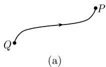
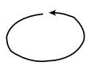

##### 1.9.5 功、势能和积分曲线

功 如果质量为 m 的一个点沿 $C^{1}$ 类路径 M: $\boldsymbol{r} = \boldsymbol{r}(t) (\alpha \leqslant t \leqslant \beta)$ 运动, 则由定义, 力场 $\boldsymbol{F} = \boldsymbol{F}(\boldsymbol{r})$ 的功为曲线积分: $^{1)}$

$$
\boxed {W := \int_ {M} \boldsymbol {F} \mathrm{d} \boldsymbol {r},}
$$

它可以用以下公式 $^{2)}$ 计算：

$$
W = \int_ {\alpha} ^ {\beta} \boldsymbol {F} (\boldsymbol {r} (t)) \boldsymbol {r} ^ {\prime} (t) \mathrm{d} t.
$$

势 它的极其重要的一个特殊情形是, 存在一个函数 U, 使得在 D 上有

1) 在一级近似里, 我们有 $W = \sum_{j=1}^{n} \pmb{F}(\pmb{r}_j) \Delta \pmb{r}_j$ (图 1.101), 即, 功 = 力 × 距离.

2) 如果令 $F = ai + bj + ck$ 和 $dr = dxi + dyj + dzk$ ，则 $\omega := F dr$ 是一次微分式。用微分式的语言来说，我们得到

$$
W = \int_ {M} \omega
$$

(见 1.7.6.3).

$$
\boxed {F = - \operatorname{grad} U.}
$$

此时 U 称为向量场 $\boldsymbol{F}=\boldsymbol{F}(\boldsymbol{r})$ 在 D 上的势, 功为

$$
\boxed {W = U (Q) - U (P),}
$$

其中 Q 为路径的起点, P 为终点 (图 1.102(a)). 也可称 U 为势能.

  
(b)  
图1.101 功 $=$ 力 $\times$ 距离  
图 1.102 功等于势能之差

例：令 $F = -mgk$ 为笛卡儿坐标系下作用在质量为 m 的石块上的重力 (g 是重力加速度)，则势能为

$$
\boxed {U = m g z.}
$$

实际上, 有 $\operatorname{grad} U = U_z k = -F$ . 如果一个石块从高为 $z > 0$ 的地方落到 $z = 0$ 的地方, 则 $W = U = mgz$ 是地球的引力场所做的功; 在落地的时候, 它转换成了热能 (和动能 —— 校者).

主定理 设 F 为 $R^{3}$ 的区域 D 中的一个 $C^{2}$ 类力场. 则下列诸条件相互等价:

(i) F 在 D 中有 $C^{1}$ 类势能.

(ii) 在 $D$ 上, $\operatorname{curl} F = 0$ .

(iii) 功 $W = \int_{M} \mathbf{F} \, \mathrm{d}\mathbf{r}$ 与路径 $M$ 无关, 即, 它只依赖于 $M$ 的起点和终点.

(iv) 对每个 $C^1$ 类闭路径 $M$ , 有 $\int_{M} \mathbf{F} \, \mathrm{d}\mathbf{r} = 0$ (图 1.102(b)).

如果 $\pmb{F}$ 的势 $U$ 在 $D$ 上存在, 则在相差一个常数因子的意义上它是唯一确定的.
