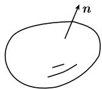

##### 1.9.7 流、守恒律与高斯积分定理

高斯定理

$$
\boxed {\int_ {D} \operatorname{div} \boldsymbol {J} \mathrm{d} x = \int_ {\partial D} \boldsymbol {J} _ {\boldsymbol {n}} \mathrm{d} F.}
$$

这里, $D$ 是 $\mathbb{R}^3$ 中的有界区域, 且有逐段光滑的边界 $^{1)}$ 及外法线单位向量 $\pmb{n}$ (图1.103).

同样, 令 J 为 $\bar{D}$ 上的 $C^{1}$ 类向量场.

体积的导数 假设 $g$ 是在点 $P$ 的一个邻域内连续的一实值函数, 则有

$$
g (P) = \lim _ {n \to \infty} \frac {\int_ {D _ {n}} g (x) \mathrm{d} x}{\mathrm{meas} D _ {n}}.
$$

(1.165)

图1.103

这里, $(D_{n})$ 是容许区域 (例如, 球) 序列, 它们都包含点 $P$ , 且当 $n \to \infty$ 时, 直径趋于零, meas $D_{n}$ 表示勒贝格测度. (1.165) 右边的表达式称为体积的导数.

质量平衡的基本方程

$$
\boxed {\rho_ {t} + \mathrm{div} \pmb {J} = F, \quad \text {在} \Omega \text {上}.}\tag{1.166}
$$

动机 方程 (1.166) 描述了如下情况. 令 D 为参考区域 $\Omega$ 的子区域, 在 $\Omega$ 中有几个能相互起化学反应的物质 $S, \cdots$ . 定义:

$A(t)$ 为在时刻 t, D 中化学物质 S 的质量,

$B(t)$ 为在时间段 $[0, t]$ 内流出 D 外的物质 S 的质量,

$C(t)$ 为在时间段 $[0, t]$ 内在 D 中由化学反应生成的物质 S 的质量.

质量守恒律推出如下方程:

$$
A (t + \Delta t) - A (t) = - (B (t + \Delta t) - B (t)) + (C (t + \Delta t) - C (t)).
$$

除以 $\Delta t$ , 并取极限 $\Delta t \to 0$ , 得

$$
A ^ {\prime} (t) = - B ^ {\prime} (t) + C ^ {\prime} (t).\tag{1.167}
$$

现在假设这些量可以用密度描述如下:

$$
A (t) = \int_ {D} \rho (x, t) \mathrm{d} x, \quad B ^ {\prime} (t) = \int_ {\partial D} \boldsymbol {J _ {n}} \mathrm{d} F, \quad C ^ {\prime} (t) = \int_ {D} F (x, t) \mathrm{d} x,
$$

其中 $x$ 为笛卡儿坐标 $x = (x_{1}, x_{2}, x_{3})$ . 在物理学中使用下列符号：

$\rho(x,t)$ 在时刻 t 时在点 x 处的质量密度 (单位体积的质量),

$J(x, t)$ 在时刻 t 时在点 x 处的质量流的通量密度向量 (单位面积与时间的质量),

$F(x, t)$ 在时刻 t 时在点 x 处产生物质的力密度 (单位体积单位时间生成的质量).

高斯定理的基本性质在于

$$
B (t) = \int_ {\partial D} \boldsymbol {J} _ {\boldsymbol {n}} \mathrm{d} F = \int_ {D} \operatorname{div} \boldsymbol {J} \mathrm{d} x,
$$

即, 边界积分可以写成体积积分. 因此, 由 (1.167) 可得

$$
\int_ {D} \rho_ {t} \mathrm{d} x = - \int_ {D} \operatorname{div} \boldsymbol {J} \mathrm{d} x + \int_ {D} F (x, t) \mathrm{d} x.
$$

体积的导数由 (1.166) 即得.

液体流 如果 $\boldsymbol{v}=\boldsymbol{v}(x,t)$ 是化学物质 S 在液体中流动形成的速度场, 则 (1.166) 对通量密度向量成立

$$
\boxed {J = \rho \boldsymbol {v}.}\tag{1.168}
$$

如果没有物质产生, 则得到所谓的连续性方程:

$$
\boxed {\rho_ {t} + \operatorname{div} \rho \boldsymbol {v} = 0.}\tag{1.169}
$$

不可压缩液体的一个特例由“ $\rho=$ 常量”给出. 由此可得 div $v\equiv0$ , 这说明不可压缩液体的体积不变.

电流 如果把质量换成电荷, 且没有电荷生成, 则得到关于电荷密度 $\rho$ 的 (1.169).

热流 热流的基本方程是

$$
\boxed {s \mu T _ {t} - \kappa \Delta T = F.}\tag{1.170}
$$

这里, $T(x,t)$ 表示在时刻 $t$ 时在点 $x$ 处的温度, $F(x,t)$ 表示时刻 $t$ 在点 $x$ 放热的功率密度 (单位时间内单位体积产生的热量). 常量 $\mu, s, \kappa$ 分别表示质量密度、比热容与热传导系数.

动机 考虑区域 $\Omega$ 中体积为 $\Delta V$ 的一小片区域. 在时刻 t, $\Omega$ 中的热量用 $Q(t)$ 表示. 这表示, 在一级近似中, 有

$$
Q (t) = \rho (x, t) \Delta V,
$$

其中, $\rho(x, t)$ 是在时刻 $t$ 时在点 $x$ 处的热密度. 对于热量的改变 $\Delta Q$ 与温度的改变 $\Delta T$ , 有

$$
\boxed {\Delta Q = s \mu \Delta V \Delta T,}
$$

这是比热容 $s$ 的定义方程. 如果令 $\Delta Q = Q(t + \Delta t) - Q(t)$ 以及 $\Delta T = T(x,t + \Delta t) - T(x,t)$ , 则有

$$
\frac {\rho (x , t + \Delta t) - \beta (x , t)}{\Delta t} = s \mu \frac {T (x , t + \Delta t) - T (x , t)}{\Delta t}.
$$

取极限 $\Delta t \rightarrow 0$ ，得

$$
\boxed {\rho_ {t} = s \mu T _ {t}.}
$$

根据傅里叶 (Fourier, 1768—1830) 的结论, 可得热通量密度向量的一级近似

$$
\boxed {J = - \kappa \mathbf {g r a d} T.}
$$

这说明, J 正交于等温面, 与温度的差成正比, 指向温度下降的方向. 把 $\rho_{t}$ 与 J 的上述表示代入平衡方程 (1.166), 就得到 (1.170).
