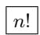
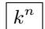
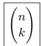

##### 2.1.1 组合学

组合学研究有多少种方法可将若干个元素配合起来. 在此使用符号

$$
n! := 1 \cdot 2 \cdot 3 \cdot \dots \cdot n, \quad 0! := 1, \quad n = 1, 2, \dots ,
$$

并读作“ $n$ 的阶乘”，这如同二项式系数 $^{1)}$ 那样：

$$
\binom{n}{k} := \frac {n (n - 1) \cdots (n - k + 1)}{1 \cdot 2 \cdot \cdots \cdot k}, \quad \binom{n}{0} := 1.
$$

例 1: $3! = 1 \cdot 2 \cdot 3 = 6,\quad 4! = 1 \cdot 2 \cdot 3 \cdot 4 = 24,$

$$
\binom{4}{2} = \frac {4 \cdot 3}{1 \cdot 2} = 6, \quad \binom{4}{3} = \frac {4 \cdot 3 \cdot 2}{1 \cdot 2 \cdot 3} = 4.
$$

二项式系数与二项式公式 参看 0.1.10.3.

阶乘与 $\Gamma$ 函数 参看1.14.6.

组合学的基本问题 $^{2)}$

(i) 排列.

(ii) 有重排列 (也称书籍问题).

(iii) 无重组合

(a) 不考虑顺序 (彩票问题),

(b) 考虑顺序 (变形彩票问题).

(iv) 有重组合

(a) 不考虑顺序 (变形字问题),

(b) 考虑顺序 (字问题).

排列 恰好有

(2.1)

种不同的可能性将 n 个不同元素配合起来. 元素的每一个这种配合称为一个排列.
例 2: 对于数 1 和 2 有 $2! = 2 \cdot 1$ 种可能的配合, 即

$$
1 2, 2 1.
$$

对于三个数 1,2,3, 有 $3! = 1 \cdot 2 \cdot 3$ 种可能的配合, 即

$$
\begin{array}{c} {1 2 3, 2 1 3, 3 1 2,} \\ {1 3 2, 2 3 1, 3 2 1.} \end{array}\tag{2.2}
$$

书籍问题 设给定 n 本书, 它们不必互不相同, 且其中分别有 $m_{1}, \cdots, m_{s}$ 本重复 (即有 s 种不同的书). 那么有

$$
\boxed {\frac {n !}{m _ {1} ! m _ {2} ! \cdots m _ {s} !}}
$$

种不同的可能性将这些书排成一列, 其中重复的书互相不加区分.

例 3: 对于 3 本书其中有 2 本相同, 共有

$$
\frac {3 !}{2 ! 1 !} = \frac {1 \cdot 2 \cdot 3}{1 \cdot 2} = 3
$$

种可能的方法将它们排成一列. 在 (2.2) 中用 1 代替数 2 并删去相同的配合只保留其中一个, 就可得到这些不同的顺序. 这给出三种可能情形

$$
1 1 3, 3 1 1, 1 3 1.
$$

字问题 从 k 个字母着手, 恰好可以形成

个不同的长为 n 的字.

如果当两个字的差别仅在于字母的排列就称它们是等价的, 那么等价字的频数等于

$$
\boxed {\binom {n + k - 1} {n}}
$$

(变形字问题).

例 4: 由两个符号 0 和 1 可以形成 $2^{2}=4$ 个长度为 2 的字, 亦即

$$
0 0, 0 1, 1 0, 1 1.
$$

等价字的频数 A 是 $\binom{n+k-1}{n}$ ，其中 n=k=2，亦即 $A=\binom{3}{2}=\frac{3\cdot2}{1\cdot2}=3$ 。这些数的代表是

$$
0 0, 0 1, 1 1.
$$

此外, 有 $2^{3} = 8$ 个长度为 3 的字:

$$
\begin{array}{l} 0 0 0, 0 0 1, 0 1 0, 0 1 1, \\ 1 0 0, 1 0 1, 1 1 0, 1 1 1. \end{array}
$$

等价字的频数是 $A = \binom{n + k - 1}{n}$ , 其中 $n = 3, k = 2$ , 亦即 $A = \binom{4}{3} = \frac{4 \cdot 3 \cdot 2}{1 \cdot 2 \cdot 3} =$ 4. 作为这些数的代数, 可取

$$
\begin{array}{l} 0 0 0, 0 0 1, 0 1 1, 1 1 1. \end{array}
$$

彩票问题 不考虑所选数的顺序, 有

种可能的方法从 n 个数中选取 k 个数.

如果考虑顺序, 那么有

$$
\boxed {\binom {n} {k} k! = n (n - 1) \dots (n - k + 1)}
$$

种可能.

例 5: 在德国人的游戏 “49 中取 6”(即从 49 个数中选取 6 个数) 中, 我们恰好要抽满

$$
\binom {4 9} {6} = \frac {4 9 \cdot 4 8 \cdot 4 7 \cdot 4 6 \cdot 4 5 \cdot 4 4}{1 \cdot 2 \cdot 3 \cdot 4 \cdot 5 \cdot 6} = 1 3 9 8 3 8 1 6
$$

张彩票, 以保证胜算.

例 6: 从集合 $\{1,2,3\}$ 中选取 2 个数, 若不考虑两个被选取的数的顺序就有 $\begin{pmatrix}3\\2\end{pmatrix}=3$ 种可能, 它们是

12, 13, 23.

若考虑顺序, 则有 $\begin{pmatrix}3\\2\end{pmatrix}\cdot2!=6$ 种可能:

$$
\begin{array}{l} 1 2, 2 1, 1 3, 3 1, 2 3, 3 2. \end{array}
$$

排列的符号 设给定 n 个数 $1,2,\cdots,n$ . 自然顺序 $12\cdots n$ 按定义, 是一个偶排列. n 个数的排列称为偶排列(或奇排列), 如果它是由自然顺序通过偶数次 (或奇数次) 将两个元素置换 $^{1)}$ 而得到. 按定义, 排列 $\sigma$ 的符号(记作 $\operatorname{sgn}\sigma$ ) 是 +1, 若排列是偶的; 或 -1, 若排列是奇的.

例 7: 数 1,2 的排列 12 是偶的, 而 21 是奇的.

对于三个数 1,2,3 的排列:

(i) 偶排列是排列 123,312,231;

(ii) 奇排列是排列 213,132,321.

狄利克雷抽屉原理 将多于 n 个的物体放入 n 个抽屉, 至少有一个抽屉中所装物体的个数大于 1.

P. G. L. 狄利克雷(1805—1859) 发现的这个简单的原理被成功地应用于数论.
