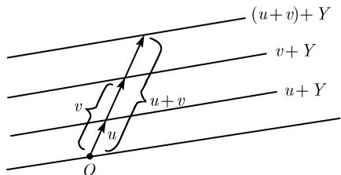

#### 2.3 线性代数

##### 2.3.1 基本思想

线性性思想 函数的微分和积分是线性运算, 这意味着有关系式

$$
(\alpha f + \beta g) ^ {\prime} (x) = \alpha f ^ {\prime} (x) + \beta g ^ {\prime} (x),
$$

$$
\int_ {G} (\alpha f + \beta g) \mathrm{d} x = \alpha \int_ {G} f \mathrm{d} x + \beta \int_ {G} g \mathrm{d} x,
$$

式中, $\alpha$ 和 $\beta$ 是数. 一般地, 线性算子 $L$ 满足条件

$$
L (\alpha f + \beta g) = \alpha L f + \beta L g,
$$

1) 另外, 如果是 2.2.3.1 中的情形, 那么 $f(\mathbf{A})$ 的两个定义是一致的.

其中, f, g 可以是函数、向量、矩阵, 等等.

线性性的思想在许多数学和物理问题中是重要的. 线性代数用综合和统一的方式总结了数学家和物理学家应用线性结构所积累的经验.

叠加原理 依定义, 在一个物理系统中叠加原理成立, 如果对于系统中的两种状态其线性组合仍然是该系统中的一种状态. 例如, 两个函数 $x = f(t)$ , $g(t)$ 都是调和振子的微分方程

$$
x ^ {\prime \prime} + \omega^ {2} x = 0
$$

的解, 并且线性组合 $\alpha f + \beta g$ 仍然是一个解.

线性化原理 数学中一个重要的并且经常出现的原理, 它存在于将问题线性化的方法中. 它的一个典型例子是函数导数的概念. 与此概念紧密相关的是曲线的切线, 曲面的切平面, 或更一般地, 流形的切空间. 线性化原理的基本思想包含在泰勒展开

$$
f (x) = f (x _ {0}) + f ^ {\prime} (x _ {0}) (x - x _ {0}) + \dots
$$

中, 其中右边是函数 $f$ 在点 $x_0$ 的一个邻域中的线性近似. 加上附加项后,

$$
f (x) = f (x _ {0}) + f ^ {\prime} (x _ {0}) (x - x _ {0}) + \frac {f ^ {\prime \prime} (x _ {0})}{2} (x - x _ {0}) ^ {2} + \dots
$$

意味着增加了二次或更高的项. 这种多线性结构在多线性代数理论 (见 2.4) 中考虑.

拓扑学这个数学分支与系统的定性性质相关. 在其中使用的一个重要方法是与拓扑空间相关联的某个线性空间 (例如, 德拉姆上同调群) 或向量丛, 并应用线性代数的工具研究这些线性空间的性质 (见 [212]).

无穷维函数空间和泛函分析 在经典几何学中一般涉及有限维空间 (见第 3 章). 借助泛函分析的微分方程和积分方程的更现代化的研究方法是以无穷维空间为基础的, 空间的元素是函数 (例如, 度量空间、巴拿赫空间、希尔伯特空间、局部凸空间; 参看 [212]).

量子系统和希尔伯特空间 如果给定一个具有标量积的加法结构的线性空间, 那么就得到一类空间, 它们称为希尔伯特空间. 这种空间是量子系统的数学刻画的基础. 量子系统的状态对应于希尔伯特空间 $\mathcal{H}$ 的元素, 而物理性质由适当定义的 $\mathcal{H}$ 上的线性算子给出, 这个算子称为可观测物 (参看 [212]).

线性代数的起源可以追溯到 1827 年出版的 A. F. 默比乌斯(Möbius, 1790—1868) 的书 Der bargzen trische Kalkül (《重心计算》) 以及 1844 年问世的 H. 格拉斯曼(Grassmann, 1809—1877) 的书 Die lineare Ausde hnungslehre (《线性扩张论》).

##### 2.3.2 线性空间

下文中, 符号 K 表示 R(实数集) 或 C(复数集). 在 K 上的线性空间 X 中, 线

性组合是指式子

$$
\boxed {\alpha u + \beta v,}
$$

其中 $u, v \in X, \alpha, \beta \in K.$

定义 集合 $X$ 称为 $\mathbb{K}$ 上的线性空间 (或向量空间), 如果对每个有序对 $(u, v)(u \in X, v \in X)$ , 在 $X$ 中存在一个唯一确定的元素并记作 $u + v$ , 而且对于每个数对 $(\alpha, u)(\alpha \in \mathbb{K}, u \in X)$ , 在 $X$ 中存在一个唯一确定的元素, 记作 $\alpha u$ , 使得对于所有 $u, v, w \in X$ 及所有 $\alpha, \beta \in \mathbb{K}$ 有下列性质1):

(i) $u + v = v + u$ (交换性).

(ii) $(u + v) + w = u + (v + w)$ (结合性).

(iii) X 中存在一个唯一确定的元素, 将它记作 0, 使得

$$
z + 0 = z \quad {\text { 对所有 }}   z \in X   (\text { 中性元 }).
$$

(iv) 对每个 $z \in X$ ，在 X 中存在一个唯一确定的元素，将它记作 $(-z)$ ，使得

$$
z + (- z) = 0 \quad {\text { 对所有 }} z \in X ({\text { 逆元 }}).
$$

(v) $\alpha(u+v)=\alpha u+\alpha v,\quad(\alpha+\beta)u=\alpha u+\beta u$ (分配性).

(vi) $(\alpha \beta)u = \alpha (\beta u)$ (结合性)及 $1u = u$

$\mathbb{R}$ (或 $\mathbb{C}$ ) 上的线性空间称为实的 (或复的)(矢量) 空间.

线性无关性 K 上的线性空间中的元素 $u_{1}, \cdots, u_{n}$ 称为线性无关的, 当且仅当关系式

$$
\alpha_ {1} u _ {1} + \dots + \alpha_ {n} u _ {n} = 0, \quad \alpha_ {1}, \dots , \alpha_ {n} \in \mathbb {K}
$$

总蕴涵关系式 $\alpha_{1}=\cdots=\alpha_{n}=0.$ 不然, $u_{1},\cdots,u_{n}$ 称为线性相关.

维数 线性空间 $X$ 的线性无关元素的最大个数称为它的维数, 并记作 $\dim X$ , 符号 $\dim X = \infty$ 表示 $X$ 中存在任意多个线性无关的元素. 如果 $X$ 仅由中性元素组成 (检验这与定义相一致!), 那么 $\dim X = 0$ .

基 设 $\dim X < \infty$ . K 上的线性空间 X 中的一组元素 $b_{1}, \cdots, b_{n}$ 称为 X 的基, 如果每个元素 $u \in X$ 可以唯一地写成

$$
u = \alpha_ {1} b _ {1} + \dots + \alpha_ {n} b _ {n}, \quad \alpha_ {1}, \dots , \alpha_ {n} \in \mathbb {K}.
$$

此时称 $\alpha_{1},\cdots,\alpha_{n}$ 为 u 关于这个基的坐标.

基定理 设 $n$ 是一个正整数. 如果每 $n$ 个线性无关的元素都形成 $X$ 的基, 那么有 $\dim X = n$ .

1) 代替 $u + (-v)$ , 我们今后更简捷地写作 $u - v$ . 此外, 我们可以证明正文中的性质蕴涵 “ $0u = o$ (当一切 $u \in X$ )” 及 “ $\alpha o = o$ (当一切 $\alpha \in \mathbb{K}$ )”. 因此, 今后 $\mathbb{K}$ 中的元素 “0” 和 $X$ 中的元素 “ $o$ ” 总是用符号 “0” 表示. 由正文中的法则, 这不会产生矛盾. 任意域 $\mathbb{K}$ 上的线性空间 (参看 2.5.3) 可类似地定义.

施泰尼茨基交换定理 如果 $b_{1}, \cdots, b_{n}$ 形成线性空间 X 的基，并且 $u_{1}, \cdots, u_{r}$ 是 X 中的线性无关的元素，那么

$$
u _ {1}, \dots , u _ {r}, b _ {r + 1}, \dots , b _ {n}
$$

形成 X 的新基 (必要时重新编号).

例 1(线性空间 $R^{n}$ ): 用 $R^{n}$ 表示所有实数 $\xi_{j}$ 的 n 数组 $(\xi_{1},\cdots,\xi_{n})$ 的集合. 令

$$
\boxed {\alpha (\xi_ {1}, \dots , \xi_ {n}) + \beta (\eta_ {1}, \dots , \eta_ {n}) = (\alpha \xi_ {1} + \beta \eta_ {1}, \dots , \alpha \xi_ {n} + \beta \eta_ {n})}
$$

对所有 $\alpha, \beta \in \mathbb{R}$ , 则 $\mathbb{R}^n$ 成为一个 $n$ 维实线性空间. 作为它的基可以取

$$
\boldsymbol {b} _ {1} := (1, 0, \dots , 0), \quad \boldsymbol {b} _ {2} := (0, 1, 0, \dots , 0), \quad \dots , \quad \boldsymbol {b} _ {n} := (0, 0, \dots , 0, 1),
$$

于是 $(\xi_{1},\cdots,\xi_{n})=\xi_{1}b_{1}+\cdots+\xi_{n}b_{n}.$

如果 $\xi_{j},\eta_{j},\alpha$ 和 $\beta$ 取复数, 那么我们得到 $n$ 维复线性空间 $\mathbb{C}^n$

例 2: 设 n 是正整数. 全体实 (或复) 系数 $a_{0}, \cdots, a_{n-1}$ 的多项式

$$
a _ {0} + a _ {1} x + \dots + a _ {n - 1} x ^ {n - 1}
$$

的集合形成一个 n 维实 (或复) 线性空间. 它的基可以由 (例如) 元素 $1, x, x^{2}, \cdots, x^{n-1}$ 给出.

例 3: 所有函数 $f : R \to R$ 的集合关于通常的线性组合 $\alpha f + \beta g$ 形成一个实线性空间. 这个空间是无穷维的, 因为幂函数 $b_{j}(x) := x^{j}, j = 0, 1, \cdots, n$ 对于每个 n 都是线性无关的, 亦即由关系式

$$
\alpha_ {0} b _ {0} (x) + \dots + \alpha_ {n} b _ {n} (x) = 0, \quad \alpha_ {0}, \dots , \alpha_ {n} \in \mathbb {R}
$$

可推出 $\alpha_{0}=\cdots=\alpha_{n}=0.$

例 4: 所有闭区间 $[a, b]$ 上的连续函数 $f : [a, b] \to R$ 形成一个 (无穷维) 实线性空间 $C[a, b]$ .

这个结论是基于下列事实：对于任何两个连续函数 f 和 g，线性组合 $\alpha f + \beta g$ 仍是连续的.

集合的线性组合 设 $\alpha, \beta \in \mathbb{K}$ . 如果 $U$ 和 $V$ 是 $\mathbb{K}$ 上的线性空间 $X$ 中的非空集合, 那么令

$$
\alpha U + \beta V := \{\alpha u + \beta v: u \in U, v \in V \}.
$$

子空间 $\mathbb{K}$ 上的线性空间 $X$ 的一个子集 $Y$ 称为子空间, 如果对于所有 $u, v \in Y$ 及所有 $\alpha, \beta \in \mathbb{K}$ 有

$$
\boxed {\alpha u + \beta v \in Y .}
$$

  
图2.1

例 5: 我们在点 P 画两个向量 a 和 b(图 2.1). 所有线性组合的集合 $\{\alpha a + \beta b | \alpha \beta \in R\}$ 形成一个线性空间 X, 它对应于通过点 P 由元素 a 和 b 张成的平面. 子空间 $Y := \{\alpha a | \alpha \in R\}$ 是通过 P 点沿着向量 a 的方向的直线.

我们有 $\dim X = 2, \dim Y = 1.$

维数定理 如果 Y 和 Z 是线性空间 X 的子空间, 则有

$$
\boxed {\dim (Y + Z) + \dim (Y \cap Z) = \dim Y + \dim Z,}
$$

其中和 $Y + Z$ 及交 $Y \cap Z$ 仍然是 X 的子空间.

余维数 设 $Y$ 是 $X$ 的子空间. 除了维数 $\dim Y$ 外, $Y$ 的余维数 $\operatorname{codim} Y$ 经常是重要的. 按定义1)有 $\operatorname{codim} Y := \dim X / Y$ . 当 $\dim X < \infty$ 时, 有

$$
\left| \operatorname{codim} Y = \dim X - \dim Y. \right|
$$

##### 2.3.3 线性算子

定义 如果 $X$ 和 $Y$ 是 $\mathbb{K}$ 上的线性空间, 那么线性算子 $A: X \to Y$ 是一个具有下列性质的映射:

$$
\boxed {A (\alpha u + \beta v) = \alpha A u + \beta A v}
$$

对所有 $u, v \in X$ 及所有 $\alpha, \beta \in K$ .

同构 两个线性空间 X 和 Y 被称为同构的, 如果存在一个线性一一映射 $A: X \rightarrow Y$ . 这种映射称为同构 $^{2)}$ .

在同构的线性空间中可以用相同的方式完成计算. 因此, 从抽象观点来看, 同构的线性空间之间没有差别.

定理 两个 K 上的有限维线性空间同构, 当且仅当它们有相同的维数.

因此, 线性空间的维数是有限维线性空间仅有的特征.

设 $b_{1},\cdots,b_{n}$ 是 K 上有限维线性空间 X 的基, 那么用

$$
A \left(\alpha_ {1} b _ {1} + \dots + \alpha_ {n} b _ {n}\right) := \left(\alpha_ {1}, \dots , \alpha_ {n}\right)
$$

定义的映射是 X 到 $K^{n}$ 的线性同构.

例 1: 设 $[a, b]$ 是闭区间, 如果令

$$
A u := \int_ {a} ^ {b} u (x) \mathrm{d} x,
$$

那么 $A: C[a, b] \rightarrow R$ 是一个线性算子.

例 2: 定义导数算子为

$$
(A u) (x) := u ^ {\prime} (x), \qquad \text { 对所有 } x \in \mathbb {R}.
$$

那么 $A: X \to Y$ 是线性算子, 其中 $X$ 是所有可微函数 $u: \mathbb{R} \to \mathbb{R}$ 的空间, $Y$ 是所有函数 $v: \mathbb{R} \to \mathbb{R}$ 的空间.

例 3: (矩阵) 设 $R_{S}^{n}$ 表示所有实列矩阵

$$
\boldsymbol {u} = \left( \begin{array}{c} u _ {1} \\ \vdots \\ u _ {n} \end{array} \right)
$$

组成的 $n$ 维实线性空间. 线性组合 $\alpha \pmb{u} + \beta \pmb{v}$ 对应于通常的矩阵计算. 所有的线性算子 $\pmb{A}:\mathbb{R}_S^n\to \mathbb{R}_S^m$ 的集合恰好与 $m\times n$ 实矩阵 $\pmb {A} = (a_{jk})$ 的集合相同. 方程 $\pmb {A}\pmb {u} = \pmb{v}$ 对应于矩阵方程

$$
\left( \begin{array}{c c c c} a _ {1 1} & a _ {1 2} & \dots & a _ {1 n} \\ a _ {2 1} & a _ {2 2} & \dots & a _ {2 n} \\ \vdots & \vdots & & \vdots \\ a _ {m 1} & a _ {m 2} & \dots & a _ {m n} \end{array} \right) \left( \begin{array}{c} u _ {1} \\ u _ {2} \\ \vdots \\ u _ {n} \end{array} \right) = \left( \begin{array}{c} v _ {1} \\ v _ {2} \\ \vdots \\ v _ {m} \end{array} \right).
$$

2.3.3.1 线性算子的运算

考虑线性算子 $A, B: X \to Y$ 及 $C: Y \to Z$ , 其中 $X, Y, Z$ 是 $\mathbb{K}$ 上的线性空间.

线性组合 设给定 $\alpha, \beta \in K$ . 用公式

$$
\boxed {(\alpha A + \beta B) u := \alpha A u + \beta B u, \quad \text {对所有} u \in X}
$$

定义线性算子 $\alpha A + \beta B : X \rightarrow Y$ .

乘积 乘积 $AC: X \rightarrow Z$ 是一个线性算子, 它由合成定义, 亦即

$$
\boxed {(A C) u = A (C u), \quad \text {对所有} u \in X.}
$$

单位算子 由 $Iu := u$ 定义的算子是一个线性算子 $I: X \to X$ , 称为单位算子, 并且也记作 $\mathrm{id}_X$ 或 $I_X$ . 对于所有线性算子 $A: X \to X$ 我们有关系式

$$
\boxed {A I = I A = A.}
$$

2.3.3.2 线性算子方程

设给定线性算子 $A: X \to Y$ . 我们考虑方程

$$
\boxed {A u = v.}\tag{2.50}
$$

核和象 我们用下列方程定义核 $\mathrm{Ker}(A)$ 和象 $\mathrm{Im}(A)$ .

$$
\operatorname{Ker} (A) := \{u \in X | A u = 0 \}, \quad \operatorname{Im} (A) := \{A u | u \in X \}.
$$

定义 (i) $A$ 称为满射, 如果 $\operatorname{Im}(A) = Y$ , 亦即对于每个 $v \in Y$ , 方程 (2.50) 都有解 $u \in X$ .

(ii) A 称为单射, 如果对每个 $v \in Y$ , 方程 (2.50) 至多有一个解 $u \in X$ .

(iii) $A$ 称为双射(一一对应), 如果 $A$ 既是满射, 又是单射, 亦即对于每个 $v \in Y$ , 方程 (2.50) 有唯一的解 $u \in X$ .

此时, 关系式 $A^{-1}v := u$ 定义逆线性算子 $A^{-1}: Y \to X$ .

叠加原理 如果 $u_0$ 是 (2.50) 的一个特解, 那么集合 $u_0 + \mathrm{Ker}(A)$ 是 (2.50) 的全部解的集合.

特别, 对于 $v = 0$ , 子空间 $\operatorname{Ker}(A)$ 是 (2.50) 的解空间. 因此我们有: 如果 $u$ 和 $w$ 是齐次方程 (2.50)(其中 $v = 0$ ) 的解, 那么每个线性组合 $\alpha u + \beta v (\alpha, \beta \in \mathbb{K})$ 也是其解.

满射判别法 线性算子 A 是满射, 当且仅当存在线性算子 $B: Y \rightarrow X$ 具有下列性质:

$$
\boxed {A B = I _ {Y}.}
$$

单射判别法 线性算子 $A: X \rightarrow Y$ 是单射, 当且仅当满足下列两个条件之一.

(a) 由 $Au = 0$ 可推出 $u = 0$ , 亦即 $\dim \operatorname{Ker}(A) = 0$ .

(b) 存在线性算子 $B: Y \to X$ 使

$$
\boxed {B A = I _ {X}.}
$$

秩和指标 我们有

$$
\operatorname{rank} (A) := \dim \operatorname{Im} (A), \quad \operatorname{ind} (A) := \dim \operatorname{Ker} (A) - \operatorname{codim} \operatorname{Im} (A).
$$

仅当 $\dim \operatorname{Ker}(A)$ 和 $\operatorname{codim} \operatorname{Im}(A)$ 中有一个有限时才能定义指标 $\operatorname{ind}(A)$ . 例：对于两个有限维线性空间 $X$ 和 $Y$ 间的线性算子 $A: X \to Y$ , 有

$$
\boxed {\operatorname{ind} (A) = \dim X - \dim Y, \quad \dim \operatorname{Ker} (A) = \dim X - \operatorname{rank} (A).}
$$

(a) 第二个公式蕴涵下列事实：(2.50) 的解的线性空间 $^{1)}$ $u_{0} + \ker(A)$ 的维数等于 $\dim X - \operatorname{rank}(A)$ .

(b) 如果 $\operatorname{ind}(A) = 0$ , 那么由 $\dim \operatorname{Ker}(A) = 0$ 立即推出 $\operatorname{Im}(A) = Y$ . 因此 $A$ 是双射, 亦即对每个 $v \in Y$ 方程 $Au = v$ 有唯一解 $u = A^{-1}v$ .

指标的重要性 指标起着基本作用. 当我们在有限维线性空间中研究微分方程和积分方程的解的性质时, 这是显然的. 20 世纪最深刻的数学结果之一是阿蒂亚-辛格指标定理. 这个定理说, 我们仅需通过紧流形上的拓扑 (定性) 数据及所谓算子的符号就可计算该流形上的一类重要的微分和积分算子的指标. 它有一个推论: 在算子和流形的相对强的扰动下算子的指标是相同的 (参看 [212]).

2.3.3.3 正合序列

现代线性代数和代数拓扑常常通过正合序列的语言来表述. 线性算子 $A$ 和 $B$ 的序列

$$
X \xrightarrow {A} Y \xrightarrow {B} Z
$$

称为是正合的, 如果 $\mathrm{Im}(A)=\mathrm{Ker}(B)$ .

更一般地, 序列

$$
\dots \to X _ {k} \stackrel {{A _ {k}}} {{\to}} X _ {k + 1} \stackrel {{A _ {k + 1}}} {{\to}} X _ {k + 2} \to \dots
$$

称为是正合的, 如果对所有 k 有 $\mathrm{Im}(A_{k})=\mathrm{Ker}(A_{k+1})$ .

定理 对于线性算子 A, 我们有 $^{1)}$

(i) $A$ 是满射, 当且仅当序列 $X \xrightarrow{A} Y \to 0$ 是正合的.

(ii) $A$ 是单射, 当且仅当 $0 \to X \xrightarrow{A} Y$ 是正合的.

(iii) $A$ 是双射, 当且仅当 $0 \to X \xrightarrow{A} Y \to 0$ 是正合的.

2.3.3.4 与矩阵计算的关系

与线性算子 A 相伴的矩阵 A 设 $A: X \to Y$ 是一个线性算子, 其中设 X 和 Y 是 K 上的有限维线性空间.

分别在 X 中和 Y 中选取固定的基 $b_{1}, \cdots, b_{n}$ 和 $c_{1}, \cdots, c_{m}$ . 对于 $u \in X$ 和 $v \in Y$ 我们有唯一确定的分解式

$$
u = u _ {1} b _ {1} + \dots + u _ {n} b _ {n}, \qquad v = v _ {1} c _ {1} + \dots + v _ {m} c _ {m}.
$$

并且

$$
\boxed {A b _ {k} = \sum_ {j = 1} ^ {m} a _ {j k} c _ {j}, \qquad k = 1, \dots , n.}
$$

此处 $b_{j}, c_{k}$ 和 $a_{jk}$ 是 $\mathbb{K}$ 中的元素, 称 $m \times n$ 矩阵

$$
\mathscr {A} := (a _ {j k}), \qquad j = 1, \dots , m; \quad k = 1, \dots , n
$$

为与线性算子 $A$ (关于所选的基) 相伴的矩阵. 另外, 我们还引进与 $u$ 和 $v$ 相伴的坐标列矩阵

$$
\mathcal {U} := (u _ {1}, \dots , u _ {n}) ^ {\mathrm{T}} \quad \text {及} \quad \mathcal {V} := (v _ {1}, \dots , v _ {m}) ^ {\mathrm{T}}.
$$

于是算子方程

$$
\boxed {A u = v}
$$

对应于矩阵方程

$$
\boxed {\mathcal {A} \mathcal {U} = \mathcal {V}.}
$$

定理 线性算子的和 (或积) 对应于相应的矩阵的和 (或积).

1) 我们用 0 表示仅由中性元组成的平凡的线性空间 $\{0\}$ . 另外, $0 \to X$ 及 $Y \to 0$ 表示零算子.

线性算子的秩与相应的矩阵的秩相同 (矩阵秩与基的选取无关).

基的变换 借助变换公式

$$
b _ {k} = \sum_ {r = 1} ^ {n} t _ {r k} b _ {k} ^ {\prime}, \quad c _ {j} = \sum_ {i = 1} ^ {m} s _ {i j} c _ {i} ^ {\prime}, \quad k = 1, \dots , n; \quad j = 1, \dots , m
$$

我们过渡到 X 的新基 $b_{1}^{\prime}, \cdots, b_{n}^{\prime}$ (或 Y 的新基 $c_{1}^{\prime}, \cdots, c_{m}^{\prime}$ ). 其中要求 $(n \times n)$ 矩阵 $\mathcal{T} = (t_{rk})$ 及 $m \times m$ 矩阵 $\mathcal{S} = (s_{ij})$ 是可逆的. u 的新坐标 $u_{k}^{\prime}$ (及 v 的新坐标 $v_{j}^{\prime}$ ) 由分解式

$$
u = u _ {1} ^ {\prime} b _ {1} ^ {\prime} + \dots + u _ {n} ^ {\prime} b _ {n} ^ {\prime}, \qquad v = v _ {1} ^ {\prime} c _ {1} ^ {\prime} + \dots + v _ {m} ^ {\prime} c _ {m} ^ {\prime}
$$

确定. 由此分别得到 $u$ 和 $v$ 的坐标变换公式

$$
\boxed {\mathcal {U} = \mathcal {T U} ^ {\prime}, \quad \mathcal {V} = \mathcal {S V} ^ {\prime}.}
$$

算子方程 Au = v 对应于矩阵方程 $A'U' = V'$ ，其中

$$
\boxed {\mathcal {A} ^ {\prime} = \mathcal {S} ^ {- 1} \mathcal {A T}.}
$$

在特殊情形： $X = Y$ 及 $b_{j} = c_{j}$ （对于所有 $j$ )，我们有 $\mathcal{S} = \mathcal{T}$ .因此我们得到矩阵 $\mathcal{A}$ 的相似变换 $\mathcal{A}' = \mathcal{T}^{-1}\mathcal{A}\mathcal{T}$

迹和行列式 设 $\dim X < \infty$ 。用下列关系式定义线性算子 $A: X \to X$ 的迹和行列式：

$$
\boxed {\operatorname{tr} A := \operatorname{tr} (a _ {j k}), \qquad \det A := \det (a _ {j k}).}
$$

这些定义都与为形成矩阵所使用的基的选取无关.

定理 对于两个线性算子 $A, B: X \to X$ , 有

(i) $\det(AB)=(\det A)(\det B).$

(ii) $A$ 是双射, 当且仅当 $\operatorname{det} A \neq 0$ .

(iii) $\operatorname{tr}(\alpha A + \beta B) = \alpha \operatorname{tr}A + \beta \operatorname{tr}B$ (对所有 $\alpha, \beta \in \mathbb{K}$ ).

(iv) $\operatorname{tr}(AB)=\operatorname{tr}(BA).$

(v) $\operatorname{tr} I_X = \dim X$ .

##### 2.3.4 线性空间的计算

由给定的线性空间我们可以构造新的线性空间．下列结构给出所有代数结构(如群、环和域)的模型.线性空间的张量积将在2.4.3.1中研究.

2.3.4.1 笛卡儿积

如果 X 和 Y 是 K 上的线性空间, 那么通过令

$$
\alpha (u, v) + \beta (w, z) := (\alpha u + \beta w, \alpha v + \beta z), \quad \alpha , \beta \in \mathbb {K},
$$

可使积集 $X \times Y := \{(u, v) | u \in X, v \in Y\}$ 成为一个 $\mathbb{K}$ 上的线性空间, 它称为 $X$ 和 $Y$ 的笛卡儿积.

如果 X 和 Y 是有限维的, 那么对于笛卡儿积有维数公式

$$
\boxed {\dim (X \times Y) = \dim X + \dim Y.}
$$

如果 $b_{1},\cdots,b_{n}$ (及 $c_{1},\cdots,c_{m}$ ) 是 X(及 Y) 的基, 那么所有可能的元素对 $(b_{j},c_{k})$ 的集合形成 $X\times Y$ 的基.

例：对于 X = Y = R，有 $X \times Y = R^{2}$ .

2.3.4.2 商空间

线性流形 (仿射线性空间) 设 $Y$ 是 $\mathbb{K}$ 上的线性空间 $X$ 的子空间. 每个集合

$$
u + Y := \{u + v | v \in Y \}, \quad u \in X \text {固定}
$$

称为 (平行于 Y 的) 线性流形(仿射子空间). 此外, 有

$$
u + Y = w + Y
$$

当且仅当 $u - w \in Y$ . 我们令 $\dim(u + Y) := \dim Y$ .

商空间 我们用 X/Y 表示 X 中所有平行于 Y 的线性流形的集合. 通过定义线性组合

$$
\alpha U + \beta V, \quad \text { 对 } U, V \in X / Y \text { 及 } \alpha , \beta \in \mathbb {K},
$$

我们可使 X/Y 成为一个线性空间, 并称它为 X 模 Y 的商空间. 显然, 我们有

$$
\alpha (u + Y) + \beta (v + Y) = (\alpha u + \beta v) + Y.
$$

对于 $\dim X < \infty$ 我们有

$$
\boxed {\dim X / Y = \dim X - \dim Y.}
$$

例：设 $X := \mathbb{R}^2$ 。如果 $Y$ 是通过原点的直线，那么 $X / Y$ 由所有平行于 $Y$ 的直线组成 (图2.2).

  
图2.2 商空间

替代定义 设 $u, w \in X$ . 记

$u \sim w,$ 当且仅当 $u - w \in Y$ .

这是 X 上的一个等价关系 (参看 4.3.5.1). 对应的等价类 $[u] := u + Y$ 形成集合 X/Y. 令

$$
\alpha [ u ] + \beta [ z ] := [ \alpha u + \beta z ],
$$

那么集合 X/Y 具备线性空间的结构, 这个定义与 u 和 z 的代表式的选取无关.

映射 $u \rightarrow [u]$ 称为 X 到 X/Y 上的典范映射.

结构定理 如果 Y 和 Z 是 X 的两个子空间, 那么有同构

$$
\boxed {(Y + Z) / Z \cong Y / (Y \cap Z).}
$$

在 $Y \subseteq Z \subseteq X$ 的情形, 还有

$$
\boxed {X / Y \cong (X / Z) / (Z / Y).}
$$

2.3.4.3 直和

定义 设 Y 和 Z 是线性空间 X 的两个子空间. 记

$$
\boxed {X = Y \oplus Z,}
$$

当且仅当每个 $u \in X$ 可以唯一地写成

$$
u = y + z, \qquad y \in Y, z \in Z.
$$

空间 X 称为 Y 和 Z 的直和, 并说 Z 是 Y 在 X 中的代数补集. 有

$$
\boxed {\dim (Y \oplus Z) = \dim Y + \dim Z.}
$$

定理 (i) 由 $X = Y \oplus Z$ 可推出 $Z \cong X / Y$ .

(ii) $\dim Z = \operatorname{codim} Y.$

直观地说, $Y$ 的余维数 $\operatorname{codim} Y$ 等于与整个空间 $X$ 相比, 在 $Y$ 中缺少的维数.

例 1: 对于 $X = R^{3}$ ，原点 0，过原点的直线及过原点的平面分别有维数 0,1 和 2 及余维数 3,2,1.

例 2: 在图 2.3 中画出了分解式 $R^{2}=Y\oplus Z$ .

  
图2.3

存在定理 对于线性空间 X 的每个子空间 Y 存在一个代数补集 Z，亦即对它有 $X = Y \oplus Z$ .

线性包 如果 $M$ 是 $\mathbb{K}$ 上的线性空间 $X$ 中的一个集合, 那么我们称集合

$$
\operatorname{span} M := \left\{\alpha_ {1} u _ {1} + \dots + \alpha_ {n} u _ {n} \mid u _ {j} \in M, \alpha_ {j} \in \mathbb {K}, j = 1, \dots , n \text {且} n \geqslant 1 \right\}
$$

为 M 的线性包(或线性生成).

线性包 M 是 X 的含有 M 的子空间中的最小者.

补空间的构造 设 Y 是 n 维线性空间 X 的 m 维子空间, $0 < m < n < \infty$ . 取 X 的基 $u_{1}, \cdots, u_{n}$ . 那么我们有

$$
X = Y \oplus \operatorname{span} \left\{u _ {m + 1}, \dots , u _ {n} \right\}.
$$

任意多个子空间的直和 设 $\{X_{\alpha}\}_{\alpha \in A}$ 是线性空间 $X$ 的一族子空间. 我们记

$$
\boxed {X = \bigoplus_ {\alpha \in A} X _ {\alpha},}
$$

当且仅当每个 $x \in X$ 可唯一地写成

$$
x = \sum_ {\alpha \in A} x _ {\alpha}, \qquad x _ {\alpha} \in X _ {\alpha},
$$

其中只允许出现有限多个加项. 如果下标集 A 是有限的, 那么有维数公式

$$
\boxed {\dim X = \sum_ {\alpha \in A} \dim X _ {\alpha}.}
$$

线性空间的外直和 设 $\{X_{\alpha}\}_{\alpha \in A}$ 是一族 $\mathbb{K}$ 上的线性空间. 那么笛卡儿积 $\prod_{\alpha \in A} X_{\alpha}$ 由所有元素组 $(x_{\alpha})$ 的集合组成, 其中加法按相应分量相加, 与 $\mathbb{K}$ 中数的乘法定义为与各分量相乘. 线性空间 $X_{\alpha}$ 的外直和

$$
\boxed {\bigoplus_ {\alpha \in A} X _ {\alpha}}
$$

定义为 $\prod_{\alpha\in A}X_{\alpha}$ 的子集, 它由所有仅对有限多个 $\alpha$ 值不为零的那些元素组组成.

我们将 $X_{\beta}$ 与所有这种元素组 $(x_{\alpha})$ 等同, 其中 $x_{\alpha}=0$ 当 $\alpha\neq\beta$ , 于是 $\bigoplus_{\alpha\in A}X_{\alpha}$ 对应于子空间 $X_{\alpha}$ 的直和.

分次 我们说空间 $\bigoplus_{\alpha \in A} X_{\alpha}$ 被子空间 $X_{\alpha}$ 分次.

2.3.4.4 对线性算子的应用

秩定理 设给定线性算子 $A: X \to Y$ . 取某个分解式 $X = \operatorname{Ker}(A) \oplus Z$ ; 那么 $A$ 的限制

$$
A: Z \to \operatorname{Im} (A)
$$

是双射. 由此推出

$$
\left| \operatorname{codim} \operatorname{Ker} (A) = \dim \operatorname{Im} (A) = \operatorname{rank} (A). \right|
$$

不变子空间 设给定线性算子 $A: X \to X$ 其中 $X$ 是 $\mathbb{K}$ 上的线性空间. $X$ 的子空间 $Y$ 称为对于 $A$ 不变, 如果 $u \in Y$ 蕴涵 $Au \in Y$ .

另外, $Y$ 称为 (对于 $A$ ) 不可约, 如果除了平凡子空间 $O$ 外 $Y$ 没有真正的不变子空间.

基本分解定理 如果 $\dim X < \infty$ ，那么对于每个 A 存在 X 的一个分解

$$
\boxed {X = X _ {1} \oplus X _ {2} \oplus \dots \oplus X _ {k},}
$$

其中 $X_{1},\cdots,X_{k}$ 是 (非平凡) 不可约的不变子空间, 亦即存在算子 $A_{j}:X_{j}\rightarrow X_{j}$ 对每个 j.

如果 $X$ 是复线性空间, 那么可在每个子空间中选取基, 使 $A$ 限制在 $X_{j}$ 时由若尔当块矩阵给出. 于是 $A$ 在 $X$ 上相对于这种基的矩阵是若尔当正规形式.

这些若尔当块的阶等于相应子空间 $X_{j}$ 的维数．这些维数可以通过将2.2.2.3中所描述的初等因子方法应用于矩阵 $A$ (相对于某个基)而算出.

##### 2.3.5 对偶性

对偶性的概念在许多数学领域中是重要的 (如射影几何和泛函分析) $^{1)}$ .

线性泛函 我们称线性映射 $u^{*}: X \to K$ 为 K 上的线性空间 X 上的线性泛函 (线性形式).

例 1: 令

$$
u ^ {*} (u) := \int_ {a} ^ {b} u (x) \mathrm{d} x,
$$

它定义了连续函数 $u:[a,b]\to R$ 形成的空间 $C[a,b]$ 上的一个线性泛函.

对偶空间 用 $X^{*}$ 表示所有 $X$ 上的线性泛函的集合. 定义线性组合 $\alpha u^{*} + \beta v^{*}$ 为

$$
(\alpha u ^ {*} + \beta v ^ {*}) (u) := \alpha u ^ {*} (u) + \beta v ^ {*} (u)
$$

对所有 $u \in X$ , 于是空间 $X^{*}$ 具备 $\mathbb{K}$ 上的线性空间的结构, 将它称为 $X$ 的对偶空间.

令 $X^{**} := (X^{*})^{*}$ .

例 2: 设 X 为 K 上的 n 维线性空间. 那么有同构

$$
\boxed {X ^ {*} \cong X,}
$$

但它不是典范的, 甚至与 X 的基 $b_{1}, \cdots, b_{n}$ 的选取有关. 为证明这个结论, 设

$$
b _ {j} ^ {*} (u _ {1} b _ {1} + \dots + u _ {n} b _ {n}) := u _ {j}, \quad j = 1, \dots , n.
$$

那么线性泛函 $b_{1}^{*}, \cdots, b_{n}^{*}$ 形成对偶空间 $X^{*}$ 的基, 它称为对偶基.

每个 X 上的线性型 $u^{*}$ 可写成

$$
u ^ {*} = \alpha_ {1} b _ {1} ^ {*} + \dots + \alpha_ {n} b _ {n} ^ {*}, \quad \alpha_ {1}, \dots , \alpha_ {n} \in \mathbb {K}.
$$

如果令 $A(u^{*}) := \alpha_{1}b_{1} + \cdots + \alpha_{n}b_{n}$ ，那么 $A : X^{*} \to X$ 是一个线性双射，这产生同构 $X^{*} \cong X$ .

另一方面, 令 $u^{**}(u^{*}) := u^{*}(u)$ 对所有 $u^{*} \in X^{*}$ , 那么同构

$$
\boxed {X ^ {* *} \cong X}
$$

是典范的, 亦即与基的选取无关. 因此对每个 $u \in X$ 都伴随一个 $u^{**}$ , 并且这个 $X$ 到 $X^{**}$ 的映射是线性的并且是双射.

对于无穷维线性空间, X 与 $X^{*}$ 以及 $X^{**}$ 间的关系不再像有穷维情形那样清晰 (例如巴拿赫空间情形, 参看 [212]).

对偶算子 设 $A: X \to Y$ 是一个线性算子, 其中 $X, Y$ 是 $\mathbb{K}$ 上的线性空间. 用公式

$$
(A ^ {*} v ^ {*}) (u) := v ^ {*} (A u), \quad \text { 对所有 } u \in X
$$

定义对偶算子 $A^{*}$ . 这是一个线性算子 $A^{*}:Y^{*}\rightarrow X^{*}$ .

乘积法则 如果 $A: X \rightarrow Y$ 及 $B: Y \rightarrow Z$ 是线性算子, 那么

$$
\boxed {(A B) ^ {*} = B ^ {*} A ^ {*}.}
$$
