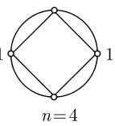

#### 2.6 伽罗瓦理论和代数方程

巴黎数学界以深刻的数学进取精神在 1830 年前后孕育了 E. 伽罗瓦, 一个才智超群的天才, 他像一颗彗星, 刚一出现就很快消失 $^{1)}$ .

D. J. 斯特罗伊克

##### 2.6.1 三个著名古代问题

在经典的希腊数学文化中, 有三个著名问题, 直到 19 世纪其不可解性都未被证明:

(i) 化圆为方;

(ii) 倍立方体 (第罗斯问题);

(iii) 三等分任意角.

在所有这些问题中只允许用圆规和直尺作图. 在问题 (i) 中, 要求作一个正方形其面积与某个给定的圆的面积相等. 在问题 (ii) 中, 要由给定的立方体作出一个新立方体的边, 使它的体积是给定立方体体积的 2 倍 $^{2)}$ .

除了这些问题, 用圆规和直尺作正多边形的一般问题在古代也是一个重要问题.

所有这些问题都可归结为关于代数方程可解性的问题 (参看 2.6.6). 代数方程的解的研究是借助于法国数学家 E. 伽罗瓦(1811—1832) 所创立的一般性理论完成的. 伽罗瓦理论开辟了现代代数思想的通途.

伽罗瓦理论包含下列一些结果作为其特殊情形：C. F. 高斯(1777—1855)青年时期发现的关于分圆域的结果及正多边形的作图，以及挪威数学家 N. H. 阿贝尔(1802—1829)关于一般 5 次及高次方程的根式不可解性定理 (参看 2.6.5 和 2.6.6).

##### 2.6.2 伽罗瓦理论的主要定理

域扩张 域扩张 $K \subseteq E$ (也记作 $(E|K)$ ) 是一个域 $E$ , 它包含给定的域 $K$ 作为其子域. $E$ 的每个适合

$$
\boxed {K \subseteq Z \subseteq E}
$$

的子域 $Z$ 称为扩张 $K \subseteq E$ 的中间域. 域扩张链

$$
K _ {0} \subseteq K _ {1} \subseteq \dots \subseteq E
$$

是域 E 的一组子域 $K_{j}$ ，它们具有所指出的包含关系.

伽罗瓦理论的某本思想 伽罗瓦理论考虑一类重要的域扩张 (伽罗瓦扩张), 并借助于这个域扩张的对称群 (伽罗瓦群) 的所有子群确定出全部中间域.

这样, 一个域论问题 (一般说, 它相当难) 就被归结为容易得多的群论问题.

将一个复杂结构的研究归结为较简单结构的研究, 是现代数学的一般策略. 例如我们可将拓扑问题归结为代数问题(它们要容易些), 而连续李群的研究归结为李代数的研究, 后者是线性代数的课题 (参看 [212]).

域扩张的次数 如果 $K \subseteq E$ 是一个域扩张, 那么我们可以将 $E$ 看作 $K$ 上的线性空间. 这个空间的维数 $^{1)}$ , 称为域扩张的次数并记作 $[E:K]$ . 如果这个次数有限, 那么称为有限域扩张.

例 1: 有理数域到实数域的扩张 $Q \subseteq R$ 是无限扩张.

例 2: 实数域 R 到复数域 C 的扩张 $R \subseteq C$ 是有限扩张, 且次数为 2, 因为在 2.5.3 中已经证明 C 可以看作 R 上的 2 维向量空间, 其基由 1 和 i 组成.

另外, 扩张 $\mathbb{Q} \subseteq \mathbb{R}$ 在 2.6.3 的意义下是一个超越扩张, 而扩张 $\mathbb{R} \subseteq \mathbb{C}$ 是单代数扩张.

次数定理 如果 $Z$ 是有限域扩张 $K \subseteq E$ 的中间域, 那么 $K \subseteq Z$ 也是有限域扩张, 并且有关系式

$$
[ E: K ] = [ Z: K ] [ E: Z ].
$$

如果将方括号符号想象为分数, 那么这个公式容易记住.

域扩张的伽罗瓦群 设 $K \subseteq E$ 是域扩张. 那么这个扩张的伽罗瓦群, 它被记作 $G_{K}^{E}$ 或 $\operatorname{Cal}(E|K)$ , 定义为域 $E$ 的全部自同构的群, 这些自同构平凡地作用于 $K$ 的所有元素.

有限域扩张 $K \subseteq E$ 称为伽罗瓦扩张, 如果

$$
\boxed {\mathrm{ord} G _ {K} ^ {E} = [ E: K ],}
$$

亦即存在个数与域扩张次数相同的 E 在 K 上的对称性.

伽罗瓦理论的主要定理 设 $K \subseteq E$ 是有限伽罗瓦域扩张. 在这个扩张的中间域 $Z$ 及子群 $H \subset G_K^E$ 间存在一一对应; 它使对应于中间域 $Z$ 的子群 $H$ 由所有使 $Z$ 的全部元素不变的自同构组成.

这样, 我们得到由所有中间域的集合到伽罗瓦群的所有子群的集合间的一个一一映射. 注意, 中间域是 $K$ 上的伽罗瓦域, 当且仅当对应于它的子群 $H$ (它同构于 $G_{K}^{Z}$ ) 是 $G_{K}^{E}$ 的正规子群.

推论 一个有限伽罗瓦域扩张 $K \subseteq E$ 没有中间伽罗瓦域扩张, 当且仅当扩张的伽罗瓦群是单群 (关于这个概念可见 2.5.1.1).

例 3: 我们考虑实数域 R 到复数域 C 的经典域扩张

$$
\boxed {\mathbb {R} \subseteq \mathbb {C}.}
$$

我们首先确定这个扩张的伽罗瓦群 $\operatorname{Gal}(\mathbb{C}|\mathbb{R})$ . 令 $\varphi: \mathbb{C} \to \mathbb{C}$ 是一个自同构, 它保持所有实数不变. 由 $\mathrm{i}^2 = -1$ 得到 $\varphi(\mathrm{i})^2 = -1$ . 因此或 $\varphi(\mathrm{i}) = \mathrm{i}$ , 或 $\varphi(\mathrm{i}) = -\mathrm{i}$ . 这两种可能性分别对应于是 $\mathbb{C}$ 上的单位自同构 $\operatorname{id}(a + b\mathrm{i}) := a + b\mathrm{i}$ 以及 $\mathbb{C}$ 上的自同构

$$
\boxed {\varphi (a + b \mathrm{i}) := a - b \mathrm{i}}
$$

(变换为复数共轭). 因此 $G_{\mathbb{R}}^{\mathbb{C}} = \{\mathrm{id},\varphi \}$ , 且 $\varphi^2 = \mathrm{id}$ . 根据例 2,

$$
[ \mathbb {C}: \mathbb {R} ] = \mathrm{ord} G _ {\mathbb {R}} ^ {\mathbb {C}} = 2.
$$

因此域扩张 $\mathbb{C}|\mathbb{R}$ 是伽罗瓦扩张.

伽罗瓦群是 2 阶循环群. 由伽罗瓦群的单性可推出域扩张 $\mathbb{C}|\mathbb{R}$ 的单性. 注意在这种情形, 由于 2 阶循环群没有任何子群, 因此 $\mathbb{R}$ 和 $\mathbb{C}$ 之间也不存在中间域扩张.

例 4: 方程

$$
\boxed {x ^ {2} - 2 = 0}
$$

在 $\mathbb{Q}$ 中无解. 为构造一个使这个方程在其中有解的域, 我们令 $\vartheta := \sqrt{2}$ . 用 $\mathbb{Q}(\vartheta)$ 表示 $\mathbb{C}$ 的含有 $\mathbb{Q}$ 和 $\vartheta$ 的最小子域. 于是我们有 $\vartheta, -\vartheta \in \mathbb{Q}(\vartheta)$ , 并且

$$
x ^ {2} - 2 = (x - \vartheta) (x + \vartheta),
$$

亦即 $\mathbb{Q}(\vartheta)$ 是 $x^{2} - 2$ 的分裂域 (并于这个概念, 参看2.6.3). 这个域由所有表达式

$$
\frac {p (\vartheta)}{q (\vartheta)}
$$

组成, 其中 $p$ 和 $q$ 是 $\mathbb{Q}$ 上的多项式且 $q \neq 0$ . 由 $\vartheta^2 = 2$ 及 $(c + d\vartheta)(c - d\vartheta) = c^2 - 2d^2$ . 可推出所有这些表达式都有下列形式1)

$$
\boxed {a + b \vartheta , \quad a, b \in \mathbb {Q}.}
$$

如同例 3 所证, 我们得知域扩张 $\mathbb{Q} \subseteq \mathbb{Q}(\vartheta)$ 是 2 次伽罗瓦扩张, 因而是单扩张. 对应的伽罗瓦群

$$
G _ {\mathbb {Q}} ^ {\mathbb {Q} (\vartheta)} = \{\vartheta \mathrm{d}, \varphi \}, \quad \text {其中} \varphi^ {2} = \mathrm{id}
$$

由 $x^{2} - 2$ 的零点 $\vartheta, -\vartheta$ 的置换生成. 恒等置换对应于 $\mathbb{Q}(\vartheta)$ 的单位自同构 $\operatorname{id}(a + b\vartheta) := a + b\vartheta$ . 而 $\vartheta$ 与 $-\vartheta$ 的对换对应于 $\mathbb{Q}(\vartheta)$ 的自同构 $\varphi(a + b\vartheta) := a - b\vartheta$ . 例5(分圆方程): 如果 $p$ 是素数, 那么方程

$$
x ^ {p} - 1 = 0, \quad x \in \mathbb {Q}
$$

有解 $x = 1$ . 为构造含有这个方程的全部解的最小的域 $E$ , 我们令 $\vartheta := \mathrm{e}^{2k\pi \mathrm{i} / p}$ , 且用 $\mathbb{Q}(\vartheta)$ 表示 $\mathbb{C}$ 的含有 $\mathbb{Q}$ 和 $\vartheta$ 的最小子域. 由关系式

$$
x ^ {p} - 1 = (x - 1) (x - \vartheta) \dots (x - \vartheta^ {p - 1})
$$

可知域 $E := \mathbb{Q}(\vartheta)$ 是多项式 $x^{p} - 1$ 的分裂域 (参看 2.6.3). 域 $\mathbb{Q}(\vartheta)$ 由所有形式为

$$
\boxed {a _ {0} + a _ {1} \vartheta + a _ {2} \vartheta^ {2} + \dots + a _ {p - 1} \vartheta^ {p - 1}, \quad a _ {j} \in \mathbb {Q}}
$$

的表达式组成, 其中加法和乘法由通常方式定义, 并注意 $\vartheta^{p}=1$ . 因为元素 $1,\vartheta,\cdots,\vartheta^{p-1}$ 在 Q 上线性无关, 因此 $[\mathbb{Q}(\vartheta):\mathbb{Q}]=p$ . 此外, 扩张 $\mathbb{Q}\subseteq\mathbb{Q}(\vartheta)$ 是伽罗瓦扩张. 对应的伽罗瓦群 $G_{\mathbb{Q}}^{\mathbb{Q}(\vartheta)}=\{\varphi_{0},\cdots,\varphi_{p-1}\}$ 由所有由

$$
\boxed {\varphi_ {k} (\vartheta) := \vartheta^ {k}}
$$

生成的自同构 $\varphi_{k}:\mathbb{Q}(\vartheta)\to\mathbb{Q}(\vartheta)$ 组成. 我们有 $id=\varphi_{0}$ 及 $\varphi_{1}^{k}=\varphi^{k}, k=1,\cdots,p-1$ 以及 $\varphi_{1}^{p}=id$ .

因此伽罗瓦群 $G_{\mathbb{Q}}^{\mathbb{Q}(\vartheta)}$ 是素数阶 $p$ 的循环群, 并且是单群, 这蕴涵扩张 $\mathbb{Q} \subseteq \mathbb{Q}(\vartheta)$ 的单性.

1) 例如, 我们有 $\frac{1}{1 + 2\vartheta} = \frac{1 - 2\vartheta}{(1 + 2\vartheta)(1 - 2\vartheta)} = -\frac{1}{7} + \frac{2}{7}\vartheta.$

##### 2.6.3 广义代数学基本定理

代数元与超越元 设 $E|K$ 是域扩张. 我们用 $K[x]$ 表示所有多项式

$$
\boxed {p (x) := a _ {0} + a _ {1} x + \dots + a _ {n} x ^ {n}}
$$

组成的环, 其中 $a_{k} \in K$ 对所有 $k$ . 这些表达式称为 $K$ 上的多项式 (或在 $K$ 上定义的多项式). 此外还用 $K(x)$ 记所有有理函数

$$
\boxed {\frac {p (x)}{q (x)}}
$$

组成的域, 其中 p 和 q 是 K 上的多项式且 $q \neq 0$ .

E 的一个元素 $\vartheta$ 称为在 K 上是代数的, 如果 $\vartheta$ 是某个 K 上多项式的零点. 否则 $\vartheta$ 是超越的.

域扩张 $E|K$ 称为在 $K$ 上是代数的, 如果 $E$ 的每个元素在 $K$ 上是代数的. 不然 $E$ 称为在 $K$ 上是超越的.

$K$ 上多项式称为不可约多项式, 如果它不能表示为两个 $K$ 上次数 $\geqslant 1$ 的多项式之积. 代数学的一个重要的一般性问题是求出域 $K$ 的一个扩张 $E$ , 使给定的 $K$ 上多项式 $p(x)$ 可分解为线性因子的积

$$
p (x) = a _ {n} \left(x - x _ {1}\right) \left(x - x _ {2}\right) \dots \left(x - x _ {n}\right),
$$

其中 $x_{j}\in E$ 对所有 $j$

代数闭包 $K$ 的扩域 $E$ 称为代数闭的, 如果每个 $K$ 上多项式可分解为 $E$ 上的线性因子之积 (亦即它的所有零点都在 $E$ 中).

K 的代数闭包是 K 的代数闭扩张 E, 它没有非平凡 (即不等于 E 本身) 的子域具有这个性质.

施泰尼茨广义代数学基本定理 每个域 K 都有唯一的 (在保持 K 的所有元素不变的同构意义下) 代数闭包; 它记作 $\bar{K}$ .

多项式的分裂域 使给定的多项式 $p(x)$ 可在其中分解为线性因子之积的 $\bar{K}$ 的最小子域称为多项式 $p(x)$ 的分裂域.

例：复数域 $\mathbb{C}$ 是实数域 $\mathbb{R}$ 的代数闭包. 由于关系式

$$
\boxed {x ^ {2} + 1 = (x - \mathrm{i}) (x + \mathrm{i}),}
$$

$\mathbb{C}$ 同时是在 $\mathbb{R}$ 上定义且在 $\mathbb{R}$ 上不可约的多项式 $x^{2} + 1$ 的分裂域.

##### 2.6.4 域扩张的分类

在2.6.3和2.6.2中我们已经给出有限的、单的、代数或超越域扩张的概念.定义设 $E|K$ 是域扩张.

(a) K 上不可约多项式称为可分多项式, 如果它没有重零点 (注意这些零点是 K 的代数闭包 $\bar{K}$ 的元素).

(b) $E|K$ 称为可分扩张, 如果它是代数扩张, 并且 $E$ 的每个元素都是某个 $K$ 上不可约可分多项式的零点.

(c) 扩张 $E|K$ 称为正规扩张, 如果它是代数扩张, 并且每个 $K$ 上不可约多项式或在 $E$ 中没有零点, 或可在 $E$ 中完全分解为线性因子之积.

定理 (i) 每个有限域扩张都是代数扩张.

(ii) 每个有限可分扩张是单扩张.

(iii) 特征 0 的域或有限域的每个代数扩张是可分的.

伽罗瓦域扩张的特征 对于域扩张 $E|K$ ，有

(i) $E|K$ 是伽罗瓦扩张, 如果这个扩张是有限、可分和正规的.

(ii) $E|K$ 是伽罗瓦扩张, 当且仅当 $E$ 是一个定义在 $K$ 上的不可约多项式的分裂域.

(iii) 如果域 $K$ 有特征 0 或是有限的, 那么 $E|K$ 是伽罗瓦扩张, 当且仅当 $E$ 是某个 $K$ 上定义的多项式的分裂域.

下列结果给出所有单域扩张的完全刻画.

单超越域扩张 域 K 的每个单超越域扩张同构于 K 上有理函数域 $K(x)$ .

单代数域扩张 设 $p(x)$ 是定义在域 $K$ 上的不可约多项式. 我们考虑符号 $\vartheta$ 及所有形式为

$$
\boxed {a _ {0} + a _ {1} \vartheta + \dots + a _ {m} \vartheta^ {m}, \quad a _ {j} \in K}\tag{2.62}
$$

的表达式, 并用通常方式定义加法和乘法, 并注意 $p(\vartheta) = 0$ (即取 $\vartheta$ 为 $p(x)$ 的一个零点). 所有这些表达式的集合连同刚才引进的运算产生一个域 $K(\vartheta)$ , 它是 $K$ 的单代数域扩张, 并且有一个重要性质: $\vartheta$ 是 $p(x)$ 的一个零点. 我们还有

$$
\boxed {[ E: K ] = \deg p (x).}
$$

如果 $(p(x))$ 表示所有这种 $K$ 上多项式的集合, 它们可以写成 $q(x)p(x)(q(x)$ 是一个多项式)(注意这个集合是环 $K[x]$ 中由元素 $p(x)$ 生成的理想), 那么商环 $K[x] / (p(x))$ 是一个与 $K(\vartheta)$ 同构的域.

如果取所有定义在 K 上的不可约多项式, 那么就得到 K 的所有单代数扩张 (在同构意义下).

例：设 $K = \mathbb{R}$ 是实数域. 我们取 $p(x) := x^2 + 1$ . 如果应用所有 (2.62) 形式的表达式, 其中 $p(\vartheta) = 0$ , 那么我们有 $\vartheta^2 = -1$ . 这意味着 $\vartheta$ 对应于虚数单位 i.

扩域 $K(\vartheta)$ 是复数域 C, 因此 $\mathbb{C}=R[x]/(x^{2}+1)$ .

##### 2.6.5 根式可解方程的主定理

设 K 是一个给定的域. 考虑方程

$$
\boxed {p (x) := a _ {0} + a _ {1} x + \dots + a _ {n - 1} x ^ {n - 1} + x ^ {n} = 0,}\tag{2.63}
$$

其中 $a_{j} \in K$ 对所有 $j$ . 我们假定多项式 $p(x)$ 在 $K$ 上不可约. 并且可分1). 用 $E$ 记 $p(x)$ 的分裂域, 亦即有

$$
p (x) = (x - x _ {1}) (x - x _ {2}) \dots (x - x _ {n}),
$$

其中 $x_{j} \in E$ 对所有 j.

目标 我们希望用尽可能简单的方式通过 K 的元素及某些附加的量 $\vartheta_{1},\cdots,\vartheta_{k}$ 表示出方程 (2.63) 的零点 $x_{1},\cdots,x_{n}$ . 二次、三次及四次方程的经典求解公式实现了这个目标, 其中表达式 $\vartheta_{j}$ 是系数 $a_{0},\cdots,a_{n}$ 的方根. 在 16 世纪找到这些公式后, 人们自然试图对更高次数的方程求出类似的公式. 在拉格朗日 (1736—1813) 和柯西 (1789—1857) 的工作的基础上, 22 岁的挪威数学家阿贝尔在 1824 年首先证明了对于一般五次方程 $^{2)}$ 根本不存在这样的公式. 1830 年伽罗瓦独立地得到同样的结果.

定义 方程 (2.63) 称为根式可解的, 如果分裂域 E 可以通过将数 $\vartheta_{1}, \cdots, \vartheta_{K}$ 逐次添加到 K 而得到, 而这些数满足形如

$$
\boxed {\vartheta_ {j} ^ {n _ {j}} = c _ {j}}\tag{2.64}
$$

的方程, 其中 $n_{j} \geqslant 2, c_{j}$ 在前面构造的扩域中, 如果域 K 的特征 p 不为零, 我们还要假设 p 不是 $n_{j}$ 的因子.

附注 代替 (2.64), 我们也可以写

$$
\vartheta_ {j} = \sqrt [ n ]{c _ {j}}.
$$

这里根式的使用是合理的. 于是上面的定义对应于域扩张链

$$
\boxed {K =: K _ {1} \subseteq K _ {2} \subseteq \dots \subseteq K _ {k + 1} =: E,}
$$

其中 $K_{j+1}=K_{j}(\vartheta_{j}), c_{j}\in K_{j}$ 对 $j=1,\cdots,k$ . 因为 (2.63) 的所有零点 $x_{1},\cdots,x_{n}$ 都在 E 中, 所以得到

$$
\boxed {x _ {j} = P _ {j} \left(\vartheta_ {1}, \dots , \vartheta_ {k}\right), \quad j = 1, \dots , n,}
$$

其中 $P_{j}$ 是 $\vartheta_{1},\cdots,\vartheta_{k}$ 的系数在 K 中的多项式.

1) 如果域 $K$ 有特征0 (例如 $K = \mathbb{R}$ 或 $K = \mathbb{Q}$ ), 或是有限域, 那么 $K$ 上每个不可约多项式自然是可分的.

主定理 代数方程 (2.63) 根式可解, 当且仅当扩张 $E|K$ 的伽罗瓦群 $G_{K}^{E}$ 是可解群. 定义 $n$ 次一般方程是域 $K := \mathbb{Z}(a_0, \cdots, a_{n-1})$ 上的方程 (2.63), 其中 $K$ 由所有有理函数

$$
\frac {p (a _ {0} , \cdots , a _ {n - 1})}{q (a _ {0} , \cdots , a _ {n - 1})}
$$

组成, p 和 q 是变量 $a_{0}, \cdots, a_{n-1}$ 的整系数多项式, 且 q 不是零多项式. 阿贝尔-伽罗瓦定理 当 $n \geqslant 5$ 时 n 次一般方程不是根式可解的.

证明概要 将 $x_{1},\cdots,x_{n}$ 看作变量, 并考虑所有整系数有理函数

$$
\frac {P (x _ {1} , \cdots , x _ {n})}{Q (x _ {1} , \cdots , x _ {n})}\tag{2.65}
$$

的域 $E := \mathbb{Z}(x_{1}, \cdots, x_{n})$ . 通过乘法及比较

$$
\begin{array}{c} p (x) = (x - x _ {1}) (x - x _ {2}) \dots (x - x _ {n}) \\ = a _ {0} + a _ {1} x + \dots + a _ {n - 1} x ^ {n - 1} + x ^ {n} \end{array}
$$

中两边的系数, 可以作为 $x_{1}, \cdots, x_{n}$ 的初等对称函数(参看 2.1.6.4) 得到数 $a_{0}, \cdots, a_{n-1}$ (除去符号). 例如, 我们得到

$$
- a _ {n - 1} = x _ {1} + \dots + x _ {n}.
$$

所有具有 P 和 Q 关于 $x_{1}, \cdots, x_{n}$ 对称这种性质的 (2.65) 形式的表达式形成 E 的一个子域, 它同构于 K, 因而可与 K 等同.

多项式 $p(x)$ 不可约且在 K 中可分，并且 E 是它的分裂域，域扩张 $E|K$ 是伽罗瓦扩张。借助 $x_{1},\cdots,x_{n}$ 的置换可得 E 的一个自同构，它保持 K 的所有元素不变。两个不同的这种置换对应于 E 的不同的自同构。因此域扩张 $E|K$ 的伽罗瓦群同构于 n 个字母的对称群，亦即

$$
\boxed {\operatorname{Gal} (E | K) \cong \mathcal {S} _ {n}.}
$$

对于 $n = 2,3,4,$ 群 $\mathcal{S}_n$ 是可解群，而当 $n\geqslant 5$ 时它不是可解群(参看2.5.1.4).于是阿贝尔-伽罗瓦定理是上述主要定理的一个推论.

##### 2.6.6 尺规作图

每个初学几何的人都知道不同的正多边形, 亦即 (正) 三角形、五边形、十五边形, 以及将它们边数加倍得到的多边形, 都是可以几何地作出的. 这是欧几里得就已经知道的事, 并且看来我们确信从那时起这些情形表达了可能性的极限: 至少我不知道任何扩充这些结果的成功的尝试. 我更加相信, 值得提及下述发现: 除了上面提到的正多边形, 在许多其他的多边形中 (正) 十七边形可以几何作图. 但这个发现实际上是一个尚未完成的范围广泛的理论的推论, 它一旦完成就将公布于众.

C. F. 高斯, 于不伦瑞克

当时他是一名在哥廷根攻读数学的学生（见 Intelligenzblatt der allgemeinen Literatarzeitang, June 1, 1796）

考虑平面上的笛卡儿坐标系及有限多个点

$$
P _ {1} = (x _ {1}, y _ {1}), \quad \dots , \quad P _ {n} = (x _ {n}, y _ {n}).
$$

我们总可以选取坐标系使 $x_{1} = 1$ 及 $y_{1} = 0$ . 我们用 $K$ 表示实数域的含有所有数 $x_{j}$ 和 $y_{j}$ 的最小子域. 还用 $\mathbb{Q}(y)$ 表示 $\mathbb{R}$ 的含有所有有理数及数 $y$ 的最小子域.

主定理 点 $(x,y)$ 可以借助直尺和圆规由点 $P_{1},\cdots,P_{n}$ 作出, 当且仅当 x 和 y 属于 K 的次数为

$$
[ E: K ] = 2 ^ {m}\tag{2.66}
$$

的伽罗瓦域扩张 E, 此处 m 是某个自然数.

一条线段 $\vartheta$ 可以应用直尺和圆规从长为 $y$ 的线段及单位线段作出, 当且仅当 $\vartheta$ 属于 $K := \mathbb{Q}(y)$ 的伽罗瓦域扩张 $E$ , 并且对于它 (2.66) 成立.

化圆为方问题的不可解性 我们要用直尺和圆规作一个正方形, 要求它与单位圆有相同的面积. 用 $\vartheta$ 表示正方形的边长, 我们有

$$
\boxed {\vartheta^ {2} = \pi}
$$

(见图 2.4(a)). 1882 年 30 岁的 F. 林德曼(希尔伯特的老师) 证明了数 $\pi$ 在有理数域 Q 上的超越性. 因此, $\pi$ (因而 $\vartheta$ ) 不可能是 Q 的任何代数域扩张中的元素.

  
(b) 倍立方体

(a) 化圆为方  

  
(c) 三等分一个角

  
图2.4  
(d) 圆的等分

倍立方体问题的不可解性 体积为 2 的立方体的边长 $\vartheta$ 是方程

$$
\boxed {x ^ {3} - 2 = 0}
$$

的解. 第罗斯问题要求只使用直尺和圆规由单位线段的长作出这个数 $\vartheta$ (图2.4(b)). 依照主定理, 当 $\vartheta$ 属于 $\mathbb{Q}$ 的次数 $[E:\mathbb{Q}] = 2^m$ 的伽罗瓦扩域 $E$ , 第罗斯问题可解. 但因为多项式 $x^{3} - 2$ 在 $\mathbb{Q}$ 上不可约, 我们有域扩张链

$$
\mathbb {Q} \subset \mathbb {Q} (\vartheta) \subseteq E,
$$

其中 $[\mathbb{Q}(\vartheta):\mathbb{Q}]=3$ . 由域扩张次数定理, 我们由此得到

$$
[ E: \mathbb {Q} ] = [ \mathbb {Q} (\vartheta): \mathbb {Q} ] [ E: \mathbb {Q} (\vartheta) ] = 3 [ E: \mathbb {Q} (\vartheta) ]
$$

(参看 2.6.2). 因此 $[E:Q]$ 不可能是 $2^{m}$ 形式的.

用直尺和圆规三等分任意角问题的不可解性 根据据图 2.4(c), 这个问题可归结为由长度为 $\cos \varphi$ 的线段及单位线段作出长度为 $\vartheta = \cos \frac{\varphi}{3}$ 的线段. 这意味着 $\vartheta$ 是方程

$$
\boxed {4 x ^ {3} - 3 x - \cos \varphi = 0}\tag{2.67}
$$

的解. 对于 $\varphi = 60^{\circ}$ 我们有 $\cos \varphi = \frac{1}{2}$ , 因而 (2.67) 左边的多项式在 $\mathbb{Q}$ 上不可约, 与上面给出的关于域扩张次数同样的推理可以证明 $\vartheta$ 不可能属于 $\mathbb{Q}$ 的次数为 $2^{m}$ 的域扩张 $E$ . 因此三等分 $60^{\circ}$ 的角不可能用直尺和圆规完成.

用直尺和圆规作正多边形 所谓分图方程

$$
\boxed {x ^ {n} - 1 = 0}
$$

的复数解的集合含有数 1, 并且将单位圆 n 等分, 上述主定理及分圆方程的性质产生下列结果:

高斯定理 正 n 边形可用直尺和圆规作出, 当且仅当

$$
\boxed {n = 2 ^ {m} p _ {1} p _ {2} \dots p _ {r},}\tag{2.68}
$$

其中 m 是自然数, 而诸 $p_{j}$ 是两两互异的形状为

$$
2 ^ {2 ^ {k}} + 1, \quad k = 0, 1, \dots\tag{2.69}
$$

的素数 $^{1)}$ ．现在已知当 k=0,1,2,3,4 时上面的数是素数 $^{2)}$ ．因此对于下面列出的素数：

$$
\boxed {2, \quad 3, \quad 5, \quad 1 7, \quad 2 5 7, \quad 6 5 5 3 7,}
$$

我们可以作出正 n 边形. 这样, 当 $n \leqslant 20$ 时, 下列所有正 n 边形, 其中

$$
n = 3, 4, 5, 6, 8, 1 0, 1 2, 1 5, 1 6, 1 7, 2 0,
$$

可以仅用直尺和圆规作出.

1) 数 $2^{2^k}$ 理解为 $2^{(2^k)}$ .

2) 费马(1601—1665) 曾猜测 (2.69) 中的数都是素数. 但欧拉发现当 $k = 5$ 时 (2.69) 中的数是一个合数, 可以分解为 2 个素数之积: $641 \cdot 6700417$ .
