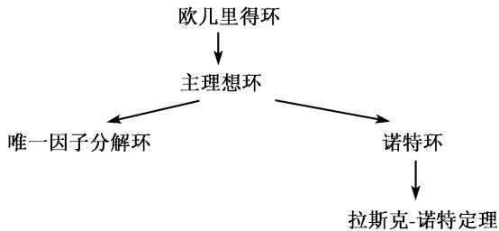

##### 2.7.11 理想和因子理论

每个整数可以写成素数乘积. 这个事实对于任意环不正确. 对于其更抽象的提法, 我们必须应用因子理论 (参照图 2.8).

理想论的出发点是库默尔 1843 年以来的工作, 其中包括费马大定理的不正确的 “证明”. 狄利克雷看出了这个错误, 具体地说, 就是数的素数分解在任意环中不成立. 据此, 库默尔研究了分解问题. 他引进了理想数, 使他能证明一般化的分解定理, 从而能够在某些特殊情形给出费马大定理的正确证明. 戴德金于 1871 年引进了理想的一般概念从而创立了理想论, 它现在应用于算子代数, 在现代数学物理中起着重要作用 (参看 [212]).

2.7.11.1 基本概念

设 R 是具有单位的整环, 亦即 R 是无零因子的交换环.

单位 R 的元素 $\varepsilon$ 称为单位, 如果 $\varepsilon^{-1}$ 也属于 R.

例 1: 在整数环 Z 中仅有的单位是 ±1.

素元 环的元素 $p$ 称为素的或不可约的, 如果 $p \neq 0$ , $p$ 不是单位且由分解式

$$
p = a b
$$

可推出 a 或 b 是单位.

唯一分解为素元 (之积) 环 R 称为因子分解环(或唯一因子分解环), 当且仅当环中每个非零元素可唯一地 (除因子顺序外) 表示为素元之积.

例 2: 整数环 Z 具有这种性质.

2.7.11.2 主理想整环和欧几里得环

设 R 是有单位的交换环.

理想 R 的非空集合 A 称为一个理想, 如果它具有下列两个性质:

(i) 从 $a, b \in \mathcal{A}$ 可推出 $a - b \in \mathcal{A}$ .

(ii) 由 $a \in \mathcal{A}$ 及 $r \in R$ 可得 $ra \in \mathcal{A}$ .

注意这些性质恰好是说 $\mathcal{A}$ 关于加法及与 $R$ 中的元素的标量乘法是封闭的. 因此, 理想是群论中的正规子群在环中的类似物. 实际上, 群论中将正规子群刻画为群同态的核的同态定理, 其类似物对于理想也成立: $R$ 的子集 $\mathcal{A}$ 是一个理想, 当且仅当它是环同态的核.

我们用 (a) 表示最小的包含元素 $a$ 的理想. 可明显地表示 $(a) = \{ra | r \in R\}$ . 这种理想称为主理想.

主理想环 一个有单位的整环称为主理想环, 当且仅当环中每个理想都是主理想.

定理 1 每个主理想环都有唯一分解为素元之积的性质.

欧几里得环 一个有单位的整环 $R$ 称为欧几里得环, 如果对于环中每个元素 $r \neq 0$ 存在整数 $h(r) \geqslant 0$ 使得

(i) $h(rs) \geqslant h(r)$ 对所有 $r \neq 0$ 及 $s \neq 0$ .

(ii) 对于环中任意两个元素 a 和 b, 且 $b \neq 0$ , 存在表达式

$$
a = q b + r,
$$

其中或者 r=0, 或者 $h(r)<h(b)$ . 函数 $h:\mathbb{R}\to\mathbb{Z}$ 称为高.

定理 2 每个欧几里得环是主理想环.

例 1: 整数环 Z 是欧几里得环, 且 $h(r) := |r|$ .

例 2: 如果 K 是一个域, 那么所有未定元 x 的系数在 K 中的多项式组成的环 $K[x]$ 是殴几里得环. 多项式的高是它的次数.

$K[x]$ 中的单位是 $K$ 中的非零元素. $K[x]$ 中的不可约元素称为不可约多项式.

多项式环 $K[x]$ 不是主理想环.

素理想和准素理想 设 A 是环 R 中的一个理想.

(i) A 称为素理想, 如果商环 $R/A$ 没有零因子.

(ii) $\mathcal{A}$ 称为准素理想, 如果 $R / \mathcal{A}$ 中的零因子是幂等元(亦即它的某个幂为零). 定理3 对于每个准素理想 $\mathcal{A}$ 存在素理想 $\mathcal{A}'$ , 它由 $R$ 中所有为 $\mathcal{A}$ 的元素的某个幂的那些元素组成.

例 3: 在整数环 Z 中, 理想 $(p)$ 是素理想, 当且仅当 p 是素数 (这个事实解释了素理想这个术语).

另外, $(a)$ 是准素理想,如果 a 是某个素数的幂.

  
图 2.8 不同类型的环间的关系

2.7.11.3 拉斯克-诺特定理

我们用 $(a_{1},\cdots,a_{n})$ 表示最小的含有元素 $a_{1},\cdots,a_{s}$ 的理想 (我们还称它为由元素 $a_{1},\cdots,a_{s}$ 生成的环).

诺特环 一个环称为诺特环, 如果它是交换的, 并且它的每个理想都是由有限多个元素生成.

希尔伯特基定定理(1983) 如果 R 是具有单位的诺特环, 那么每个 n 个未知元系数在 R 中的多项式环 $R[x_{1}, \cdots, x_{n}]$ 也是这样的环.

下列定理是因子理论中的主要结果.

E. 拉斯克 (Lasker)(1905) 和 E. 诺特 (Noether)(1926) 定理 设 $R$ 是诺特环. 那么 $R$ 中的每个理想可以不可缩减地表示为一些准素理想的交, 且与这些准素理想相伴的素理数互不相同.

任何两个这样的表示中准素理想 (除顺序外) 个数相同, 且具有相同的相伴素理想.

理想的乘积 设 A 和 B 是环 R 中两个理想, 我们用

$$
\mathcal {A B}
$$

表示最小的包含所有乘积 $ab$ (其中 $a \in \mathcal{A}, b \in \mathcal{B}$ ) 的理想. 另外, 交 $\mathcal{A} \cap \mathcal{B}$ 和理想论中的和 $\mathcal{A} + \mathcal{B} := \{a + b | a \in \mathcal{A}, b \in \mathcal{B}\}$ 也是理想.
