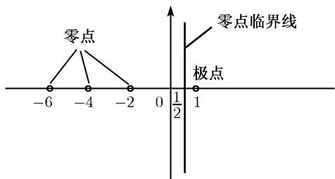

##### 2.7.3 素数分布

我想我要对柏林科学院给予我的荣誉表示感谢, 他们委任我为科学院通讯员, 使我立即可以借助这种身份提交我关于素数频率的研究结果; 这是长期以来高斯和狄利克雷感兴趣的问题, 看来值得重新将它提起. $^{1)}$

B. 黎曼 (1859)

数论的主要问题之一是揭示素数分布的规律.

间隙定理 数 $n! + 2, n! + 3, \cdots, n! + n (n = 2, 3, 4, \cdots)$ 不是素数，并且当 n 增长时非素数集合（素数集合中的间隙）将越来越长.

狄利克雷算术级数定理(1837) 如果 a 和 d 是两个互素的自然数, 那么数列 $^{1)}$

$$
\boxed {a, a + d, a + 2 d, a + 3 d, \dots}\tag{2.70}
$$

含有无穷多个素数.

例1：取 $a = 3$ 及 $d = 5$ .我们得到序列

$$
3, 8, 1 3, 1 8, 2 3, \dots ,
$$

其中含有无穷多个素数.

推论 对于任意实数 $x \geqslant 2$ , 定义 $P_{a,d}(x) := (2.70)$ 中所有满足 $p \leqslant x$ 的素数 $p$ 的集合. 那么有

$$
\boxed {\sum_ {p \in P _ {a, d} (x)} \frac {\ln p}{p} = \frac {1}{\varphi (d)} \ln x + O (1), \quad x \to + \infty ,}\tag{P}
$$

其中 $\varphi$ 表示欧拉函数 (参看 2.7.2), 余项 $O(1)$ 与 a 无关. 在例 1 中有 $\varphi(d)=4$ .

公式 (P) 恰好是说所有具有常数公差 d 的数列 (2.70) 含有个数 “渐近” 相等的素数, 且与 a 值无关.

特别地, 当 a = 2 及 d = 1 时 (2.70) 含有所有素数. 此时有 $\varphi(d) = 1$ .

解析数论 在上述定理的证明中, 狄利克雷将某些全新的方法引进数论 (即傅里叶级数、狄利克雷级数及 $L$ 级数), 它们在代数数论中也是基本的. 这样, 他开创了一个新的数学分支——解析数论. $^{2)}$

2.7.3.1 素数定理

素数分布函数 对于任意实数 $x \geqslant 2$ ，定义

$$
\boxed {\pi (x) := \text {不超过} x \text {的素数的个数}.}
$$

勒让德定理(1798) $\lim_{x\to \infty}\frac{\pi(x)}{x} = 0.$

因此, 比起自然数, 素数相当少.

1) (2.70) 中的数列是一个算术级数, 即相邻两项之差是常数:

如果 a, d 不互素, 那么 (2.70) 中始终不出现素数, 除非 a 本身是素数.

2) 当高斯于 1855 年去世后, 狄利克雷 (1805–1859) 成为他在哥廷根的继任人. 1859 年黎曼受命担当这个哥廷根的著名职位. F. 克莱因从 1886 年起直到 1925 年去世, 也在哥廷根, 希尔伯特 1895 年被克莱因引荐到哥廷根, 他在此一直工作到 1930 年退休.

在 20 世纪 20 年代, 哥廷根是引领世界的数学和物理中心. 1933 年许多顶尖科学家移居国外, 因而哥廷根丧失了它在世界科学中心中的超级地位.

素数基本定理 对于大数 x, 我们有下列渐近等式 $^{1)}$ :

$$
\boxed {\pi (x) \sim \frac {x}{\ln x} \sim \operatorname{li} x, x \to + \infty .}
$$

这是数学中最著名的渐近公式. 表 2.5 将 $\pi(x)$ 与 lix 作了比较.

表2.5

<table><tr><td>x</td><td>π(x)</td><td>lix</td></tr><tr><td> $10^3$ </td><td>168</td><td>178</td></tr><tr><td> $10^6$ </td><td>78498</td><td>78628</td></tr><tr><td> $10^9$ </td><td>50847534</td><td>50849235</td></tr></table>

欧拉(1707—1783) 还相信素数是完全不规则地分布的. $\pi(x)$ 的渐近分布是 33 岁的勒让德于 1785 年以及 14 岁的高斯于 1792 年通过对对数表的深入研究独立地发现的.

素数定理的严格证明是 30 岁的 J. 阿达马(1865—1893) 及 30 岁的 C.J. 德拉瓦莱普桑(de la Valleé-Poussin) 于 1896 年独立地给出的. 如果 $p_n$ 表示第 $n$ 个素数, 那么我们有

$$
\boxed {p _ {n} \sim n \mathrm{ln}   n, \quad n \to + \infty .}
$$

误差估计 存在正常数 A 和 B 使对所有 $x \geqslant 2$ 有

$$
\pi (x) = \frac {x}{\ln x} (1 + r (x)),
$$

以及

$$
{\frac {A}{\ln x}} \leqslant r (x) \leqslant {\frac {B}{\ln x}}.
$$

黎曼陈述 我们有更为精密的估计：如果黎曼猜想 (2.72) 成立, $^{2)}$ 那么

$$
\boxed {| \pi (x) - \operatorname{li} x | \leqslant \text {常数} \cdot \sqrt {x} \ln x, \quad \text {当所有} x \geqslant 2.}
$$

1) 这对应于明显的极限关系式

$$
\lim _ {x \to + \infty} \frac {\pi (x)}{\left(\frac {x}{\ln x}\right)} = \lim _ {x \to + \infty} \frac {\pi (x)}{\operatorname{li} x} = 1.
$$

对数积分的定义是

$$
\operatorname{li} x := P V \int_ {0} ^ {x} \frac {\mathrm{d} t}{\ln t} = \lim _ {\varepsilon \rightarrow + \infty} \left(\int_ {0} ^ {1 - \varepsilon} \frac {\mathrm{d} t}{\ln t} + \int_ {1 + \varepsilon} ^ {x} \frac {\mathrm{d} t}{\ln t}\right).
$$

2) 1914 年李特尔伍德证明了当 x 增长时差 $\pi(x)-\operatorname{li}x$ 无穷多次变号. 但若 $x_{0}$ 表示第一次变号时的 x 值, 那么根据 S. 斯凯韦斯 (Skewes, 1955) 的结果, 有 $10^{700}<x_{0}<10^{10^{1034}}$ .

黎曼 $\zeta$ 函数 黎曼考虑了函数

$$
\boxed {\zeta (s) := \sum_ {n = 1} ^ {\infty} \frac {1}{n ^ {s}}, \quad s \in \mathbb {C}, \operatorname{Res} > 1.}
$$

下列结果产生这个函数与素数理论的惊人的关系:

欧拉定理(1737) 对于所有实数 s > 1, 有

$$
\boxed {\prod_ {p} \left(1 - \frac {1}{p ^ {s}}\right) ^ {- 1} = \zeta (s),}\tag{2.71}
$$

其中乘积展布在所有素数 p 上. 这表明:

$$
\text { 黎曼 } \zeta \text { 函数解密了所有素数的集合的结构. }
$$

黎曼定理(1859)

(i) $\zeta$ 函数可以扩充为 $\mathbb{C} - \{1\}$ 上的解析函数, 并且在 $s = 1$ 有一阶极点, 而在此处的留数等于 1, 亦即对所有复数 $s \neq 1$ 有

$$
\zeta (x) = {\frac {1}{s - 1}} + \text {   在点   } s \text {   附近的幂级数.   }
$$

例如, $\zeta(0) = -\frac{1}{2}$ .

(ii) 对所有复数 $s \neq 1$ 有函数方程

$$
\boxed {\pi^ {- \frac {s}{2}} \Gamma \left(\frac {s}{2}\right) \zeta (s) = \pi^ {(s - 1) / 2} \Gamma \left(\frac {1}{2} - \frac {s}{2}\right) \zeta (1 - s).}
$$

(iii) $\zeta$ 函数在 $s = -2k (k = 1, 2, \cdots)$ 有所谓平凡零点 (图 2.5).

  
图 2.5 黎曼 $\zeta$ 函数

2.7.3.2 著名的黎曼猜想

1859 年黎曼提出了下列猜想:

$$
\boxed {\zeta \text {函数的所有非平凡零点都在复平面中临界线} \mathrm{Re} s = \frac {1}{2} \text {上}.}\tag{2.72}
$$

哈代定理(1914) 临界线 $\operatorname{Re}s = \frac{1}{2}$ 上有黎曼 $\zeta$ 函数的无穷多个零点.1)

现在已知有一系列不同类型但都与黎曼猜想等价的命题, 大量的借助于超级计算机完成的富有想象力的方案和试验从未给出黎曼猜想不成立的迹象, 已计算出临界线上数十亿个零点. 精密的渐近估计表明 $\zeta$ 函数的全部零点中至少有 $\frac{1}{3}$ 在临界线上.

2.7.3.3 黎曼 $\zeta$ 函数与统计物理学

统计物理学的基本认知功能是可以借助配分函数

$$
\mathcal {L} = \sum_ {n = 1} ^ {\infty} E ^ {- E _ {n} / k T}\tag{2.73}
$$

从固定个数的粒子的能量状态 $E_{1}, E_{2}, \cdots$ 得出统计系统的所有物理性质. 此处 T 是系统的绝对温度, k 是玻尔兹曼常量. 如果我们令

$$
E _ {n} := k t s \cdot \ln n, \quad n = 1, 2, \dots ,
$$

那么我们有

$$
\boxed {\mathcal {L} = \zeta (s).}
$$

这表明黎曼 $\zeta$ 函数是一个特殊配分函数, 这说明了这样的事实: 与 $\zeta$ 函数类似类型的函数对处理统计物理学的模型确实是重要的 (并且在超级计算机上不仅仅是近似的).

2.7.3.4 黎曼 $\zeta$ 函数与物理学中的重正规化

不幸的是, 发散的表达式常常在统计物理学及量子场论中出现. 物理学家发展了不少巧妙的方法去克服这些困难并使这些最初无意义 (发散) 的表达式具有某种意义. 这就是物理学中范围广阔的重正规化; 在量子电动力学和标准模型中, 尽管在数学推理上有含糊性, 但它们在现象上与实验证据能很好地符合. $^{2)}$

例： $n\times n$ 单位方阵 $\pmb{I}_n$ 的迹的值是

$$
\operatorname{tr} I _ {n} = 1 + 1 + \dots + 1 = n.
$$

对于无穷单位方阵 I 我们得到迹

$$
\operatorname{tr} \boldsymbol {I} = \lim _ {n \to \infty} n = \infty .
$$

为了赋予 $\operatorname{tr} I$ 一个有意义的有限值, 考虑方程

$$
\zeta (s) = \sum_ {n = 1} ^ {\infty} \frac {1}{n ^ {s}}.\tag{2.74}
$$

当 $\operatorname{Re}s > 1$ 时在收敛级数的意义下这是一个正确的公式. 按照黎曼定理, 它的左边可以扩充为一个解析函数, 它对于每个复数 $s \neq 1$ 赋予一个确定的值. 利用这个事实, 我们可以将 (2.74) 的右边定义为这个确定的值. 在特殊情形 $s = 0$ , 右边形式上是 $1 + 1 + 1 + \dots$ . 因此可以通过

$$
\boxed {\operatorname{tr} \boldsymbol {I} _ {\text {ren}} := \zeta (0) = - \frac {1}{2}}
$$

定义 tr I 的重正规化值. 在此, 正数的 “无穷和” $1 + 1 + 1 + \cdots$ 奇妙地给出一个负数作为结果!

2.7.3.5 素数 mod m 的狄利克雷局部化原理

设 $m$ 是正自然数．狄利克雷为了证明他的素数分布基本定理，将欧拉定理(2.71)写成下列形式：

$$
\boxed {\prod_ {p} \left(1 - \frac {\chi_ {m} (p)}{p ^ {s}}\right) ^ {- 1} = L (s, \chi_ {m}), \quad \text {当所有} s > 1,}
$$

其中乘积展布在所有素数 p 上. 在此已令

$$
L (s, \chi_ {m}) := \sum_ {n = 1} ^ {\infty} \frac {\chi_ {m} (n)}{n ^ {s}},
$$

这个级数称为狄利克雷 L 级数, 符号 $\chi_{m}$ 表示狄利克雷特征, 这是一个模 m 的特征, 定义是:

(i) 映射 $\chi^{\prime}:\mathbb{Z}/m\mathbb{Z}\to\mathbb{C}-\{0\}$ 是一个群同态 $^{1)}$ .

(ii) 对所有 $g \in \mathbb{Z}$ 我们令

$$
\chi_ {m} (g) := \left\{ \begin{array}{l l} {\chi^ {\prime} ([ g ]),} & {\text {当} \operatorname * {g c d} (g, m) = 1,} \\ {0,} & {\text {其他情形}.} \end{array} \right.
$$

例：如果 $m = 1$ ，我们得 $\chi_1(g) = 1$ 对所有 $g\in \mathbb{Z}$ ，那么

$$
L (s, \chi_ {1}) = \zeta (s) \quad {\text {当所有}} s > 1.
$$

于是狄利克雷 L 级数推广了黎曼 $\zeta$ 函数. 粗略地讲, 我们有

$$
\text { 狄利克雷函数 } L (\cdot , \chi_ {m}) \text { 解密了素数 } (\mathrm{mod} m) \text { 集合的结构. }
$$

L 函数理论可以推广到其他代数对象, 特别是代数数域.

1) 如果 $[g] = g + m\mathbb{Z}$ 表示 $g$ 模 $m$ 的剩余类 (参看2.5.2)，那么我们有 $\chi'([g]) \neq 0$ ，并且 $\chi'([g][t]) = \chi'([g])\chi'([t])$ 对所有 $g, t \in \mathbb{Z}$ .

2.7.3.6 孪生素数猜想

恰好相差 2 的两个不同素数称为孪生素数. 例如素数对 3 与 5, 5 与 7, 以及 11 与 13. 一般地, 我们猜想存在无穷多对孪生素数.
