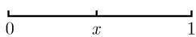

##### 2.7.5 用有理数及连分数逼近无理数

我们考虑可以怎样用有理数逼近无理数的问题. 在这个考虑中, 连分数起着中心作用. 连分数最初出现于 17 世纪. 例如 C. 惠更斯(Huygens,1629—1695) 在其太阳系齿轮模型的结构中偶尔使用过连分数, 最后试图用来逼近具有尽可能少的齿的行星周期间的关系. 连分数理论可回溯到欧拉(1707—1783). 与十进表达式不同, 连分数给出实数的好结构的信息. 例如, 无理数通过有理数的最佳逼近是借助连分数解决的 (参看 2.7.5.3). 通常连分数比幂级数要更为有效, 它们还用多种方式应用于计算机算法中.

基本思想 由恒等式

$$
\sqrt {2} = 1 + \frac {1}{1 + \sqrt {2}}
$$

通过反复代入可得

$$
\sqrt {2} = 1 + \frac {1}{1 + \left(1 + \frac {1}{1 + \sqrt {2}}\right)}
$$

及

$$
\sqrt {2} = 1 + \frac {1}{2 + \frac {1}{2 + \frac {1}{1 + \sqrt {2}}}}, \text {等等}.\tag{2.75}
$$

2.7.5.1 有限连分数

定义 有限连分数是下列形式的表达式:

$$
\begin{array}{c} a _ {0} + \frac {1}{a _ {1} + \frac {1}{a _ {2} + \frac {1}{a _ {3} + \cdots \ddots \frac {1}{a _ {n - 1} + \frac {1}{a _ {n}}}}}}. \end{array}
$$

对此还使用符号

$$
\left[ a _ {0}, a _ {1}, \dots , a _ {n} \right],
$$

其中 $a_{0}, a_{1}, \cdots, a_{n}$ 是实数或复数，除 $a_{0}$ 外总假定它们非零.
例 1:

$$
1 + \frac {1}{1 + \frac {1}{1 + \frac {1}{2}}} = 1 + \frac {1}{1 + \frac {2}{3}} = 1 + \frac {3}{5} = \frac {8}{5}.
$$

例 2:

$$
\begin{array}{l} \left[ a _ {0}, a _ {1} \right] = a _ {0} + \frac {1}{a _ {1}}, \\ \left[ a _ {0}, a _ {1}, a _ {2} \right] = a _ {0} + \frac {1}{a _ {1} + \frac {1}{a _ {2}}} = a _ {0} + \frac {a _ {2}}{a _ {1} a _ {2} + 1}. \end{array}
$$

递推公式 有

$$
\boxed {[ a _ {0}, a _ {1}, \dots , a _ {n} ] = a _ {0} + \frac {1}{[ a _ {1} , \cdots , a _ {n} ]}.}
$$

有效算法 如果应用迭代程序

$$
\begin{array}{l} p _ {k} = a _ {k} p _ {k - 1} + p _ {k - 2}, \\ q _ {k} = a _ {k} q _ {k - 1} + q _ {k - 2}, \end{array} \quad k = 0, 1, \dots , n\tag{2.76}
$$

并取初值 $p_{-2} := 0, p_{-1} := 1$ 及 $q_{-2} := 1, q_{-1} := 0$ ，那么有

$$
\boxed {[ a _ {0}, a _ {1}, \dots , a _ {n} ] = \frac {p _ {n}}{q _ {n}}, \quad n = 0, 1, \dots .}
$$

例 3: 为应用 (2.76) 方便地算出

$$
[ 2, 1, 2, 1 ] = \frac {1 1}{4},
$$

我们应用表 2.6 所示的方法, 在第 3 行出现的每个数都是它正上方的数 $a_{n}$ 与每 3 行中它前面那个数之积加上同行中前一数之前的数而得到. 第 4 行中的数也是类似地算出的.

表 2.6 连分数计算

<table><tr><td>n</td><td>-2</td><td>-1</td><td>0</td><td>1</td><td>2</td><td>3</td><td>连分数的长度</td></tr><tr><td>an</td><td></td><td></td><td>2</td><td>1</td><td>2</td><td>1</td><td>连分数的分量</td></tr><tr><td>pn</td><td>0</td><td>1</td><td>2</td><td>3</td><td>8</td><td>11</td><td>迭代值</td></tr><tr><td>qn</td><td>1</td><td>0</td><td>1</td><td>1</td><td>3</td><td>4</td><td>迭代值</td></tr><tr><td> $\frac{p_n}{q_n}$ </td><td></td><td></td><td> $\frac{2}{1}$ </td><td> $\frac{3}{1}$ </td><td> $\frac{8}{3}$ </td><td> $\frac{11}{4}$ </td><td>典范近似分数</td></tr></table>

2.7.5.2 无限连分数

定义 无限连分数是一个有限连分数

$$
\frac {p _ {n}}{q _ {n}} = [ a _ {0}, a _ {1}, \dots , a _ {n} ]
$$

的序列 $\left(\frac{p_n}{q_n}\right)$ , 我们将它记作

$$
\boxed {\left[ a _ {0}, a _ {1}, \dots \right].}\tag{2.77}
$$

无限连分数 (2.77) 称作收敛的, 如果存在有限极限

$$
\boxed {\lim _ {n \to \infty} \frac {p _ {n}}{q _ {n}} = \alpha ,}
$$

于是我们将数 $\alpha$ 与无限连分数 (2.77) 相伴.

收敛性判别法 无穷连分数 (2.77) 收敛, 当且仅当无穷级数

$$
\sum_ {n = 1} ^ {\infty} a _ {n}
$$

发散. 我们还有区间套

$$
\boxed {\frac {p _ {2 m}}{q _ {2 m}} <   \alpha <   \frac {p _ {2 m + 1}}{q _ {2 m + 1}}, \quad m = 0, 1, 2, \dots ,}\tag{2.78}
$$

以及 (一般地说) 更为精密的误差估计 (2.83).

例 1: 连分数 $[a_{0}, a_{1}, \cdots]$ 称为正则的, 如果所有 $a_{j}$ 是整数且 $a_{j} > 0$ 当所有 $j \geqslant 1$ . 每个这种连分数都是收敛的.

例 2: 连分数 $[1, \overline{2}] = [1, 2, 2, \cdots]$ 收敛. $^{1)}$ 依据 (2.75), 我们有

$$
\boxed {\sqrt {2} = [ 1, \overline {{2}} ].}
$$

实数通过连分数唯一表示 每个实数 $\alpha$ 可以唯一地写成连分数. 对这种表达式, 我们有

(i) 如果对应的连分数是有限的, 那么 $\alpha$ 是有理数 $^{2)}$ .

(ii) 如果对应的连分数是无限的, 那么 $\alpha$ 是无理数.

这个定理为我们给出确定实数无理性的一般性工具. 我们可以计算它们的连分数, 然后检验连分数是否无限.

例 3: 数 $\sqrt{2}$ 是无理数, 因为由例 2 知它的连分数是无限的.

构造迭代 令 $\rho_0 := \alpha$ , 可以借助下列 (修饰的) 欧几里得算法确定 $\alpha$ 的连分数. $^{3)}$

$$
\boxed { \begin{array}{l} {\rho_ {0} = [ \rho_ {0} ] + \frac {1}{\rho_ {1}},} \\ {\rho_ {1} = [ \rho_ {1} ] + \frac {1}{\rho_ {2}},} \\ {\rho_ {2} = [ \rho_ {2} ] + \frac {1}{\rho_ {3}}, \text {等等}} \end{array} }\tag{2.79}
$$

1)为简单记, 用上方横线表示周期. 例如

$$
[ a, b, \overline {{c , d}} ] = [ a, b, c, d, c, d, c, d, \dots ].
$$

2) 为了避免在有理数 $\alpha$ 的表示 $\alpha = [a_{0}, a_{1}, \cdots, a_{n}]$ 中出现明显的歧义，还假定 $a_{n} \neq 1$ 对所有 $n \geqslant 1$ ，这里给出的算法自动地采取这个约定.

3) 此处符号 $[x]$ 表示不超过 x 的最大整数 (高斯方括号).

当在某一步余数为零时则迭代结束, 如果令 $a_{0} := [\rho_{0}], a_{1} := [\rho_{1}], \cdots$ , 那么有

$$
\boxed {\alpha = [ a _ {0}, a _ {1}, \dots ].}
$$

例 4: 对于 $\alpha = \frac{10}{7}$ ，得

$$
\frac {1 0}{7} = \boxed {1} + \frac {3}{7},
$$

$$
\frac {3}{7} = \boxed {2} + \frac {1}{3},
$$

$$
\frac {3}{1} = \boxed {3}.
$$

这产生 $\frac{10}{7} = [1,2,3]$ .

例 5: 欧拉确定了数 e 的简洁的连分数表达式

$$
\boxed {\mathrm{e} = [ 2, \overline {{1 , 2 n , 1}} ] _ {n = 1} ^ {\infty}.}\tag{2.80}
$$

这表明 $e = [2, 1, 2, 1, 1, 4, 1, 1, 6, 1, \cdots]$ . 因为这个连分数是无限的, 欧拉在 1737 年就能证明 e 的无理性. 直到 150 年后埃尔米特才能够证明 e 的超越性.

实际上, 欧拉首先推导出公式

$$
\frac {\mathrm{e} ^ {k / 2} + 1}{\mathrm{e} ^ {k / 2} - 1} = [ k, 3 k, 5 k, \dots ], \quad k = 1, 2, \dots .
$$

然后在能给出严格证明前先猜出公式 (2.80). 更多的连分数可在表 2.7 中找到.

表 2.7 一些特殊实数的连分数

<table><tr><td>实数</td><td>连分数</td></tr><tr><td> $\frac{1}{2}(\sqrt{5}-1)$ (黄金比)</td><td>[0, 1]</td></tr><tr><td> $\frac{1}{2}(\sqrt{5}-1)$ </td><td>[1]</td></tr><tr><td> $\sqrt{2}$ </td><td>[1, 2]</td></tr><tr><td> $\sqrt{3}$ </td><td>[1, 1, 2]</td></tr><tr><td> $\sqrt{4}$ </td><td>[2]</td></tr><tr><td> $\sqrt{5}$ </td><td>[2, 4]</td></tr><tr><td> $\sqrt{6}$ </td><td>[2, 2, 4]</td></tr><tr><td> $\sqrt{7}$ </td><td>[2, 1, 1, 1, 4]</td></tr><tr><td>e</td><td> $[2, \overline{1, 2n, 1}]_{n=1}^{\infty}$ </td></tr><tr><td> $\pi$ </td><td>[3, 7, 15, 1, 292, 1, 1, 1, 2, 1, 3, 1, 14,  $\cdots$ ] (没有显然表达式)</td></tr></table>

黄金比 如果在点 $x$ 处分割单位线段[0,1],其中

$$
\boxed {\frac {1}{x} = \frac {x}{1 - x},}\tag{2.81}
$$

  
图 2.6 黄金比

于是得到自古称为黄金比的分割, 它被认为在雕塑、绘画及建筑中具有特殊的审美价值 (图 2.6). 由 (2.81) 推出 $x^{2} + x - 1 = 0$ , 亦即

$$
x = \frac {1}{2} (\sqrt {5} - 1) = 0. 6 1 8 \dots ,
$$

且有连分数展开式

$$
x = [ 0, \overline {{1}} ] = [ 0, 1, 1, 1, \dots ].
$$

值得注意这个数具有最简单的连分数.

2.7.5.3 最佳有理逼近

主定理 设 $\alpha$ 是实无理数, $n \geqslant 2$ 那么当 p 和 q 是满足关系式

$$
o <   q \leqslant q _ {n}, \quad \frac {p}{q} \neq \frac {p _ {n}}{q _ {n}}
$$

的整数时, 有 $^{1)}$

$$
\boxed {\left| \alpha - \frac {p _ {n}}{q _ {n}} \right| <   \left| \alpha - \frac {p}{q} \right|.}\tag{2.82}
$$

推论 设 $n=0,1,2,\cdots$ 。对于实数用有理数逼近的误差，有估值

$$
\boxed {\frac {1}{q _ {n} \left(q _ {n} + q _ {n + 1}\right)} <   \left| \alpha - \frac {p _ {n}}{q _ {n}} \right| \leqslant \frac {1}{q _ {n} q _ {n + 1}}.}\tag{2.83}
$$

例 1 (黄金比): 黄金比数 $\alpha_{g} = \frac{1}{2}(\sqrt{5} - 1)$ 有连分数表达式 $\alpha_{g} = [0, \overline{1}]$ . 对 $n = 0, 1, \cdots$ 典范近似分数是

$$
\frac {p _ {n}}{q _ {n}} = \frac {0}{1}, \frac {1}{1}, \frac {1}{2}, \frac {2}{3}, \frac {3}{5}, \frac {5}{8}, \frac {8}{1 3}, \frac {1 3}{2 1}, \dots .
$$

因此 $\frac{8}{13}$ 是 $\alpha_{g}$ 的分母 $\leqslant 13$ 的最佳有理逼近. 由 (2.8.3) 得误差估计

$$
\left| \alpha_ {g} - \frac {8}{1 3} \right| \leqslant \frac {1}{q _ {6} q _ {7}} = \frac {1}{1 3 \cdot 2 1} <   \frac {4}{1 0 0 0}
$$

例 2: 对于 $\sqrt{2} = [1, 2, 2, 2, \cdots]$ 我们得到典范近似分数

$$
1, \quad \frac {3}{2}, \quad \frac {7}{5}, \quad \frac {1 7}{1 2}, \quad \frac {4 1}{2 9}, \quad \dots ,
$$

因此 $\frac{17}{12}$ 是 $\sqrt{2}$ 的分母 $\leqslant 12$ 的最佳有理逼近, 由 (2.83) 得误差估计

$$
\left| \sqrt {2} - \frac {1 7}{1 2} \right| \leqslant \frac {1}{1 2 \cdot 2 9} <   \frac {3}{1 0 0 0}.
$$

例 3: 对于 $e = [2, 1, 2, 1, 1, 4, 1, \cdots]$ ，典范近似分数是

$$
\frac {2}{1}, \quad \frac {3}{1}, \quad \frac {8}{3}, \quad \frac {1 1}{4}, \quad \frac {1 9}{7}, \quad \frac {8 7}{3 2}, \quad \frac {1 0 6}{3 9}, \quad \dots .
$$

因此 $\frac{87}{32}$ 是 $\mathbf{e}$ 的分母 $\leqslant 32$ 的最佳有理逼近. 另外, 还有误差估计

$$
\left| \mathrm{e} - \frac {8 7}{3 2} \right| \leqslant \frac {1}{3 2 \cdot 3 9} <   \frac {1}{1 0 0 0}.
$$

确定最优有理逼近在与圆周长的逼近有关的数学史中起着特殊的作用 (即 $\pi$ 的逼近, 参看 2.7.7).

狄利克雷丢番图逼近定理(1842) 实数 $\alpha$ 是无理数, 当且仅当不等式

$$
| q \alpha - p | <   \frac {1}{q}
$$

有无穷多对互素整数解 p 及 q > 0.

赫尔维茨最优逼近定理(1891) 对每个无理数 $\alpha$ 不等式

$$
\left| \alpha - \frac {p}{q} \right| <   \frac {1}{\sqrt {5} q ^ {2}}\tag{2.84}
$$

有无穷多个有理解 $\frac{p}{q}$ .

常数 $\sqrt{5}$ 是最优的. $^{1)}$ 黄金比数 $\alpha_{g}=\frac{1}{2}(\sqrt{5}-1)$ 是可最差地逼近的数. $^{2)}$ 就此意义而言, $\alpha_{g}$ 就所有实数中 “最无理的”.

黄金比在混沌理论中的作用 如果我们有两个耦合振荡系统, 其角频率为 $\omega_{1}$ 和 $\omega_{2}$ , 那么共振情形

$$
\boxed {\frac {\omega_ {1}}{\omega_ {2}} = \mathrm{有理数}}
$$

是特别危险的, 就实际情况而言, 在计算机上只存在有理数. 但经验表明商 $\omega_{1} / \omega_{2}$ 的无理性可以应用例 1 中黄金比的典范近似分数在计算机上对 $\omega_{1} / \omega_{2}$ 进行模拟 (参看 [212], KAM 理论).
