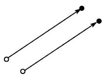
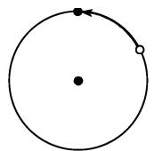

#### 3.1 由克莱因的埃尔兰根纲领所概括的几何学的基本思想

古代所知道的几何学是欧几里得几何, 它在 2000 多年来一直处于数学中的支配地位. 关于非欧几何的存在问题在 19 世纪导致了一系列不同几何的描述. 当这种情形被认定时, 自然要考虑的便是所有可能的几何的分类问题. F. 克莱因 (Felix Klein) 在他 23 岁时解决了这个问题, 并在 1872 年以其埃尔兰根纲领 (Erlanger Program) 表明几何可以借助于群论方便地分类. 一种几何要求有一个变换群 $G$ . 每个在此群 $G$ 作用下保持不变的性质或量是这个相关几何的性质, 因而这个几何也被称为一个 $G$ 几何. 本章将不断地使用这个分类原理. 我们将用欧氏几何和所谓的相似几何作为例子对此基本思想进行解释.

欧氏几何 (运动的几何) 考虑一个平面 $E$ . 以 $\operatorname{Aut}(E)$ 表示 $E$ 到自身的所有这样一些映射的集合, 它们是下面一些类型变换的复合 (是自同构的一个特殊情形, 因此用此记号):

(i) 平移;

(ii) 绕一点的旋转;

(iii) 对一固定直线的反射. (图 3.1)

称这些变换的复合即 $\operatorname{Aut}(E)$ 中的元素为 $E$ 的一个运动 $^{1)}$ . 以

表示 g 和 h 复合的变换, 即首先应用 g, 然后用 h. 用此乘法, 集合得到了一个群的结构 (自同构群的一个特殊情形). 这个群的单位元是恒同运动 (根本不动).

  
(a) 平移

  
(b) 绕一点的旋转

  
(c) 对固定直线的反射

  
图 3.1 平面的运动  
(d) 相似变换

按照定义, 在此群下不变的性质和量的集合属于此平面的欧几里得几何. 它的例子是 “线段的长” 或者 “一个圆的半径”.

全等 该平面的两个子集 (例如, 两个三角形) 被称作全等, 如果可由 $\operatorname{Aut}(E)$ 中的一个变换把它们相互映射成对方. 平面三角形的熟知的全等定理便是欧氏几何的结果 (见 3.2.1.5).

相似几何 一个特殊相似变换是平面 $E$ 的一个变换, 它把通过一个选定点 $P$ 的所有直线映到自己, 同时把从 $P$ 到其他某个点的距离乘以一个固定的 (正) 常数. 我们以 $\operatorname{Sim}(E)$ 代表 $E$ 的所有上述运动和相似变换复合的集合. 于是

$\operatorname {Sim}(E)$

以上面同样的乘法形成了一个群, 称其为相似变换群.

“线段的长”的概念不是这个几何的一个概念. 但是 “两条线段的比值” 的概念则是.

相似性 称 $E$ 的两个子集 (例如, 两个三角形) 相似, 如果它们由一个相似变换相关联, 即如果存在一个相似变换, 它把其中一个变到另一个. 平面中所熟知的三角形相似定理是这种几何的定理.

每个技术性绘图都是对所透视对象的相似.
