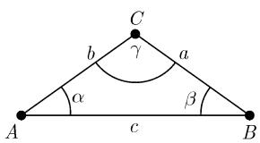
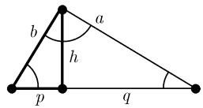
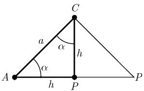
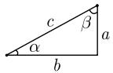
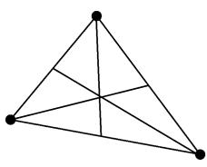
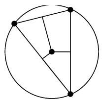
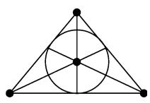
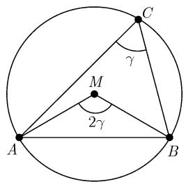
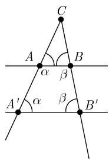

##### 3.2.1 平面三角学

记号 一个平面三角形的组成是: 称为顶点的三个不共线的点, 以及连接这三个点中每两个的三条线段, 称它们为边. 我们以 a, b, c 记这些边 $^{1)}$ , 记它们的对角分别为

$\alpha,\beta,\gamma$ (图 3.2(a)). 进一步, 令

$$
s = {\frac {1}{2}} (a + b + c) (\text { 半周长 }),
$$

F 为表面面积, $h_{a}$ 为三角形在边 a 上的高, R 为外接圆的半径, r 为内切圆的半径.

外接圆是包含整个三角形的最小的圆, 它通过所有这三个顶点. 内切圆是包含在此三角形内最大的圆.

  
(a)

  
(b)  
图 3.2 平面三角形的各种量

3.2.1.1 三角形的四个基本定律

和角定律

$$
\left| \alpha + \beta + \gamma = \pi . \right|\tag{3.1}
$$

余弦定律

$$
c ^ {2} = a ^ {2} + b ^ {2} - 2 a b \cos \gamma .\tag{3.2}
$$

正弦定律

$$
\boxed {\frac {a}{b} = \frac {\sin \alpha}{\sin \beta}.}\tag{3.3}
$$

正切定律

$$
\boxed {\frac {a - b}{a + b} = \frac {\tan \frac {\alpha - \beta}{2}}{\tan \frac {\alpha + \beta}{2}} = \frac {\tan \frac {\alpha - \beta}{2}}{\cot \frac {\gamma}{2}}.}\tag{3.4}
$$

三角不等式 $c < a + b$ .

周长 $C = a + b + c = 2s.$

高 对于在边 a 上的三角形的高有 (图 3.2(b))

$$
\boxed {h _ {a} = b \sin \gamma = c \sin \beta .}
$$

面积 由高的公式得到

$$
\boxed {A = \frac {1}{2} h _ {a} a = \frac {1}{2} a b \cdot \sin \gamma .}
$$

用语言表达：一个三角形的面积等于一条边的长和这条边上的高的乘积的一半.

又, 也可以使用海伦公式 $^{1)}$ :

$$
\boxed {A = \sqrt {s (s - a) (s - b) (s - c)} = r s.}
$$

用语言表达: 一个三角形的面积等于内切圆半径和三角形周长乘积的一半.

关于三角形的更多的公式

半角公式：

$$
\sin {\frac {\gamma}{2}} = \sqrt {\frac {(s - a) (s - b)}{a b}},
$$

$$
\cos {\frac {\gamma}{2}} = \sqrt {\frac {s (s - c)}{a b}}, \quad \tan {\frac {\gamma}{2}} = \frac {\sin {\frac {\gamma}{2}}}{\cos {\frac {\gamma}{2}}}.
$$

莫尔韦德公式：

$$
{\frac {a + b}{c}} = {\frac {\cos {\frac {\alpha - \beta}{2}}}{\cos {\frac {\alpha + \beta}{2}}}} = {\frac {\cos {\frac {\alpha - \beta}{2}}}{\sin {\frac {\gamma}{2}}}},
$$

$$
{\frac {a - b}{c}} = {\frac {\sin {\frac {\alpha - \beta}{2}}}{\sin {\frac {\alpha + \beta}{2}}}} = {\frac {\sin {\frac {\alpha - \beta}{2}}}{\cos {\frac {\gamma}{2}}}}.
$$

正切公式：

$$
\tan \gamma = \frac {c \sin \alpha}{b - c \cos \alpha} = \frac {c \sin \beta}{a - c \cos \beta}.
$$

投影定理：

$$
c = a \cos \beta + b \cos \alpha .\tag{3.5}
$$

循环置换 更多的公式可由 (3.1) 到 (3.5) 经对边和角的循环置换得到: $a \to b \to c \to a$ 和 $\alpha \to \beta \to \gamma \to \alpha$ .

特殊三角形 称一个三角形为直角三角形，如果其中的一个角为 $\pi/2$ (即 $90^{\circ}$ ) (图 3.3).

  
(a) $\gamma = 90^{\circ}$

  
(b) $h^{2} = pq$  
图 3.3 直角三角形

称一个三角形为对称的或等腰的 (分别地, 等边的) 是说, 如果两条 (分别地, 三条) 边相等 (分别以图 3.5 和图 3.4 表示).

  
图3.4 等边三角形

  
(a)

  
(b) $\alpha = \beta = 45^{\circ},\gamma = 90^{\circ},h = \frac{a\sqrt{2}}{2}$  
图 3.5 等腰三角形

锐角和钝角 称角 $\gamma$ 为锐角 (分别地, 钝角) 如果 $\gamma$ 在 0 与 $90^{\circ}$ (分别地, 在 $90^{\circ}$ 与 $180^{\circ}$ ) 之间.

在计算器上计算三角形 为了计算在下面出现的公式, 需要知道 $\sin \alpha$ , $\cos \alpha$ 等的值. 大部分计算器提供了这些三角函数的计算功能.

3.2.1.2 直角三角形

在一个直角三角形中称直角所对的边为斜边．另外两条边被叫做直角边(中文称勾股).这些词来自希腊.下文中将使用在图3.3中的记号.

面积

$$
\boxed {A = \frac {1}{2} a b = \frac {a ^ {2}}{2} \tan \beta = \frac {c ^ {2}}{4} \sin 2 \beta .}
$$

毕达哥拉斯定理

$$
\boxed {c ^ {2} = a ^ {2} + b ^ {2}.}\tag{3.6}
$$

以文字表达: 斜边长的平方等于两条直角边长的平方和.

因为 $\gamma = \pi / 2$ 以及 $\cos \gamma = 0$ , (3.6) 实际上是余弦定律 (3.2) 的特殊情形. 高的欧几里得定律

$$
\boxed {h ^ {2} = p q.}
$$

以文字表达：高的平方等于直角边在斜边上投影线段长度的乘积.

直角边的欧几里得定律

$$
a ^ {2} = q c, \quad b ^ {2} = p c.
$$

以文字表达: 直角边中一条的长的平方等于该边在斜边上的投影长与斜边长的乘积.
角关系

$$
\boxed { \begin{array}{l} \sin \alpha = \frac {a}{c}, \quad \cos \alpha = \frac {b}{c}, \quad \tan \alpha = \frac {a}{b}, \quad \cot \alpha = \frac {b}{a}, \\ \sin \beta = \cos \alpha , \quad \cos \beta = \sin \alpha , \quad \alpha + \beta = \frac {\pi}{2}. \end{array} }\tag{3.7}
$$

由于有关系 $\sin \beta = \cos \alpha$ ，故正弦定律(3.3)变为 $\tan \alpha = \frac{a}{b}$ .我们将 $a$ （分别地， $b$ )作为角 $\alpha$ 相对的(分别地，相邻的)直角边.

直角三角形上的计算 所有有关直角三角形提出的问题故可借助于 (3.7) 解决 (参看表 3.1).

表 3.1 直角三角形的公式

<table><tr><td>已知量</td><td colspan="2">对于直角三角形其他量的公式</td><td></td></tr><tr><td>a,b</td><td> $\alpha = \arctan \frac{a}{b}$ ,</td><td> $c = \frac{a}{\sin \alpha}$ ,</td><td> $\beta = \frac{\pi}{2} - \alpha$ </td></tr><tr><td>a,c</td><td> $\alpha = \arcsin \frac{a}{c}$ ,</td><td> $b = c \cos \alpha$ ,</td><td> $\beta = \frac{\pi}{2} - \alpha$ </td></tr><tr><td>b,c</td><td> $\alpha = \arccos \frac{b}{c}$ ,</td><td> $a = b \tan \alpha$ ,</td><td> $\beta = \frac{\pi}{2} - \alpha$ </td></tr><tr><td>a, $\alpha$ </td><td> $b = a \cot \alpha$ ,</td><td> $c = \frac{a}{\sin \alpha}$ </td><td> $\beta = \frac{\pi}{2} - \alpha$ </td></tr><tr><td>a, $\beta$ </td><td> $\alpha = \frac{\pi}{2} - \beta$ ,</td><td> $b = a \cot \alpha$ ,</td><td> $c = \frac{a}{\sin \alpha}$ </td></tr><tr><td>b, $\alpha$ </td><td> $a = b \tan \alpha$ ,</td><td> $c = \frac{a}{\sin \alpha}$ </td><td> $\beta = \frac{\pi}{2} - \alpha$ </td></tr><tr><td>b, $\beta$ </td><td> $\alpha = \frac{\pi}{2} - \beta$ ,</td><td> $a = b \tan \alpha$ ,</td><td> $c = \frac{a}{\sin \alpha}$ </td></tr></table>

例 1 (图 3.5(b)): 有相等边的直角三角形中, 对在边 c 上的高有关系式:

$$
\boxed {h _ {c} = \frac {a \sqrt {2}}{2}.}
$$

证明：在图3.5(b)中的三角形APC是个直角三角形．由于三角形的角之和总是 $180^{\circ}$ ，故有 $\alpha = \beta = 45^{\circ}$ .因为 $\frac{\gamma}{2} = 45^{\circ}$ ，三角形APC有相等边．于是由毕达哥拉斯定理知 $a^2 = h^2 +h^2$ .这表明 $h^2 = a^2 /2,$ 从而 $h = a / \sqrt{2} = a\sqrt{2} /2.$ 证毕.

另外, 有

$$
\sin 4 5 ^ {\circ} = \frac {h}{a} = \frac {\sqrt {2}}{2}, \quad \cos 4 5 ^ {\circ} = \sin 4 5 ^ {\circ}.
$$

例 2 (图 3.4(b)): 在一个等边三角形中对于边 c 上的高有

$$
\boxed {h _ {c} = \frac {a \sqrt {3}}{2}.}
$$

证明：毕达哥拉斯定理给出了 $a^2 = h^2 + \left(\frac{a}{2}\right)^2$ 。由此得到 $4a^2 = 4h^2 + a^2$ ，从而 $4h^2 = 3a^2$ ，这意味着 $2h = \sqrt{3} a$ 。证毕。

又, 我们还有

$$
\sin 6 0 ^ {\circ} = \frac {h}{a} = \frac {\sqrt {3}}{2}, \quad \cos 3 0 ^ {\circ} = \sin 6 0 ^ {\circ}.
$$

3.2.1.3 有关三角形的四个基本问题

由方程 $\sin \alpha = d$ ，人们不能唯一地确定出角 $\alpha$ ，这是因为 $\alpha$ 可以是锐角也可以是钝角，而 $\sin (\pi - \alpha) = \sin \alpha$ 。下面的方法对于现在将提出的问题中的第一个和第三个都给出了唯一的角。

第一个问题 设已知边 c 和它的两个相邻角 $\alpha$ 和 $\beta$ . 问题是求出三角形的另外两边和角 (图 3.2).

(i) 角 $\gamma = \pi - \alpha - \beta$ 由应用和角定律决定.

(ii) 边 $a$ 和 $b$ 都可以由正弦定律决定：

$$
a = c \frac {\sin \alpha}{\sin \gamma}, b = c \frac {\sin \beta}{\sin \gamma}.
$$

(iii) 对其面积有 $A = \frac{1}{2} ab\sin \gamma$ .

第二个问题 现假设边 a 和 b, 以及它们的夹角 $\gamma$ 已知.

(i) 由正切定律可唯一地算出 $\frac{\alpha - \beta}{2}$ :

$$
\tan {\frac {\alpha - \beta}{2}} = \frac {a - b}{a + b} \cot {\frac {\gamma}{2}}, \quad - \frac {\pi}{4} <   \frac {\alpha - \beta}{2} <   \frac {\pi}{4}.
$$

(ii) 由和角公式得:

$$
a = \frac {\alpha - \beta}{2} + \frac {\pi - \gamma}{2}, \quad \beta = \frac {\pi - \gamma}{2} - \frac {\alpha - \beta}{2}.
$$

(iii) 由正弦定律则可得到边 c:

$$
c = \frac {\sin \gamma}{\sin \alpha} a.
$$

(iv) 对面积有 $A = \frac{1}{2} ab\sin \gamma$

第三个问题 已知全部三条边 a, b 和 c.

(i) 可算出此三角形的半周长 $s = \frac{1}{2} (a + b + c)$ 以及内切圆的半径：

$$
r = \sqrt {\frac {(s - a) (s - b) (s - c)}{s}}.
$$

(ii) 角 $\alpha$ 和 $\beta$ 由下面的方程唯一确定:

$$
\tan {\frac {\alpha}{2}} = \frac {r}{s - a}, \quad \tan {\frac {\beta}{2}} = \frac {r}{s - b}, \quad 0 <   \frac {\alpha}{2}, \frac {\beta}{2} <   \frac {\pi}{2}.
$$

(iii) 角 $\gamma = \pi - \alpha - \beta$ 又由和角定律确定.

(iv) 我们得到一个容易的面积公式 $A = rs$ . 第四个问题 最后假设已知两边 $a$ 和 $b$ 及一个对角 $\alpha$ .

(i) 先决定角 $\beta$ .

情形 1: a > b. 于是 $\beta < 90^{\circ}$ , $\beta$ 由正弦定律唯一地由方程

$$
\sin \beta = \frac {b}{a} \sin \alpha\tag{3.8}
$$

决定.

情形 2: a = b. 这时正好有 $\alpha = \beta$ .

情形 3: a < b. 若 $b \sin \alpha < a$ ，则方程 (3.8) 给出两个角 $\beta$ 的解。一个为锐角一个为钝角。当 $b \sin \alpha = b$ 时我们有 $\beta = 90^{\circ}$ 。当 $b \sin \alpha > a$ 时没有三角形满足此条件。

(ii) 又由和角定律决定出角 $\gamma = \pi - \alpha - \beta$ .

(iii) 由正弦定律确定边 c:

$$
c = \frac {\sin \gamma}{\sin \alpha} a.
$$

(iv) 对于面积, 我们有 $A = \frac{1}{2} ab \sin \gamma$ .

3.2.1.4 三角形中的特殊直线

中线和中心 中线被定义为通过一边的中点和此边的相对顶点的直线.

一个三角形的所有三条中线交于中心. 另外我们还知道中心把中线分成 2:1 的两部分 (从顶点开始度量, 见图 3.6(a)).

  
(a) 中线

  
(b) 等距垂线

  
(c) 角平分线  
图 3.6 圆和三角形的几何性质

c 边上中线的长为

$$
s _ {c} = \frac {1}{2} \sqrt {a ^ {2} + b ^ {2} + 2 a b \cos \gamma} = \frac {1}{2} \sqrt {2 (a ^ {2} + b ^ {2}) - c ^ {2}}.
$$

中垂线和外接圆 按定义, 一条中垂线是一条垂直于一条边并通过该边中点的线段. 三条等距垂线交于外接圆的圆心.

外接圆的半径为 $R = \frac{a}{2 \sin \alpha}$ .

角平分线和内切圆：一条角平分线通过一个顶点和它的对边，并将此角分成两个相等的角（平分该角）.所有三条角平分线交于内切圆的中心.

内切圆的半径为

$$
r = (s - a) \tan {\frac {\alpha}{2}} = \frac {A}{s} = \sqrt {\frac {(s - a) (s - b) (s - c)}{s}},
$$

  
图3.7

$$
r = s \tan {\frac {\alpha}{2}} \tan {\frac {\beta}{2}} \tan {\frac {\gamma}{2}} = 4 R \sin {\frac {\alpha}{2}} \sin {\frac {\beta}{2}} \sin {\frac {\gamma}{2}}.
$$

角 $\gamma$ 的平分线的长为

$$
w _ {\gamma} = \frac {2 a b}{a + b} \cos \frac {\gamma}{2} = \frac {\sqrt {a b ((a + b) ^ {2} - c ^ {2})}}{a + b}.
$$

泰勒斯定理 $^{1)}$ 若三个点位于一个圆周上 (其圆心为 M)，则圆心角 $2\gamma$ 等于圆周角 $\gamma$ 的两倍，其中的圆心角和圆周角显示在图 3.7 中.

3.2.1.5 关于全等三角形的定理

两个三角形全等 (即它们由 3.1 中所描述的一个变换相关联), 当且仅当满足下列四种情形之一 (图 3.8(a)):

(i) 两条边和它们的夹角都相等.

(ii) 一条边和它的两个相邻角都相等.

(iii) 三条边都相等.

(iv) 两条边和它们的对角中最大的一个都相等.

  
(b) 相似  
图 3.8 全等和相似三角形

3.2.1.6 关于相似三角形的定理

两个三角形相似 (即它们可由 3.1 的相似变换相互进行变换), 当且仅当下面四个情形之一成立 (图 3.8(b)):

(i) 两个角相等.

(ii) 边长的两对比率相等.

(iii) 边长的一对比率相等并且它们所夹的角也相等.

(iv) 边长的一对比率相等并且两条边中较长的一条的对角也相等.

泰勒斯定理 (射线定理) 设已知两条交于点 $C$ 的直线. 如果有两条平行的直线交此两条直线, 则对应的三角形 $ABC$ 和三角形 $A'B'C$ 相似 (图3.9) 其理由是两个三角形的角和对应边的比率都相等. 例如, 有

$$
\frac {C A}{C A ^ {\prime}} = \frac {C B}{C B ^ {\prime}}.
$$

  
图3.9
