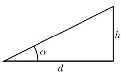
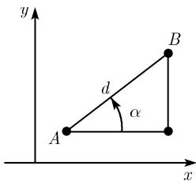
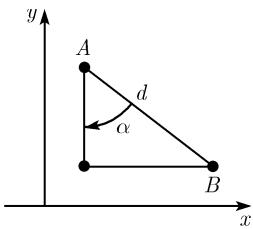
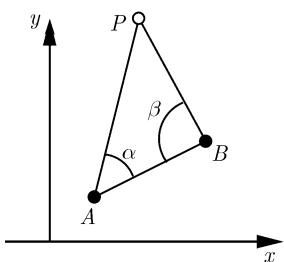
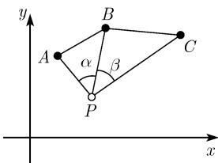
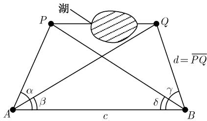

##### 3.2.2 对大地测量学的应用

大地测量学是一门度量地球表面的科学. 人们对其利用了三角形 (三角剖分). 严格地说, 这些三角形在这里是一个球面上的三角形 (球面三角形). 但是, 如果这些三角形足够小 (相对于该球面), 则可把它们当作平面三角形从而可应用平面三角学的公式. 对于大地测量学而言. 大多数的应用都是这种情形. 但是, 在大海和空中旅行, 所使用的三角形是如此之大, 以致人们必须使用球面三角学 (参看 3.2.4) 的公式.

  
图3.10

塔的高度 一个人试图确定一个塔的高 h (图 3.10).

被测量的量：测量从该塔到测量点的距离 $d$ 和倾角 $\alpha$ 计算： $h = d\tan \alpha$

到一个塔的距离 这时已知塔的高度, 要确定到该塔的距离 d.

被测量的量: 测量倾角 $\alpha$ 并已知塔高 h.

计算： $d = h\cot \alpha$

大地测量学的基本公式 设已知由笛卡儿坐标 $(x_{A},y_{A})$ 和 $(x_{B},y_{B})$ 给出的两个点 $A$ 和 $B$ , 其中我们假定 $x_{A} < x_{B}$ (图3.11). 于是我们得到了对于距离 $d = AB$ 和角 $\alpha$ 的公式:

$$
\boxed {d = \sqrt {(x _ {A} - x _ {B}) ^ {2} + (y _ {A} - y _ {B}) ^ {2}}, \quad \alpha = \arctan \frac {y _ {B} - y _ {A}}{x _ {B} - x _ {A}}.}
$$

  
(a) $y_{B} > y_{A}, \alpha > 0$

  
(b) $y_{B} < y_{A}, \alpha < 0$  
图 3.11 大地测量的基本思想

3.2.2.1 第一基本问题 (前向切割)

问题 设已知两点 A, B; 其坐标分别为 $(x_{A}, y_{A})$ 和 $(x_{B}, y_{B})$ . 要求第三个点 P (在图 3.12(a) 中标出) 的笛卡儿坐标 $(x, y)$ .

被测量的量: 图 3.12 中的角 $\alpha$ 和 $\beta$ .

计算：由下面公式确定 b 和 $\delta$ :

$$
\begin{array}{l} {c = \sqrt {(x _ {B} - x _ {A}) ^ {2} + (y _ {B} - y _ {A}) ^ {2}},} \\ {b = c \frac {\sin \beta}{\sin (\alpha + \beta)}, \quad \delta = \arctan \frac {y _ {B} - y _ {A}}{x _ {B} - x _ {A}}} \end{array}
$$

并得到

$$
\boxed {x = x _ {A} + b \cos (\alpha + \delta), \quad y = y _ {A} + b \sin (\alpha + \delta).}
$$

  
(a) 前向切割

  
(b) $b = \overline{AP}, c = \overline{AB}$  
图 3.12 大地测量中问题的制定

证明：利用图 3.12 中的直角三角形 APQ. 于是, 有

$$
x = x _ {A} + \Delta x = x _ {A} + b \sin \varepsilon , \quad y = y _ {A} + \Delta y = y _ {A} + b \cos \varepsilon .
$$

由 $\varepsilon = \frac{\pi}{2} -\alpha -\delta$ 得到 $\sin \varepsilon = \cos (\alpha +\delta)$ 和 $\cos \varepsilon = \sin (\alpha +\delta)$ . 由正弦定律得到

$$
b = c \frac {\sin \beta}{\sin \gamma}.
$$

最后对 $\gamma = \pi - \alpha - \beta$ (三角形的和角) 得到关系式 $\sin \gamma = \sin (\alpha + \beta)$ .

3.2.2.2 第二基本问题 (后向切割)

问题 现在已知具笛卡儿坐标 $(x_{A},y_{A})$ ， $(x_{B},y_{B})$ 和 $(x_{C},y_{C})$ 的三个点 $A,B$ 和 $C.$ 要找出图3.13中标出的点 $P$ 的笛卡儿坐标 $(x,y)$

被测量的量: 测量了角 $\alpha$ 和 $\beta$ .

这个问题只能在这四点不共圆时才有解.

计算：由辅助量

$$
x _ {1} = x _ {A} + (y _ {C} - y _ {A}) \cot \alpha ,
$$

$$
y _ {1} = y _ {A} + (x _ {C} - x _ {A}) \cot \alpha ,
$$

$$
x _ {2} = x _ {B} + (y _ {B} - y _ {C}) \cot \beta ,
$$

$$
y _ {2} = y _ {B} + (x _ {B} - x _ {C}) \cot \beta
$$

图3.13

我们计算出 $\mu$ 和 $\eta$ 为

$$
\mu = \frac {y _ {2} - y _ {1}}{x _ {2} - x _ {1}}, \quad \eta = \frac {1}{\mu},
$$

得到了

$$
y = y _ {1} + \frac {x _ {C} - x _ {1} + (y _ {C} - y _ {1}) \mu}{\mu + \eta},
$$

$$
x = \left\{ \begin{array}{l l} x _ {C} - (y - y _ {C}) \mu , & \mu <   \eta , \\ x _ {1} + (y - y _ {1}) \eta , & \eta <   \mu . \end{array} \right.
$$

3.2.2.3 第三基本问题 (对不能直接测量的距离的计算)

问题 我们要求出图 3.14 中标出的两个点 P 和 Q 之间的距离 $\overline{PQ}$ ，譬如，它们被一个湖分隔。因而该距离不能直接去测量。

被测量的量: 测量了距离 $c = \overline{AB}$ ，这是另外两个点 A 和 B 之间的距离，还测量了四个角 $\alpha, \beta, \gamma$ 和 $\delta$ (图 3.14).

  
图3.14

计算：由辅助量

$$
\rho = \frac {1}{\cot \alpha + \cot \delta}, \quad \sigma = \frac {1}{\cot \beta + \cot \gamma}
$$

以及 $x = \sigma \cot \beta -\rho \cot \alpha ,y = \sigma -\rho ,$ 我们得到

$$
\boxed {d = \sqrt {x ^ {2} + y ^ {2}}.}
$$
