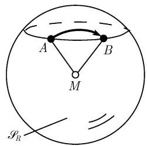
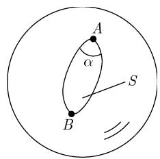
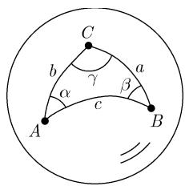
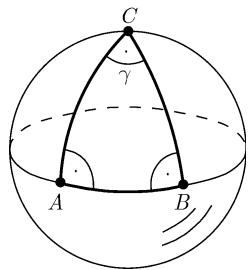

##### 3.2.3 球面几何学

球面几何学是关于在一个球面 (球的表面) 上的几何. 在地球表面的情形, 当三角形 (即距离) 足够小时, 平面三角学的公式和方法可以用于它, 这是一个好的近似. 但是对于涉及较大距离的计算时 (例如穿越大西洋的飞行或者长途的海上旅行), 地球的弯曲便起了重要的作用; 换句话说, 这时人们必须使用球面三角学的公式来代替平面三角学的.

下面我们将把地球看成是一个圆的球, 就是说我们忽略掉在两极附近的平坦情形. 几何这个词来自希腊, 意思就是测量地球.

3.2.3.1 测量大圆的距离

考虑半径为 R 的一个球, 并以 $S_{R}$ 表示它的表面 (半径为 R 的球面). 约定称圆心为该球中心的 $S_{R}$ 上的圆为大圆.

$$
\text {   代替平面几何中直线的,   在球面几何中是大圆   }
$$

定义 如果 $A$ 和 $B$ 是 $\mathcal{S}_R$ 上的两个点, 我们可以用由 $A, B$ 和球的中心 $M$ 构成的平面与 $\mathcal{S}_R$ 的交得到通过 $A$ 和 $B$ 的大圆.

例 1: 地球的赤道和经线都是大圆. 纬线不是大圆.

在球面上测量距离 在球面上连接 $S_{R}$ 上的两点 A 和 B 的最短线由考虑 A 和 B 之间的大圆 (如上所述) 并取两段中较小的一段得到, 其中的这两段是由 A 和 B 分割该大圆得到的 (图 3.15).

  
(a)

  
(b)  
图 3.15 球面上的距离

按定义, 在一个球面上两点 A 和 B 之间的距离是这两个点在球面上的最短距离.
例 2: 若一条船 (或一架飞机) 想要在两点 A 和 B 间采取最短的路线, 则它必须在连接这两点的大圆上旅行.

(i) 若 A 和 B 都位于赤道上，则此船只需沿赤道行驶 (假定是可能的)，见图 3.15(a).

(ii) 若 $A$ 和 $B$ 在同一条纬线 (不是大圆) 上, 则最短的航线是沿着连接这两点大圆而不是这条纬线, 见图 3.15(b).

最短路径的唯一性 若 A 和 B 不是正好为球面的对径点 (它们之间的连线通过了球的中心), 则有一条唯一确定的最短路径.

但是, 若 A 和 B 为对径点, 则存在无穷多条最短路径, 它们的长都相等. 例 3: 从北极到南极的最短路径由所有径线大圆组成.

测地线 大圆的所有线段被称为测地线.

3.2.3.2 测量角

定义 若两个大圆交于一点 $A$ , 则它们之间的角定义为在点 $A$ 的两条大圆的切线的夹角 (图3.16).

球面对角形\*. 如果用两个大圆连接球面 $\mathcal{S}_R$ 上两个点 $A$ 和 $B$ , 便得到了所谓的球面对角形, 其面积为

$$
\boxed {S = 2 R ^ {2} \alpha ,}
$$

其中 $\alpha$ 为两个大圆间的夹角 (图 3.17).

  
图3.16

  
图3.17

  
图3.18

3.2.3.3 球面三角形

定义 一个球面三角形由球面 $\mathcal{S}_R$ 上三个点 $A, B$ 和 $C$ 和连接这些点的最短路径组成 $^{1)}$ . 它们的角以 $\alpha, \beta$ 和 $\gamma$ 表示, 而这些边长记为 $a, b$ 和 $c$ (图3.18).

循环置换 所有下面的公式在进行后面的循环置换时仍然正确:

$$
a \to b \to c \to a \quad {\text { 和 }} \quad \alpha \to \beta \to \gamma \to \alpha .
$$

球面三角形的面积 $S$

$$
\boxed {S = (\alpha + \beta + \gamma - \pi) R ^ {2}.}
$$

因为球面面积本身等于 $4\pi R^2$ ，由 $0 < S < 4\pi R^2$ 对角的和得到不等式

$$
\boxed {\pi <   \alpha + \beta + \gamma <   3 \pi .}
$$

如果有人不能确认他是否生活在一个球面中还是在一个平面上, 他可用测量三角形中角的和来得到答案. 对平面三角形总有 $\alpha + \beta + \gamma = \pi$ . 称差 $\alpha + \beta + \gamma - \pi$ 为球面角盈.

例 1: 图 3.19 中的三角形由北极 C 和赤道上两个点 A 和 B 组成. 这里有 $\alpha = \beta = \frac{\pi}{2}$ . 对于角的和我们得到了 $\alpha + \beta + \gamma = \pi + \gamma$ . 其面积由 $S = R^{2}\gamma$ 给出.

  
图3.19

三角不等式

$$
\boxed {| a - b | <   c <   a + b.}
$$

边的比率 最长的边总对着最大的角. 显式地有

$$
\alpha <   \beta \Leftrightarrow a <   b, \quad \alpha > \beta \Leftrightarrow a > b, \quad \alpha = \beta \Leftrightarrow a = b.
$$

约定 $^{1)}$ 令

$$
a _ {*} := \frac {a}{R}, b _ {*} := \frac {b}{R}, c _ {*} := \frac {c}{R}.
$$

正弦定律 $^{2)}$

$$
\boxed {\frac {\sin \alpha}{\sin \beta} = \frac {\sin a _ {*}}{\sin b _ {*}}.}\tag{3.9}
$$

边和角的余弦定律

$$
\begin{array}{r l} & {\cos c _ {*} = \cos a _ {*} \cos b _ {*} + \sin a _ {*} \sin b _ {*} \cos \gamma ,} \\ & {\cos \gamma = \sin \alpha \sin \beta \cos c _ {*} - \cos \alpha \cos \beta .} \end{array}\tag{3.10}
$$

(3.11)

半角定律 令 $S_{*}:=\frac{1}{2}(a_{*}+b_{*}+c_{*})$ ，则有

$$
\boxed {\tan \frac {\gamma}{2} = \sqrt {\frac {\sin (s _ {*} - a _ {*}) \sin (s _ {*} - b _ {*})}{\sin s _ {*} \sin (s _ {*} - c _ {*})}}, 0 <   \gamma <   \pi .}\tag{3.12}
$$

$$
\sin \frac {\gamma}{2} = \sqrt {\frac {\sin (s _ {*} - a _ {*}) \sin (s _ {*} - b _ {*})}{\sin a _ {*} \sin b _ {*}}}, \quad \cos \frac {\gamma}{2} = \sqrt {\frac {\sin s _ {*} \sin (s _ {*} - c _ {*})}{\sin a _ {*} \sin b _ {*}}}.
$$

球面三角形面积 A 的公式

$$
\tan {\frac {A}{4}} = \sqrt {\tan {\frac {s _ {*}}{2}} \tan {\frac {s _ {*} - a _ {*}}{2}} \tan {\frac {s _ {*} - b _ {*}}{2}} \tan {\frac {s _ {*} - c _ {*}}{2}}}
$$

1) 常取 $R = 1$ . 于是 $a_{*} = a$ 等. 我们在公式中保留半径 $R$ 是为了能过渡到 $R \to \infty$ (欧氏几何), 以及替换 $R \mapsto \mathrm{i}R$ (过渡到非欧双曲几何) (见3.2.8).

2) 如果 $\alpha$ 是直角, 则为 $\sin \alpha = 1, \cos \alpha = 0$ .

(广义海伦公式)

半边定律 设 $\sigma := \frac{1}{2} (\alpha + \beta + \gamma)$ , 则有

$$
\boxed {\tan \frac {c _ {*}}{2} = \sqrt {\frac {- \cos \sigma \cos (\sigma - \gamma)}{\cos (\sigma - \alpha) \cos (\sigma - \beta)}}, 0 <   c _ {*} <   \pi ,}\tag{3.13}
$$

$$
\sin \frac {c _ {*}}{2} = \sqrt {- \frac {\cos \sigma \cos (\sigma - \gamma)}{\sin \alpha \sin \beta}}, \quad \cos \frac {c _ {*}}{2} = \sqrt {\frac {\cos (\sigma - \alpha) \cos (\sigma - \beta)}{\sin \alpha \sin \beta}}.
$$

纳皮尔公式

$$
\tan {\frac {c _ {*}}{2}} \cos {\frac {\alpha - \beta}{2}} = \tan {\frac {a _ {*} + b _ {*}}{2}} \cos {\frac {\alpha + \beta}{2}},
$$

$$
\tan {\frac {c _ {*}}{2}} \sin {\frac {\alpha - \beta}{2}} = \tan {\frac {a _ {*} - b _ {*}}{2}} \sin {\frac {\alpha + \beta}{2}},
$$

$$
\cot {\frac {\gamma}{2}} \cos {\frac {a _ {*} - b _ {*}}{2}} = \tan {\frac {\alpha + \beta}{2}} \cos {\frac {a _ {*} + b _ {*}}{2}},
$$

$$
\cot {\frac {\gamma}{2}} \sin {\frac {a _ {*} - b _ {*}}{2}} = \tan {\frac {\alpha - \beta}{2}} \sin {\frac {a _ {*} + b _ {*}}{2}}.
$$

莫尔韦德公式

$$
\sin {\frac {\gamma}{2}} \sin {\frac {a _ {*} + b _ {*}}{2}} = \sin {\frac {c _ {*}}{2}} \cos {\frac {\alpha - \beta}{2}},
$$

$$
\sin {\frac {\gamma}{2}} \cos {\frac {a _ {*} + b _ {*}}{2}} = \cos {\frac {c _ {*}}{2}} \cos {\frac {\alpha + \beta}{2}},
$$

$$
\cos {\frac {\gamma}{2}} \sin {\frac {a _ {*} - b _ {*}}{2}} = \sin {\frac {c _ {*}}{2}} \sin {\frac {\alpha - \beta}{2}}
$$

$$
\cos {\frac {\gamma}{2}} \cos {\frac {a _ {*} - b _ {*}}{2}} = \cos {\frac {c _ {*}}{2}} \sin {\frac {\alpha + \beta}{2}}.
$$

球面三角形的内切圆和外接圆的半径 r 和 $\rho$

$$
\tan r = \sqrt {\frac {\sin (s _ {*} - a _ {*}) \sin (s _ {*} - b _ {*}) \sin (s _ {*} - c _ {*})}{\sin s _ {*}}} = \tan \frac {\alpha}{2} \sin (s _ {*} - a _ {*}),
$$

$$
\cot \rho = \sqrt {- \frac {\cos (\sigma - \alpha) \cos (\sigma - \beta) \cos (\sigma - \gamma)}{\cos \sigma}} = \cot \frac {a _ {*}}{2} \cos (\sigma - \alpha).
$$

到平面三角学的极限过程 如果在上述公式中取极限 $R \to \infty$ (表明球面半径无限增大), 则球面的弯曲变得越来越小. 在其极限中便得到了平面三角学的熟悉公式. 例2: 应用余弦定律(3.10), 从 $\cos x = 1 - \frac{x^2}{2} + o(x^2), x \to 0$ , 和 $\sin x = x + o(x), x \to 0$ 推导出

$$
\begin{array}{c} 1 - \frac {c ^ {2}}{2 R ^ {2}} + \dots = \left(1 - \frac {a ^ {2}}{2 R ^ {2}} + \dots\right) \left(1 - \frac {b ^ {2}}{2 R ^ {2}} + \dots\right) \\ + \left(\frac {a}{R} + \dots\right) \left(\frac {b}{R} + \dots\right) \cos \gamma . \end{array}
$$

对其乘以 $R^{2}$ 并对 $R \rightarrow \infty$ 便得到表达式.

$$
c ^ {2} = a ^ {2} + b ^ {2} - 2 a b \cos \gamma .
$$

这是平面三角学中的余弦定律.

3.2.3.4 球面三角形的计算

在下面记住 $a_{*} := a / R$ 等. 这里只考虑所有的角和边介于 0 和 $\pi$ 之间的三角形.

第一基本问题 已知两边 $a$ 和 $b$ 连同它们的夹角 $\gamma$ . 要利用对边的余弦定律计算另一条边 $c$ 和另外的角 $\alpha$ 和 $\beta$ :

$$
\begin{array}{l} \cos c _ {*} = \cos a _ {*} \cos b _ {*} + \sin a _ {*} \sin b _ {*} \cos \gamma , \\ \cos \alpha = \frac {\cos a _ {*} - \cos b _ {*} \cos c _ {*}}{\sin b _ {*} \sin c _ {*}}, \\ \cos \beta = \frac {\cos b _ {*} - \cos c _ {*} \cos a _ {*}}{\sin c _ {*} \sin a _ {*}}. \end{array}
$$

第二基本问题 这里我们给出所有三条边 $a, b$ 和 $c$ , 它们全都在 0 和 $\pi$ 之间. 角 $\alpha, \beta$ 和 $\gamma$ 由半边定律进行了计算:

$$
\tan {\frac {\alpha}{2}} = \sqrt {\frac {\sin (s _ {*} - b _ {*}) \sin (s _ {*} - c _ {*})}{\sin s _ {*} \sin (s _ {*} - a _ {*})}} \quad \text {等等}.
$$

对于 $\tan \frac{\beta}{2}$ 和 $\tan \frac{\gamma}{2}$ 的公式可由 $\tan \frac{\alpha}{2}$ 的由循环置换得到.

第三基本问题 这里给出了三个角 $\alpha, \beta$ 和 $\gamma$ . 边 a, b 和 c 可由半边定律得到:

$$
\tan {\frac {a _ {*}}{2}} = \sqrt {\frac {- \cos \sigma \cos (\sigma - \alpha)}{\cos (\sigma - \beta) \cos (\sigma - \gamma)}} \quad \text {等等}.\tag{3.14}
$$

对于 $\tan\frac{b_{*}}{2}$ 和 $\tan\frac{c_{*}}{2}$ 可利用循环置换从 $\tan\frac{a_{*}}{2}$ 得到.

第四基本问题 已知边 $c$ 和与它相邻的两个角 $\alpha$ 和 $\beta$ . 未知的角 $\gamma$ 可由余弦定律得到:

$$
\cos \gamma = \sin \alpha \sin \beta \cos c _ {*} - \cos \alpha \cos \beta .
$$

其余的边可应用 (3.14) 进行计算.
