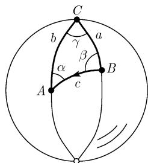

##### 3.2.4 对于海上和空中旅行的应用

为了对此原则给出示例, 进行舍入式的计算.

从圣地亚哥到檀香山的海上旅行 这两个城市之间的最短路线有多长？在圣地亚哥必须以哪个角度 $\beta$ 出发？

回答: 考虑图 3.20:

$$
\left| c = \text {距离} = 4 1 0 0 \mathrm{km}, \quad \beta = 9 7 ^ {\circ}. \right.
$$

解：这两个城市具有下面的地理坐标：

A (檀香山): 北纬 $22^{\circ}$ , 西经 $157^{\circ}$ , B (圣地亚哥): 北纬 $33^{\circ}$ , 西经 $117^{\circ}$ .

我们使用了角度量度. 使用图 3.20 的记号, 有

$$
\begin{array}{c} \gamma = 1 5 7 ^ {\circ} - 1 1 7 ^ {\circ} = 4 0 ^ {\circ}, \quad a _ {*} = 9 0 ^ {\circ} - 3 3 ^ {\circ} = 5 7 ^ {\circ}, \\ b _ {*} = 9 0 ^ {\circ} - 2 2 ^ {\circ} = 6 8 ^ {\circ}. \end{array}
$$

图3.20

3.2.3.4 中的第一基本问题给出了

$$
\cos c _ {*} = \cos a _ {*} \cos b _ {*} + \sin a _ {*} \sin b _ {*} \cos \gamma ,\tag{3.15}
$$

$$
\cos \beta = \frac {\cos b _ {*} - \cos a _ {*} \cos c _ {*}}{\sin a _ {*} \sin c _ {*}}.\tag{3.16}
$$

由它得到 $c_{*}=37^{\circ},\beta=97^{\circ}$ . 地球的半径是 R=6370km. 因此三角形的边 c 为

$$
c = R \frac {2 \pi c _ {*} ^ {\circ}}{3 6 0 ^ {\circ}} = 4 1 0 0 (\mathrm{km}).
$$

从哥本哈根到芝加哥的穿越大西洋的飞行 这两个城市间的最短（飞行）路径有多远？从哥本哈根必须从哪个角 $\beta$ 出发？

回答：仍旧考虑图 3.20.

$$
c = \text {距离} = 6 0 0 0 \mathrm{km}, \quad \beta = 8 2 ^ {\circ}.
$$

解：这两个城市的地理坐标为

A (芝加哥): 北纬 $42^{\circ}$ ，西经 $88^{\circ}$ ，

B (哥本哈根): 北纬 $56^{\circ}$ ，东经 $12^{\circ}$ .

我们仍以角度量度. 用图 3.20 的记号有

$$
\gamma = 1 2 ^ {\circ} + 8 8 ^ {\circ} = 1 0 0 ^ {\circ}, \quad a _ {*} = 9 0 ^ {\circ} - 5 6 ^ {\circ} = 3 4 ^ {\circ}, \quad b _ {*} = 9 0 ^ {\circ} - 4 2 ^ {\circ} = 3 8 ^ {\circ}.
$$

由 (3.15) 得到 $c_* = 54^\circ$ , 从而 $c = R \frac{2\pi c_*^\circ}{360^\circ} = 6000$ . 由 (3.16) 得到了角; 它是 $\beta$ .
