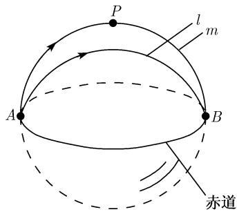

##### 3.2.7 非欧椭圆几何学

我们考虑一个半径 R = 1 的球面 S. 我们选取包括赤道的北半球作为一个“参照平面” $E_{ellip}$ .

(i) “点”或者是不在赤道上的经典的点, 或者是在赤道上的一对对径点 $\{A, B\}$ .

(ii) “直线” 是球面上的大圆.

(iii) “角” 是通常大圆间的角 (图 3.26).

定理 在这个几何中平行公理不成立.

例：设已知一条直线 $l$ ，还有一个不在此直线上的点 $P$ (在图里是北极). 每条通过 $P$ 的都是经圆. 所有这些直线均交 $l$ 为一点. 例如, 在图3.26中直线 $l$ 交直线 $m$ 于点 $\{A, B\}$ .

全等 在这个几何中的 “运动” 是绕通过北极和南极的轴的旋转. 全等的线段和角定义为可由这样一个运动变换到另一个.

这个几何满足除去欧几里得平行公理外的所有希尔伯特的几何公理．令人惊奇的是，两千多年来居然没有数学家遇到过利用这个简单的模型来证明平行公理不能由其他公理得到的想法．显然在那个时期存在着思想上的障碍．人们过于顽固地想象点就是通常点，而直线就是通常“笔直”的线，等等．事实上，这种直观的可视性在利用

  
图3.26

公理和通常逻辑规则的几何定理的证明中没有作用.
