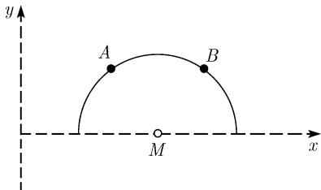
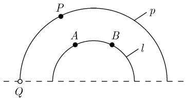

##### 3.2.8 非欧双曲几何学

庞加莱模型 选取一个笛卡儿坐标系并考虑开的上半平面

$$
\mathcal {H} = \mathcal {H} _ {\mathrm{hyp}} := \{(x, y) \in \mathbb {R} ^ {2} | y > 0 \},
$$

我们称它为双曲平面. 采取下面的约定:

(i) “点”为上半平面中经典的点.

(ii) “线”为上半平面中那样的半圆, 其中心在 x 轴上 (图 3.27).

  
图3.27

定理 (图 3.28)

(i) 恰好存在通过 H 中两个点 A 和 B 的一条直线.

(ii) 若 $l$ 是一条直线, 则通过 $l$ 外面的每个其他点 $P$ 的有无穷多条与 $l$ 不相交的直线 $p$ , 即存在无穷多条通过点 $P$ 的平行于 $l$ 的直线.

在双曲几何中欧几里得平行公理不成立.

角 两条直线的夹 “角” 等于对相应圆弧间的角 (图 3.28(b)).

距离 在双曲平面 $\mathcal{H}$ 中一条曲线 $y = y(x), a \leqslant x \leqslant b$ 的长由积分

$$
\boxed {L = \int_ {a} ^ {b} \frac {\sqrt {1 + y ^ {\prime} (x) ^ {2}}}{y (x)} \mathrm{d} x}
$$

给出. 对于这个距离, 直线是最短路径 (测地线).

  
(a) 直线

  
(b) 角  
图 3.28 庞加莱平面的几何

例 1: 图 3.28(a) 中 P 和 Q 间距离为无穷大. 因此称图 3.28 (a) 中的 x 轴为在双曲平面的无穷远处的直线.

双曲三角学 这是一门在双曲平面中的三角形计算的学科. 双曲几何的所有公式都可以从球面三角学中公式经应用下述平移原理简练地导出:

在球面三角学的所有公式中将半径换成 $\mathrm{i}R$ (其中的 $\mathrm{i}$ 是 $\mathrm{i}^2 = -1$ 的虚单位)并令 $R = 1$ .

例 2: 由球面三角的对边的余弦定律

$$
\cos {\frac {c}{R}} = \cos {\frac {a}{R}} \cos {\frac {b}{R}} + \sin {\frac {a}{R}} \sin {\frac {b}{R}} \cos \gamma ,
$$

将其中 R 换作 iR 得到了关系式 $^{1)}$

$$
\cosh {\frac {c}{R}} = \cosh {\frac {a}{R}} \cosh {\frac {b}{R}} - \sinh {\frac {a}{R}} \sinh {\frac {b}{R}} \cos \gamma .
$$

对于 R = 1，便得到了双曲几何中边的余弦定律

$$
\cosh c = \cosh a \cosh b - \sinh a \sinh b \cos \gamma .
$$

若 $\gamma$ 为直角, 则 $\cos\gamma=0$ , 我们便得到了双曲几何的毕达哥拉斯定理

$$
\boxed {\cosh c = \cosh a \cosh b.}
$$

更重要的一些公式可在表 3.2 中找到. 对椭圆几何中的公式对应了球面三角学中在半径 R = 1 的球面上的公式.

更多的公式可经由循环置换得到:

$$
a \to b \to c \to a   \text { 和 }   \alpha \to \beta \to \gamma \to \alpha .
$$

表 3.2 各种几何学中的公式

<table><tr><td></td><td>欧氏几何</td><td>椭圆几何</td><td>双曲几何</td></tr><tr><td>三角形的和角公式(A为面积)</td><td> $\alpha + \beta + \gamma = \pi$ </td><td> $\alpha + \beta + \gamma = \pi + A$ </td><td> $\alpha + \beta + \gamma = \pi - A$ </td></tr><tr><td>半径r的圆面积</td><td> $\pi r^{2}$ </td><td> $2\pi (1 - \cos r)$ </td><td> $2\pi (\cosh r - 1)$ </td></tr><tr><td>半径r的圆的周长</td><td> $2\pi r$ </td><td> $2\pi \sin r$ </td><td> $2\pi \sinh r$ </td></tr><tr><td>毕达哥拉斯定理</td><td> $c^{2} = a^{2} + b^{2}$ </td><td> $\cos c = \cos a \cos b$ </td><td> $\cosh c = \cosh a \cosh b$ </td></tr><tr><td>余弦定律</td><td> $c^{2} = a^{2} + b^{2}$  $-2ab \cos \gamma$ </td><td> $\cos c = \cos a \cos b$  $+ \sin a \sin b \cos \gamma$ </td><td> $\cosh c = \cosh a \cosh b$  $- \sinh a \sinh b \cos \gamma$ </td></tr><tr><td>正弦定律</td><td> $\frac{\sin \alpha}{\sin \beta} = \frac{a}{b}$ </td><td> $\frac{\sin \alpha}{\sin \beta} = \frac{\sin a}{\sin b}$ </td><td> $\frac{\sin \alpha}{\sin \beta} = \frac{\sinh a}{\sinh b}$ </td></tr><tr><td>高斯曲率</td><td>K=0</td><td>K=1</td><td>K=-1</td></tr></table>

运动 令 $z = x + \mathrm{i}y$ 和 $z' = x' + \mathrm{i}y'$ . 双曲几何的“运动”是特殊的默比乌斯变换

$$
\boxed {z ^ {\prime} = \frac {\alpha z + \beta}{\gamma z + \delta},}
$$

其中 $\alpha, \beta, \gamma$ 和 $\delta$ 为实数并满足 $\alpha \delta - \beta \gamma > 0$ . 所有这样的变换的集合构成一个群，称为双曲平面的运动群.

(i) H 的直线在双曲运动下映成了另一条直线.

(ii) 双曲运动是保角和保距的变换.

根据克莱因的埃尔兰根纲领, 双曲几何的性质就是那些在双曲运动群下保持不变的性质.

定理 上面所定义的双曲几何满足除了欧几里得平行公理外的所有希尔伯特公理. 黎曼几何 双曲几何是具度量

$$
\boxed {\mathrm{d} s ^ {2} = \frac {\mathrm{d} x ^ {2} + \mathrm{d} y ^ {2}}{y ^ {2}}, \quad y > 0}
$$

的黎曼几何, 且具有 (负) 常值高斯曲率 K = -1 (参看 [212]).

物理解释 在几何光学背景中的对庞加莱模型的简单解释可在 5.1.2 中找到.
