#### 3.3 向量代数在解析几何学中的应用

笛卡儿 (1596—1650) 和费马 (1601—1665) 所发现的笛卡儿坐标方法在 18 世纪末被称作 “解析几何学”，它增加了在几何思考中代数的重要性.

J. 迪厄多内 (Dieudonné)

向量代数使得利用方程来描述几何对象成为可能, 并且它们与所选取的坐标系无关. 设 $O$ 为一定点. 以 $\pmb{r} = \overrightarrow{OP}$ 记点 $P$ 的径向量. 若三个两两正交的单位向量 $\pmb{i},\pmb{j}$ 和 $\pmb{k}$ 使它们构成右手系, 则有

$$
\boxed {\boldsymbol {r} = x \boldsymbol {i} + y \boldsymbol {j} + z \boldsymbol {k}}.
$$

称实数 $x, y, z$ 为点 $P$ 的笛卡儿坐标 (图3.29和图1.85). 另外, 令 $\pmb{a} = a_1\pmb{i} + a_2\pmb{j} + a_3\pmb{k}$ 等.

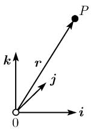  
(a)

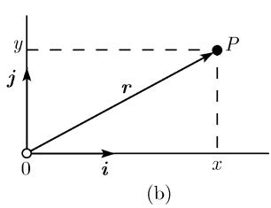  
图 3.29 笛卡儿坐标

下面的所有公式都包含了向量的表述和以笛卡儿坐标的表示.

##### 3.3.1 平面中的直线

通过一点 $P_{0}(x_{0},y_{0})$ 并以向量 v 为方向的直线方程 (图 3.30(a))

$$
\boxed { \begin{array}{l l} \boldsymbol {r} = \boldsymbol {r} _ {0} + t \boldsymbol {v}, & - \infty <   t <   \infty , \\ x = x _ {0} + t v _ {1}, & y = y _ {0} + t v _ {2}. \end{array} }
$$

若把实参数 t 看作时间, 则这是一个点以速度 $v = v_{1}i + v_{2}j$ 的运动方程, 而 $r_{j} = x_{j}i + y_{j}j$ .

通过两个点 $P_{j}(x_{j},y_{j}), j=0,1$ 的直线方程 (图 3.30(b))

$$
\boxed { \begin{array}{l} \boldsymbol {r} = \boldsymbol {r} _ {0} + t (\boldsymbol {r} _ {1} - \boldsymbol {r} _ {0}), \quad - \infty <   t <   \infty , \\ x = x _ {0} + t (x _ {1} - x _ {0}), \quad y = y _ {0} + t (y _ {1} - y _ {0}). \end{array} }
$$

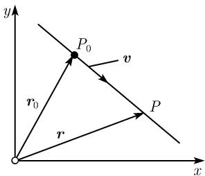  
(a)

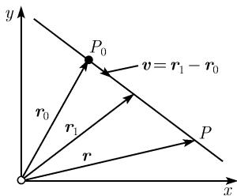  
(b)  
图3.30 过两点的直线

通过点 $P_{0}(x_{0},y_{0})$ 正交于单位向量 n 的直线 l 的方程 (图 3.31(a))

$$
\boxed { \begin{array}{c} \boldsymbol {n} (\boldsymbol {r} - \boldsymbol {r} _ {0}) = 0, \\ n _ {1} (x - x _ {0}) + n _ {2} (y - y _ {0}) = 0. \end{array} }
$$

在这里有 $\sqrt{n_{1}^{2}+n_{2}^{2}}=1.$

点 $P_{*}$ 到直线 $l$ 的距离

$$
\begin{array}{c} \framebox {d = \boldsymbol {n} (\boldsymbol {r} _ {*} - \boldsymbol {r} _ {0}),} \\ d = n _ {1} (x _ {*} - x _ {0}) + n _ {2} (y _ {*} - y _ {0}). \end{array}
$$

在此我们已令 $r_{*} = \overrightarrow{OP_{*}}$ . 若 $P_{*}$ 在 l 相对于 n 的正的一侧则有 d > 0, 若在负的一侧, 则有 d < 0 (图 3.31(b)). 又有 $n = n_{1}i + n_{2}j$ .

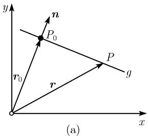

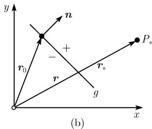  
图3.31 正交于一个向量的直线

两点 $P_{1}$ 和 $P_{0}$ 间的距离 $\pmb{d}$ (图3.32(a))

$$
\boxed { \begin{array}{c} d = | \boldsymbol {r} _ {1} - \boldsymbol {r} _ {0} |, \\ d = \sqrt {(x _ {1} - x _ {0}) ^ {2} + (y _ {1} - y _ {0}) ^ {2}}. \end{array} }
$$

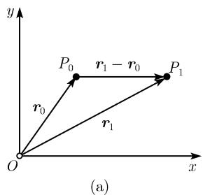

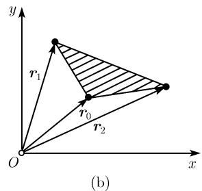  
图 3.32 距离和面积

以 $P_{j}(x_{j},y_{j}), j=0,1,2$ 为顶点的三角形的面积 (图 3.32(b))

$$
\boxed {A = \frac {1}{2} \boldsymbol {k} ((\boldsymbol {r} _ {1} - \boldsymbol {r} _ {0}) \times (\boldsymbol {r} _ {2} - \boldsymbol {r} _ {0})).}
$$

显式表达为

$$
A = \frac {1}{2} \left| \begin{array}{c c} x _ {1} - x _ {0} & y _ {1} - y _ {0} \\ x _ {2} - x _ {0} & y _ {2} - y _ {0} \end{array} \right|.
$$

##### 3.3.2 空间中的直线和平面

通过点 $P_0(x_0, y_0, z_0)$ 并以向量 $\pmb{v}$ 为方向的直线方程 (图3.33(a))

$$
\boxed { \begin{array}{c} \boldsymbol {r} = \boldsymbol {r} _ {0} + t \boldsymbol {v}, \quad - \infty <   t <   \infty , \\ x = x _ {0} + t v _ {1}, \quad y = y _ {0} + t v _ {2}, \quad z = z _ {0} + t v _ {3}. \end{array} }
$$

若把实参数 t 看作时间, 则这是一个点以速度向量为 $v = v_{1}i + v_{2}j + v_{3}k$ , $r = xi + yj + zk$ 的运动方程.

通过两点 $P_{j}(x_{j},y_{j},z_{j}), j=0,1$ 的直线方程 (图 3.33 (a))

$$
\begin{array}{c} \boxed {\boldsymbol {r} = \boldsymbol {r} _ {0} + t (\boldsymbol {r} _ {1} - \boldsymbol {r} _ {0}), \quad - \infty <   t <   \infty ,} \\ x = x _ {0} + t (x _ {1} - x _ {0}), \quad y = y _ {0} + t (y _ {1} - y _ {0}), \quad z = z _ {0} + t (z _ {1} - z _ {0}). \end{array}
$$

(c)  
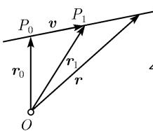  
(a)

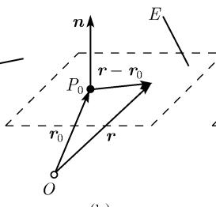

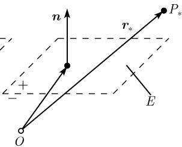  
图 3.33 空间对象的方程

通过三个已知点 $P(x_{j},y_{j},z_{j}),j = 0,1,2$ 的平面方程

$$
\boxed { \begin{array}{c} \boldsymbol {r} = \boldsymbol {r} _ {0} + t (\boldsymbol {r} _ {1} - \boldsymbol {r} _ {0}) + s (\boldsymbol {r} _ {2} - \boldsymbol {r} _ {0}), \quad - \infty <   t, s <   \infty , \\ \hline x = x _ {0} + t (x _ {1} - x _ {0}) + s (x _ {2} - x _ {0}), \\ y = y _ {0} + t (y _ {1} - y _ {0}) + s (y _ {2} - y _ {0}), \\ z = z _ {0} + t (z _ {1} - z _ {0}) + s (z _ {2} - z _ {0}). \end{array} }
$$

通过点 $P(x_{0}, y_{0}, z_{0})$ 并垂直于单位向量 n 的平面 E 的方程 (图 3.33(b))

$$
\begin{array}{c} \framebox {\boldsymbol {n} (\boldsymbol {r} - \boldsymbol {r} _ {0}) = 0,} \\ n _ {1} (x - x _ {0}) + n _ {2} (y - y _ {0}) + n _ {3} (z - z _ {0}) = 0. \end{array}
$$

在此我们有 $\sqrt{n_1^2 + n_2^2 + n_3^2} = 1$ . 称 $\pmb{n}$ 为平面 $E$ 的单位法向量. 若三个点 $P_{1}, P_{2}$ 和 $P_{3}$ 已在 $E$ 上给出, 则 $\pmb{n}$ 可由下面公式得到:

$$
\boldsymbol {n} = \frac {\left(\boldsymbol {r} _ {1} - \boldsymbol {r} _ {0}\right) \times \left(\boldsymbol {r} _ {2} - \boldsymbol {r} _ {0}\right)}{\left| \left(\boldsymbol {r} _ {1} - \boldsymbol {r} _ {0}\right) \times \left(\boldsymbol {r} _ {2} - \boldsymbol {r} _ {0}\right) \right|}.
$$

平面 F 到点 $P_{*}$ 的距离

$$
\boxed { \begin{array}{c} d = \boldsymbol {n} (\boldsymbol {r} _ {*} - \boldsymbol {r} _ {0}), \\ d = n _ {1} (x _ {*} - x _ {0}) + n _ {2} (y _ {*} - y _ {0}) + n _ {3} (z _ {*} - z _ {0}). \end{array} }
$$

在这里, 若点 $P_{*}$ 在相对于单位法向量 n 而言在平面 E 的正 (分别地, 负) 侧, 则有 d > 0 (分别地 d < 0) (图 3.33(c)).

两个点 $P_0$ 和 $P_{1}$ 之间的距离

$$
\begin{array}{c} \framebox {d = | \boldsymbol {r} _ {1} - \boldsymbol {r} _ {0} |,} \\ d = \sqrt {(x _ {1} - x _ {0}) ^ {2} + (y _ {1} - y _ {0}) ^ {2} + (z _ {1} - z _ {0}) ^ {2}}. \end{array}
$$

两个向量 $a$ 和 $b$ 间的角 $\varphi$

$$
\begin{array}{c} \boxed {\cos \varphi = \frac {\boldsymbol {a b}}{| \boldsymbol {a} | | \boldsymbol {b} |},} \\ \cos \varphi = \frac {a _ {1} b _ {1} + a _ {2} b _ {2} + a _ {3} b _ {3}}{\sqrt {a _ {1} ^ {2} + a _ {2} ^ {2} + a _ {3} ^ {2}} \cdot \sqrt {b _ {1} ^ {2} + b _ {2} ^ {2} + b _ {3} ^ {2}}}. \end{array}
$$

##### 3.3.3 体积

由向量 a, b 和 c 张成的平行四面体的体积 (图 3.34 (a))

$$
\begin{array}{c} \framebox {V = (\boldsymbol {a} \times \boldsymbol {b}) \boldsymbol {c},} \\ V = \left| \begin{array}{c c c} a _ {1} & a _ {2} & a _ {3} \\ b _ {1} & b _ {2} & b _ {3} \\ c _ {1} & c _ {2} & c _ {3} \end{array} \right|. \end{array}
$$

在这里, 若 $a, b, c$ 形成右手系 (分别地, 左手系) 则 $V > 0$ (分别地, $V < 0$ ). 由点 $P_{j}(x_{j}, y_{j}, z_{j}), j = 0, 1, 2, 3$ 张成的平行四面体的体积 令 $a := r_{1} - r_{0}, b := r_{2} - r_{0}, c := r_{3} - r_{0}$ .

由向量 a 和 b 张成的三角形的面积 (图 3.34 (b))

$$
\boxed {A = \frac {1}{2} | \pmb {a} \times \pmb {b} |,}
$$

$$
A = \sqrt {\left| \begin{array}{c c} a _ {2} & a _ {3} \\ b _ {2} & b _ {3} \end{array} \right| ^ {2} + \left| \begin{array}{c c} a _ {3} & a _ {1} \\ b _ {3} & b _ {1} \end{array} \right| ^ {2} + \left| \begin{array}{c c} a _ {1} & a _ {2} \\ b _ {1} & b _ {2} \end{array} \right| ^ {2}}.
$$

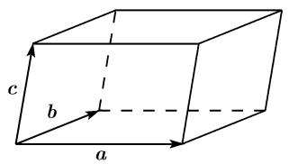  
(a)

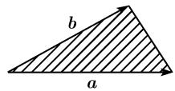  
(b)  
图3.34 二维和三维体积
