#### 3.4 欧氏几何学 (运动的几何学)

##### 3.4.1 欧几里得运动群

以 $x_{1}, x_{2}, x_{3}$ 和 $x_{1}', x_{2}', x_{3}'$ 为两个笛卡儿坐标系. 一个欧几里得运动是一个变换

$$
\boxed {\boldsymbol {x} ^ {\prime} = \boldsymbol {D} \boldsymbol {x} + \boldsymbol {a},}
$$

其中 $\boldsymbol{a}=(a_{1},a_{2},a_{3})^{\mathrm{T}}$ 为常值列向量, D 为正交 $(3\times3)$ 矩阵, 即 $DD^{T}=D^{T}D=E$ (其中 E 为单位矩阵). 显式地这些变换由下面方程给出:

$$
x _ {j} ^ {\prime} = d _ {j 1} x _ {1} + d _ {j 2} x _ {2} + d _ {j 3} x _ {3} + a _ {j}, \quad j = 1, 2, 3.
$$

分类 (i) 平移: D = E.

(ii) 旋转: $\det D = 1, a = 0.$

(iii) 旋转反射: $\operatorname{det} D = -1, a = 0$ .

(iv) 正常运动: $\det D = 1$ .

定义 所有运动的集合在复合下构成一个群, 称其为欧几里得运动群.

所有的旋转构成一个子群, 称其为旋转群 $^{1)}$ . 所有的平移 (分别地, 所有的正常运动) 构成了欧几里得运动群的一个子群, 称其为平移群 (分别地, 正常欧氏运动群). 例 1: 绕 $\zeta$ 轴以旋转角 $\varphi$ 的旋转 (取正的数学定向) 在笛卡儿 $(\xi, \eta, \zeta)$ 系下为

$$
\boxed { \begin{array}{l l} \xi^ {\prime} = \xi   \cos \varphi + \eta   \sin \varphi , & \zeta^ {\prime} = \zeta , \\ \eta^ {\prime} = - \xi   \sin \varphi + \xi   \cos \varphi . \end{array} }
$$

图 3.35 表示了在 $(\xi,\eta)$ 平面中的旋转.

例 2: 对于 $(\xi, \eta)$ 平面的一个反射由下面的关系给出:

  
图3.35

$$
\xi^ {\prime} = \xi , \quad \eta^ {\prime} = \eta , \quad \zeta^ {\prime} = - \zeta .
$$

结构定理 (i) 每个旋转可以在一个适当的笛卡儿坐标系下化为绕 $\zeta$ 轴的旋转.

(ii) 每个旋转反射可在一个适当选取的 $(\xi, \eta, \zeta)$ 坐标系下表示为绕 $\zeta$ 轴的旋转与对 $(\xi, \eta)$ 平面的反射的复合.

欧氏几何 根据克莱因的埃尔兰根纲领, 欧几里得几何正好是在欧几里得运动下不变的性质 (例如, 线段的长).

##### 3.4.2 圆锥截线

圆锥截线的初等理论已在 0.1.7 中表述过了.

二次型 考虑方程

$$
\boxed {\boldsymbol {x} ^ {\mathrm{T}} \boldsymbol {A} \boldsymbol {x} = b.}
$$

显式地, 此方程为

$$
a _ {1 1} x _ {1} ^ {2} + 2 a _ {1 2} x _ {1} x _ {2} + a _ {2 2} x _ {2} ^ {2} = b,\tag{3.17}
$$

它具有实对称矩阵 $A = \left( \begin{array}{cc} a_{11} & a_{12} \\ a_{21} & a_{22} \end{array} \right)$ . 设 $A \neq O$ . 于是, 有 $\det A = a_{11}a_{22} - a_{12}a_{21}$ , 且 $\operatorname{tr}A = a_{11} + a_{22}$ .

定理 应用在笛卡儿坐标系 $(x_{1}, x_{2}, x_{3})$ 下的一个旋转总可以把方程 (3.17) 化为法式

$$
\boxed {\lambda x ^ {2} + \mu y ^ {2} = b.}\tag{3.18}
$$

这里的 $\lambda$ 和 $\mu$ 是 A 的特征值, 即有

$$
\left| \begin{array}{c c} a _ {1 1} - \zeta & a _ {1 2} \\ a _ {2 1} & a _ {2 2} - \zeta \end{array} \right| = 0,
$$

其中 $\zeta = \lambda, \mu.$ 有 $\det A = \lambda \mu, \operatorname{tr} A = \lambda + \mu.$

证明：我们来确定矩阵 A 的两个特征向量 u 和 v，即使得

$$
\pmb {A} \pmb {u} = \lambda \pmb {u} \quad {\text {和}} \quad \pmb {A} \pmb {u} = \mu \pmb {v}.
$$

在这里可以选取 u 和 v 使得 $u^{T}v = 0$ 而 $u^{T}u = v^{T}v = 1$ . 令 $D := (u, v)$ . 于是

$$
\pmb {x} = D \pmb {x} ^ {\prime}
$$

是一个旋转. 由 (3.17) 得到

$$
\begin{array}{l} b = \boldsymbol {x} ^ {\mathrm{T}} \boldsymbol {A} \boldsymbol {x} = \boldsymbol {x} ^ {\prime \mathrm{T}} (\boldsymbol {D} ^ {\mathrm{T}} \boldsymbol {A} \boldsymbol {D}) \boldsymbol {x} ^ {\prime} = \boldsymbol {x} ^ {\prime \mathrm{T}} \left( \begin{array}{c c} \lambda & 0 \\ 0 & \mu \end{array} \right) \boldsymbol {x} ^ {\prime} \\ = \lambda x _ {1} ^ {\prime 2} + \mu x _ {2} ^ {\prime 2}. \end{array}
$$

一般圆锥截线 我们现在来研究方程

$$
\boxed {\boldsymbol {x} ^ {\mathrm{T}} \boldsymbol {A} \boldsymbol {x} + \boldsymbol {x} ^ {\mathrm{T}} \boldsymbol {a} + a _ {3 3} = 0,}
$$

其中 $\boldsymbol{a}=(a_{13},a_{23})^{\mathrm{T}}$ ，即

$$
a _ {1 1} x _ {1} ^ {2} + 2 a _ {1 2} x _ {1} x _ {2} + a _ {2 2} x _ {2} ^ {2} + a _ {1 3} x _ {1} + a _ {2 3} x _ {2} + a _ {3 3} = 0.\tag{3.19}
$$

它具有实对称矩阵

$$
\boldsymbol {A} = \left( \begin{array}{c c} a _ {1 1} & a _ {1 2} \\ a _ {2 1} & a _ {2 2} \end{array} \right), \quad \mathcal {A} = \left( \begin{array}{c c c} a _ {1 1} & a _ {1 2} & a _ {1 3} \\ a _ {2 1} & a _ {2 2} & a _ {2 3} \\ a _ {3 1} & a _ {3 2} & a _ {3 3} \end{array} \right).
$$

第一种主要情形 有中心方程. 如果 $\operatorname{det} A \neq 0$ , 则线性方程组

$$
\begin{array}{r} a _ {1 1} \alpha_ {1} + a _ {1 2} \alpha_ {2} + a _ {1 3} = 0, \\ a _ {2 1} \alpha_ {1} + a _ {2 2} \alpha_ {2} + a _ {2 3} = 0 \end{array}
$$

有唯一的解 $(\alpha_{1},\alpha_{2})$ .利用平移 $X_{j}:= x_{j}- \alpha_{j}, j=1,2,$ 方程(3.19)被变换为

$$
a _ {1 1} X _ {1} ^ {2} + 2 a _ {1 2} X _ {1} X _ {2} + a _ {2 2} X _ {2} ^ {2} = - \frac {\det \mathcal {A}}{\det A}.
$$

与 (3.17) 中的情形相似, 由此通过旋转得到

$$
\boxed {\lambda x ^ {2} + \mu y ^ {2} = - \frac {\det \mathcal {A}}{\det A}.}
$$

因为 $\det A = \lambda \mu, \operatorname{tr} A = \lambda + \mu,$ 于是可得表 3.3 中的法式.

表 3.3 中心圆锥截线

<table><tr><td>det A</td><td>det A</td><td>法式 (a&gt;0, b&gt;0, c&gt;0)</td><td>名称</td><td>图示</td></tr><tr><td></td><td>&lt; 0</td><td> $\frac{x^{2}}{a^{2}}+\frac{y^{2}}{b^{2}}=1$ </td><td>椭圆</td><td>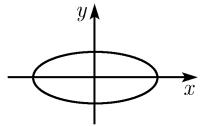</td></tr><tr><td>&gt;0</td><td>&gt;0</td><td> $\frac{x^{2}}{a^{2}}+\frac{y^{2}}{b^{2}}=-1$ </td><td>虚椭圆</td><td></td></tr><tr><td></td><td>=0</td><td> $\frac{x^{2}}{a^{2}}+\frac{y^{2}}{b^{2}}=0$ </td><td>二重点</td><td>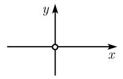</td></tr><tr><td></td><td>&lt; 0</td><td> $\frac{x^{2}}{a^{2}}-\frac{y^{2}}{b^{2}}=1$ </td><td>双曲线</td><td>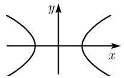</td></tr><tr><td>&lt; 0</td><td>&gt;0</td><td> $\frac{y^{2}}{b^{2}}-\frac{x^{2}}{a^{2}}=1$ </td><td>双曲线</td><td>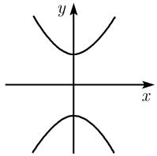</td></tr><tr><td></td><td>=0</td><td> $\frac{x^{2}}{a^{2}}-\frac{y^{2}}{b^{2}}=0$ </td><td>二重直线</td><td>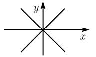</td></tr></table>

第二种主要情形 无中心方程 (表 3.4). 这时有 $\det A = 0$ , 从而 $\lambda \neq 0$ 且 $\mu = 0$ . 对 (3.19) 应用一个旋转得到

$$
\boxed {\lambda x ^ {2} + 2 q x + p y + c = 0.}
$$

对它配完全平方得到

$$
\lambda \left(x + \frac {q}{\lambda}\right) ^ {2} + p y + c - \frac {q ^ {2}}{\lambda} = 0.
$$

表 3.4 非中心曲线 ( $\det A = 0$ )

<table><tr><td>法式 (a&gt;0)</td><td>名称</td><td>图示</td></tr><tr><td> $y = ax^{2}$ </td><td>抛物线</td><td>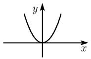</td></tr><tr><td> $y^{2} = 0$ </td><td>二重直线</td><td>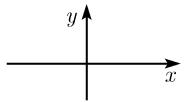</td></tr><tr><td> $y^{2} = a^{2}$ </td><td>两条直线  $y = \pm a$ </td><td>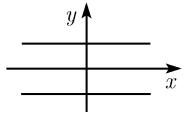</td></tr><tr><td> $y^{2} = -a^{2}$ </td><td>两条虚直线</td><td></td></tr></table>

##### 3.4.3 二次曲面

二次型 考虑方程

$$
\boxed {\boldsymbol {x} ^ {\mathrm{T}} \boldsymbol {A} \boldsymbol {x} = b.}
$$

显式表达, 此方程为

$$
a _ {1 1} x _ {1} ^ {2} + 2 a _ {1 2} x _ {1} x _ {2} + 2 a _ {1 3} x _ {1} x _ {3} + 2 a _ {2 3} x _ {2} x _ {3} + a _ {2 2} x _ {2} ^ {2} + a _ {3 3} x _ {3} ^ {2} = b\tag{3.20}
$$

具有一个实矩阵 $\boldsymbol{A}=(a_{jk})$ . 假设 $\det\boldsymbol{A}\neq0$ . 于是其迹为 $tr\boldsymbol{A}=a_{11}+a_{22}+a_{33}$ .
定理 对笛卡儿坐标系 $(x_{1}, x_{2}, x_{3})$ 应用一个旋转可将上面的方程化为下面的法式:

$$
\boxed {\lambda x ^ {2} + \mu y ^ {2} + \zeta z ^ {2} = b.}
$$

这里的 $\lambda,\mu$ 和 $\zeta$ 是 A 的特征值, 即有 $\det(A-\gamma E)=0$ , 其中 $\nu=\lambda,\mu$ 或 $\zeta$ . 又有 $\det A=\lambda\mu\zeta$ , $\operatorname{tr}A=\lambda+\mu+\zeta$ .

证明：我们来确定矩阵 A 的三个特征向量 u, v 和 w，即向量使得

$$
\boldsymbol {A} \boldsymbol {u} = \lambda \boldsymbol {u}, \quad \boldsymbol {A} \boldsymbol {v} = \mu \boldsymbol {v}, \quad \boldsymbol {A} \boldsymbol {w} = \zeta \boldsymbol {w}.
$$

在这里可选取 u, v 和 w 使得 $u^{T}v = u^{T}w = v^{T}w = 0$ 以及 $u^{T}u = v^{T}v = w^{T}w = 1$ . 令 $D := (u, v, w)$ , 变换

$$
\pmb {x} = D \pmb {x} ^ {\prime}
$$

是一个旋转. 由 (3.20) 得到了

$$
\begin{array}{r l} & b = \boldsymbol {x} ^ {\mathrm{T}} \boldsymbol {A} \boldsymbol {x} = \boldsymbol {x} ^ {\prime \mathrm{T}} (\boldsymbol {D} ^ {\mathrm{T}} \boldsymbol {A} \boldsymbol {D}) \boldsymbol {x} ^ {\prime} = \boldsymbol {x} ^ {\prime \mathrm{T}} \left( \begin{array}{l l l} \lambda & 0 & 0 \\ 0 & \mu & 0 \\ 0 & 0 & \zeta \end{array} \right) \boldsymbol {x} ^ {\prime} \\ & = \lambda x _ {1} ^ {\prime 2} + \mu x _ {2} ^ {\prime 2} + \zeta x _ {3} ^ {\prime 2}. \end{array}
$$

证毕.

一般二次曲面 现在研究方程

$$
\boxed {\boldsymbol {x} ^ {\mathrm{T}} \boldsymbol {A} \boldsymbol {x} + \boldsymbol {x} ^ {\mathrm{T}} \boldsymbol {a} + a _ {4 4} = 0,}
$$

其中 $\boldsymbol{a}=(a_{14},a_{24},a_{34})^{\mathrm{T}}$ 。此方程的显式表达为

$$
\begin{array}{c} a _ {1 1} x _ {1} ^ {2} + 2 a _ {1 2} x _ {1} x _ {2} + 2 a _ {1 3} x _ {1} x _ {3} + 2 a _ {2 3} x _ {2} x _ {3} + a _ {2 2} x _ {2} ^ {2} + a _ {3 3} x _ {3} ^ {2} \\ + a _ {1 4} x _ {1} + a _ {2 4} x _ {2} + a _ {3 4} x _ {3} + a _ {4 4} = 0 \end{array}\tag{3.21}
$$

它具有实对称矩阵

$$
\boldsymbol {A} = \left( \begin{array}{c c c} a _ {1 1} & a _ {1 2} & a _ {1 3} \\ a _ {2 1} & a _ {2 2} & a _ {2 3} \\ a _ {3 1} & a _ {3 2} & a _ {3 3} \end{array} \right), \quad \mathcal {A} = \left( \begin{array}{c c c c} a _ {1 1} & a _ {1 2} & a _ {1 3} & a _ {1 4} \\ a _ {2 1} & a _ {2 2} & a _ {2 3} & a _ {2 4} \\ a _ {3 1} & a _ {3 2} & a _ {3 3} & a _ {3 4} \\ a _ {4 1} & a _ {4 2} & a _ {4 3} & a _ {4 4} \end{array} \right).
$$

第一种主要情形 有中心的方程 (表 3.5). 如果 $\det A \neq 0$ , 则线性方程组

$$
\begin{array}{l} a _ {1 1} \alpha_ {1} + a _ {1 2} \alpha_ {2} + a _ {1 3} \alpha_ {3} + a _ {1 4} = 0, \\ a _ {2 1} \alpha_ {1} + a _ {2 2} \alpha_ {2} + a _ {2 3} \alpha_ {3} + a _ {2 4} = 0, \\ a _ {3 1} \alpha_ {1} + a _ {3 2} \alpha_ {2} + a _ {3 3} \alpha_ {3} + a _ {3 4} = 0 \end{array}
$$

有一个唯一的解 $(\alpha_{1},\alpha_{2},\alpha_{3})$ .通过平移 $X_{j}:= x_{j}- \alpha_{j}, j=1,2,3,$ (3.21) 变成了方程

$$
a _ {1 1} X _ {1} ^ {2} + 2 a _ {1 2} X _ {1} X _ {2} + 2 a _ {1 3} X _ {1} X _ {3} + 2 a _ {2 3} X _ {2} X _ {3} + a _ {2 2} X _ {2} ^ {2} + a _ {3 3} X _ {3} ^ {2} = - \frac {\det \mathcal {A}}{\det \boldsymbol {A}}.
$$

类似于在 (3.20) 中那样, 以旋转由此得到

$$
\boxed {\lambda x ^ {2} + \mu y ^ {2} + \zeta z ^ {2} = - \frac {\det \mathcal {A}}{\det \boldsymbol {A}}.}
$$

第二种主要情形 无中心的方程．这发生在 $\det A = 0$ 时的情形．将旋转用于 (3.21) 得到了这种情形下的

$$
\boxed {\lambda x ^ {2} + \mu y ^ {2} + p x + r y + s z + c = 0.}
$$

经完全配平方和平移于是给出了在表 3.6 中列出的不同法式.

表 3.5 中心曲面

<table><tr><td>法式 (a&gt;0, b&gt;0, c&gt;0)</td><td>名称</td><td>图示</td></tr><tr><td> $\frac{x^{2}}{a^{2}}+\frac{y^{2}}{b^{2}}+\frac{z^{2}}{c^{2}}=1$ </td><td>椭球面</td><td>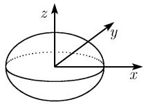</td></tr><tr><td> $\frac{x^{2}}{a^{2}}+\frac{y^{2}}{b^{2}}+\frac{z^{2}}{c^{2}}=-1$ </td><td>虚椭球面</td><td></td></tr><tr><td> $\frac{x^{2}}{a^{2}}+\frac{y^{2}}{b^{2}}+\frac{z^{2}}{c^{2}}=0$ </td><td>原点</td><td>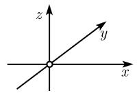</td></tr><tr><td> $\frac{x^{2}}{a^{2}}+\frac{y^{2}}{b^{2}}-\frac{z^{2}}{c^{2}}=1$ </td><td>单叶双曲面</td><td>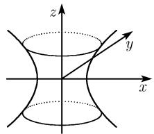</td></tr><tr><td> $\frac{x^{2}}{a^{2}}+\frac{y^{2}}{b^{2}}-\frac{z^{2}}{c^{2}}=0$ </td><td>双锥面</td><td>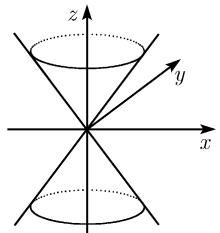</td></tr><tr><td> $\frac{z^{2}}{c^{2}}-\frac{x^{2}}{a^{2}}-\frac{y^{2}}{b^{2}}=1$ </td><td>双叶双曲面</td><td>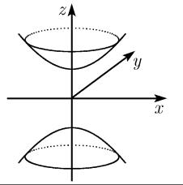</td></tr></table>

表 3.6 非中心曲面 ( $\det A = 0$ )

<table><tr><td>法式  $(a > 0, b > 0, c > 0)$ </td><td>名称</td><td>图示</td></tr><tr><td> $\frac{x^{2}}{a^{2}} + \frac{y^{2}}{b^{2}} = 2cz$ </td><td>椭圆抛物面</td><td>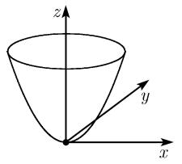</td></tr><tr><td> $\frac{x^2}{a^2} - \frac{y^2}{b^2} = 2cz$ </td><td>双曲抛物面 (鞍面)</td><td>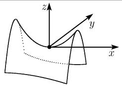</td></tr><tr><td> $\frac{x^2}{a^2} + \frac{y^2}{b^2} = 1$ </td><td>椭圆柱面</td><td>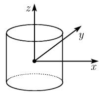</td></tr><tr><td> $\frac{x^2}{a^2} - \frac{y^2}{b^2} = 1$ </td><td>双曲柱面</td><td>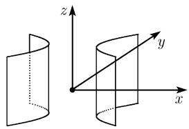</td></tr><tr><td> $\frac{x^2}{a^2} - \frac{y^2}{b^2} = 0$ </td><td>两个相交平面</td><td>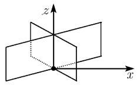</td></tr><tr><td> $x = 2cy^2$ </td><td>抛物柱面</td><td>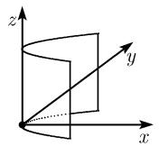</td></tr><tr><td> $x^2 = a^2$ </td><td>两个平行平面 (x=±a)</td><td>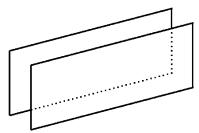</td></tr><tr><td> $x^2 = 0$ </td><td>二重平面</td><td>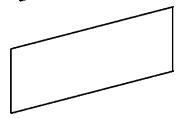</td></tr><tr><td> $\frac{x^2}{a^2} + \frac{y^2}{b^2} = -1$ </td><td>虚椭圆柱面</td><td></td></tr><tr><td> $\frac{x^2}{a^2} + \frac{y^2}{b^2} = 0$ </td><td>退化椭圆柱面 (z轴)</td><td>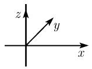</td></tr></table>
