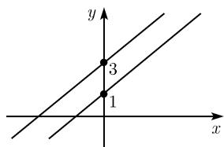
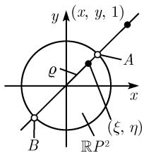
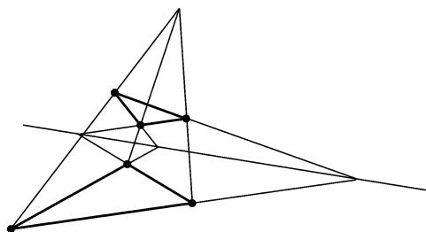
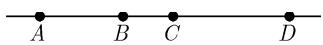
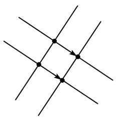
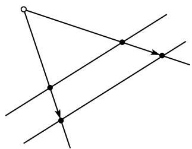
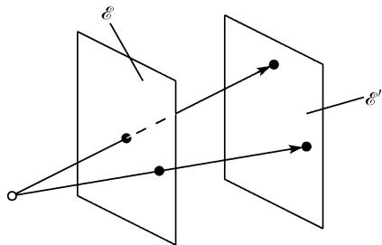

#### 3.5 射影几何学

##### 3.5.1 基本思想

在欧几里得平面几何中没有所谓的在点和直线间的对偶. 相反, 有

(i) 通过两个不同点总是恰好有一条直线.

(ii) 但是, 两条不同的直线并不总交于一个点.

为了消除这种不对称性, 定义

$$
\text {一个无穷远点} = \text {一个无指向的方向.}
$$

两条平行线总具有相同的方向, 即在无穷远处有同一点. 利用这个约定, 有: 两条不同的直线交于一个点 (它可以是在 “无穷远直线” 即所有方向的集合上的点).

齐次坐标 要使这个想法能经得住计算的考验, 例如, 在一条直线的方程

$$
y = 2 x + 1
$$

中把量 $x$ (分别地, $y$ ) 换为 $x / u$ (分别地, $y / u$ ) 并乘以 $u$ . 这给出了

$$
y = 2 x + u.
$$

我们把每个点 $(x,y)$ 相伴于所有齐次坐标 $(xu,yu)$ 的集合, 其中 $u$ 是任何一个非零实数. 两条平行线

$$
y = 2 x + 1, \quad y = 2 x + 3
$$

对应于方程

$$
y = 2 x + u, \quad y = 2 x + 3 u,
$$

它们的解为 $x = 1, y = 2, u = 0$ ，它对应于一个无穷

远点 (图 3.36). 方程

$$
\boxed {u = 0}
$$

是无穷远直线的方程.

  
图3.36

平面的射影点 一个射影点是一个集合

$$
[ (x, y, u) ] := \{(\lambda x, \lambda y, \lambda u) | \lambda \in \mathbb {R}, \lambda \neq 0 \}
$$

满足 $x^{2} + y^{2} + u^{2}\neq 0$ (注意, 这就是要求 $x,y,u$ 中至少有一个不为零). 所有这些射影点的集合被记为 $\mathbb{R}P^2$ , 并称其为实射影平面.

每个数组 $(\lambda x, \lambda y, \lambda u), \lambda \neq 0$ 被称为对点 $[(x, y, u)]$ 的一个齐次坐标集。满足 $u = 0$ 的点 $[(x, y, u)]$ 是无穷远点。

射影直线 称所有满足方程

$$
a x + b y + c u = 0
$$

的射影点 $[(x,y,u)]$ 的集合为一条射影直线. 这里的 $a, b$ 和 $c$ 是满足 $a^2 + b^2 + c^2 \neq 0$ 的实系数. 两条射影直线

$$
a _ {1} x + b _ {1} y + c _ {1} u = 0,
$$

$$
a _ {2} x + b _ {2} y + c _ {2} u = 0
$$

当 $\operatorname{rank}\left( \begin{array}{lll}a_1 & b_1 & c_1\\ a_2 & b_2 & c_2 \end{array} \right) = 2$ 时互不相同.

对偶原理 (i) 两个不同的射影点决定了一条唯一包含它们的直线.

(ii) 两条不同的射影直线决定了一个唯一的点, 即其交点.

以单位圆实现射影平面 我们以 $R P_{*}^{2}$ 表示所有开圆盘中的点和在边界 (即单位圆周) 上把对径点 A, B 等化为同一点的这种点的集合 (图 3.37).

定理 存在从 $RP^{2}$ 到 $RP_{*}^{2}$ 的双射.

证明：我们把每个射影点 $[(x,y,1)]$ 相关联到一个点 $(\xi ,\eta)$ ，在这里射影点对应了笛卡儿坐标 $(x,y)$ ，而 $(\xi ,\eta)$ 是过 $(x,y)$ 与(0,0)的直线上与原点(0,0)的距离等于

$$
\rho = \frac {2}{\pi} \arctan r
$$

的点, 其中 $r := \sqrt{x^2 + y^2}$ . 另一方面, 无穷远点 $[(1, m, 0)]$ 对应于对径点偶 $\{A, B\}$ , 它们是由直线 $y = mx$ 与单位圆相交得到的 (图3.37).

德萨格定理 如果连接两个三角形对应顶点的直线通过了一个点, 则它们的对应边的交点都位于一条直线上 (图 3.38).

  
图3.37

  
图 3.38 德萨格定理

交比 如果 A, B, C 和 D 四个点位于一条直线上, 称实数

$$
\boxed {\frac {A C}{A D}: \frac {B C}{B D}}
$$

为这四个点 (图 3.39) 的交比. 这里的 AC 代表从 A 到 C 的线段的长, 等等.

  
图3.39 交比

交比是射影几何中最重要的不变量.

##### 3.5.2 射影映射

两条直线相互间的投射 图 3.40 显示了一个平行投射和一个中心投射. 在这些投射下, 线段的长可以改变. 但是我们有下面的基本结果:

四个点的交比保持不变.

  
(a) 平行

  
(b) 中心  
图 3.40 两条直线的投射

两个平面相互间的投射 图 3.41 显示了平面 E 到平面 $E'$ 上的中心投射. 这时在一条直线上四个点的交比仍然保持不变.

  
图3.41 中心投射

直射变换 若分别在 $\mathcal{E}$ 和 $\mathcal{E}'$ 中引进了齐次坐标 $(x,y,u)$ 和 $(x',y',u')$ , 则一个直射变换定义为形如下面的这个映射:

$$
\left( \begin{array}{c} x ^ {\prime} \\ y ^ {\prime} \\ u ^ {\prime} \end{array} \right) = \left( \begin{array}{c c c} a _ {1 1} & a _ {1 2} & a _ {1 3} \\ a _ {2 1} & a _ {2 2} & a _ {2 3} \\ a _ {3 1} & a _ {3 2} & a _ {3 3} \end{array} \right) \left( \begin{array}{c} x \\ y \\ u \end{array} \right),
$$

其中的 $3 \times 3$ 实矩阵 $(a_{ij})$ 的行列式不为零.

结构定理 (i) 每个从 $\mathcal{E}$ 到 $\mathcal{E}'$ 的映射如果是由有限个平行投射和中心投射组合而成的, 则它是一个直射变换. 按此方式可得到从 $\mathcal{E}$ 到 $\mathcal{E}'$ 的所有直射变换.

(ii) 在直射变换下, 一条直线上四个点的交比保持不变.

例：在对风景进行摄影时，在同一直线上四个点的交比等于在照片上这些点的交比。因此，如果人们知道了在实景上三个点的坐标，则第四个点的可用测量在照片上这四个点的交比计算出来。

射影性质 根据克莱因的埃尔兰根纲领, 射影性质正是那些在直射变换群下不变的性质.

##### 3.5.3 $n$ 维实射影空间

设 $n=1,2,\cdots$

射影点 一个 $n$ 维的射影点 是一个集合

$$
[ x _ {1}, \dots , x _ {n + 1} ] := \{(\lambda x _ {1}, \dots , \lambda x _ {n + 1}) | \lambda \in \mathbb {R}, \lambda \neq 0 \}.
$$

在这里的 $x_{j}$ 是实数并所有的 $x_{i}$ 不同时为零. 我们称 $(\lambda x_{1},\cdots,\lambda x_{n+1})(\lambda\neq0)$ 为这个射影点 $[x_{1},\cdots,x_{n+1}]$ 的齐次坐标. 所有这些点的集合被记作 $R P^{n}$ ，并称为 n 维实射影空间. 满足 $x_{n+1}=0$ 的点被称作无穷远点.

射影子空间 设已知 m 个线性独立的向量 $p_{1}, \cdots, p_{m} \in R^{n+1}$ . 所有齐次坐标 x 可以写为形式

$$
\boxed {\boldsymbol {x} = t _ {1} \boldsymbol {p} _ {1} + \dots + t _ {m} \boldsymbol {p} _ {m}}
$$

的射影点 $[x]$ 的集合定义为由点 $[p_{1}],\cdots,[p_{m}]$ 生成的 $RP^{n}$ 的 m 维射影子空间, 其中的 $t_{1},\cdots,t_{m}$ 为任意的实参数.

如果 $m = 1$ (分别地, $m = n - 1$ ), 我们则称其为射影直线 (分别地, 射影超平面). 直射变换 这些是在射影坐标 $x$ 和 $x'$ 的集合间的映射

$$
\boxed {\boldsymbol {x} ^ {\prime} = \boldsymbol {A} \boldsymbol {x}}.
$$

这里的 A 是一个 $n+1$ 行的实方阵, 且 $\det A \neq 0$ .

每个这样的直射变换对应了一个映射

$$
\varphi_ {A}: \mathbb {R} P ^ {n} \to \mathbb {R} P ^ {n}.
$$

我们有： $\varphi_{A}=\varphi_{B}$ 当且仅当矩阵 A 和 B 一个是另一个的非零实标量的倍数.

射影群 所有这些映射 $\varphi$ 在映射的复合下构成了射影群 $PGL(n + 1,\mathbb{R})$ . 这个群自身又是一个商群, 即

$$
\boxed {P G L (n + 1, \mathbb {R}) = G L (n + 1, \mathbb {R}) / D.}
$$

这里的 $GL(n+1,\mathbb{R})$ 表示所有实的 $(n+1)$ 可逆矩阵的群, 而 D 代表所有形如 $\lambda I$ 的对角矩阵的子群, 其中 $\lambda \neq 0$ .

定理 直射变换把 $m$ 维射影于空间映射到 $m$ 维射影子空间并保持关联关系不变. $\mathbb{R}P^n$ 的拓扑结构 空间 $\mathbb{R}P^n$ 是一个 $n$ 维的、连通的、紧的、光滑的实流形 $^{1)}$ 若记

$$
S ^ {n} := \left\{\boldsymbol {x} \in \mathbb {R} ^ {n + 1} \mid | \boldsymbol {x} | = 1 \right\}
$$

为 $n$ 维单位球面, 记 $\mathbb{Z}_2$ 为二阶群, 则 $S^n / \mathbb{Z}_2$ 微分同胚于 $\mathbb{RP}^n$ . 我们将其表示为

$$
\boxed {\mathbb {R} P ^ {n} \simeq S ^ {n} / \mathbb {Z} _ {2}.}
$$

在这里商 $S^n / \mathbb{Z}_2$ 由 $S^n$ 等化它的对径点得到. $\mathbb{R}P^n$ 的另一个表示是商空间, 它由令

$$
S _ {+} ^ {n} := \{x + S ^ {n} | x _ {n + 1} > 0 \}
$$

为闭的北半球, 然后也得到

$$
\boxed {\mathbb {R} P ^ {n} \simeq S _ {+} ^ {n} / \mathbb {Z} _ {2}.}
$$

这种情形的商空间是由等化 $S_{+}^{n}$ 的赤道的对径点 (并且再无其他的等化作用了) 得到.

例 1: 对 n = 1, $S_{+}^{1}$ 是单位圆的一半 $\{x^{2} + y^{2} = 1 | y > 0\}$ ，而商 $S_{+}^{1}/Z_{2}$ 是把两个边界点 $(-1, 0)$ 和 $(0, 1)$ 等同得到的。这样我们得到了一个变形的圆，它可以拉伸为通常的单位圆。它使我们想到了同胚

$$
\boxed {\mathbb {R} P ^ {1} \simeq S ^ {1},}
$$

它实际上是个微分同胚.

例 2: 在 n = 2 的情形, 有同胚

$$
\boxed {\mathbb {R} P ^ {2} \simeq S _ {+} ^ {2} / \mathbb {Z} _ {2} \simeq \mathbb {R} P _ {*} ^ {2},}
$$

其中的 $R P_{*}^{2}$ 是由 (闭) 单位圆盘 $\{(x,y)\in\mathbb{R}^{2}\mid x^{2}+y^{2}\leqslant1\}$ 经等化边界 (即单位圆) 上的对径点得到的 (图 3.37).

定理 $\mathbb{R}P^2$ 是非定向曲面.

对一个通常的曲面, 它有两个不同的 “侧面”, 一个 “内侧” 一个 “外侧”. 例如每个球面有此性质. 在非定向曲面的情形, 设有像不同侧面的这一类东西.

##### 3.5.4 $n$ 维复射影空间

若在上面的定义中我们允许变量 $x_{1}, \cdots, x_{n+1}$ 以及 $\lambda$ 为复的，则我们得到了所谓的复射影空间 $CP^{n}$ ，其方式与在 3.5.3 得出 $RP^{n}$ 的方式相同.

另外, $\mathbb{CP}^n$ 的直射变换的定义完全像对 $\mathbb{RP}^n$ 的那样, 但允许矩阵 $A$ 为复. 复射影群 $PGL(n + 1,\mathbb{C})$ 的定义为商群

$$
\boxed {P G L (n + 1, \mathbb {C}) = G L (n + 1, \mathbb {C}) / D.}
$$

其中的 $GL(n + 1,\mathbb{C})$ 为复的 $(n + 1)$ 可逆矩阵的群, 而 $D$ 代表所有形如 $\lambda I$ 的对角线矩阵的子群, 其中 $\lambda \neq 0$ .

射影性质 属于复 $n$ 维射影几何的一个性质是说, 如果它在 $\mathbb{CP}^n$ 的所有直射变换下不变的性质, 即该性质是在 $PGL(n + 1, \mathbb{C})$ 作用下不变的.

$\mathbb{CP}^n$ 的拓扑结构 空间 $\mathbb{CP}^n$ 是一个 $n$ 维连通的、紧的、光滑的复流形. 若以

$$
S _ {\mathbb {C}} ^ {n} := \left\{x \in \mathbb {C} ^ {n + 1} \Big | \sum_ {j = 1} ^ {n} | x _ {j} | ^ {2} = 1 \right\}
$$

记 n 维复单位球, 则有微分同胚

$$
\boxed {\mathbb {C} P ^ {n} \simeq S _ {\mathbb {C}} ^ {n} / S _ {\mathbb {C}} ^ {1}.}
$$

在 3.8.4 中, 我们将看到对于平面代数曲线的研究来说, 复射影几何的方法会产生出丰富的成果. 没有这样的方法, 代数曲线的理论就是一只装着一些孤立结果的篮子, 而这些结果的完全阐述会不断地充斥着例外的情形.

$\mathbb{CP}^n$ 的拓扑性质和理想论是代数几何中射影方法成功的基础.

##### 3.5.5 平面几何学的分类

考虑一个平面 P. 平面的各种几何在利用克莱因的埃尔兰根纲领进行的分类受到了考虑在平面 P 中所有可能的变换群和它们的性质的影响.

3.5.5.1 欧氏几何学

欧几里得运动群 这个几何的群是 P 的欧几里得运动群, 它由平移、旋转和反射的复合组成. 从解析表达上说, 这个群由平面变换 $x \mapsto x'$ 组成, 它具有形式

$$
\boxed {\boldsymbol {x} ^ {\prime} = \boldsymbol {A} \boldsymbol {x} + \boldsymbol {a},}\tag{T}
$$

其中 $\boldsymbol{x}=(x_{1},x_{2})^{\mathrm{T}},\boldsymbol{a}=(a_{1},a_{2})^{\mathrm{T}}$ 。这里的 A 是一个正交矩阵，就是说， $A^{T}A=AA^{T}=E$ （其中 E 为单位矩阵）。对于 A=E，公式 (T) 给出了一个平移 $^{1)}$ 。

全等 称在平面 $P$ 中两个圆形为全等, 当且仅当它们可以通过一个欧氏运动把一个映射到另一个.

1) 显式地有

$$
\begin{array}{l} x _ {1} ^ {\prime} = a _ {1 1} x _ {1} + a _ {1 2} x _ {2} + a _ {1}, \\ x _ {2} ^ {\prime} = a _ {2 1} x _ {1} + a _ {2 2} x _ {2} + a _ {2}, \end{array}
$$

具实系数 $a_{jk}, a_{j}$ 和实变量 $x_{j}$ 和 $x'_{j}$ .

3.5.5.2 相似几何学

相似变换群 这个几何的群是所有相似变换的群, 这些变换是 (T) 中的那些 A 为正交矩阵与具正元的对角矩阵的乘积.

几何特征 一个正常的相似变换是在两个平行平面 $P$ 和 $Q$ 间进行一个中心投射，然后将 $P$ 和 $Q$ 中的对应点等化. 这对应于 (T) 中的对角矩阵

$$
\boldsymbol {A} = \left( \begin{array}{c c} \lambda & 0 \\ 0 & \lambda \end{array} \right).
$$

正数 $\lambda$ 是作为此相似变换的一个乘法因子．任意一个相似变换由正常相似变换和欧几里得运动的复合组成.

相似图形 称在平面 $P$ 中两个图形为相似的, 是说它们可用一个相似变换把一个图变到另一个.

3.5.5.3 仿射几何学

仿射群 这是由那些使 A 为可逆矩阵的映射 (T) 组成的平面 P 的变换群. 这样的变换被称作仿射变换.

几何特征 从几何上说, 可以在空间中取有限多个平面 $P, P_1, \cdots, P_n, Q$ , 并在每个上进行平行投射, 然后将 $P$ 和 $Q$ 上被映射成的点等化便得到了一个仿射变换. 仿射等价 平面 $P$ 中两个图形被称作仿射等价, 如果它们可由一个仿射变换相互转换.

例：在仿射变换下，圆映射成了椭圆，而椭圆映射到椭圆，因此椭圆的概念是仿射几何的一个概念.

3.5.5.4 射影几何学

直射变换 (射影变换) 群 射影平面的群由直射变换 $^{1)}$

$$
\boxed {\boldsymbol {y} ^ {\prime} = \boldsymbol {B y}}
$$

组成, 其中齐次坐标 $\boldsymbol{y}=(y_{1},y_{2},y_{3})^{\mathrm{T}},\boldsymbol{y}^{\prime}=(y_{1}^{\prime},y_{2}^{\prime},y_{3}^{\prime})^{\mathrm{T}}$ . 在这里 $y\neq0,\boldsymbol{y}^{\prime}\neq0$ . 另外, B 是一个实的 $(3\times3)$ 矩阵. 直射变换也被称为射影变换.

1) 显式地有

$$
\begin{array}{r l} & y _ {1} ^ {\prime} = b _ {1 1} y _ {1} + b _ {1 2} y _ {2} + b _ {1 3} y _ {3}, \\ & y _ {2} ^ {\prime} = b _ {2 1} y _ {1} + b _ {2 2} y _ {2} + b _ {2 3} y _ {3}, \\ & y _ {3} ^ {\prime} = b _ {3 1} y _ {1} + b _ {3 2} y _ {2} + b _ {3 3} y _ {3}. \end{array}
$$

所有系数 $b_{jk}$ 和变量 $y_{j}$ 和 $y_{i}^{\prime}$ 都是实的.

当令 $y_{3} = 1, b_{31} = b_{32} = 0, b_{33} = 1$ 时便围转到了仿射坐标和仿射变换.

无穷远点 加进 $P$ 上无穷远点 $y_{3} = 0$ 的 $y$ , 则平面 $P$ 扩张为射影平面 $P_{\infty}$ , 它对应于二维射影空间 $\mathbb{R}P^2$ . 两个数组 $y$ 和 $y'$ 是射影平面 $P_{\infty}$ 中同一个点的齐次坐标表明 $y = \alpha y'$ , 其中 $\alpha \neq 0$ 为某个实数.

几何特征 从几何上, 当我们在有限个平面 $P, P_1, \cdots, P_n, Q$ 上进行中心投射, 然后等化在此复合映射下 $P$ 和 $Q$ 的对应映成点而得到.

射影等价 称平面中两个图形的射影等价的, 如果它们可由一个射影变换把一个变到另一个.

例：在一个射影变换下，圆、椭圆、抛物线和双曲线全都可以相互映射。按此推理，(非退化)圆锥截线的概念是个射影几何的概念。另外，下面的一些概念也属于射影几何：“直线”、“点”、“在一条直线上的点”、“两条直线交于一点”以及“一条直线上四个点的交比”。

3.5.5.5 历史评注

欧氏几何由亚历山大的欧几里得 (大约公元前 365—前 300) 在其著名的专著《几何原本》中作了极其详尽的阐述。这些书在所有学校教材中居主导地位长达 2000 多年。

仿射几何归功于欧拉 (1707—1783).

画法几何和正交投射 使用到 (一个或两个) 平面上正交投影的画法几何是由蒙日 (Monge, 1746—1818) 在 1766 到 1770 年间创立的, 它与构建城堡的工作有关, 1978 年他的基本著作《画法几何学》(Géométrie descriptive) 出版.

射影几何与中心投射 文艺复兴时期引进了透视画法，这在欧洲的绘画中带来了一场革命，而这种画法所根据的便是中心投射。数位大艺术家都参与其中：阿尔贝蒂 (Leon Batista Alberti, 1404—1472, 罗马圣彼得教堂的建筑师)、达芬奇 (Leonardo da Vinci, 1452—1519) 和丢勒 (Albrecht Dürer, 1471—1528)。丢勒出版了 Unterweisung der Messung mit Zirkel und Richtscheit (《用圆规和直尺进行测量的操作指南》) 一书。大约直到 1900 年透视法的使用才流行起来。

现代摄影也基于中心投射．第一架照相机是由达芬奇在1500年描绘的．尼普斯(Niecéphore Niepce)在1822年生产了第一架具有“暗箱”的实用的摄影器.

综合射影几何：作为一门学科的射影几何，其发展始于1822年，这一年法国数学家蓬斯莱(Poncelet, 1788—1867)出版了Traité des propriétés projectives des figures（《关于图形的射影性质的教科书》）一书。蓬斯莱在此书中只使用了常常被称为综合几何的画法，这种几何是相对于属于笛卡儿(Descartes, 1596—1650)的解析几何而言的。由于此蓬斯莱立足于传统的法国数学家之列，这些数学家是德萨格(1591—1661)，帕斯卡(1623—1662)和蒙日(1746—1818)。

默比乌斯的重心坐标：我们对射影变换的计算能力要归功于默比乌斯的工作，这是在他的书 Der bargcentric Calcul, ein neues Hilfsmittel zur analytischen Be-handlung der Geometrie (《重心算法, 对几何的分析处理的一个新工具》) 中提出来的, 该书面世于 1827 年 $^{1)}$ . 默比乌斯在其著作中引进了重心坐标 $(m_{1}, m_{2}, m_{3})$ . 如果 $p_{1}, p_{2}, p_{3}$ 是平面 P 中三个不共线的点, 则 P 中任意一个点 P 可由满足 $m_{1} + m_{2} + m_{3} = 1$ 的实坐标 $m_{1}, m_{2}, m_{3}$ 来唯一地描述. 如果 $x_{1}, x_{2}, x_{3}$ 和 x 是对应于点 $p_{1}, p_{2}, p_{3}$ 和 p 的向量, 则有

$$
\boxed {\boldsymbol {x} = m _ {1} \boldsymbol {x} _ {1} + m _ {2} \boldsymbol {x} _ {2} + m _ {3} \boldsymbol {x} _ {3}.}
$$

例：可取点 $p_{1}=(1,0,0)$ , $p_{2}=(0,1,0)$ , $p_{3}=(0,0,1)$ .

可以赋予重心坐标以一个简单的物理解释. 如果将质量 $m_{1}, m_{2}, m_{3}$ 置于这三个点 $p_{1}, p_{2}, p_{3}$ 上, 则 $p$ 是这些质点的质心并位于由这三点张成的三角形的内部. 如果允许有负或零质量, 则可得到该平面的其他点.

若去掉对 $m_{i}$ 的限制条件 $m_{1} + m_{2} + m_{3} = 1$ ，则可得到无穷远点.

在 19 世纪对于射影几何作出重要贡献的还有施泰纳 (Steiner, 1796—1863), 施陶特 (Von Staudt, 1798—1867), 普吕克 (Plücker, 1801—1868), 凯莱 (Cayley, 1821—1895) 及克莱因 (1849—1925). 在 1870 年左右, 射影空间的概念已经作为基本几何概念被广泛接受. 在欧几里得的《几何原本》的出现到那个时刻之间相隔亘看两千多年的时光 $^{2)}$ .
