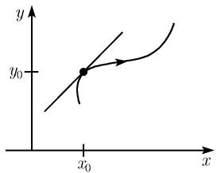
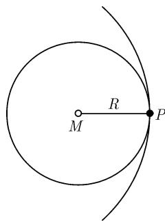
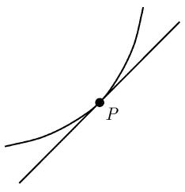
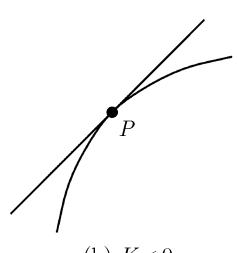
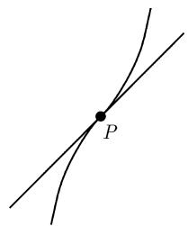
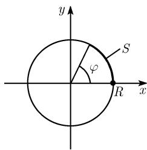
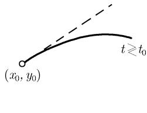
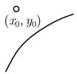
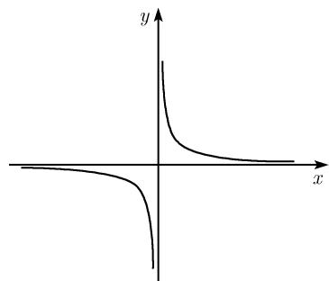
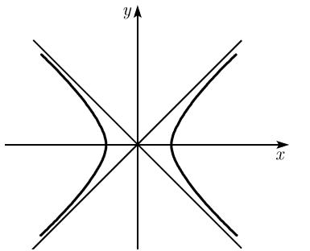

##### 3.6.1 平面曲线

参数表示 一条平面曲线是以笛卡儿坐标 $(x, y)$ 的形如

$$
\boxed {x = x (t), \quad y = y (t), \quad a \leqslant t \leqslant b}\tag{3.22}
$$

的方程给出的 (图 3.42). 若把实参数 t 解释为时间, 则 (3.22) 描述了一个点的运动, 其中这个点在时刻 t 时的坐标为 $(x(t), y(t))$ .

  
(a)

  
(b)  
图 3.42 平面曲线

例 1: 在 t = x 的特殊情形我们得到了曲线方程 $y = y(x)$ (一个函数在 $R^{2}$ 中图像的方程).

曲线的弧长

$$
\boxed {s = \int_ {a} ^ {b} \sqrt {x ^ {\prime} (t) ^ {2} + y ^ {\prime} (t) ^ {2}} \mathrm{d} t.}
$$

在点 $(x_{0},y_{0})$ 的切线方程（图3.42(a))

$$
\boxed {x = x _ {0} + (t - t _ {0}) x _ {0} ^ {\prime}, \quad y = y _ {0} + (t - t _ {0}) y _ {0} ^ {\prime}, \quad - \infty <   t <   \infty .}
$$

这里已令 $x_{0}^{\prime} := x(t_{0}), x_{0}^{\prime} = x^{\prime}(t_{0}), y_{0} := y(t_{0}), y_{0}^{\prime} = y^{\prime}(t_{0})$ .

曲线在点 $(x_{0},y_{0})$ 的法线的方程（图3.42(b))

$$
\boxed {x = x _ {0} - (t - t _ {0}) y _ {0} ^ {\prime}, \quad y = y _ {0} + (t - t _ {0}) x _ {0} ^ {\prime}, \quad - \infty <   t <   \infty .}\tag{3.23}
$$

曲率半径 R 若曲线在一点 $P(x_{0}, y_{0})$ 的邻域中曲线 (3.22) 为 $C^{2}$ 类, 则存在一个中心在 $M(\xi, \eta)$ 的半径为 R 的唯一确定的圆, 使得它与该曲线在点 P 以二阶精度相重合 (人们也称此圆与曲线有二阶切触, 或者说, 此圆与曲线有一个二阶切触点), 称 R 为该曲线在点 P 的曲率半径 (图 3.43).

曲率 K 它是数 K, 其绝对值等于曲率半径 R 的倒数:

$$
\boxed {| K | := \frac {1}{R}.}
$$

  
图3.43

而 $K$ 在点 $P$ 的符号的定义为正 (分别地, 负) 是指该曲线位于点 $P$ 的切线之上 (分别地, 之下) (图3.44). 对于曲线(3.22)有

$$
\boxed {K = \frac {x _ {0} ^ {\prime} y _ {0} ^ {\prime \prime} - y _ {0} ^ {\prime} x _ {0} ^ {\prime \prime}}{(x _ {0} ^ {\prime 2} + y _ {0} ^ {\prime 2}) ^ {3 / 2}},}
$$

其曲率中心 $M(\xi,\eta)$ 有

$$
\boxed {\xi = x _ {0} - \frac {y _ {0} ^ {\prime} (x _ {0} ^ {\prime 2} + y _ {0} ^ {\prime 2})}{x _ {0} ^ {\prime} y _ {0} ^ {\prime \prime} - y _ {0} ^ {\prime} x _ {0} ^ {\prime \prime}}, \quad \eta = y _ {0} + \frac {x _ {0} ^ {\prime} (x _ {0} ^ {\prime 2} + y _ {0} ^ {\prime 2})}{x _ {0} ^ {\prime} y _ {0} ^ {\prime \prime} - y _ {0} ^ {\prime} x _ {0} ^ {\prime \prime}}.}
$$

拐点 按定义, 称一条曲线在点 P 有一个拐点, 如果 $K(P)=0$ 且 K 在点 P 改变符号 (图 3.44(c)).

极值点 曲线上的一些点, 在这些点上曲率 K 取得其极大值或极小值, 称它们为该曲线的极值点.

两条曲线 $x = x(t), y = y(t)$ 和 $X = X(t), Y = Y(t)$ 在它们交点的夹角 $\varphi$ ，此交角 $\varphi$ 由下式确定：

$$
K > 0
$$

  
图3.44 曲线的曲率 $K$

  
(c) K=0

$$
\boxed {\cos \varphi = \frac {x _ {0} ^ {\prime} X _ {0} ^ {\prime} + y _ {0} ^ {\prime} Y _ {0} ^ {\prime}}{\sqrt {x _ {0} ^ {\prime 2} + y _ {0} ^ {\prime 2}} \sqrt {X _ {0} ^ {\prime 2} + Y _ {0} ^ {\prime 2}}}, \quad 0 \leqslant \varphi <   \pi ,}
$$

这里的 $\varphi$ 是在该交点处切线间的夹角, 并以数学的正定向下进行度量, 见图 3.45.

值 $x_{0}, X_{0}$ 等为交点的坐标.

应用

例 2: 圆心在原点 $(0, 0)$ ，半径为 R 的圆的方程为

$$
\boxed {x = R \cos t, \quad y = R \sin t, \quad 0 \leqslant t <   2 \pi}
$$

(图 3.46). 点 $(0,0)$ 是曲率中心, 而 R 为曲率半径. 它给出了曲率

$$
K = \frac {1}{R}.
$$

  
图3.45

  
图3.46

由导数 $x'(t) = -R \sin t$ 和 $y'(t) = R \cos t$ ，我们得到了切线的参数方程

$$
x = x _ {0} - (t - t _ {0}) y _ {0}, \quad y = y _ {0} + (t - t _ {0}) x _ {0}, \quad - \infty <   t <   \infty .
$$

对于弧长 $s$ ，由 $\cos^2 t + \sin^2 t = 1$ 得到关系式

$$
s = \int_ {0} ^ {\varphi} \sqrt {x ^ {\prime} (t) ^ {2} + y ^ {\prime} (t) ^ {2}} \mathrm{d} t = R \varphi .
$$

如果将圆方程写为隐形式

$$
\boxed {x ^ {2} + y ^ {2} = R ^ {2},}
$$

于是从表3.8中的 $F(x,y) = x^{2} + y^{2} - R^{2}$ 得到了在点 $(x_0,y_0)$ 的切线方程

$$
\boxed {x _ {0} (x - x _ {0}) + y _ {0} (y - y _ {0}) = 0,}
$$

即 $x_0x + y_0y = R^2$ .在极坐标下该圆的方程为

$$
r = R.
$$

表 3.7 对显式表达曲线的公式

<table><tr><td>曲线方程</td><td> $y = y(x)$  显形式</td><td> $r = r(\varphi)$  极坐标</td></tr><tr><td>弧长</td><td> $s = \int_{a}^{b} \sqrt{1 + y'(x)^2} \mathrm{d}x$ </td><td> $\int_{\alpha}^{\beta} \sqrt{r^2 + r'^2} \mathrm{d}\varphi$ </td></tr><tr><td>在点  $P(x_0, y_0)$  的切线</td><td> $y = x_0 + y'_0(x - x_0)$ </td><td></td></tr><tr><td>在点  $P(x_0, y_0)$  的法向量</td><td> $-y'_0(y - y_0) = x - x_0$ </td><td></td></tr><tr><td>在点  $P(x_0, y_0)$  的曲率  $K$ </td><td> $\frac{y''_0}{(1 + y'^2)^{3/2}}$ </td><td> $\frac{r^2 + 2r'^2 - rr''}{(r^2 + r'^2)^{3/2}}$ </td></tr><tr><td rowspan="2">曲率中心</td><td> $\xi = x_0 - \frac{y'_0(1 + y'_0^2)}{y''_0}$ </td><td> $\xi = x_0 - \frac{(r^2 + r'^2)(x_0 + r' \sin \varphi)}{r^2 + 2r'^2 - rr''}$ </td></tr><tr><td> $\eta = y_0 + \frac{1 + y'_0^2}{y''_0}$ </td><td> $\eta = y_0 - \frac{(r^2 + r'^2)(y_0 - r' \cos \varphi)}{r^2 + 2r'^2 - rr''}$ </td></tr></table>

表 3.8 对隐式表达曲线的公式

<table><tr><td>隐式方程</td><td> $F(x,y)=0$ </td></tr><tr><td>在点  $P(x_0,y_0)$  的切线</td><td> $F_x(P)(x-x_0)-F_y(P)(y-y_0)=0$ </td></tr><tr><td>在点  $P(x_0,y_0)$  的法向量</td><td> $F_x(P)(y-y_0)-F_y(P)(x-x_0)=0$ </td></tr><tr><td>在点  $P(x_0,y_0)$  的曲率  $K(F_x:=F_x(p),\text{等})$ </td><td> $\frac{-F_y^2F_{xx}+2F_xF_yF_{xy}-F_x^2F_{yy}}{(F_x^2+F_y^2)^{3/2}}$ </td></tr><tr><td>曲率中心</td><td> $\xi=x_0-\frac{F_x(F_x^2+F_y^2)}{F_y^2F_{xx}-2F_xF_yF_{xy}+F_x^2F_{yy}}$  $\eta=y_0-\frac{F_y(F_x^2+F_y^2)}{F_y^2F_{xx}-2F_xF_yF_{xy}+F_x^2F_{yy}}$ </td></tr></table>

例 3: 抛物线

$$
\boxed {y = \frac {1}{2} a x ^ {2},}
$$

a > 0, 根据表 3.7 在点 x = 0 具有曲率 K = a.

例4：设 $y = x^{3}$ 由表3.7有

$$
K = \frac {y ^ {\prime \prime} (x)}{(1 + y (x) ^ {2}) ^ {3 / 2}} = \frac {6 x}{(1 + 9 x ^ {4}) ^ {3 / 2}}.
$$

在点 x = 0, K 的符号改变. 从而这是个拐点.

奇点 我们考虑曲线 $x = x(t), y = y(t)$ . 按定义, 称点 $(x(t_0), y(t_0))$ 为该曲线的一个奇点, 如果

$$
\boxed {x ^ {\prime} (t _ {0}) = y ^ {\prime} (t _ {0}) = 0.}
$$

在这样的一个点上切线不能确切定义. 在一个奇点邻域中曲线的性态可利用泰勒级数

$$
\begin{array}{l} {x (t) = x (t _ {0}) + \frac {(t - t _ {0}) ^ {2}}{2} x ^ {\prime \prime} (t _ {0}) + \frac {(t - t _ {0}) ^ {3}}{6} x ^ {\prime \prime \prime} (t _ {0}) + \dots ,} \\ {y (t) = y (t _ {0}) + \frac {(t - t _ {0}) ^ {2}}{2} y ^ {\prime \prime} (t _ {0}) + \frac {(t - t _ {0}) ^ {3}}{6} y ^ {\prime \prime \prime} (t _ {0}) + \dots} \end{array}
$$

来研究.

例 5: 对于

$$
x = x _ {0} + (t - t _ {0}) ^ {2} + \dots , y = y _ {0} + (t - t _ {0}) ^ {3} + \dots ,
$$

有一个返回点 (图 3.47 (a)). 若

$$
x = x _ {0} + (t - t _ {0}) ^ {2} + \dots , \quad y = y _ {0} + (t - t _ {0}) ^ {2} + \dots ,
$$

则在点 $(x_{0},y_{0})$ 该曲线终结(图3.47(b)).

  
(a) 返回点

  
(b) 终点  
图3.47 奇点

由隐式方程给出的曲线的奇点 若曲线由方程 $F(x,y) = 0$ 给出, 满足 $F(x_0,y_0) = 0$ , 则按定义 $(x_0,y_0)$ 为一个奇点, 当且仅当

$$
\boxed {F _ {x} (x _ {0}, y _ {0}) = F _ {y} (x _ {0}, y _ {0}) = 0.}
$$

这条曲线在 $(x_{0},y_{0})$ 的邻域中的性态仍利用泰勒展开

$$
F (x, y) = a (x - x _ {0}) ^ {2} + 2 b (x - x _ {0}) (y - y _ {0}) + c (y - y _ {0}) ^ {2} + \dots\tag{3.24}
$$

进行研究. 在其中, 已令 $a := \frac{1}{2} F_{xx}(x_0, y_0)$ , $b := F_{xy}(x_0, y_0)$ 和 $c := \frac{1}{2} F_{yy}(x_0, y_0)$ . 另外, 令 $D := ac - b^2$ .

情形 1: D > 0. 于是 $(x_{0}, y_{0})$ 是个孤立点 (图 3.48 (a)).

情形 2: D < 0. 这时曲线在点 $(x_{0}, y_{0})$ 有两个分支 (图 3.48(b)).

若 $D = 0$ ，则我们必须要考虑展开式(3.24)中的高阶项.例如可能出现下面的情形：切触点、返回点、终点、三重点或更一般的 $n$ 重点(参看图3.47和图3.48).

  
(a) 孤立点

  
(b) 二重点

  
(c) 切触点

  
图3.48 曲线上的奇点  
(d) 三重点

突变理论 在突变理论中奇点的讨论可在 [212] 中找到.

渐近线 若当与原点的距离无限增大时一

条曲线趋向于一条直线, 则称此直线为该曲线的一条渐近线.

例 6: x 轴和 y 轴是由方程 xy = 1 给出的双曲线的渐近线 (图 3.49).

设 $a \in \mathbb{R}$ . 考虑曲线 $x = x(t), y = y(t)$ 及当 $t$ 趋向 $t_0 + 0$ 时的极限.

(i) 对于 $y(t) \to \pm \infty, x(t) \to a$ , 则直线 $x = a$ 是一条竖直渐近线.

(ii) 对于 $x(t) \to \pm \infty, y(t) \to a$ , 则直线 $y = a$ 是一条水平渐近线.

图3.49 渐近线：双曲线 $xy = 1$

(iii) 假如 $x(t) \to \infty, y(t) \to \infty$ , 若两个极限

$$
m = \lim _ {t \to t _ {0} + 0} {\frac {y (t)}{x (t)}} \text {和} c = \lim _ {t \to t _ {0} + 0} (y (t) - m x (t))
$$

存在, 则直线 $y = mx + c$ 是一条渐近线.

我们可以类似地处理 $t \rightarrow t_{0} - 0$ 和 $t \rightarrow \infty$ 的情形.

例 7: 双曲线

$$
\frac {x ^ {2}}{a ^ {2}} - \frac {y ^ {2}}{b ^ {2}} = 1
$$

具有参数化 $x = a\cosh t,y = b\sinh t.$ 两条直线

$$
y = \pm \frac {b}{a} x
$$

为渐近线 (图 3.50).

证明：例如，有

$$
\lim _ {t \to + \infty} \frac {b \sinh t}{a \cosh t} = \frac {b}{a}, \quad \lim _ {t \to + \infty} (b \sinh t - b \cosh t = 0).
$$

  
图 3.50 渐近线：双曲线 $\frac{x^{2}}{a^{2}} - \frac{y^{2}}{b^{2}} = 1$
