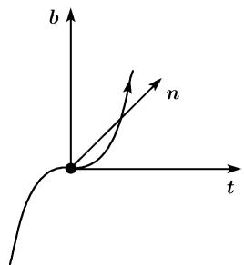

##### 3.6.2 空间曲线

参数化 设 $x, y$ 和 $z$ 为以 $\mathbf{i}, \mathbf{j}, \mathbf{k}$ 为基向量的笛卡儿坐标, 点 $P$ 的径向量为 $\boldsymbol{r} = \overrightarrow{OP}$ . 一条空间曲线由方程

  
图3.51

$$
\boxed {\boldsymbol {r} = \boldsymbol {r} (t), \quad a \leqslant t \leqslant b}
$$

给出, 即 $x = x(t)$ , $y = y(t)$ , $z = z(t)$ 及 $a \leqslant t \leqslant b$ .
在点 $r_{0} := r(t_{0})$ 的切线方程

$$
\boxed {\boldsymbol {r} = \boldsymbol {r} _ {0} + (t - t _ {0}) \boldsymbol {r} ^ {\prime} (t _ {0}), \quad t \in \mathbb {R}.}
$$

物理解释 若 t 代表时间, 则空间曲线 $\boldsymbol{r} = \boldsymbol{r}(t)$ 描述了一个质点以在 t 时的速度向量 $\boldsymbol{r}'(t)$ 及加速度 $\boldsymbol{r}''(t)$ 的运动 (图 3.51).

3.6.2.1 曲率和挠率

曲线的弧长 $s$

$$
\boxed {s := \int_ {a} ^ {b} | \boldsymbol {r} ^ {\prime} (t) | \mathrm{d} t = \int_ {a} ^ {b} \sqrt {x ^ {\prime} (t) ^ {2} + y ^ {\prime} (t) ^ {2} + z ^ {\prime} (t) ^ {2}} \mathrm{d} t.}
$$

若以 $t_{0}$ 代替 b，则得到了起点和曲线在时 $t_{0}$ 的点间的弧长.

在后文中我们将把空间曲线 $\boldsymbol{r}(s)$ 看成是弧长 s 的函数，并以 $\boldsymbol{r}'(s)$ 表示对于 s 的导数.

泰勒展开

$$
\boldsymbol {r} (s) = \boldsymbol {r} (s _ {0}) + (s - s _ {0}) \boldsymbol {r} ^ {\prime} (s _ {0}) + \frac {(s - s _ {0}) ^ {2}}{2} \boldsymbol {r} ^ {\prime \prime} (s _ {0}) + \frac {(s - s _ {0}) ^ {3}}{6} \boldsymbol {r} ^ {\prime \prime \prime} (s _ {0}) + \dots .\tag{3.25}
$$

下面的定义基于这个公式.

单位切向量

$$
\boxed {\boldsymbol {t} := \boldsymbol {r} ^ {\prime} (s _ {0}).}
$$

曲率

$$
\boxed {k := | \boldsymbol {r} ^ {\prime \prime} (s _ {0}) |.}
$$

称数 $R := 1/k$ 为曲率半径.

单位法向量

$$
\boxed {\boldsymbol {n} := \frac {1}{k} \boldsymbol {r} ^ {\prime \prime} (s _ {0}).}
$$

副法向量

$$
\boxed {\boldsymbol {b} := \boldsymbol {t} \times \boldsymbol {n}.}
$$

挠率

$$
\boxed {w := R \boldsymbol {b r} ^ {\prime \prime \prime} (s _ {0}).}
$$

几何解释 这三个向量 t, n, b 构成了在曲线上点 P 的. 所谓的伴随 3 标架 $^{1)}$ . 这是个两两正交的右手系的单位向量 (图 3.53).

(i) 曲线在点 $P_{0}$ 的切触平面由 t 和 n 张成.

(ii) 曲线在点 $P_{0}$ 的法平面由 n 和 b 张成.

(iii) 曲线在点 $P_{0}$ 的从切平面由 t 和 b 张成.

根据（3.25）知，曲线在点 $P_0$ 的切触平面中处于二阶（即具有二阶切触）(图3.52).

  
(a) k > 0

  
(b) k < 0  
图 3.52 极小和极大

若对点 $P_{0}$ 有 w = 0，则根据 (3.25) 该曲线在三阶上是条平面曲线.

若在点 $P_{0}$ 有 w > 0 (分别地, w < 0, 则曲线在 $P_{0}$ 点的邻域以 b (分别地, -b) 方向移动 (图 3.53).

一般的参数化 若曲线由 $\boldsymbol{r} = \boldsymbol{r}(t)$ 的形式给出, t 为实参数, 则有

$$
\begin{array}{l} k ^ {2} = \frac {1}{R ^ {2}} = \frac {\boldsymbol {r} ^ {\prime 2} \boldsymbol {r} ^ {\prime \prime 2} - (\boldsymbol {r} ^ {\prime} \boldsymbol {r} ^ {\prime \prime}) ^ {2}}{\left(\boldsymbol {r} ^ {\prime 2}\right) ^ {3}} \\ = \frac {(x ^ {\prime 2} + y ^ {\prime 2} + z ^ {\prime 2}) (x ^ {\prime \prime 2} + y ^ {\prime \prime 2} + z ^ {\prime \prime 2}) - (x ^ {\prime} x ^ {\prime \prime} + y ^ {\prime} y ^ {\prime \prime} + z ^ {\prime} z ^ {\prime \prime}) ^ {2}}{\left(x ^ {\prime 2} + y ^ {\prime 2} + z ^ {\prime 2}\right) ^ {3}}, \end{array}
$$

  
(a) $w > 0$

  
(b) w < 0  
图3.53 拐点

$$
w = R ^ {2} \frac {(\boldsymbol {r} ^ {\prime} \times \boldsymbol {r} ^ {\prime \prime}) \boldsymbol {r} ^ {\prime \prime \prime}}{(\boldsymbol {r} ^ {\prime 2}) ^ {3}} = R ^ {2} \frac {\left| \begin{array}{c c c} x ^ {\prime} & y ^ {\prime} & z ^ {\prime} \\ x ^ {\prime \prime} & y ^ {\prime \prime} & z ^ {\prime \prime} \\ x ^ {\prime \prime \prime} & y ^ {\prime \prime \prime} & z ^ {\prime \prime \prime} \end{array} \right|}{(x ^ {\prime 2} + y ^ {\prime 2} + z ^ {\prime 2}) ^ {3}}.\tag{3.26}
$$

例：考虑螺线

  
图3.54

从而

$$
\boxed {x = a \cos t, \quad y = a \sin t, \quad z = b t, \quad t \in \mathbb {R},}
$$

其中 $a > 0$ 及 $b > 0$ (右手系, 见图3.54) 分别地; $b < 0$ (左手系). 我们有

$$
\boxed {k = \frac {1}{R} = \frac {a}{a ^ {2} + b ^ {2}}, \quad w = \frac {b}{a ^ {2} + b ^ {2}}.}
$$

证明：以弧长 s 替代参数 t,

$$
s = \int_ {0} ^ {t} \sqrt {\dot {x} ^ {2} + \dot {y} ^ {2} + \dot {z} ^ {2}} \mathrm{d} t = t \sqrt {a ^ {2} + b ^ {2}}.
$$

于是有

$$
\begin{array}{c} x = a \cos {\frac {s}{\sqrt {a ^ {2} + b ^ {2}}}}, \quad y = a \sin {\frac {s}{a ^ {2} + b ^ {2}}}, \\ z = \frac {b s}{\sqrt {a ^ {2} + b ^ {2}}}, \end{array}
$$

$$
w = \left(\frac {a ^ {2} + b ^ {2}}{a}\right) ^ {2} \frac {\left| \begin{array}{c c c} - a \sin t & a \cos t & b \\ - a \cos t & - a \sin t & 0 \\ a \sin t & - a \cos t & 0 \end{array} \right|}{\left[ (- a \sin t) ^ {2} + (a \cos t) ^ {2} + b ^ {2} \right] ^ {3}} = \frac {b}{a ^ {2} + b ^ {2}}.
$$

这表明挠率也为常数.

3.6.2.2 曲线论中的主定理

费雷内公式 对于向量 t, n, b 关于弧长的导数我们有

$$
\boxed { \begin{array}{l l l} \boldsymbol {t} ^ {\prime} = k \boldsymbol {n}, & \boldsymbol {n} ^ {\prime} = - k \boldsymbol {t} + w \boldsymbol {b}, & \boldsymbol {b} ^ {\prime} = - w \boldsymbol {n}. \end{array} }\tag{3.27}
$$

主定理 若在区间 $a \leqslant s \leqslant b$ 中给出了两个连续函数

$$
k = k (s) \text {和} w = w (s)
$$

并且对所有 $s$ 有 $k(s) > 0$ , 则在差一个全空间的变换下, 恰好存在一个曲线段 $\pmb{r} = \pmb{r}(s), a \leqslant s \leqslant b$ , 它的弧长等于 $s$ , 并有曲率 $k$ 和模率 $w$ .

曲线的构建 (i) 方程 (3.27) 由 $t, n$ 和 $b$ 中每个的 3 个分量的 9 个微分方程的方程组组成。在规定了值 $t(0)$ 。 $n(0)$ 和 $b(0)$ (这相当于描述了在点 $S = 0$ 的伴随 3 标架) 时，这些微分方程 (3.27) 的解是唯一确定的。

(ii) 若另外还规定了向量 $r(0)$ ，则得到了

$$
\boldsymbol {r} (s) = \boldsymbol {r} (0) + \int_ {0} ^ {s} \boldsymbol {t} (s) \mathrm{d} s.
$$
