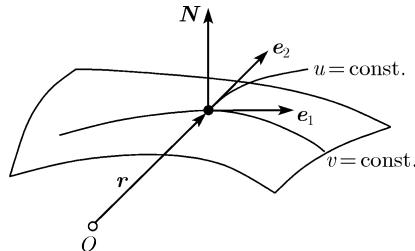
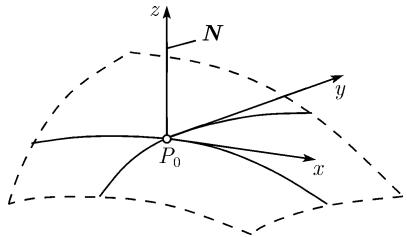
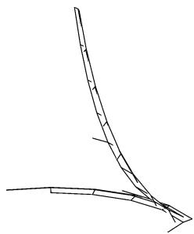
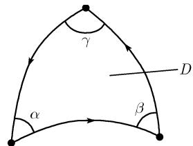

##### 3.6.3 高斯的曲面局部理论

在往昔，间或地某些光辉的、非凡的天才人物会从他们的环境中脱颖而出，他们以其思想的创造威力和行动的能量给予了人类的智力发展以如此全面的积极影响。以致与此同时，他们作为里程碑式的人物也昂首挺立在世纪之间……在数学和自然科学的历史中这样的划时间的精神巨人在古代是叙拉古的阿基米德，牛顿则在中世纪黑暗年代的末期，而高斯是在我们当今的时代，他的闪烁的辉煌生涯在死神冰冷的手触及他的具有深邃思想的头颅的那一刻已走到了尽头；这是今年的二月二十三日。

冯 瓦尔特斯豪森 (S. von Waltershausen), 1855,

《纪念高斯》

曲面的参数化 设 $x, y$ 和 $z$ 是以 $\pmb{i}, \pmb{j}, \pmb{k}$ 为基向量的笛卡儿坐标以及点 $P$ 的径向量 $\pmb{r} = \overrightarrow{OP}$ . 一个曲面由方程

$$
\boxed {\boldsymbol {r} = \boldsymbol {r} (u, v)}
$$

给出, 其中 u, v 为实参数, 即

$$
x = x (u, v), \quad y = y (u, v), \quad z = z (u, v).
$$

伴随 3 标架 令

$$
\boxed {e _ {1} := \boldsymbol {r} _ {u} (u _ {0}, v _ {0}), \quad e _ {2} := \boldsymbol {r} _ {v} (u _ {0}, v _ {0}), \quad N := \frac {\boldsymbol {e} _ {1} \times \boldsymbol {e} _ {2}}{| \boldsymbol {e} _ {1} \times \boldsymbol {e} _ {2} |}.}
$$

于是 $e_1$ (分别地, $e_2$ ) 是通过曲面上点 $P_0(u_0, v_0)$ 坐标线 $v = \mathrm{const}$ (分别地, $u = \mathrm{const}$ ) 的切向量. 另外, $N$ 是曲面在 $P_0$ 的单位法向量 (图3.55). 显式表达地有

$$
\pmb {e} _ {1} = x _ {u} (u _ {0}, v _ {0}) \pmb {i} + y _ {u} (u _ {0}, v _ {0}) \pmb {j} + z _ {u} (u _ {0}, v _ {0}) \pmb {k},
$$

$$
\boldsymbol {e} _ {2} = x _ {v} (u _ {0}, v _ {0}) \boldsymbol {i} + y _ {v} (u _ {0}, v _ {0}) \boldsymbol {j} + z _ {v} (u _ {0}, v _ {0}) \boldsymbol {k}.
$$

  
图3.55

在点 $P_0$ 的切平面方程

$$
\boxed {\boldsymbol {r} = \boldsymbol {r} _ {0} + t _ {1} \boldsymbol {e} _ {1} + t _ {2} \boldsymbol {e} _ {2}, \quad t _ {1}, t _ {2} \in \mathbb {R}.}
$$

曲面的隐式方程 若曲面由方程 $F(x,y,z)=0$ 给出，则在点 $P_{0}(x_{0},y_{0},z)$ 的单位法向量的公式是

$$
\boldsymbol {N} = \frac {\operatorname{grad} F (P _ {0})}{| \operatorname{grad} F (P _ {0}) |}.
$$

在点 $P_{0}$ 的切平面方程为

$$
\boxed {\mathbf {g r a d} F (P _ {0}) (\boldsymbol {r} - \boldsymbol {r} _ {0}) = 0.}
$$

这显式地表明

$$
F _ {x} (P _ {0}) (x - x _ {0}) + F _ {y} (P _ {0}) (y - y _ {0}) + F _ {z} (P _ {0}) (z - z _ {0}) = 0.
$$

曲面的显式方程 方程 $z = z(x,y)$ 可以按下面方式完成 $F(x,y,z) = 0$ 的形式： $F(x,y,z) := z - z(x,y)$ .

例 1: 半径为 R 的球面方程是

$$
x ^ {2} + y ^ {2} + z ^ {2} = R ^ {2}.
$$

若令 $F(x,y,z) = x^{2} + y^{2} + z^{2} - R^{2}$ ，则得到在点 $P_0$ 的切平面方程为

$$
x _ {0} (x - x _ {0}) + y _ {0} (y - y _ {0}) + z _ {0} (z - z _ {0}) = 0,
$$

其单位法向量 $N = r_{0} / |r_{0}|$ .

曲面上的奇点 对曲面 $\boldsymbol{r} = \boldsymbol{r}(u, v)$ ，点 $P_{0}(u_{0}, v_{0})$ 是个奇点当且仅当 $e_{1}$ 和 $e_{2}$ 不张成一个平面.

在隐方程 $F(x,y,z)=0$ 的情形, 按定义, $P_{0}$ 为奇点是说没有单位法向量, 即 $\mathbf{grad}F(P_{0})=0$ . 它显式地表明

$$
F _ {x} (P _ {0}) = F _ {y} (P _ {0}) = F _ {z} (P _ {0}) = 0.
$$

例 2: 圆锥 $x^{2} + y^{2} - z^{2} = 0$ 有奇点 x = y = z = 0, 它正好是圆锥的顶点.

参数变换和张量计算 令 $u^1 = u, u^2 = v$ . 如果在曲面上我们给出了两个函数 $a_{\alpha}(u^1, u^2), \alpha = 1, 2$ , 在由曲面上 $u^{\alpha}$ 坐标系到 $u'^{\alpha}$ 坐标系给出的坐标变换下，它们按下面那样变换：

$$
a _ {\alpha} ^ {\prime} (u ^ {\prime 1}, u ^ {\prime 2}) = \frac {\partial u ^ {\gamma}}{\partial u ^ {\prime \alpha}} a _ {\gamma} (u ^ {1}, u ^ {2}),\tag{3.28}
$$

于是我们称 $a_{\alpha}(u^1, u^2)$ 是在此曲面上的一个简单共变张量场。在 (3.28) 中我们使用了爱因斯坦求和约定(也将在 3.6.3 中其余地方使用它)，它说的是，该和式是由对同时存在于上指标和下指标的同一指标数取和形成的（当然，在这里的求和是从 1 到 2；这个约定在更一般的情形也有意义）。

$2k+2l$ 个函数 $a_{\alpha_{1}\cdots\alpha_{k}}^{\beta_{1}\cdots\beta_{l}}(u^{1},u^{2})$ 按定义形成一个曲面的 k 共变和 l 反变的张量场是说, 如果它们在坐变换从 $u^{\alpha}$ 到 $u^{\prime\alpha}$ 时有如下这样的变化:

$$
a ^ {\prime \beta_ {1} \dots \beta_ {l}} _ {\alpha_ {1} \dots \alpha_ {k}} (u ^ {\prime 1}, u ^ {\prime 2}) = \frac {\partial u ^ {\gamma_ {1}}}{\partial u ^ {\prime \alpha_ {1}}}   \frac {\partial u ^ {\gamma_ {2}}}{\partial u ^ {\prime \alpha_ {2}}} \dots \frac {\partial u ^ {\gamma_ {k}}}{\partial u ^ {\prime \alpha_ {k}}}   \frac {\partial u ^ {\prime \beta_ {1}}}{\partial u ^ {\delta_ {1}}} \dots \frac {\partial u ^ {\prime \beta_ {l}}}{\partial u ^ {\delta_ {l}}}   a _ {\gamma_ {1} \dots \gamma_ {k}} ^ {\delta_ {1} \dots \delta_ {l}} (u ^ {1}, u ^ {2}).
$$

张量计算的优点 如果人们在曲面论中使用张量计算, 则可立即认识到某些已知 (分析-代数的) 表达式在什么时候具有几何的意义, 即与选取的参数化无关. 这个目标可由利用张量和构建标量达到 (参看 [212]).

3.6.3.1 高斯的第一基本型和曲面的度量性质

第一基本型 按照高斯, 这个形式在由方程 $r = r(u, v)$ 给出的曲面上可写成

$$
\boxed {\mathrm{d} s ^ {2} = E \mathrm{d} u ^ {2} + F \mathrm{d} u \mathrm{d} v + G \mathrm{d} v ^ {2},}
$$

其中

$$
\begin{array}{c} E = \boldsymbol {r} _ {u} ^ {2} = x _ {u} ^ {2} + y _ {u} ^ {2} + z _ {u} ^ {2}, \quad G = \boldsymbol {r} _ {v} ^ {2} = x _ {v} ^ {2} + y _ {v} ^ {2} + z _ {v} ^ {2}, \\ F = \boldsymbol {r} _ {u} \boldsymbol {r} _ {v} = x _ {u} x _ {v} + y _ {u} y _ {v} + z _ {u} z _ {v}. \end{array}
$$

若曲面是由形如 $Z = Z(x, y)$ 的方程给出，则有 $E = 1 + z_{x}^{2}, G = 1 + z_{y}^{2}, F = z_{x}z_{y}$ .

$$
\text { 第一基本型包含了曲面的所有度量性质的信息. }
$$

弧长 曲面上一条曲线 $\boldsymbol{r} = \boldsymbol{r}(u(t), v(t))$ 具参数值 $t_{0}$ 和 t 的点之间的弧长等于

$$
s = \int_ {t _ {0}} ^ {t} \mathrm{d} s = \int_ {t _ {0}} ^ {t} \sqrt {E \left(\frac {\mathrm{d} u}{\mathrm{d} t}\right) ^ {2} + 2 F \frac {\mathrm{d} u}{\mathrm{d} t} \frac {\mathrm{d} v}{\mathrm{d} t} + G \left(\frac {\mathrm{d} v}{\mathrm{d} t}\right) ^ {2}} \mathrm{d} t.
$$

曲面面积 让参数 u, v 在 u, v 平面上区域 D 中变化所描述的曲面的一片具有的面积为

$$
\iint_ {D} \sqrt {E G - F ^ {2}} \mathrm{d} u \mathrm{d} v.
$$

曲面上两条曲线间的夹角 若 $\boldsymbol{r} = \boldsymbol{r}(u_{1}(t), v_{1}(t))$ 和 $\boldsymbol{r} = \boldsymbol{r}(u_{2}(t), v_{2}(t))$ 是在曲面 $\boldsymbol{r} = \boldsymbol{r}(u, v)$ 上的两条曲线，它们交于一点 P，则相交角 $\alpha$ （在点 P 按正向切线取的角）由下面公式决定：

$$
\cos \alpha = \frac {E \dot {u} _ {1} \dot {u} _ {2} + F (\dot {u} _ {1} \dot {v} _ {2} + \dot {v} _ {1} \dot {u} _ {2}) + G \dot {v} _ {1} \dot {v} _ {2}}{\sqrt {E \dot {u} _ {1} ^ {2} + 2 F \dot {u} _ {1} \dot {v} _ {1} + G \dot {v} _ {1} ^ {2}} \sqrt {E \dot {u} _ {2} ^ {2} + 2 F \dot {u} _ {2} \dot {v} _ {2} + G \dot {v} _ {2} ^ {2}}}.
$$

这里的 $\dot{u}_{1}$ 和 $\dot{u}_{2}$ 分别是 $u_{1}(t)$ 和 $u_{2}(t)$ 分别在 P 点对应的参数值的一阶导数, 等等.

两个曲面间的映射 假设有两个曲面

$$
\mathcal {F} _ {1}: \pmb {r} = \pmb {r} _ {1} (u, v) \quad \text {和} \quad \mathcal {F} _ {2}: \pmb {r} = \pmb {r} _ {2} (u, v),
$$

两个都是关于同一参数 $u$ 和 $v$ 给出的 (或者经过重新参数化). 若对 $\mathcal{F}_1$ 中具径向量 $\pmb{r}_1(u,v)$ 的点 $P_1$ 指派一个 $\mathcal{F}_2$ 中具径向量 $\pmb{r}_2(u,v)$ 的量 $P_2$ , 则得到了这两个曲面间的一个双射映射 $\varphi: \mathcal{F}_1 \to \mathcal{F}_2$ .

(i) 称 $\varphi$ 为保距的, 若任意曲线段的长在 $\varphi$ 下保持不变.

(ii) 称 $\varphi$ 为保角(共形)的, 如果两条任意曲线的相交角在 $\varphi$ 下保持不变.

(iii) 称 $\varphi$ 为保面积的, 如果曲面的任意一块的面积在 $\varphi$ 下保持不变.

在表 3.9 中量 $F_{j}, F_{j}, G_{j}$ 为 $F_{j}$ 的第一基本型的系数, 它们是对于参数 u, v 得到的. 在表 3.9 中所列的条件必须在曲面的每点都满足.

定理 (i) 每个保距映射是共形和保面积的.

(ii) 每个保面积映射和每个共形映射都是保距的.

(iii) 一个保距映射保持在每点的高斯曲率不变.

表 3.9 曲面的几何性质的代数条件

<table><tr><td>性质</td><td>对  $E_{j}$ ,  $F_{j}$ ,  $G_{j}$  的充要条件</td></tr><tr><td>保距</td><td> $E_{1} = E_{2}$ ,  $F_{1} = F_{2}$ ,  $G_{1} = G_{2}$ </td></tr><tr><td>保角 (共形)</td><td> $E_{1} = \lambda E_{2}$ ,  $F_{1} = \lambda F_{2}$ ,  $G_{1} = \lambda G_{2}$ ,  $\lambda(u,v) > 0$ </td></tr><tr><td>保面积</td><td> $E_{1}G_{1} - F_{1}^{2} = E_{2}G_{2} - F_{2}^{2}$ </td></tr></table>

度量张量 $g_{\alpha\beta}$ 若令 $u^{1}=u, u^{2}=u, g_{11}=E, g_{12}=g_{21}=F$ 及 $g_{22}=G$ ，则利用爱因斯坦求和约定，可以把度量记为

$$
\boxed {\mathrm{d} s ^ {2} = g _ {\alpha \beta} \mathrm{d} u ^ {\alpha} \mathrm{d} u ^ {\beta}.}
$$

过渡到曲面上另一个坐标系 $u^{\prime\alpha}$ ，我们有 $ds^{2}=g_{\alpha\beta}^{\prime}du^{\prime\alpha}du^{\prime\beta}$ 满足

$$
g _ {\alpha \beta} ^ {\prime} = \frac {\partial u ^ {\gamma}}{\partial u ^ {\prime \alpha}} \frac {\partial u ^ {\delta}}{\partial u ^ {\prime \beta}} g _ {\gamma} \delta .
$$

因而 $g_{\alpha\beta}$ 显然是一个 2 共变张量场的坐标 (度量张量).

另外，令

$$
g = \det g _ {\alpha \beta} = E G - F ^ {2}
$$

以及

$$
g ^ {1 1} = \frac {G}{g}, \quad g ^ {1 2} = g ^ {2 1} = \frac {- F}{g}, \quad g ^ {2 2} = \frac {E}{g}.
$$

我们有 $g^{\alpha\beta}g_{\beta\gamma}=\delta_{\gamma}^{\alpha}$ . 由从 $u^{\alpha}$ 坐标系到 $u^{\prime\alpha}$ 坐标的转换, $g^{\alpha\beta}$ 和 g 变换为

$$
g ^ {\prime \alpha \beta} = \frac {\partial u ^ {\prime \alpha}}{\partial u ^ {\gamma}} \frac {\partial u ^ {\prime \beta}}{\partial u ^ {\delta}} g ^ {\gamma \delta}
$$

(2 反变张量场) 和

$$
g ^ {\prime} = \left(\frac {\partial (u ^ {1} , u ^ {2})}{\partial (u ^ {\prime 1} , u ^ {\prime 2}) ^ {2}}\right) g
$$

具函数行列式

$$
\frac {\partial (u ^ {1} , u ^ {2})}{\partial (u ^ {1} , u ^ {2})} = \frac {\partial u ^ {1}}{\partial u ^ {1}} \frac {\partial u ^ {2}}{\partial u ^ {2}} - \frac {\partial u ^ {2}}{\partial u ^ {1}} \frac {\partial u ^ {1}}{\partial u ^ {2}}.
$$

为了给予一个曲线坐标系一个定向 $\eta = \pm 1$ ，我们固定一个坐标系 $u_0^\alpha$ 并声称它是正的 $(\eta = \pm 1)$ ，并称以函数行列式的符号给出 $\eta$ ，即 $\eta = \sin \frac{\partial (u^1, u^2)}{\partial (u_0^1, u_0^2)}$ 。如果我们令 $\varepsilon^{11} = \varepsilon^{22} = 0$ 和 $\varepsilon^{12} = -\varepsilon^{21} = 1$ ，则下面的列维-齐维塔张量：

$$
E ^ {\alpha \beta} := \frac {\eta}{\sqrt {g}} \varepsilon^ {\alpha \beta} \quad \text { 分别地, } E _ {\alpha \beta} := \eta \sqrt {g} \varepsilon^ {\alpha \beta}
$$

是分别与 $g^{\alpha\beta}$ 和 $g_{\alpha\beta}$ 完全一样的.

3.6.3.2 高斯的第二基本型和曲面的曲率性质

第二基本型 依照高斯所做, 对于一个曲面 $r = r(u, v)$ , 这个形式由关系

$$
\boxed {- \mathrm{d} N \mathrm{d} r = L \mathrm{d} u ^ {2} + 2 M \mathrm{d} u \mathrm{d} v + N \mathrm{d} v ^ {2}}
$$

给出, 其中

$$
L = \boldsymbol {r} _ {u u} \boldsymbol {N} = \frac {l}{\sqrt {E G - F ^ {2}}}, \quad N = \boldsymbol {r} _ {v v} \boldsymbol {N} = \frac {n}{\sqrt {E G - F ^ {2}}}, \quad M = \frac {m}{\sqrt {E G - F ^ {2}}}
$$

以及

$$
l := \left| \begin{array}{c c c} x _ {u u} & y _ {u u} & z _ {u u} \\ x _ {u} & y _ {u} & z _ {u} \\ x _ {v} & y _ {v} & z _ {v} \end{array} \right|, \quad n := \left| \begin{array}{c c c} x _ {v v} & y _ {v v} & z _ {v v} \\ x _ {u} & y _ {u} & z _ {u} \\ x _ {v} & y _ {v} & z _ {v} \end{array} \right|, \quad m := \left| \begin{array}{c c c} x _ {u v} & y _ {u v} & z _ {u v} \\ x _ {u} & y _ {u} & z _ {u} \\ x _ {v} & y _ {v} & z _ {v} \end{array} \right|.
$$

```txt
第二基本型包含了曲面张量性质的信息.
```

若令 $u^1 = u, u^2 = v$ 和 $b_{11} = L, b_{12} = b_{21} = M, b_{22} = N,$ 则我们可以写成

$$
- \mathrm{d} N \mathrm{d} r = b _ {\alpha \beta} \mathrm{d} u ^ {\alpha} \mathrm{d} u ^ {\beta}.
$$

在从 $u^{\alpha}$ 坐标到新坐标 $u^{\prime \alpha}$ 的坐标变换下我们有 $-\mathrm{d}N\mathrm{d}r = b_{\alpha \beta}'\mathrm{d}u'^{\alpha}\mathrm{d}u'^{\beta}$ ，其中

$$
b _ {\alpha \beta} ^ {\prime} = \varepsilon \frac {\partial u ^ {\gamma}}{\partial u ^ {\prime \alpha}} \frac {\partial u ^ {\delta}}{\partial u ^ {\prime \beta}} b _ {\gamma \delta},
$$

而 $\varepsilon$ 是函数行列式的符号： $\varepsilon = \operatorname{sgn}\frac{\partial(u'^1, u'^2)}{\partial(u^1, u^2)}$ 。从而 $b_{\alpha \beta}$ 是一个 2 共变伪张量的坐标。进一步令 $b := \det b_{\alpha \beta} + LN - M^2$ 。量 $b$ 则按照 $g$ 的同一方式变换。

曲面上一点的典型的笛卡儿坐标系 在给定点 $P_0$ ，我们总能选取一个笛卡儿坐标系 $x, y, z$ 使其原点为 $P_0$ ，而它的 $x, y$ 平面为该曲面在 $P_0$ 的切平面 (图3.56). 在这个 $x, y, z$ 坐标系中，在靠近 $P_0$ 处曲面可以被描述为 $z = z(x, y)$ ，满足 $z(0, 0) = z_x(0, 0) = z_y(0, 0) = 0$ . 在 $P_0$ 这个相应的3标架由三个单位向量 $\mathbf{i}, \mathbf{j}$ 和 $\mathbf{N} = \mathbf{i} \times \mathbf{j}$ 组成. 在 $P_0$ 的一个邻域中的泰勒展开式

$$
z = \frac {1}{2} z _ {x x} (0, 0) x ^ {2} + z _ {x y} (0, 0) x y + \frac {1}{2} z _ {y y} (0, 0) y ^ {2} + \dots
$$

作另外一个绕 z 轴的笛卡儿坐标系的旋转, 则可进一步地得到一个位置使得在其中有

$$
\boxed {z = \frac {1}{2} (k _ {1} x ^ {2} + k _ {2} y ^ {2}) + \dots .}
$$

称这个 $x, y$ 坐标系为曲面在点 $P_0$ 的标准笛卡儿坐标系. 称 $x$ 轴和 $y$ 轴为主曲率方向, 而 $k_1, k_2$ 为该曲面在点 $P_0$ 的主曲率.

另外称 $R_{1}=1/k_{1}$ 和 $R_{2}=1/k_{2}$ 为主曲率半径.

在点 $P_{0}$ 的高斯曲率 K 定义

$$
\boxed {K := k _ {1} k _ {2}}
$$

这是一个曲面的基本曲率.

例：对于半径为 R 的球面, 有 $R_{1}=R_{2}=R$ 及 $K=1/R^{2}$ .

称 K = 常数的曲面为具常值高斯曲率的曲面. 它们的例子有

(a) 球面, 对其而言 K > 0.

(b) 伪球面, 对其而言 $K < 0$ ; 这样一个曲面可像图3.57中那些由一条曳物线绕 $z$ 轴旋转得到.

在一点 $P_{0}$ 的平均曲率 H 令

$$
\boxed {H := \frac {1}{2} (k _ {1} + k _ {2})}
$$

并称 H 为该曲面的平均曲率. 具有 $H \equiv 0$ 的曲面被称为极小曲面 (参看 [212]).

  
图3.56

  
图3.57

若用变换 $x \mapsto y, y \mapsto x, z \mapsto -z$ 变换坐标, 则主曲率的变化为 $k_{1} \mapsto -k_{2}, k_{2} \to -k_{1}$ . 由此有 $K \mapsto K, H \mapsto -H$ . 这表明 $K$ 是一个真正的几何量, 而 $H$ 则不是而只有 $|H|$ 是的.

表 3.10 给出了对 K 的不同符号的几何解释.

表 3.10 曲面曲率的可能值

<table><tr><td>点 $P_0$ 的类型</td><td>分析的定义</td><td>靠近 $P_0$ 在二阶范围内的性态</td></tr><tr><td>椭圆点</td><td> $K = k_1k_2 > 0$ (i.e. $LN - M^2 > 0$ )</td><td>椭球面</td></tr><tr><td>脐点</td><td> $K = k_1k_2 > 0, \quad k_1 = k_2$ </td><td>球</td></tr><tr><td>双曲点</td><td> $K = k_1k_2 < 0$ (i.e. $LN - M^2 < 0$ )</td><td>单叶双曲面</td></tr><tr><td>抛物点</td><td> $K = k_1k_2 = 0$ (i.e. $LN - M^2 = 0$ )(a) $k_1^2 + k_2^2 \neq 0$ (b) $k_1 = k_2 = 0$ </td><td>圆柱面平面</td></tr></table>

定理 假设曲面由参数化 $\boldsymbol{r} = \boldsymbol{r}(u, v)$ 给出.

(i) 有

$$
\boxed {K = \frac {L N - M ^ {2}}{E G - F ^ {2}}, \quad H = \frac {L G - 2 F M + E N}{2 (E G - F ^ {2})}.}
$$

(ii) 主曲率 $k_{1}$ 和 $k_{2}$ 是二次方程

$$
k ^ {2} - 2 H k + K = 0
$$

的解.

(iii) 若 $e_{1}, e_{2}$ 和 N 代表曲面上的 3 标架, 则主曲率方向具有形式 $\lambda_{1}e_{1} + \lambda_{2}e_{2}$ , 其中 $\lambda, \mu$ 为方程

$$
\lambda^ {2} (F N - G M) + \lambda \mu (E N - G L) + \mu^ {2} (E M - F L) = 0\tag{3.29}
$$

的解.

证明概述：在标准的笛卡儿坐标系中，第一和第二基本型具有非常简单的表达式

$$
\mathrm{d} s ^ {2} = \mathrm{d} x ^ {2} + \mathrm{d} y ^ {2}, \quad - \mathrm{d} N \mathrm{d} r = k _ {1} \mathrm{d} x ^ {2} + k _ {2} \mathrm{d} y ^ {2}.
$$

由此我们得到

$$
K = \frac {b}{g}, H = \frac {1}{2} g ^ {\alpha \beta} b _ {\alpha \beta}.
$$

于是经张量计算知这些表达式在一个任意的 $u^{\alpha}$ 坐标系中成立, 这是因为 $K$ 是一个标量而 $H$ 是个伪标量. 方程 (3.29) 对应于结果 $E^{\alpha \beta} g_{\alpha \sigma} b_{\beta \mu} \lambda^{\alpha} \lambda^{\mu} = 0$ .

可展直纹面 称一个曲面是直纹的, 如果它可以由空间中直线的运动生成 (例如, 锥面、柱面、双曲面、双曲抛物面). 如果直纹面可实际上 “剥开” 成一个平面, 我们则称这个曲面为可展的 (例如一个柱面). 如果在一个可展曲面上有 K = 0, 则 $LN - M^{2} = 0$ .

曲面截线 设 $e_1, e_2, N$ 为曲面 $\boldsymbol{r} = \boldsymbol{r}(u, v)$ 在点 $P_0$ 相伴随的3标架. 以通过 $P_0$ 和由 $\lambda e_1 + \mu e_2$ 生成的直线的平面切割该曲面. 另外, 记 $E$ 与法向量 $\boldsymbol{N}$ 的夹角为 $\gamma$ , 则交线在点 $P_0$ 的曲率由

$$
\boxed {k = \frac {k _ {N}}{\cos \gamma}}
$$

给出, 其中

$$
k _ {N} = \frac {L \lambda^ {2} + 2 M \lambda \mu + N \mu^ {2}}{E \lambda^ {2} + 2 F \lambda \mu + G \mu^ {2}}.
$$

曲面上曲线的曲率 曲面上一条通过曲面上点 $P_0$ 的曲线与这条曲线在 $P_0$ 的切触平面与曲面的交线具有相同的曲率 $k$ . 如果这个切触平面与 $N$ 构成了角 $\gamma$ , 并与对应于 $k_1$ 的主曲率方向构成角 $\alpha$ , 则有

$$
\boxed {k = \frac {k _ {1} \cos^ {2} \alpha + k _ {2} \sin^ {2} \alpha}{\cos \gamma}}
$$

(欧拉-梅尼埃定理).

3.6.3.3 曲面论的主定理和高斯绝妙定理 (theorema egregium) 对导数的高斯和魏因加滕方程 在伴随 3 标架中的变化由所谓的导数方程描绘:

$$
\boxed { \begin{array}{l l l} {\frac {\partial \pmb {e} _ {\alpha}}{\partial u ^ {\beta}}} & {\Gamma_ {\alpha \beta} ^ {\sigma} \pmb {e} _ {\sigma} + b _ {\alpha \beta} \pmb {N}} & {(\text {高斯}),} \\ {\frac {\partial \pmb {N}}{\partial u ^ {\alpha}}} & {- g ^ {\sigma \gamma} b _ {\gamma \alpha} \pmb {e} _ {\sigma}} & {(\text {魏因加滕}).} \end{array} }
$$

所有的指标都是从 1 到 2. 那些既出现在下指标又出现在上指标则被求和. 克里斯托费尔符号由公式

$$
\Gamma_ {\alpha \beta} ^ {\sigma} := \frac {1}{2} g ^ {\sigma \delta} \left(\frac {\partial g _ {\alpha \delta}}{\partial u ^ {\beta}} + \frac {\partial g _ {\beta \delta}}{\partial u ^ {\alpha}} - \frac {\partial g _ {\alpha \beta}}{\partial u ^ {\delta}}\right).
$$

给出. 这些符号不代表张量. (在坐标变换下它们的变化不正确.) 导数方程组成了一个 18 个偏微分方程的方程组, 它们涉及 $e_1, e_2$ 和 $N$ 中每个的三个分量的一阶导数; 这些方程可借助于费罗贝尼乌斯定理 (参看 1.13.5.3) 得出.

可积性条件 由 $\frac{\partial^2\pmb{e}_\alpha}{\partial u^\beta\partial u^\gamma} = \frac{\partial^2\pmb{e}_\alpha}{\partial u^\gamma\partial u^\beta} = \frac{\partial^2N}{\partial u^\alpha\partial u^\beta} = \frac{\partial^2N}{\partial u^\beta\partial u^\alpha}$ 我们得到了所谓的可积性条件

$$
\frac {\partial b _ {1 1}}{\partial u ^ {2}} - \frac {\partial b _ {1 2}}{\partial u ^ {1}} - \Gamma_ {1 2} ^ {1} b _ {1 1} + (\Gamma_ {1 1} ^ {1} - \Gamma_ {1 2} ^ {2}) b _ {1 2} + \Gamma_ {1 1} ^ {2} b _ {2 2} = 0,\tag{3.30}
$$

$$
\frac {\partial b _ {1 2}}{\partial u ^ {2}} - \frac {\partial b _ {2 2}}{\partial u ^ {1}} - \Gamma_ {2 2} ^ {1} b _ {1 1} + (\Gamma_ {1 2} ^ {1} - \Gamma_ {2 2} ^ {2}) b _ {1 2} + \Gamma_ {1 2} ^ {2} b _ {2 2} = 0
$$

(马伊纳尔迪-科达齐方程) 且

$$
\boxed {K = \frac {R _ {1 2 1 2}}{g}}\tag{3.31}
$$

(高斯的绝妙定理).

这里的 $R_{\alpha\beta\gamma\delta}=R_{\alpha\beta\gamma}^{\cdots\nu}g_{\nu\delta}$ 是黎曼曲率张量, 其中

$$
R _ {\alpha \beta , \gamma .} ^ {\dots \nu} = \frac {\partial \Gamma_ {\alpha \gamma} ^ {\nu}}{\partial x ^ {\beta}} + \Gamma_ {\beta \sigma} ^ {\nu} \Gamma_ {\alpha \gamma} ^ {\sigma} - \frac {\partial \Gamma_ {\beta \gamma} ^ {\nu}}{\partial x ^ {\alpha}} - \Gamma_ {\alpha \sigma} ^ {\nu} \Gamma_ {\beta \gamma} ^ {\sigma}.
$$

主定理 若已知有函数

$$
g _ {1 1} (u ^ {1}, u ^ {2}) \equiv E (u, v), g _ {1 2} (u ^ {1}, u ^ {2}) = g _ {2 1} (u ^ {1}, u ^ {2}) \equiv F (u, v),
$$

$$
g _ {2 2} (u ^ {1}, u ^ {2}) \equiv G (u, v)
$$

(假定它们均为二次连续可微), 以及函数

$$
b _ {1 1} (u ^ {1}, u ^ {2}) \equiv L (u, v), \quad b _ {1 2} (u ^ {1}, u ^ {2}) = b _ {2 1} (u ^ {1}, u ^ {2}) \equiv M (u, v),
$$

$$
b _ {2 2} (u ^ {1}, u ^ {2}) \equiv N (u, v)
$$

(假设它们为连续可微), 它们还满足可积性条件 (3.30) 和 (3.31), 并且对任意实数 $\lambda, \mu, \lambda^2 + \mu^2 \neq 0$ , 它们满足 $E\lambda^2 + 2F\lambda\mu + G\mu^2 > 0$ , 则存在一个曲面 $\boldsymbol{r} = \boldsymbol{r}(u, v)$ , 它为三次连续可微, 使得它的第一和第二基本型的系数为这些已知的函数. 这个曲面在平移和旋转下唯一决定.

这个曲面的构建如下. (1) 由高斯-魏因加滕导数公式可唯一地得到伴随的 3 标架, 这只要给出了在固定点 $P_{0}(u_{0}, v_{0})$ 这些函数的值就可做到.

(2) 由 $\partial \pmb{r} / \partial u^{\alpha} = e^{\alpha}$ 可计算出 $\pmb{r}(u,v)$ ; 如果要求曲面通过点 $P_0$ , 则 $\pmb{r}(u,v)$ 被唯一确定.

基本的绝妙定理 一个曲面的高斯曲率曾在 3.6.3.2 中借助于所嵌入的空间定义.但根据 (3.29), K 只依赖于度量张量 $g_{\alpha\beta}$ 和它的导数, 从而只依赖于第一基本型.

$$
\text { 高斯曲率 } K \text { 可以只被曲面上的度量所决定. }
$$

从而曲率 $K$ 是曲面的内蕴性质, 即它不依赖于所嵌入的空间. 这是流形的曲率论的起点. 例如在广义相对论中四维时空空间的曲率应对了引力.

高斯长时间努力来完成这个绝妙定理. 这是他的曲面论的顶点.

例：对于一个保距映射，第一基本型从而高斯曲率被保持不变. 对于球面（分别地，平面），有 $K = 1 / R^2$ （分别地， $K = 0$ ）．从而球面不可能保距地映射成平面．因此没有地球表面的保距映射.

但是, 我们可构造保角映射. 这对于航海极其重要.

3.6.3.4 测地线

测地线 称一个曲面上的一条曲线为测地线, 如果在该曲线的每点上, 曲线的主法线与曲面的主法线或者平行或者反平行. 曲面上两个点之间的最短线段总是一条测地线的一部分. 在平面上这些测地线恰好就是通常意义下的直线. 在球面上, 测地线是大圆 (例如经线和赤道. 一条测地线 $r = r(u'(s), u^2(s))$ (其中 $s$ 代表弧长) 满足微分方程

$$
\boxed {\frac {\mathrm{d} ^ {2} u ^ {\alpha}}{\mathrm{d} s ^ {2}} + \Gamma_ {\beta \gamma} ^ {\alpha} \frac {\mathrm{d} u ^ {\beta}}{\mathrm{d} s} \frac {\mathrm{d} u ^ {\gamma}}{\mathrm{d} s} = 0, \quad \alpha = 1, 2}
$$

并且反过来, 这些方程之解总是测地线.

若曲面以 $z = z(x,y)$ 的形式给出，则测地线 $z = z(x,y(x))$ 的微分方程为

$$
(1 + z _ {x} ^ {2} + z _ {y} ^ {2}) y ^ {\prime \prime} = z _ {x} z _ {y y} (y ^ {\prime}) ^ {3} + (2 z _ {x} z _ {x y} - z _ {y} z _ {y y}) (y ^ {\prime}) ^ {2} + (z _ {x} z _ {x x} - 2 z _ {y} z _ {x y}) y ^ {\prime} - z _ {y} z _ {x x}.
$$

测地曲率 对在曲面上由 $\boldsymbol{r} = \boldsymbol{r}(u(s), v(s))$ 给出的曲线 (s 为弧长) 总存在下面的一个分解

$$
\boxed {\frac {\mathrm{d} ^ {2} \boldsymbol {r}}{\mathrm{d} s ^ {2}} = k _ {N} \boldsymbol {N} + k _ {g} \left(\boldsymbol {N} \times \frac {\mathrm{d} \boldsymbol {r}}{\mathrm{d} s}\right),}
$$

其中

$$
k _ {N} = \boldsymbol {N} \frac {\mathrm{d} ^ {2} \boldsymbol {r}}{\mathrm{d} s ^ {2}}, \quad k _ {g} = \left(\boldsymbol {N} \times \frac {\mathrm{d} \boldsymbol {r}}{\mathrm{d} s}\right) \frac {\mathrm{d} ^ {2} \boldsymbol {r}}{\mathrm{d} s ^ {2}}.
$$

称数 $k_{g}$ 为测地曲率. 曲面上的一条曲线是测地线当且仅当 $k_{g}=0$ .

3.6.4 高斯的曲面整体理论

关于一个三角形的和角的高斯定理 设 D 是曲面上的一个测地三角形, 其角为 $\alpha, \beta$ 和 $\gamma$ , 即该三角形的边都为测地线, 则有

$$
\boxed {\int_ {D} K \mathrm{d} F = \alpha + \beta + \gamma - \pi ,}\tag{3.32}
$$

其中 dF 代表曲面的测度 (图 3.58).

例：对单位球面我们有 K = 1，即 $\int_{D} K \, dF$ 等于此三角形的面积.

全曲率 对任意球面有

$$
\boxed {\int_ {F} K \mathrm{d} F = 4 \pi .}
$$



(3.33)

图3.58 曲面上的一个三角形

这个关系式对所有微分同胜于一个球面的闭光滑曲面 $F$ 仍然有效。在此基本结果中，微分几何和拓扑学相遇了。欧拉示性数和示性类理论之间的联系将在[212]中得到解释。

若曲面 F 是个环面或微分同胜于一个环面, 则我们必须把 (3.33) 的右端换为 “=0”.

博内定理 (1848) 若在图 3.58 中三角形的边为具弧长 $s$ 的任意曲线, 则必须将 (3.32) 换成

$$
\boxed {\int_ {D} K \mathrm{d} F + \int_ {\partial D} k _ {g} \mathrm{d} s = \alpha + \beta + \gamma - \pi ,}
$$

其中边界曲线 $\partial D$ 在一种数学的正指向下为横线.
