#### 3.7 平面曲线的例子

##### 3.7.1 包络线和焦散线

我们考虑依赖于一个实参数 c 的曲线族:

$$
\boxed {F (x, y, c) = 0.}
$$

这个族的包络线是从方程

$$
F _ {x} (x, y, c) = 0, \quad F (x, y, c) = 0
$$

中消去 c 得到的.

例：对曲线族 $(x - c)^2 + y^2 - 1 = 0$ 我们得到 $x - c = 0$ 从而有

$$
y ^ {2} = 1.
$$

这个解的集合由两条直线 $y = \pm1$ 组成 (图 3.59).

散焦线 图 3.60 显示了一个圆面镜, 它将射向它的平行光线反射回去. 这些反射光线的包络被称为一条散焦线. 散焦线的外形通常造成了几何光学的极大困难, 更一般地说, 是变分法中的困难.

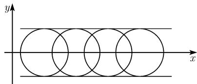  
图3.59 包络线

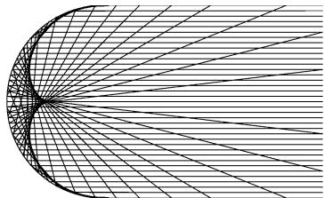  
图3.60 反射平行光线的圆的散焦线

在古希腊就已知道了散焦线.

##### 3.7.2 渐屈线

定义 称一条给定曲线 C 的所有曲率中心的几何轨迹为 C 的渐屈线 E.

如果曲线 C 由 $y = f(x)$ 的形式给出, 则可得出参数形式的渐屈线如下:

$$
\boxed {x = t - \frac {f ^ {\prime} (t) \left(1 + f ^ {\prime} (t) ^ {2}\right)}{f ^ {\prime \prime} (t)}, \quad y = f (t) + \frac {1 + f ^ {\prime} (t) ^ {2}}{f ^ {\prime \prime} (t)}}
$$

(表 3.7).

定理 曲线 $C$ 在其一点的法线等于其渐屈线在相应的曲率中心的切线 (参看图3.64中 $PQ$ 的一段).

例1：对于抛物线 $C:y = \frac{1}{2} x^2$ 我们得到了

$$
x = - t ^ {3}, \quad y = 1 + \frac {3}{2} t ^ {2}.
$$

在消去 t 后, 得到了半立方抛物线

$$
y = 1 + \frac {3}{2} x ^ {2 / 3},
$$

它是这条抛物线的渐屈线 (图 3.61).

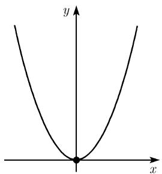  
(a) 抛物线

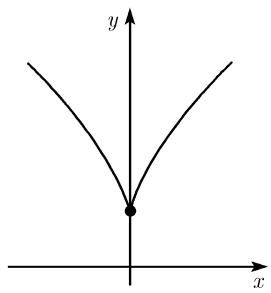  
(b) 渐屈线  
图3.61

例 2: 椭圆

$$
\frac {x ^ {2}}{a ^ {2}} + \frac {y ^ {2}}{b ^ {2}} = 1
$$

的渐屈线是星形线

$$
\left(\frac {a x}{c ^ {2}}\right) ^ {2} + \left(\frac {b y}{c ^ {2}}\right) ^ {2} = 1,
$$

其中 $c^{2}=a^{2}-b^{2}$ (图 3.62).

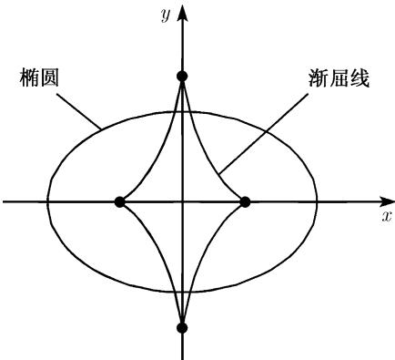  
图3.62 椭圆的渐屈线

##### 3.7.3 渐伸线

定义 已知曲线 $E$ ，则由包围（或展开）具定长的（切）弦得到的曲线 $C$ 被称为渐伸线（图3.63）.

定理 如果 E 是 C 的渐屈线, 则 C 为 E 的渐伸线.

例：圆

$$
E: x ^ {2} + y ^ {2} = R ^ {2}\tag{3.34}
$$

的渐伸线是

$$
C: x = R (\cos \varphi + \varphi \sin \varphi), \quad y = R (\sin \varphi - \varphi \cos \varphi)\tag{3.35}
$$

(图 3.64). 更准确地我们有下面的情形: 圆 (3.34) 是曲线 (3.35) 的渐屈线. 如果考虑图 3.64 中对 E 的切线 PQ, 则由展开此线段得到了曲线 C 的一段弧.

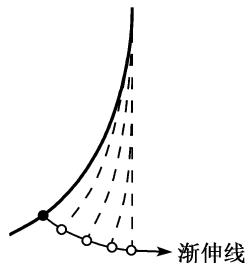  
图3.63

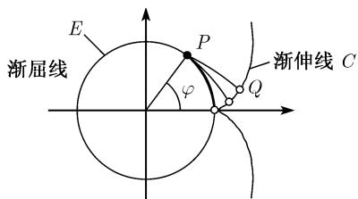  
图3.64

##### 3.7.4 惠更斯的曳物线和悬链线

曳物线 (图 3.65(a)) 这条曲线由方程

$$
\boxed {x = \pm \left(a \operatorname{arcosh} \frac {a}{y} - \sqrt {a ^ {2} - y ^ {2}}\right)}
$$

给出.

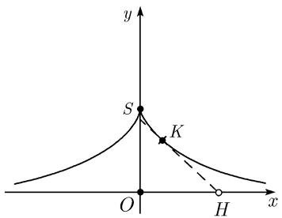  
(a) 曳物线

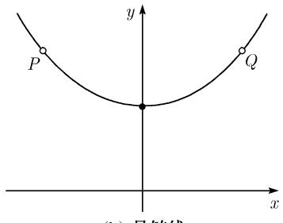  
(b) 悬链线  
图 3.65 涉及双曲三角函数的两条曲线

几何特征：如果考虑该曲线在其点 $K$ 的切线，它交 $x$ 轴于一点 $H$ ，则线段 $KH$ 的长是一个常数.

曳物线这个名称来自的事实是: 这是当一个头在点 H 拉一辆在 K 的大车所产生的曲线. 这种情形在早期的采矿中常常实际发生.

x 轴是此曳物线的渐近线. 如果 $s(y) = SK$ 代表从曲线的类点到在 K 的半车的长, 而 $x(y) = OH$ 表示该半到原点的距离, 于是有

$$
\lim _ {y \to 0} | s (y) - x (y) | = a (1 - \ln 2).
$$

这个数近似地等于 $0.3069 \cdot a$ .

绕 x 轴旋转这条曳物线便得到一个曲常负曲率的曲面, 这就是我们已知的伪球面 (图 3.57).

悬链线 (图 3.65 (b)) 这个曲线的方程是

$$
\boxed {y = a \cosh \frac {x}{a}.}
$$

物理特征：这条曲线在形式上对应于一条晾衣绳或链，这就是名称的出处：它的拉丁文“Catenary”的意思就是链；这条线挂在 $P$ 和 $Q$ 点. 在重力作用下自然下垂.

在 P 和 Q 之间的长度等于 $2a \sinh(x/a)$ .

几何特征: 悬链线是曳物线的渐屈线.

绕 $x$ 轴旋转悬链线得到一个其平均曲率为零的曲面（一个极小曲面），称其为悬链面.

##### 3.7.5 伯努利双纽线和卡西尼卵形线

在笛卡儿坐标下的双纽线方程 (图 3.66 (a))

$$
\boxed {\left(x ^ {2} + y ^ {2}\right) ^ {2} - 2 a ^ {2} \left(x ^ {2} - y ^ {2}\right) = 0.}
$$

在此方程中出现的常数 $a$ 被假定为正. 这条曲线首先由 J. 伯努利在 Acta cruditorm (《教师学报》) 中首先给出, 发表于 1694 年.

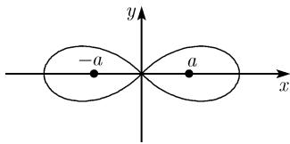  
(a) 双纽线

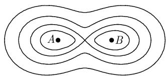  
(b) 卡西尼卵形线  
图 3.66 作为卡西尼卵形线特殊情形的双纽线

几何特征：双纽线是所有那种点的轨迹，这些点到两点 $A = (a,0)$ 和 $B = (-a,0)$ 的距离的乘积等于 $a^2$ 。两条线 $y = \pm x$ 在原点切于双纽线。

总面积： $2a^{2}$

该曲线长：对 $a = 1$ ，双纽线的总长为

$$
L = 2 \int_ {0} ^ {1} {\frac {\mathrm{d} x}{\sqrt {1 - x ^ {4}}}}.
$$

这是一个椭圆积分. 22 岁的高斯在 1799 年发现了公式

$$
\boxed {\frac {\pi}{L} = M (1, \sqrt {2}),}\tag{3.36}
$$

其中 $M(a_{0},b_{0})$ 代表两个正数 $a_{0}$ 和 $b_{0}$ 的算术-几何平均, 就是说

$$
M (a _ {0}, b _ {0}) = \lim _ {n \to \infty} a _ {n} = \lim _ {n \to \infty} b _ {n},
$$

其中

$$
a _ {n + 1} := \frac {a _ {n} + b _ {n}}{2}, \quad b _ {n + 1} := \sqrt {a _ {n} b _ {n}}.
$$

高斯的公式 (3.36) 是更一般公式的一个特殊情形, 这个一般公式是

$$
\boxed {K (k) := \int_ {0} ^ {\pi / 2} \frac {\mathrm{d} \varphi}{\sqrt {1 - k ^ {2} \sin^ {2} \varphi}} = \frac {\pi}{2 M (1 , \sqrt {1 - k ^ {2}})}.}\tag{3.37}
$$

它是第一类型的完全椭圆积分 $K(x)$ ，其中 1 < k < 1.
在笛卡儿坐标中卡西尼卵形线的方程（图 3.66(b))

$$
\boxed {\left(x ^ {2} + y ^ {2}\right) ^ {2} - 2 a ^ {2} \left(x ^ {2} - y ^ {2}\right) + a ^ {4} - c ^ {4} = 0.}
$$

此处的常数 $a$ 和 $c$ 是正的. 这条曲线是天文学家卡西尼 (J. D. Cassini, 1625—1712) 在其 Eléments d'astronomie (《天文学原理》) 中描述的, 出现在 1749 年.

几何特征: 卡西尼卵形线是那种点的轨迹, 它到两个固定点 $A = (a,0)$ 和 $B = (-a,0)$ 的距离的乘积等于 $c^2$ .

双纽线是卡西尼卵形线在 $a = c$ 的特殊情形, 它是后来由P. 费罗尼 (Ferroni) 在1782年认识到的.

##### 3.7.6 利萨如图形

在笛卡儿坐标下利萨如 (Lissajou) 图形的参数化形式 (图 3.67):

$$
\boxed {x = a \sin \omega t, \quad y = b \sin (\omega^ {\prime} t + \alpha).}
$$

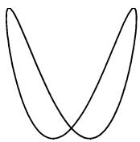  
(a) $\frac{\omega}{\omega'} = \frac{1}{2}$

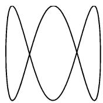

$$
\frac {\omega}{\omega^ {\prime}} = \frac {1}{3}
$$

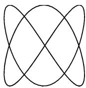  
图3.67 利萨如曲线  
(c) $\frac{\omega}{\omega'} = \frac{2}{3}$

如果把 t 解释为时间, 则这些是振动, 它由美国天文学家 N. 鲍狄奇 $^{1)}$ (Nathaniel Bowditch, 1773—1836) 和在 1850 年由利萨如研究. 改变角频率 $\omega, \omega'$ , 同时还有相的变化 $\alpha$ , 我们可以用一个激光器生成了许多种的曲线, 某些曲线有时可在激光表演的场合显示出来.

##### 3.7.7 螺线

阿基米德螺线 (图 3.68 (a)) 这些曲线在极坐标下的方程是

$$
\boxed {r = a \varphi , \quad \varphi > 0.}
$$

假定在这里的常数 a 为正.

对数螺线 (图 3.68 (b)) 这些曲线由方程

$$
\boxed {r = a \mathrm{e} ^ {b \varphi}, \quad - \infty <   \varphi <   \infty .}
$$

给出. 这里出现的常数 $a$ 和 $b$ 也假定为正.

几何性质：从原点出发的每条射线交一条对数螺线为常数角 $\alpha$ ，其中 $\cot\alpha=k$ .

由条件 $\beta \leqslant \varphi \leqslant r$ 决定的弧的长： $L = (\gamma -\beta)\frac{\sqrt{1 + b^2}}{b}.$

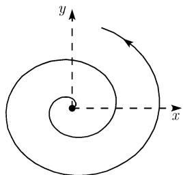  
(a) 阿基米德螺线

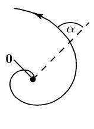  
(b) 对数螺线

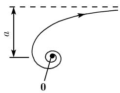  
(c) 双曲螺线  
图 3.68 各种螺线

曲率半径： $r\sqrt{1+b^{2}}$ .

对 b=0, 此曲线是半径为 a 的圆.
双曲螺线 (图 3.68 (c)) 这些曲线有方程

$$
\boxed {r = \frac {a}{\varphi}, \quad \varphi > 0.}
$$

常数 a 仍为正.

蜘蛛曲线 (四旋曲线) (图 3.69)

$$
\boxed {R = \frac {a ^ {2}}{s}.}
$$

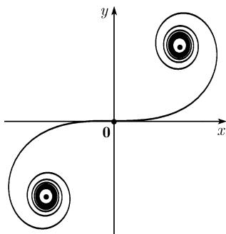

(3.38)

图3.69 蜘蛛曲线

在这个方程中, $R$ 是曲率半径, $s$ 表示曲线上点到原点 0 的弧长. 常数 $a$ 为正. 如果一条曲线像在 (3.38) 那样, 由纯粹的几何量描述, 则可称其为自然的曲线方程. 在笛卡儿坐标中的参数化表示:

$$
x = a \sqrt {\pi} \int_ {0} ^ {t} \cos \frac {\pi u ^ {2}}{2} \mathrm{d} u, y = a \sqrt {\pi} \int_ {0} ^ {t} \sin \frac {\pi u ^ {2}}{2} \mathrm{d} u, - \infty <   t <   \infty .
$$

这条曲线处于相对于原点 $\mathbf{0} = (0, 0)$ 的对称的状态.

弧长： $s = at\sqrt{\pi}.$

渐近点：

$$
A = \left(\frac {a \sqrt {\pi}}{2}, \frac {a \sqrt {\pi}}{2}\right), \quad B = \left(\frac {a \sqrt {\pi}}{2}, \frac {a \sqrt {\pi}}{2}\right).
$$

##### 3.7.8 射线曲线（蚌线）

定义 如果一条曲线 $C$

$$
r = f (\varphi)
$$

由极坐标给出, 则 C 的蚌线是具有方程

$$
\boxed {r = f (\varphi) + b}
$$

的曲线 (或者方程为 $r = f(\varphi) - b$ ). 这里的 b 仍是一个正常数.

3.7.8.1 尼科米迪斯蚌线

在极坐标下的方程 (图 3.70):

$$
\boxed {r = \frac {a}{\cos \varphi} \pm b, - \frac {\pi}{2} <   \varphi <   \frac {\pi}{2}.}\tag{3.39}
$$

这里的两个常数 $a$ 和 $b$ 都为正．对于“+”（分别地，“-”）我们得到了这条曲线的正（分别地，负）分支．如果在(3.39)中令 $b = 0$ ，则我们得到了直线 $x = a$ （图3.70(a))．尼科米迪斯蚌线因而是一条直线的蚌线.

这条曲线大约发现于公元前 180 年, 这是在试图解决黛尔芬问题中得到的, 这是关于二倍立方体和圆形的三分问题.

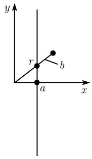  
(a) 直线

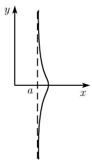

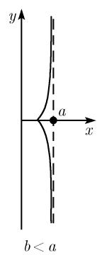  
(b) 正分支

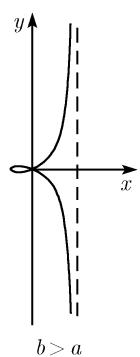  
图 3.70 尼科米迪斯蚌线  
(c) 负分支

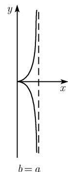

3.7.8.2 帕斯卡蝎线和心脏线

极坐标中的方程 (图 3.71):

$$
\boxed {r = a \cos \varphi + b, - \pi <   \varphi \leqslant \pi ,}\tag{3.40}
$$

这里的常数 $a$ 和 $b$ 为正. 圆的方程 $(x - a)^2 + y^2 = a^2$ 在极坐标下为 $r = a\cos \varphi$ , 其中 $-\frac{\pi}{2} < \varphi \leqslant \frac{\pi}{2}$ . 这就是为什么人们称 (3.40) 为圆的蚌线.

所围成的面积 $^{1)}$ : $A=\frac{\pi a^{2}}{2}+\pi b^{2}$ .

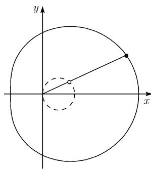  
(a) $b \geqslant 2a$

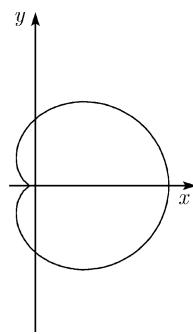  
(b) a < b < 2a

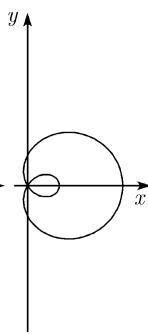  
(c) b < a

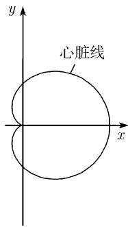  
(d) a = b  
图 3.71 帕斯卡蝎线

在笛卡儿坐标下的方程： $(x^{2}+y^{2}-ax)^{2}=b^{2}(x^{2}+y^{2})$ .

心脏线的特殊情形 出现于 $a = b$ 。这时有

所包围的面积: $A = \frac{3\pi a^{2}}{2}$ .

拐点：x = 2a, y = 0.

##### 3.7.9 旋轮线

可以由沿一给定曲线以常用速度旋转一个轮子来产生许多曲线, 这时取轮的铁钉上-固定点 (譬如在边缘上) 的轨线即可. 这在图 3.72 和图 3.74 中已有图解. 自从文艺复兴期以来许多数学家处理过的这类曲线已常常用于所有技术领域.

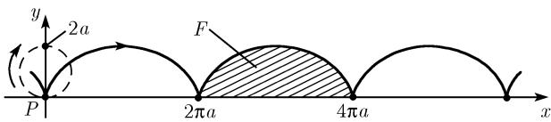  
(a) 旋轮线

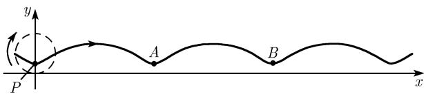  
(b) 短辐旋轮线

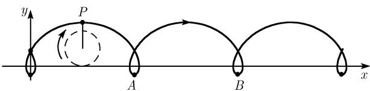  
(c) 长辐旋轮线  
图 3.72 对不同参数的车轮线或旋轮线

3.7.9.1 沿直线旋转-车轮 (旋轮线)

在笛卡儿坐标下的参数化 (图 3.72)

$$
\boxed {x = a (\varphi - \mu \sin \varphi), \quad y = a (\varphi - \mu \cos \varphi), \quad - \infty <   \varphi <   \infty .}
$$

这里的 a 是半径, $\varphi$ 是旋轮的相对角.

分类 (i) $\mu = 1$ (旋轮线),

(ii) $0 < \mu < 1$ (短辐旋轮线),

(iii) $\mu > 1$ (长辐旋轮线).

在情形 (i), 点 P 在轮的边缘, 而在情形 (ii) (分别地, 情形 (iii)) 它位于轮边缘内部 (分别地, 外部)). 后两种情形也被称为摆线.

一个旋轮线弧与 x 轴之间的面积: $A = 3\pi a^{2}$ .

在点 x=0 和 x=a 之间的旋轮线的长：L=8a.

旋轮线的曲率半径： $4a\sin\frac{\varphi}{2}$

摆线的曲率半径： $\frac{a(1+\mu^{2}-2\mu\cos\varphi)^{3/2}}{\mu(\cos\varphi-\mu)}$

从 $A$ 到 $B$ 的摆线弧长： $L = a\int_{0}^{2\pi}\sqrt{1 + \mu^2 - 2\mu\cos\varphi}\mathrm{d}\varphi.$

旋轮线是著名的摆线问题的解, 它归功于约翰·伯努利 (参看 5.1.2).

在笛卡儿坐标下的参数化 (图 3.73)

$$
\boxed { \begin{array}{c} x = (A + a) \cos \varphi - \mu a \cos \frac {A + a}{a} \varphi , \\ y = (A + a) \sin \varphi - \mu a \sin \frac {A + a}{a} \varphi . \end{array} }
$$

在这里一个半径为 $a$ 的轮子在一个半径 $A$ 的圆上旋转. 点 $P$ 具有极坐标 $\varphi$ 和 $r$ . 分类 (i) $\mu = 1$ (外摆线),

(ii) $0 < \mu < 1$ (短程外摆线),

(iii) $\mu > 1$ (长程外摆线).

外摆线的曲率半径 $\frac{Aa(A+a)}{A+2a}\sin\frac{A\varphi}{2a}.$

相交现象 令 $n = \frac{A}{a}$ .

(i) 若 n 为自然数, 则此曲线在绕圆一周后闭合.

(ii) 若 $n$ 为有理数, 则此曲线在绕周有限多次后闭合.

(iii) 若 n 为无理数, 则此曲线永不闭合.

从一个夹点到另一个之间的外摆线弧长 $8(A + a) / n.$

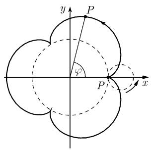  
(a) n = 3

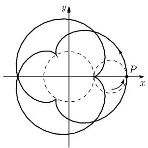  
(b) $n = \frac{3}{2}$

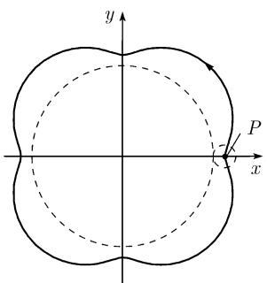  
(c) n = 4, $\mu < 1$

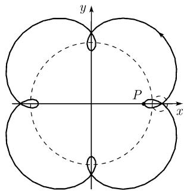  
(d) $n = 4, \mu > 1$  
图 3.73 外摆线 (在圆上的旋轮生成的曲线).

3.7.9.2 沿一个圆的内侧旋转车轮 (内摆线)

在笛卡儿坐标下的参数化 (图 3.74)

$$
\boxed { \begin{array}{c} x = (A - a) \cos \varphi - \mu a   \cos \frac {A - a}{a} \varphi , \\ y = (A - a) \sin \varphi - \mu a   \sin \frac {A - a}{a} \varphi . \end{array} }
$$

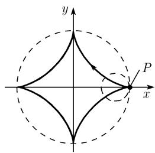  
(a) n=4, $\mu=0$

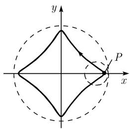  
(b) $n = 4, \mu < 1$

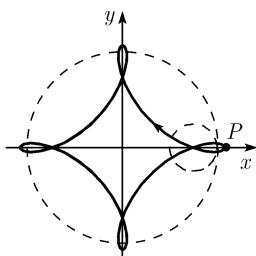  
(c) n=4, $\mu>1$  
图 3.74 内摆线 (在圆内侧旋转轮子产生的曲线)

在这里的一个半径为 $a$ 的轮子在一个半径为 $A$ 的内边缘旋转. 点 $P$ 的极坐标为 $\varphi$ 和 $r$ .

分类 (i) $\mu = 1$ (内摆线),

(ii) $0 < \mu < 1$ (短程内摆线),

(iii) $\mu > 1$ (长程内摆线).

内摆线的曲率半径 $\frac{4a(A-a)}{A-2a}\sin\frac{A\varphi}{2a}$ .

例1：在 $n = \frac{A}{a} = 4$ 和 $\mu = 1$ 我们得到参数化表示

$$
x = A \cos^ {3} \varphi , \quad y = A \sin^ {3} \varphi , \quad 0 \leqslant \varphi <   2 \pi .
$$

这是一条星形线, 在笛卡儿坐标下由

$$
\boxed {x ^ {2 / 3} + y ^ {2 / 3} = A ^ {2 / 3}}
$$

给出, 或者为 $(x^{2} + y^{2} - A^{2})^{3} + 27x^{2}y^{2}A^{2} = 0$ (图3.74(a)). 星形线是一条6次代数曲线(见下面的3.8.2).

3.7.9.3 希帕凯斯 (Hipparchus) 的周转圆

在笛卡儿坐标下的参数化表示 (图 3.75)

$$
\boxed {x = A \cos \omega t + a \cos \omega^ {\prime} t, \quad y = A \sin \omega t + a \sin \omega^ {\prime} t.}\tag{3.41}
$$

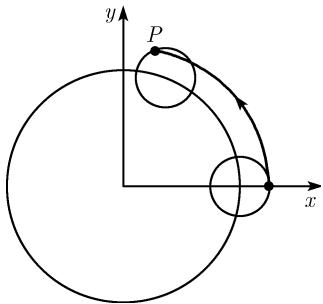  
图3.75

当把 $t$ 解释为时间时, (3.41) 描述了在一个半径为 $a$ 的圆 $K_{a}$ 上在点 $P$ 的一个质点的运动. 在这个运动中, $K_{a}$ 的中心在一个半径为 $A$ 的圆 $K_{A}$ 以角速度 $\omega$ 运动, 而 $K_{a}$ 以角速度 $\omega'$ 旋转. 这些周转圆在古代被伟大的天文学家希帕凯斯 (公元前 180—前 125) 和托勒密 (公元前 150) 用来描绘在天体中行星的运动.

周转圆的理论告诫我们：以一个充分灵活可塑的模型，人们可以近似地描述现实，甚至在此模型肯定是错误的情形也是如此.
