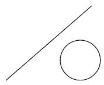
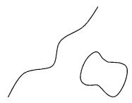
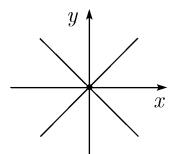
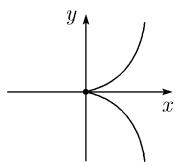
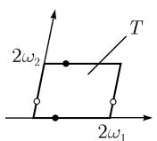
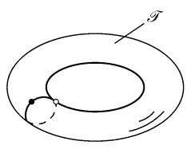
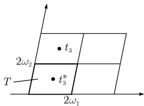
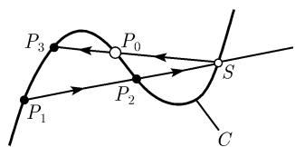

##### 3.8.1 基本思想

3.8.1.1 基本问题

设已知 m 个具复系数的 n 个 (复) 变量 $z_{1}, \cdots, z_{n}$ 的多项式 $p_{j} = p_{j}(z)$ . 令 $z = (z_{1}, \cdots, z_{n})$ . 代数几何所关心的是形如

$$
\boxed {p _ {j} (\boldsymbol {z}) = 0, \quad \boldsymbol {z} \in \mathbb {C} ^ {n}, \quad j = 1, \dots , m}\tag{3.42}
$$

的方程组的解. 这是所有数学的中心问题, 它们的解对许多问题具有重要性 $^{1)}$ .

3.8.1.2 奇点和它们在物理中的关联

$$
\text {代数几何中的典型难点在于奇点的出现.}
$$

定义 设 $m < n$ . (3.42) 的一个解 $z$ 被称为一个正则点是说, 如果有

$$
\boxed {\operatorname{Rank} \left(\frac {\partial p _ {j} (z)}{\partial z _ {k}}\right) = m}
$$

(即 f 的雅可比矩阵具有极大秩). 其他情形则称 z 是方程组 (3.42) 的一个奇点.

若方程组 (3.42) 的所有解都是正则的, 则该解的集合形成一个光滑流形. 在微分拓扑和微分几何中研究了流形 (参看 [212]).

例 1(流形): 一条直线的方程

$$
\boxed {y = m x + b}
$$

和对圆的方程

$$
\boxed {x ^ {2} + y ^ {2} = r ^ {2},}
$$

其中 r > 0 描述了没有奇点的曲线, 即这些曲线构成了一维流形. 这种流形的特征性质是在曲线的每个点有唯一的切线 (参看图 3.76(a)).

  
(a) 流形(无奇异点)

  
(b) 二重点(奇点)

  
图 3.76 光滑流形与奇点  
(c) 具尖点的半立方抛物线

例 2(作为奇点的二重点): 方程

$$
\boxed {x ^ {2} - y ^ {2} = 0}
$$

分解为 $x^{2} - y^{2} = (x - y)(x + y) = 0$ 。这表明由此方程描述的曲线分裂为两条不同的直线，各具方程 $x - y = 0$ 和 $x + y = 0$ 。这两条直线交于点 $(0,0)$ 称此点为一个普通二重点。可清楚看出，在此点曲线有两条切线（即这两条直线），故这不是一个流形（图3.76(b))。

二重点也可出现在一条曲线的自交情形, 这就像在笛卡儿叶状线的情形 (参看 3.8.2.3 的图 3.82).

例 3(作为奇点的尖点): 半立方抛物线

$$
\boxed {y ^ {2} - x ^ {3} = 0,}\tag{3.43}
$$

在点 $(0,0)$ 有一个称为尖点的点. 在此尖点不存在切线, 故又不是一个流形.

二重点和尖点是可能出现的最简单的奇点.

在物理中与奇点的关联 在自然界中的一个基本现象是一个系统可以在临界的外在影响下剧烈地改变其性态. 在这种情形中人们将谈及所谓分歧 (分岔). 这些可以归属于, 例如, 生态突变或者经济危机.

例 4 (平衡态的分歧): 如果一个系统处于平衡态, 它可以在外力的影响下转移到一个新的平衡态. 例如外力作用在一个棒的长方向, 则在某个临界水平上会发生在棒上的一个膨胀.

例 5 (霍普夫分歧): 一个处于平衡态的动力系统可以在外力影响下开始振动.

$$
\text {在自然界存在的分歧可以借助于奇点进行数学建模.}
$$

这就是分歧理论的背景, 我们将在 [212] 中谈到它. 另外所谓突多变理论也属于这个领域, 后面这个理论应归功于法国数学家 R. 托姆 (Thom).

现在考虑 (3.42) 的最简单的特殊情形.

线性方程 若所有多项式 $p_{j}$ 为线性 (次数为 1), 则 (3.42) 是个线性方程组, 对它则有一个完整的解的理论 (参看 2.3).

从几何的观点看, 线性方程的研究对应于直线的, 平面的和超平面的相交性态的研讨.

泛函分析 甚至在线性方程的最简单情形也导致了线性代数的发展. 尽管从现代的观点看线性方程是平凡的, 但这也构成了所称为的泛函分析的基础. 偏微方程的现代理论和量子理论都以泛函分析的语言来阐述.

拓扑 在现代数学中的一个基本策略是用与其相伴的属于线性代数的简单结构来研究复杂结构. 例如, 这便是用于代数拓扑中的方法. 在其中 (拓扑) 空间由它们的德拉姆 (de Rham) 上同调群表示, 这构成了现代微分拓扑的基础. 一个不算精巧的例子是用切空间来研究流形 (见 [212])

二次方程 若多项式 $p_j$ 是二次的即具有次数2, 则基本方程 (3.42) 描述了圆锥截线和它们的相交性态. 如果我们考虑一个单个的二次方程

$$
\boxed {p (x, y) = 0,}
$$

假定多项式 p 为不可约, 我们便得到了一个光滑的圆锥截线. 奇点只可能出现在多项式 p 可分裂的情形 (即分解为乘积), 这时我们有例 2 中的情形.

数论 二次方程对应于在数论中重点研究的二次型. 它的基础归功于高斯的二次型理论, 这在他的 1801 年的专著 Disquisitiones arithmeticae (《算术研究》) 中所阐述的. 这次它又变成了二次数域理论以及现代代数和解析数论的基础.

谱论 $n$ 个变量的二次方程

$$
\sum_ {j, k = 1} ^ {n} a _ {j k} x _ {j} x _ {k} = \text {常数}
$$

可以被简洁地写成矩阵形式

$$
\boxed {\boldsymbol {x} ^ {\mathrm{T}} \boldsymbol {A} \boldsymbol {x} = \text {常数}}
$$

这种类型方程的研究涉及求矩阵 A 的法式. 这个理论在 19 世纪后半时得到发展. 这个理论的基础由欧拉 (1765) 和拉格朗日 (1773) 对于旋转刚体的惯性轴的研究形成的, 它导致了对主轴的特殊变换. 这个变换的一般形式由柯西在 1829 年给出. 在 1904 年希尔伯特将其联系于他的积分方程理论推广到了无穷维的矩阵. 冯诺依曼在 1928 年认识到希尔伯特所用过的想法实际上可用于在希尔伯特空间中的无界自伴算子的谱理论, 这次它又成了量子论的基础. 哈密顿算子的谱推广了对称矩阵的特征值并准确地描述了量子系统可能的能量水平.

二次型和现代物理的几何 保持二次型, 特别是保持化成了法式的二次型的变换群是许多重要的几何学的基础, 我们将在 3.9 中仔细考虑.

特殊函数 如果我们找寻圆

$$
\boxed {x ^ {2} + y ^ {2} = 1}
$$

的参数表示, 则我们将得到三角函数. 该圆的整体参数表示 (单值化) 由

$$
\boxed {x = \cos t, y = \sin t, \quad t \in \mathbb {R}}
$$

给出. 我们需要用周期函数来作此描述的事实有一个较深刻的拓扑上的理由, 它是说这个圆是一条二次的亏格 0 的不可约代数曲线.

由这个圆的参数化可以立即得到双曲线

$$
\boxed {x ^ {2} - y ^ {2} = 1}
$$

的整体参数比 (单值化), 这时的 y 换作 iy, t 换作 is, 便有

$$
\boxed {x = \cos i s, \quad y = - \mathrm{i} \sin i s, \quad s \in \mathbb {R}.}
$$

这等同于双曲线的参数化

$$
\boxed {x = \cosh s, \quad y = \sinh s, \quad s \in \mathbb {R},}
$$

在这里利用了双曲函数.

如果只观察实的值, 函数的周期性是不明显的. 欧拉曾发现某些椭圆积分的反函数是周期的. 当高斯在研究双纽线时, 作为 20 岁的他, 发现某些椭圆积分的反函数除了欧拉所导出的实周期外还有两个纯虚的周期; 这个发现产生了极大的后果. 这个事实后来证实在魏尔斯特拉斯发展起来的双周期 (椭圆) 函数论中是彻底了解椭圆积分的关键. 椭圆积分的反函数的双周期性在拓扑的理由已在 1.14.19 中解释过.

单值化和奇点分解 寻找一般曲线和曲面的整体参数化是个有趣的问题. 这里的单值化概念也被叫做奇点分解. 这一类的问题, 至少对人们试图单值化相当一般的对象而言, 属于在整个数学中最为困难的部分.

(i) 所有三次代数曲线的单值化导向了椭圆函数和椭圆积分的理论.

(ii) 任意代数曲线的单值化属于由克贝 (Koebe) 和庞加莱在 1907 年所证明的著名的单值化定理的内容之中。单值化让我们可借助于自守函数来计算阿贝尔积分。

(iii) 在 1964 年, 广中平佑 (HiroNaka) 成功地证明了对任意维的射影代数集的一般奇点分解定理.

三次方程 三次代数曲线 (甚至在其方程是不可约时) 可以具有奇点. 它们是那种在其上不能唯一定义切线的点. 半三次抛物线 (3.43) 是这种情形的最简单的例子.

3.8.1.3 椭圆曲线和椭圆积分

椭圆曲线 根据魏尔斯特拉斯 (1815—1897), 方程

$$
\boxed {w ^ {2} = 4 z ^ {3} - g _ {2} z - g _ {3}}\tag{3.44}
$$

的复解 $(z, w)$ 的集合由参数表示

$$
\boxed {z = \wp (t), w = \wp^ {\prime} (t), \quad t \in \mathbb {C},}\tag{3.45}
$$

其中 $\wp$ 代表由魏尔斯特拉斯定义的椭圆函数, 它有两个复周期 $2\omega_{1}$ 和 $2\omega_{2}$ , 并且具常数

$$
\begin{array}{l} e _ {1} := \wp (\omega_ {1}), \quad e _ {2} := \wp (\omega_ {1} + \omega_ {2}), \quad e _ {3} := \wp (\omega_ {2}), \\ g _ {2} := - 4 (e _ {1} e _ {2} + e _ {1} e _ {3} + e _ {2} e _ {3}), \quad g _ {3} := 4 e _ {1} e _ {2} e _ {3}. \end{array}
$$

椭圆积分 积分

$$
J = \int R (z, \sqrt {4 z ^ {3} - g _ {2} z - g _ {3}}) \mathrm{d} z
$$

被理解为

$$
J = \int R (z, w) \mathrm{d} z\tag{3.46}
$$

的意思, 其中 $(z,w)$ 为方程 (3.44) 的解. 通过变量代换 $z=\wp(t)$ , $w=\wp'(t)$ 得到

$$
J = \int R (\beta (t), \wp^ {\prime} (t)) \wp^ {\prime} (t) \mathrm{d} t.
$$

由于与椭圆积分理论的关联, 人们称 (3.44) 为一条椭圆曲线. 另一方面, 在单复变函数的理论 (函数论) 中, 人们称这种情形为由 (3.44) 给出的 “多值函数” $w = w(z)$ 的黎曼面 $^{1)}$ . 因此有

$$
\text {   椭圆曲线的研究导致了椭圆函数和椭圆积分理论.   }
$$

椭圆曲线的拓扑结构 所有满足 (3.44) 的复数偶 $(z, w)$ 的集合按定义构成了一条椭圆曲线 $C$ . 由于 $\wp$ 函数具有复周期 $\omega_{1}$ 和 $\omega_{2}$ , 在寻找 (3.45) 中的参数表示时, 可局限于一个平行四边形 $T$ 中的 $t$ 值, 其中 $T$ 的边界的相对点被等化 (图 3.77(a)). 借助于分式

$$
\boxed {z = \wp (t), w = \wp^ {\prime} (t), \quad t \in T.}
$$

我们得到了椭圆曲线 C 和 T 之间的双射.

  
(a) 平行四边形

  
(b) 环面

  
(c) 等价点  
图 3.77 椭圆曲线的定义

如果我们把 $T$ 的对应点粘合在一起, 便得到了一个环面 $\mathcal{T}$ (图3.77(b)). 由此得出椭圆曲线双射地与环面 $\mathcal{T}$ 相关联. 若赋与 $C$ 以由 $\mathcal{T}$ 得到的拓扑, 则 $C$ 同胚于一个环面, 从而具有参格

$$
\boxed {p = 1}
$$

(参看 [212]).

椭圆曲线上的群结构 存在群 $\mathcal{G}$ 的一个自然的群作用, 这里的 $\mathcal{G}$ 是由在 $T$ 上的加法规则

$$
\boxed {t _ {1} + t _ {2} = t _ {3} \mathrm{mod} T}
$$

生成的. 其定义是首先按两个复数 $t_1$ 和 $t_2$ 加通常和定义 $t_1 + t_2$ . 若此和仍在 $T$ 中则令 $t_1 + t_2 := t_3$ . 如果这个和位于 $T$ 之外, 这表明存在两个 (唯一确定的) 复数 $m_1$ 和 $m_2$ 使得点 $t_3^* = t_1 + t_2 - 2m_1\omega_1 - 2m_2\omega_2$ 位于 $T$ 内, 从而我们令 $t_1 + t_2 = t_3^*$ (图3.77(c)). 群 $\mathcal{G}$ 很容易对椭圆曲线 $C$ 做成一个群, 这只要由公式

$$
\boxed {(z _ {1}, w _ {1}) + (z _ {2}, w _ {2}) = (z _ {3}, w _ {3})}\tag{3.47}
$$

定义和即可. 在这里, 已令

$$
z _ {j} = \wp (t _ {j}), w _ {j} = \wp^ {\prime} (t _ {j}), \text {而} t _ {3} = t _ {1} + t _ {2}.
$$

然后由加法定理

$$
\wp (u + v) = - \wp - \wp (v) + \frac {1}{4} \left(\frac {\wp^ {\prime} (u) - \wp^ {\prime} (v)}{\wp (u) - \wp (v)}\right) ^ {2}
$$

得到

$$
\boxed {z _ {3} = - z _ {1} - z _ {2} + \frac {1}{4} \left(\frac {w _ {1} - w _ {2}}{z _ {1} - z _ {2}}\right) ^ {2}.}\tag{3.48}
$$

群运算 (3.47) 由雅可比在 1834 年发现. 为证明它, 他利用了欧拉在 1753 年发现的对椭圆积分的加法定理, 这是椭圆曲线的许多加法定理的基础.

椭圆曲线上加法结构的直观解释点的三次曲线.

考虑一条椭圆曲线即一条在实平面 $\mathbb{R}^2$ 上无奇

  
图 3.78 椭圆曲线上的群结构

(i) 在此曲线上固定一点 P.

(ii) 两点 $P_{1}$ 和 $P_{2}$ 的和为点 $P_{3}$ , 它由图3.78所画出的几何结构得到.

这表明我们首先确定直线 $P_{1}P_{2}$ 与曲线 C 的交点 S. 然后 $P_{3}$ 则是直线 $P_{0}S$ 与 C 的交点. $P_{1}$ 和 $P_{2}$ 的 “和” 于是定义为

$$
\boxed {P _ {1} + P _ {2} = P _ {3}.}\tag{3.49}
$$

定理 (a) 曲线 $C$ 在上面刚定义的加法下是一个群, 其加法单位元为 $P_0 = 0$ .

(b) 若选取 $P_{0}$ 为 $C$ 的一个拐点, 则曲线上三个点位于一条直线上当且仅当

$$
\boxed {P + Q + R = 0.}\tag{3.50}
$$

陈述 (b) 由庞加莱在 1901 年发现并在研究丢番图几何中发挥了重要作用 (参看 3.8.6).

作为数学发展根据的类比原理 一条椭圆曲线具有每条通过其上两个不同点的直线必恰好交此曲线另一个点 $^{1)}$ . 这是在 (3.47) 中构造两点的和 $P_{1} + P_{2}$ 的构造的几何基础. “加”的记号乍看起来似乎是不自然的, 这是因为通常人们只对线性的对象联系到这个记号, 譬如直线和平面. 但是在这里我们考虑的是一个弯曲的空间. 数学的威力之一在于有可能以对已知对象的复合通过类比引进对新的对象的复合. 在目前情形中已知的加法是关于数的, 但它让我们按类比引进了在一条曲线上的加法.

按这种方式, 数学的已知结果可以转移到越来越复杂的对象以及情况上, 从而导致了新的成果与发现. 原来, 基本结构的个数相对较少. 因此, 只要有几个基本结构便够用了 (如群、环、域、拓扑空间、流形). 在抽象过程中的下一步是

基本结构的结合.

例如把群和流形的基本概念结合一起我们便得到了李群, 它在物理学中具有基本的重要性 (参看 [212]).

但是数学的历史并不总是如此清晰和顺利, 而更多是采取了它的蜿蜒的小道来达到它的目的. 数学中新的发展的主要推动力是解决复杂问题. 数学家们被迫去寻找新的和强有力的思想. 对深刻结果的第一个证明往往是非常复杂并难以弄懂的, 从而导致了要简化这个证明的愿望. 这样做的结果常常发展出了新的理论, 而且对它的运用使这个复杂的问题能够产生更高水平的抽象, 在这个高水平的抽象中原来的证明变得要容易处理得多, 简单得多. 现在轮到从这个新水平出发, 便越来越复杂的问题能够被处理了.

将数学的这种发展与登山作个比较 (这在数学家中是一种有意思的流行运动); 一群登山者从一个高地前进到下一个. 在某些特别勇敢的个人, 不带绳索保护他们自己冲在前面的同时, 这个团队中的大部分人则在研究考察每一块高地, 清除巨大的砾石, 从而让后来者更容易攀登.

3.8.1.4 高次代数曲线和阿贝尔积分

直到现在我们考虑过的只是椭圆曲线, 它与椭圆积分和椭圆函数紧密相关. 对于那些更加复杂的积分, 那些第一眼看来似乎不易处理的这些积分的考察可以很干净利落地利用对复杂曲线的研究得到处理, 它首先是由黎曼研究的 (1857). 这些是形如

$$
\boxed {\int R (z, w) \mathrm{d} z}
$$

的积分, 其中点 $(z, w)$ 是曲线

$$
\boxed {p (z, w) = 0}\tag{3.51}
$$

上的点. 这里的 $p$ 是关于 $z$ 和 $w$ 的多项式. 满足 (3.51) 的 “多值函数” $w = w(z)$ 被称为一个代数函数. 这种类型的积分第一个由年轻的挪威数学家阿贝尔 (Niels Henrik Abel, 1802—1829) 作了一般性的研究.

历史评注 阿贝尔积分的研究在 19 世纪的数学中扮演了一个基本的角色, 它导致了黎曼和魏尔斯特拉斯对于函数论的发展. 黎曼生活在 1826 年到 1866 年, 他以一种巧妙的方式认识到阿贝尔积分的处理以研究其定性行为的办法可以变得十分清楚和简单, 这里所说的定性行为即指的是属于方程 (3.51) 的黎曼面的拓扑. 这里的决定性的角色是黎曼面的亏格, 这是因为亏格是一个紧黎曼面的唯一的拓扑不变量.

方程 (3.45) 诱导了椭圆曲线 (3.44) 的参数表示. 克莱因 (1849—1925) 和庞加莱 (1854—1912) 两人在年轻时都力图解决对一个任意代数函数 (3.51) 求出一个合适的参数化的困难问题. 这导致了自守函数论的发展, 它是椭圆函数的推广.

参数化 (3.51) 的问题的最终解决是由 P. 克贝 (1882—1945) 和庞加莱在 1907 年独立解决的, 他们以给出了著名的单值化定理(参看 [212]) 的证明来解决的.

概形的语言 在现代代数几何中人们在任意域 (以代替复数域) 上考虑方程组 (3.42). 在这个研究中的现代工具之一是称为概形 (scheme) 的东西. 这个是在所有数学中最重要的概念之一 (例如, 以其最一般的形式, 它包含了流形的概念) 与拓扑学、微分拓扑、代数几何和数论相联系. 所有这些中心的数学学科的基本对象都是概形 (参看 3.8.9.4).

费马猜想 (费马大定理) 和志村-谷山-韦伊猜想 1994 年安德鲁 怀尔斯在普林斯顿成功地证明了费马大定理, 这是一个 300 多年来一直没有解决的中心问题之一. 这个证明中的一部分是把问题化到部分验证一个关于椭圆曲线的非常深刻的几何猜想 (志村-谷山-韦伊猜想).

弦论 当代统一自然界的所有基本力 (引力、弱力和强力, 以及电磁力) 的努力在弦论的背景下导致了在物理和数学之间思想的极其富于成果的相互作用. 在这些现代的发展中代数几何方法起了占支配地位的作用.

代数几何是一门数学学科, 它对数学的许多领域有很强的影响, 也对自然学科如此, 无疑它属于基础的和基本的数学支柱. 在后面, 我们将努力建立一座从直观和几何的理论源头跨越到这个理论的抽象方面的桥梁, 这种抽象理论并非为了自身而发展起来的; 而是为了证明困难的结果.
