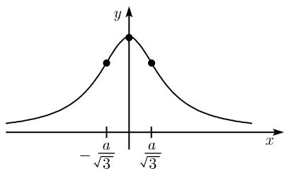
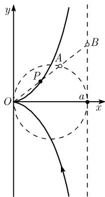
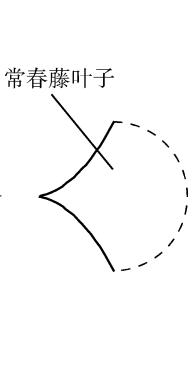
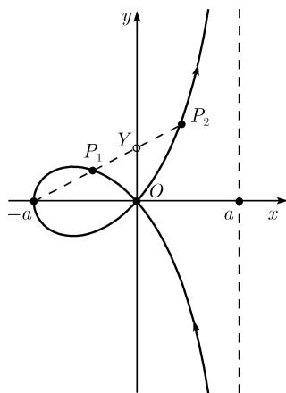
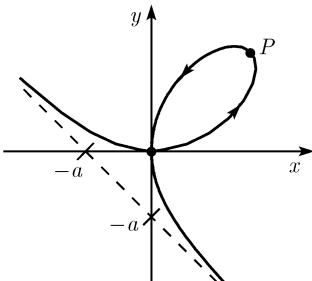
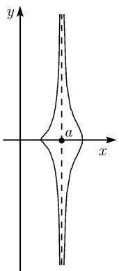
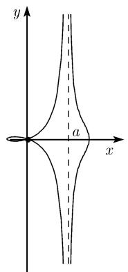
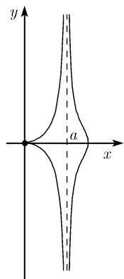
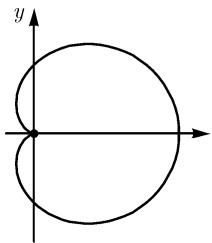
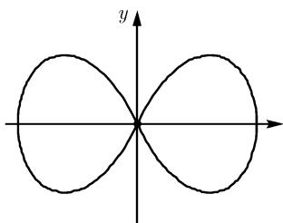

##### 3.8.2 平面曲线的例子

平面代数曲线最重要的性质是它的亏格 $p$ (参看3.8.5). 在下文中 $a, b, c$ 是正(实)常数.

3.8.2.1 一次和二次曲线

次数为 1 的代数曲线 (线性曲线) 是直线, 它们的亏格 p = 0. 二次不可约代数曲线 (二次曲线) 是非退化圆锥截线 (圆, 椭圆, 抛物线及双曲线); 它们也具有亏格 p = 0.

可约二次曲线必是一对直线.

所有在这一节和下一节中的曲线都是不可约的．一条三次不可约曲线的亏格 $p = 1$ ，这时我们假定它上面没有奇点1)，否则 $p = 0$

一条四次不可约曲线具有亏格 $p = 3,2,1$ 或 $p = 0$ 。第一种情形对应的曲线是光滑的，即没有奇点，而其他情形的出现依赖于奇点的个数和种类。例如，著名的被称作克莱因四次线便有三个普通二重点且亏格 $p = 0$ 。

3.8.2.2 三次曲线

阿涅西箕舌线(图 3.79)

$$
\boxed {(x ^ {2} + a ^ {2}) y - a ^ {3} = 0.}\tag{3.52}
$$

渐近线：y = 0.

曲线到其渐近线之间的面积： $\pi a^{2}$

在顶点 $(0,a)$ 的曲率半径：R=a/2.

拐点： $(\pm a/\sqrt{3},3a/4)$ .

亏格： $p = 0$

  
图 3.79 玛丽亚 艾格尼丝的箕舌线

在复射影平面 $\mathbb{CP}^2$ 上的箕舌线的方程：曲线(3.52)的方程被写在射影平面上的射影坐标中时为

$$
\boxed {x ^ {2} y + a ^ {2} y u ^ {2} - a ^ {3} u ^ {3} = 0.}\tag{3.53}
$$

这个方程由将 (3.52) 中的变量 $x$ 和 $y$ 换作 $x / u$ 和 $y / u$ , 然后再乘以 $u^3$ 得到 (这个过程被称为对多项式或对方程的齐次化).

这里的 $x, y$ 和 $u$ 为复变量, 这时应排除 $x = y = u = 0$ 的情形 (所有同时为零). (3.53) 的两个解 $(x_{j}, y_{j}, u_{j})$ 当存在一个复数 $\lambda \neq 0$ 使得

$$
(x _ {1}, y _ {1}, u _ {1}) = \lambda (x _ {2}, y _ {2}, u _ {2}) := (\lambda x _ {2}, \lambda y _ {2}, \lambda u _ {2})
$$

时对应了曲线上同一个点.

如果令 u = 1, 我们便得到了所谓的 (3.53) 的仿射形式 (3.52). 这是齐次化的递过程, 也称为非齐次化.

无穷远点：曲线 (3.53) 与无穷远直线的交点由方程 $u = 0$ 定义, 在点

$$
(1, 0, 0) \quad {\text {和}} \quad (0, 1, 0),
$$

它们对应了图 3.79 中 x 轴和 y 轴的方向.

奇点: 这条曲线上唯一的奇点是无穷远二重点 (这恰是 “在无穷远直线上的二重点” 的另一种说法) $(1,0,0)$ . 这对应于该曲线的渐近线 y=0, 见图 3.79.

亏格：p = 0.

狄奥克莱斯蔓叶线(图 3.80)

$$
\boxed {x ^ {3} + (x - a) y ^ {2} = 0.}
$$

有理参数化表示： $x=\frac{at^{2}}{1+t^{2}},y=\frac{at^{3}}{1+t^{2}},-\infty<t<\infty.$

在极坐标下 我们有: $t = \tan \varphi$ .

极坐标中的表示： $r=\frac{a\sin^{2}\varphi}{\cos\varphi}$ .

  
(a)

  
图 3.80 蔓叶线  
(b)

  
图3.81 环索线

渐近线： $x = a$

曲线与其渐近线之间的面积: $3\pi a^{2}/4$ .

几何特征：设 $K$ 为半径是 $a / 2$ 的圆，圆心在 $(a / 2,0)$ ，并设 $g$ 为直线 $x = a$ 。一条以原点 $O$ 出发的射线交 $K$ 于点 $A$ ，交 $g$ 于点 $B$ 。蔓叶线上点 $P$ 具有如下性质：

$$
\boxed {O P = A B.}
$$

名称蔓叶 (cissoid) 源自希腊文, 意思是常春藤 ( $\kappa\iota\sigma\sigma\omicron\kappa$ ) 叶子的轮廓线 (cissoz 表示常春藤). 蔓叶线在原点 (0,0) 有一个实点, 这是其唯一的奇点.

环索线 (图 3.81)

$$
\boxed {(x + a) x ^ {2} + (x - a) y ^ {2} = 0.}
$$

有理参数化： $x=\frac{a(t^{2}-1)}{1+t^{2}}$ , $y=\frac{at(t^{2}-1)}{1+t^{2}}$ , $-\infty<t<\infty$ .

在极坐标下, 有 $t = \tan \varphi$ .

在极坐标下的表示： $r = -\frac{a \cos 2\varphi}{\cos \varphi}$ .

渐近线：x = a.

在原点O的切线： $y=\pm x$ .

其闭道的面积: $\left(2 - \frac{\pi}{2}\right)a^{2}$ .

曲线和其渐近线之间的面积: $\left(2+\frac{\pi}{2}\right)a^{2}$ .

几何特征：固定一条从点 $(-a,0)$ 出发的射线，其交 $y$ 轴于点 $Y$ 。在环索线上交出的两点 $P_{1}$ 和 $P_{2}$ 满足条件

$$
\boxed {P _ {j} Y = O Y, \quad j = 1, 2.}
$$

就是这个性质给出了它的希腊名称 strophoid. 环索线在原点 $(0,0)$ 有一个二重点, 它是其唯一的奇点. 笛卡儿叶状线(图 3.82)

$$
\boxed {x ^ {3} + y ^ {3} - 3 a _ {2} y = 0.}
$$

有理参数化： $x = \frac{3at}{1 + t^3},y = \frac{3at^2}{1 + t^3}, - \infty <  t <$

-1 和 $-1 < t < \infty$ . 在极坐标下有 $t = \tan \varphi$ .

渐近线： $x + y + a = 0$ .

在原点O的切线：y=0 和 x=0.

图3.82 笛卡儿叶状线

其闭道的面积: $3a^{2}/2$ .

曲线和其渐近线之间的面积: $3a^{2}/2$ .

顶点 $P:(3a/2,3a/2)$ .

对两个分支在原点的曲率半径： $R = 3a / 2$

亏格：p=0. 笛卡儿叶状线具有唯一的奇点，即在原点的二重点.

3.8.2.3 四次曲线

下面的这些曲线已在 3.7 详细讨论过.

尼科米迪斯蚌线(图 3.83)

$$
\left| (x - a) ^ {2} \left(x ^ {2} + y ^ {2}\right) - b ^ {2} x ^ {2} = 0. \right.
$$

亏格：p = 2.

  
(a) b < a

  
(b) b > a

  
(c) b=a  
图 3.83 尼科米迪斯蚌线

蚌线这个名字仍来自希腊, conchoid 的意思是英文的 “shell” ( $\kappa\acute{o}vx\eta = shell$ ). 蚌线具有一个尖点或二重点, 依参数值 a 和 b 而定, 它们是唯一的奇点.

$$
(x ^ {2} + y ^ {2} - a x) ^ {2} - b ^ {2} (x ^ {2} + y ^ {2}) = 0.
$$

亏格： $p = 2$ 和 $p = 3,$ 依参数 $a$ 和 $b$ 的值而定.

心脏线(图 3.84(a)): 这是 a = b 时的帕斯卡蝎线.

亏格：p = 2.

心脏线在原点 $(0,0)$ 有一个尖点为其唯一的奇点.

卡西尼卵形线(图 3.66(b))

$$
\boxed {(x ^ {2} + y ^ {2}) ^ {2} - 2 c ^ {2} (x ^ {2} - y ^ {2}) + c ^ {4} - a ^ {4} = 0.}
$$

亏格：p=3 或 p=2，由参数 a 和 c 的值决定.

伯努利双纽线(图 3.84(b)) 这是 a = c 时的一条卡西尼卵形线.
亏格：p = 2.

  
(a) 心脏线

  
(b) 双纽线  
图3.84 两条著名的曲线

双纽线在原点 $(0,0)$ 有一个二重点.

历史评注 狄奥克莱斯蔓叶线和尼科米迪斯蚌线是最古老的已知的具奇点的代数曲线, 大约是在公元前 180 年左右发现的. 它们的发明 (发现) 是为了解决两个著名的第罗斯问题: 倍立方体和以绘图法三等分角 (参看 2.6.1). 在古代, 尼科米迪斯蚌线也被用于柱的截面的构造 (图 3.83(c)).

帕斯卡蝎线的性质由著名数学家 B. 帕斯卡 (1623—1662) 的父亲研究过.

笛卡儿叶状线 (folium Cartesii) 是笛卡儿 (1596—1650) 引进的, 他由于把几何图形以 “笛卡儿坐标” 表示对代数几何作出了重要的贡献. 卡西尼曲线则源于意大利天文学家卡西尼 (Cassini, 1650—1700) 的工作.

牛顿 (1643—1727) 对代数曲线的性态进行了多项研究. 雅各布 伯努利 (1655—1705) 的双纽线在椭圆积分的发展中起了重要作用 (参看 3.75). 在 1748 年意大利数学家阿涅西 (M. G. Agnesi, 1718—1799) 写了一本《无穷小分析》, 该书收集了那个时期在代数和分析方面的知识, 并且由于其叙述的清晰被翻译成了多种语言. 正是在该书中论述了现今称为阿涅西箕舌线的曲线. 在意大利文中它被称为 “versiera of Agnesi”, 其中的 versiera 在意大利文中的意思是 “睡魔女妖”.
