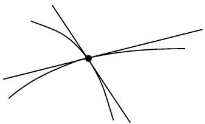
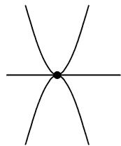

##### 3.8.4 平面代数曲线的射影复形式

基本思想 要使平面代数曲线的理论组织得清晰有序的唯一方法是转移到齐次复坐标上, 就是说把其考虑为复平面 $\mathbb{CP}^2$ 中的曲线 (参看 3.5.4).

例 1: 在圆的方程

$$
\boxed {x ^ {2} + y ^ {2} = 1}
$$

中我们把 x 和 y 换作 x/u 和 y/u. 在乘以 $u^{2}$ 后得到了圆的复射影形式

$$
\boxed {x ^ {2} + y ^ {2} = u ^ {2}}.
$$

这里的 $x, y, u$ 为复数, 但排除掉三元组 $(0, 0, 0)$ , 即所有的变量不能同时为零. 两个这样的数组 $(x, y, u)$ 和 $(x_{*}, y_{*}, u_{*})$ 定义了 (射影平面中) 同一个点是说它们之间差一个非零常数因子 $\lambda$ , 即我们有 $(x, y, u) = \lambda(x_{*}, y_{*}, u_{*})$ .

定义 每个 $n$ 次平面代数曲线可以写成形式

$$
\boxed {p (x, y, u) = 0,}\tag{3.61}
$$

其中 $p$ 是个 $n$ 次齐次多项式, 变量为 $x, y$ 和 $u$ , 系数为复数. 称这样的曲线为 $\mathbb{CP}^2$ 中的代数曲线. 称数 $n$ 为此曲线的次数.

不可约曲线 由方程 (3.61) 定义的曲线被称为不可约的, 如果多项式 $p$ 在 $\mathbb{C}$ 上不可约. 这直观地表明此曲线由“单独一支”组成, 即它不能分裂成多于一个的分支. 例2: 方程 $x = 0$ 不可约并描述了一条直线. 方程

$$
\boxed {x y = 0}
$$

为二次并是可约的(即不是不可约的). 这条曲线是一个退化的圆锥截线, 分裂成两条直线 $x = 0$ 和 $y = 0$ (或说由这两条直线的并组成). 不可约二次曲线恰好是椭圆, 抛物线和双曲线 (但是从复射影平面的观点看, 它们之间并没有差别). 这些是非退化的圆锥截线.

3.8.4.1 关于曲线相交的贝祖 (Bézout) 定理

下面的定理是代数曲线理论中最重要的定理中的一个.

一般性相交(gereric intersection) 若两个不可约曲线交于一点 $p$ , 则称此点为正常的, 是说这两条曲线在此点都有唯一的切线并且这两条切线不重合 (图 3.85). 这种情形 “几乎总” 存在. 这个副词便是数学词库 “一般性地, 泛地 (generic)” 的内容, 它表明 “例外情形是非常罕见的”, 更为数学化的语言是说 “例外情形出现在一个低维集合上”.

  
(a) 正则交点

  
(b) 非正则交点  
图3.85 平面曲线的交点

贝祖定理 (1779) 设在 $\mathbb{CP}^2$ 上已知两条不同的代数曲线 $C$ 与 $D$ , 各自的次数为 $m$ 和 $n^{1)}$ . 于是最多存在这两条曲线的 $mn$ 个交点. 另外, 若所有的交点都是正常的, 则正好有 $mn$ 个交点 $^2)$ .

例 1: 两条 (没有公共分支的) 圆锥截线最多交 $mn = 2 \cdot 2 = 4$ 个点.

例 2: 单位圆 $x^{2} + y^{2} = 1$ 和直线 x = 2 在实平面内不相交. 转移到齐次坐标得到

$$
x ^ {2} + y ^ {2} = u ^ {2}, \quad x = 2 u,
$$

它有两个交点 $(2, \pm i\sqrt{3}, 1)$ . 我们注意到这些交点为有限但是是虚的.

推论 对每个交点可以赋予一个重数, 使得 $^{3)}$

两条曲线的所有交点的重数和正好是 mn.

正则交点的重数为 1.

1) 若 $C$ 和 $D$ 是可约的, 则同样的陈述依然成立, 但需假定它们没有公共分支.

2) 更一般地, 我们可以引入交点的重数概念 (见后面). 于是这个陈述为: 算上重数, 正好总存在 mn 个交点.

3) 假设这两条曲线由方程

$$
p (x, y, u) = 0 \quad {\text {和}} \quad q (x, y, u) = 0
$$

给出. 用坐标变换 (直射映射) 我们可假设 $(0,0,1)$ 不在连接两个交点的直线上.

令 $\mathcal{R} := \mathbb{C}[x, u]$ (即变量 x 和 u 在 C 上的多项式环). 于是有

$$
p, q \in \mathcal {R} [ y ].
$$

p 和 q 的结式 $R(p,q)$ 在这两条曲线的交点 P 上为零. 此结式在 $R[y]$ 上对应的 y 的零点的重数被称为此交点的重数.

3.8.4.2 曲线的有理变换

在数学中对每个对象的类有一个相对应的变换类. 在射影平面 $\mathbb{CP}^2$ 中的代数曲线理论中人们首先想到的是 $\mathbb{CP}^2$ 到自己的射影映射. 相对于这个关系的曲线的分类却被发现对于应用而言过于困难和复杂了, 取而代之的, 被证明有用的是相对于双有理变换的分类.

曲线的有理映射 设在 $CP^{2}$ 中给出了两条代数曲线 C 和 $C'$ . 称由

$$
\boxed {x ^ {\prime} = X (x, y, u), \quad y ^ {\prime} = Y (x, y, u), \quad u ^ {\prime} = U (x, y, u)}\tag{3.62}
$$

定义的从 C 到 $C'$ 的映射为有理的, 如果 X, Y 和 U 为对变量 x, y, u 的同次齐次多项式. 称映射 (3.62) 为双有理映射, 如果这个映射是有理的并为双射, 而其逆也为有理.

有理曲线 称一条曲线是有理的, 如果它是一条直线的有理象. 显式表达地这对应于此曲线的一个表示:

$$
x = X (\lambda , \mu), \quad y = Y (\lambda , \mu), \quad u = U (\lambda , \mu),\tag{3.63}
$$

其中 X,Y,U 为复变量 $\lambda,\mu$ 的同次齐次多项式.

例 1: 直线和圆锥截线是有理曲线.

曲线的双有理等价 称两条平面代数曲线为双有理等价或互为双有理, 如果它们可用有理映射相互变换.

$$
\text {代数曲线的代数几何是这些曲线在双有理变换下不变的理论.}
$$

例 2: 曲线的次数不是一个双有理不变量, 但曲线的亏格则是的 (参看 3.8.5).

克雷莫纳群 $\mathbb{CP}^2$ 到自己的双有理映射的集合构成一个群, 它首先为意大利几何学家克雷莫纳 (Luigi Cremona) 在 $1863\sim 1865$ 年进行了研究. 这就是为什么至今这个群冠以此名的缘故.

3.8.4.3 奇点

切线 曲线 $p(x,y,u)=0$ 在点 $P:=(x_{0},y_{0},z_{0})$ 的切线由方程

$$
\boxed {p _ {x} (P) \left(x - x _ {0}\right) + p _ {y} (P) \left(y - y _ {0}\right) + p _ {u} (P) \left(u - u _ {0}\right) = 0}\tag{3.64}
$$

给出.

例 1: 单位圆 $x^{2} + y^{2} - u^{2} = 0$ 的切线方程是

$$
2 x _ {0} (x - x _ {0}) + 2 y _ {0} (y - y _ {0}) - 2 u _ {0} (u - u _ {0}) = 0.
$$

这等价于所谓的极方程

$$
x x _ {0} + y y _ {0} - u u _ {0} = 0.
$$

正则点 曲线上一点 P 为正则点, 当且仅当在点 P 有唯一确定的切线, 即有

$$
(p _ {x} (P), p _ {y} (P), p _ {u} (P)) \neq (0, 0, 0).
$$

奇点 一个点如果不是正则点, 则称其是奇点. 一个奇点 $P$ 有重数 $s$ 定义为: 如果多项式 $p$ 到 $s - 1$ 阶的所有偏导数均在 $p$ 为零而在 $s$ 阶至少有一个偏导数在 $P$ 非零.

二重点和尖点 称重数 s = 2(分别地, s = 3) 的奇点为二重点(分别地, 尖点).

例 2(二重点): 对 $p(x,y)=x^{2}-y^{2}, P=(0,0,1)$ ，有

$$
p _ {x} (P) = p _ {y} (P) = p _ {u} (P) = 0 \quad {\text {和}} \quad P _ {x x} (p) = 2.
$$

因此 $x^{2} - y^{2} = 0$ 在二条直线 $y = \pm x$ 的交点 $P$ 处分裂为它们, 故 $P$ 点是个二重点 (参看在3.8.1.2的图3.76).

例 3(尖点): 对于 $p(x,y,u) := x^{3} - y^{2}u$ 和 $P := (0,0,1)$ ，有

$$
p _ {x x x} (P) = 6,
$$

而到二阶前的所有偏导数在 $P$ 均为零. 因此 $P$ 是个尖点. 这个点对应于半立方抛物线 $x^{3} - y^{2} = 0$ 的原点 $(0,0)$ (参看3.8.1.2的图3.76).

定理 包含了重数的奇点及正则点对于曲线的双有理等价不变.

对阿涅西箕舌线的应用 这条曲线的方程是

$$
C: x ^ {2} y + y u ^ {2} - u ^ {3} = 0
$$

(参看 3.8.2.2 的图 3.79). 令 $p = x^{2}y + yu^{2} - u^{3}$ .

(i) 此曲线与无穷远直线 u = 0 的交点为 $(1, 0, 0)$ 和 $(0, 1, 0)$ .

(ii) 该曲线上的奇点由方程组

$$
p _ {x} = 2 x y = 0, \quad p _ {y} = x ^ {2} + u ^ {2}, \quad p _ {u} = 2 u y - 3 u ^ {2} = 0, \quad p = 0
$$

的公共解决定．它给出了解 $(0,1,0)$ 和不适当的点 $(0,0,0)$ (回忆一下，射影空间不包含点 $(0,0,0)$ )．因为 $p_{xx}(0,1,0)=2$ ，故在无穷远点 $(0,1,0)$ 是一个二重点，它对应于在图 3.79 中 C 的渐近线．

3.8.4.4 对偶性

对偶曲线 设已知代数曲线 $C: p(x, y, u) = 0$ . 映射

$$
C _ {*}: x _ {*} = p _ {x} (x, y, u), \quad y _ {*} = p _ {y} (x, y, u), \quad u _ {*} = p _ {u} (x, y, u)
$$

是对 C 的所有正则点 $(x,y,z)$ 考虑的, 它描述了 $CP^{2}$ 中的一条曲线, 称其为曲线 C 的对偶曲线 $^{1)}$ . 对偶曲线的次数被称为曲线 C 的类.

从几何的观点看, 对偶曲线的点坐标是原曲线的切线的坐标.

定理 对一条曲线经两次对偶又回到了原曲线, 即 $(C_{*})_{*} = C$ .

例：设 $p(x,y,u):=x^{2}+y^{2}-u^{2}$ 。其对应的代数曲线 $C:p(x,y,u)=0$ 是个单位圆。对此曲线我们得到参数化的对偶曲线 $C_{*}$ ：

$$
x _ {*} = 2 x, \quad y _ {*} = 2 y, \quad u _ {*} = - 2 u.
$$

由 $x_{*}^{2} + y_{*}^{2} - u_{*}^{2} = 0$ 知 $C = C_{*}$ ，即单位圆与自己对偶.

上面的例子不应该给出一个错误的印象, 认为确定一已知曲线的对偶是件容易的事; 相反地, 这是个困难的代数问题.
